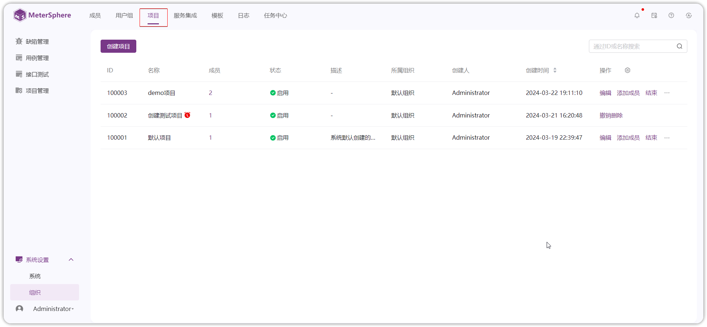
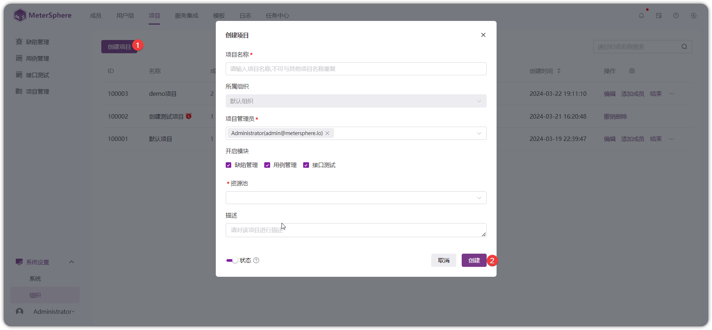

!!! ms-abstract ""
    在 MeterSphere 中，缺陷管理、用例管理、接口测试等能力均通过项目进行分权分域查看和管理。使用 MeterSphere 平台进行测试管理工作需要先创建项目，通过项目管理测试数据。进一步的管理模型说明请参考[管理模型](../system_arch.md#_3)。
    
    管理员登录平台，在左侧菜单中点击【系统设置-组织】，进入【项目】菜单创建项目。
{ width="900px" }

!!! ms-abstract ""
    点击【创建项目】按钮，在弹出页面中编辑项目名称、项目管理员、开启模块、资源池、描述、启用停用状态等信息。
{ width="900px" }

!!! ms-abstract "操作说明"
    【项目管理员】：默认为当前创建人，项目管理员自动加入当前项目。当项目管理员不在当前创建的项目所属组织时，自动将项目管理员加入到项目所属组织，赋予组织成员用户组。 
    【开启模块】：默认全选，可以自定义选择功能模块。 
    【资源池】：用于接口测试执行任务，默认可用 Local 资源池。资源池配置在【[系统-资源池](../user_manual/system_management/system.md#5)】配置。 
    【状态】：默认启用，有启用，关闭两种状态。 
