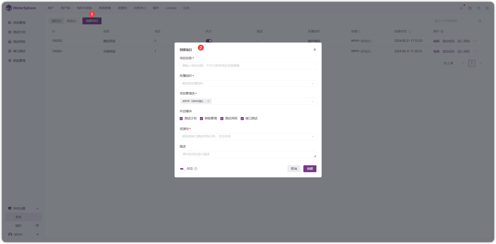

!!! ms-abstract ""
    在 MeterSphere 中，测试用例、测试计划、接口测试、UI 测试及性能测试等的管理均通过项目进行分权分域查看和管理，使用MeterSphere 进行测试，登录进入工作空间后，首先需要创建项目，在项目下创建管理操作功能用例、测试计划、接口测试、UI 测试、性能测试等。进一步的管理模型说明请参考[管理模型](../system_arch.md#_3)。
    
    在左侧菜单中点击【系统设置】，在打开的页面左侧二级菜单中，选择【工作空间】下【项目管理】菜单，打开【项目管理】页面。
{ width="900px" }

!!! ms-abstract ""
    在【项目管理】页面，点击【创建项目】 按钮，打开【创建项目】对话框，在对话框中输入项目的基本信息后，点击【确定】按钮创建一个新项目。
{ width="900px" }