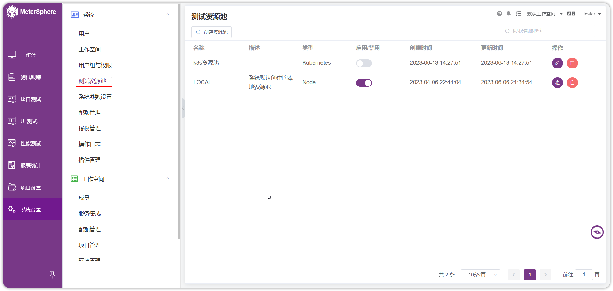
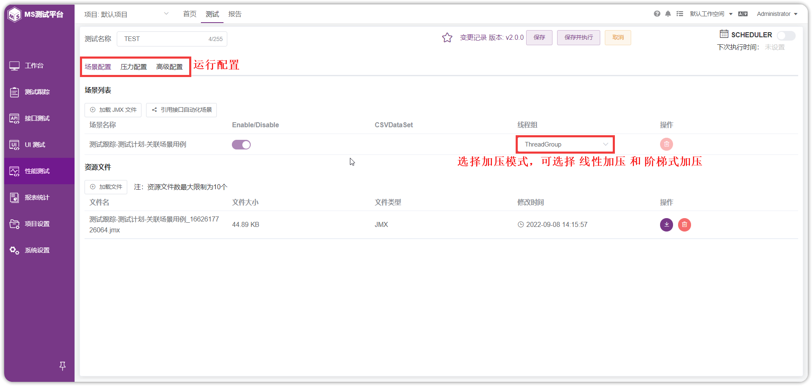
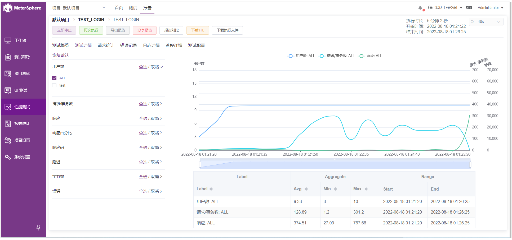
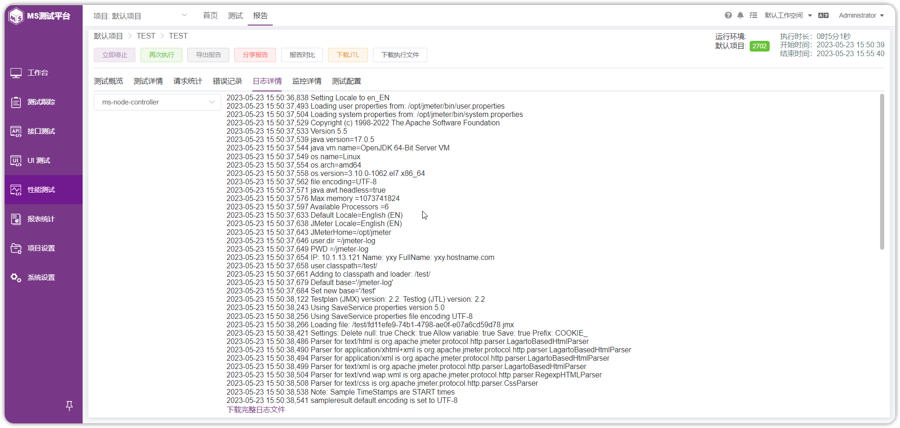

!!! ms-abstract ""
    MeterSphere 性能测试模块支持通过已有的接口测试用例、场景测试创建、上传 JMeter JMX 做性能测试，并按需设置并发用户数等测试参数，执行性能测试并实时查看性能测试报告。

## 1 创建测试资源池
!!! ms-abstract ""
    通过安装包安装 MeterSphere 后，系统默认使用当前节点创建了名为【LOCAL】测试资源池。关于测试资源池的作用请参考 [FAQ](../faq/load_test.md#_1)。

    如果需要创建新的测试资源池，或向已有资源池中添加节点，请参考 [如何向测试资源池中添加节点？](../faq/load_test.md#_2)
{ width="900px" }

## 2 修改当前站点 URL
!!! ms-abstract ""
    性能测试执行过程中 node-controller 节点需要通过配置的【当前站点URL】 下载 JMX 等测试资源文件。在执行性能测试前需要配置并检查测试资源池中的节点可以正常访问到该 URL，URL 值一般为通过浏览器访问 MeterSphere 的地址。
{ width="900px" }

## 3 创建性能测试
!!! ms-abstract ""
    进入【性能测试】-【测试】页面。

    在性能测试列表中点击【创建性能测试】，在【场景配置】点击【引用接口自动化场景】，将已有的接口自动化场景添加到性能测试中。
{ width="900px" }

## 4 调整压力配置
!!! ms-abstract ""
    在压力配置页面选择系统配置的测试资源池。 
    点击展开第一个线程组的配置页面，填入并发参数。 
    具体的并发配置如下：

    - 并发用户数：10
    - 选择【按持续时间】模式
    - 压测时长：5分钟
    - RPS 上限不设置
    - 在场景配置中选择【ConcurrencyThreadGroup】加压模型，设置10秒内分5步增加并发用户
{ width="900px" }

## 5 执行并查看报告
!!! ms-abstract ""
    点击性能测试配置页面的【保存并执行】按钮，系统自动进入性能测试测试报告页面。当收到测试结果数据后，报告页面将自动更新。
{ width="900px" }

{ width="900px" }

{ width="900px" }

{ width="900px" }

{ width="900px" }

