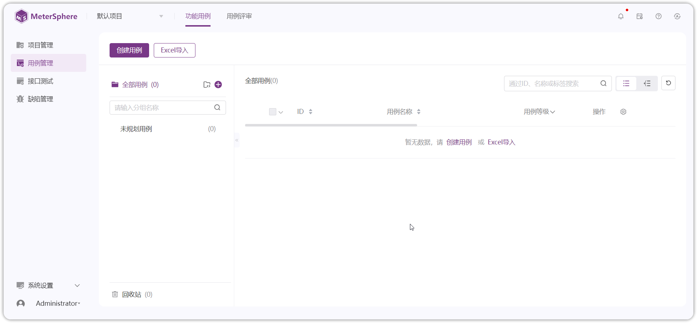

## 1 一键部署
!!! ms-abstract ""
    准备部署服务器，通过 MeterSphere 快速安装脚本一键快速部署。一键安装采用默认安装参数，更多有关离线部署、分布式部署等内容可查看 [安装部署](../installation/network_port.md) 章节。<br>

    **部署服务器要求**：<br>

     - 操作系统要求：Ubuntu
     - CPU内存要求：最低要求 4C8G，推荐 8C16G (企业版最低配置 8C16G)
     - 部署目录空间（默认/opt目录）要求：50G
     - 网络要求：可访问互联网
     - 如用于生产环境，推荐下载 [离线安装包](https://community.fit2cloud.com/#/products/metersphere/downloads) 进行 [离线部署](../installation/offline_installation.md)。


    以 root 用户 ssh 登录部署目标服务器，执行以下脚本进行一键安装:<br>
    ```sh
    curl -sSL https://resource.fit2cloud.com/metersphere/metersphere/releases/latest/download/quick_start.sh | bash
    ```

    安装成功后，客户端通过浏览器访问以下地址，输入用户名和密码，即可开始使用 MeterSphere。
    ```
    地址: http://目标服务器IP地址:8081
    默认用户名: admin
    默认密码: metersphere
    使用命令 'msctl status' 检查服务运行情况.
    ```

## 2 界面说明
!!! ms-abstract ""
    进入 MeterSphere 主界面左边是导航栏，包括【项目管理】【用例管理】【接口测试】【缺陷管理】【系统设置】【个人中心】六个模块。点击跳转 [创建项目](../quick_start/create_project.md) ，使用平台！

{ width="900px" }
