## 1 创建模块
!!! ms-abstract ""
    系统预置了部分用例，以 Halo 建站平台测试为例，创建 Halo 被测业务测试用例模块 `登录` 。 
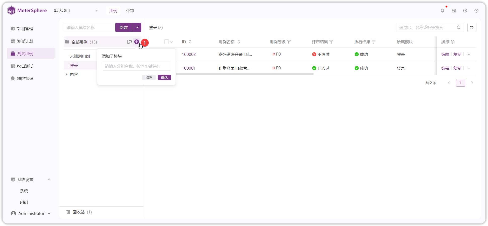{ width="900px" }

## 2 创建测试用例
!!! ms-abstract ""
    创建 Halo 测试用例，点击【新建】添加 `halo平台登录用例`用例，如：填写用例名称 `halo平台登录用例`、测试步骤`访问halo测试地址，输入用户名、密码`、期望`登录首页`、用例等级`p0`等字段创建用例。
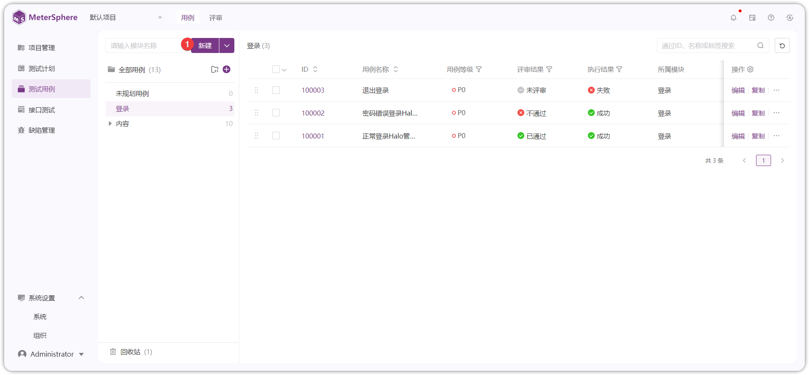{ width="900px" }
   
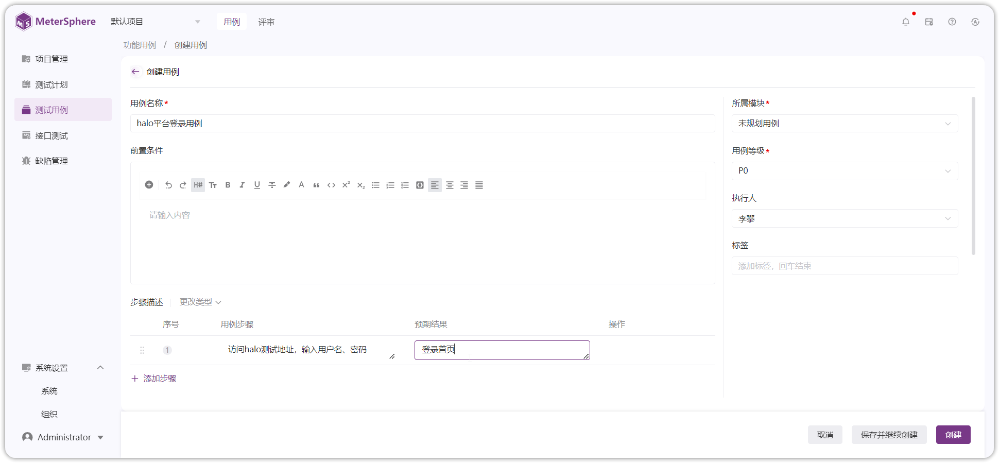{ width="900px" }

## 3 创建评审计划
!!! ms-abstract ""
     编写完成 Halo 功能用例后发起用例评审活动。在【测试用例-评审】创建用例评审计划 `v1.0版本用例评审`，评审标准`单人评审`、选择评审人`Administrator`，填写完成后创建评审。
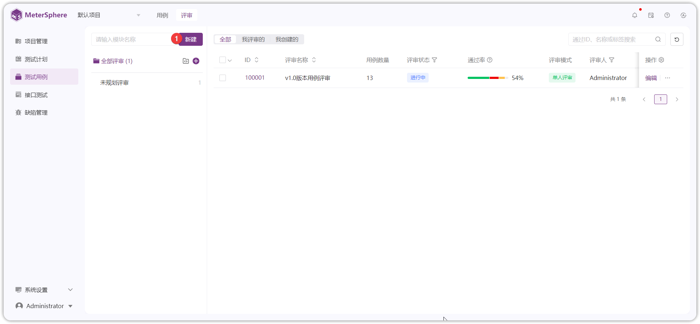{ width="900px" }

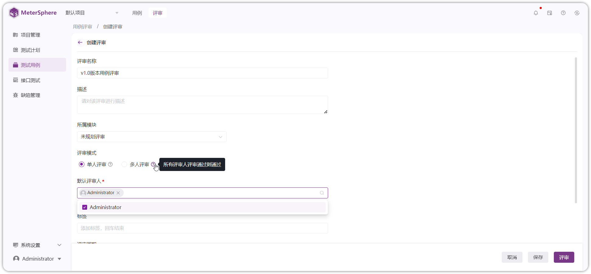{ width="900px" }

!!! ms-abstract "说明"

     - 【评审标准】单人评审：最后一次评审结果，为最终审结果；多人评审：所有评审人评审通过则通过，任意评审人不通过，则不通过。 
     - 【评审人】只有评审人才可进行评审操作。新添加的用例，评审人为项目配置的评审人。 
     - 【评审周期】评审预计时间，超过时间也可评审。 
     - 【关联用例】选择需要评审的用例关联到评审计划中评审。

!!! ms-abstract "评审计划关联用例"
    点击  `v1.0版本用例评审` ID进入评审详情关联用例，在点击【关联用例】按钮关联要评审`正常登录Halo管理系统` 、 `密码错误登录Halo管理系统失败`、 `退出登录`测试用例到评审任务中。
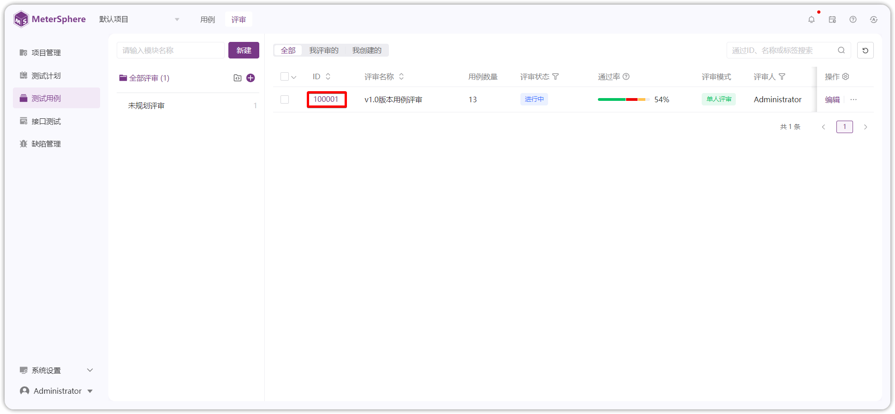{ width="900px" }

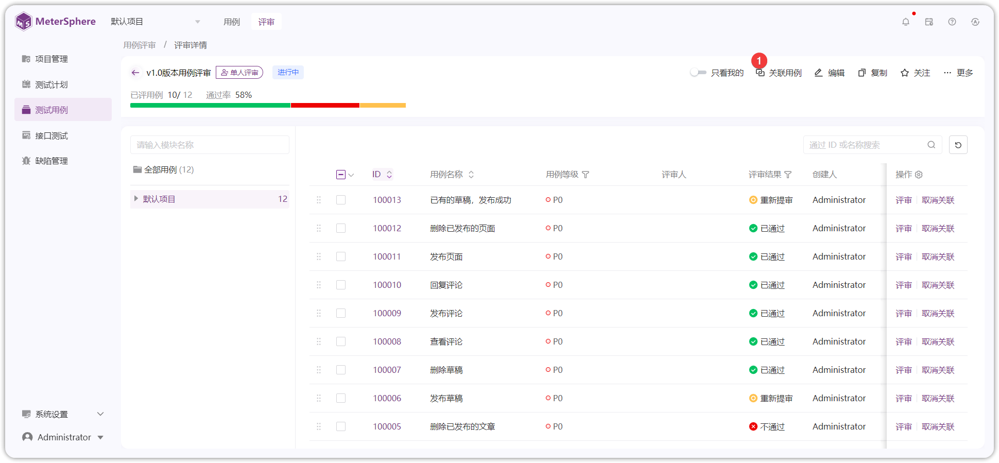{ width="900px" }

{ width="900px" }

## 4 评审
!!! ms-abstract ""
    用例评审人 `Administrator` 点击评审列表用例 ID 或【评审】按钮，对用例编写的测试点进行意见评审，选择评审结果标记用例状态为`通过`，每条用例都标记状态后，计划评审完成。
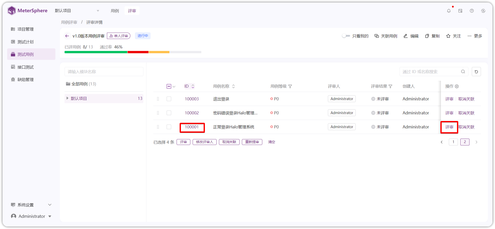{ width="900px" }

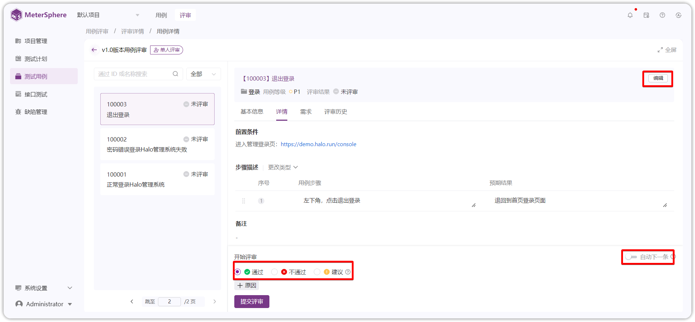{ width="900px" }
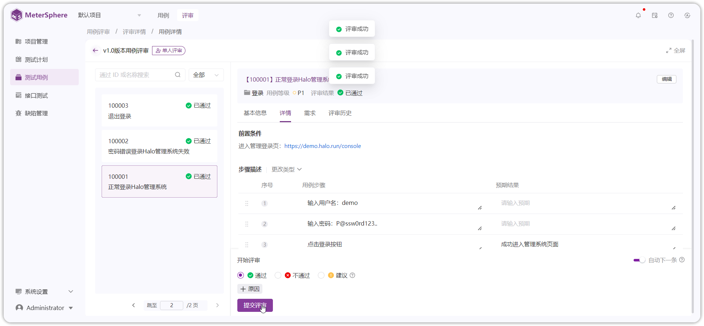{ width="900px" }

!!! ms-abstract "操作说明"

     - 【评审标记】选择评审结果，标记并提交，可选择通过、失败、建议等状态。 
     - 【编辑】评审过程存在用例需要修改，有编辑用例权限的用户可以点击【编辑】按钮操作。 
     - 【自动下一条】勾选后，提交评审结果自动进入下一条评审。 

## 5 创建测试计划
!!! ms-abstract ""
    进入【测试计划-计划】界面，点击【新建】新建测试计划 ` v1.0版本发布计划`，并关联用例。
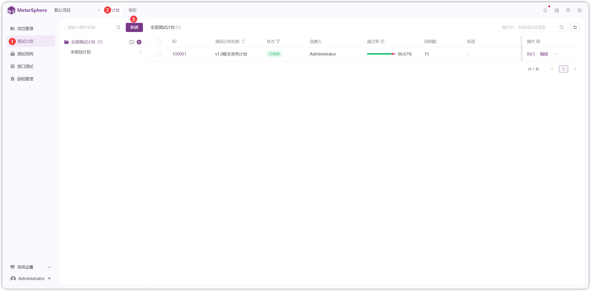{ width="900px" }

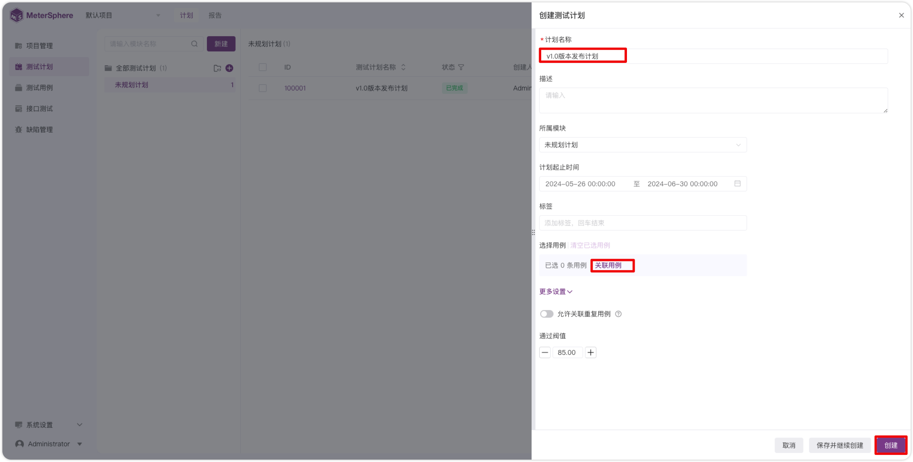{ width="900px" }

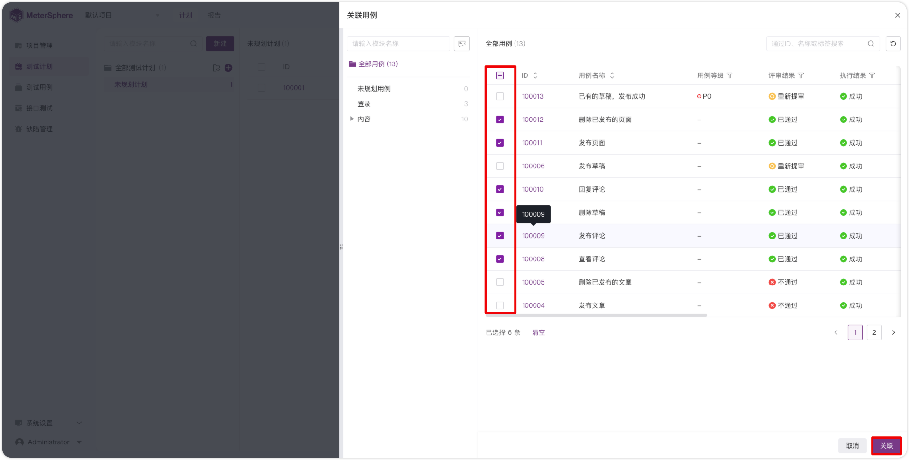{ width="900px" }

## 6 测试计划执行
!!! ms-abstract ""
    如图，点击【执行】进入【用例详情】在步骤描述处填写【实际结果】和【步骤执行结果】，修改当前用例【执行状态】和【评论】后，点击【提交结果】完成当前用例执行。
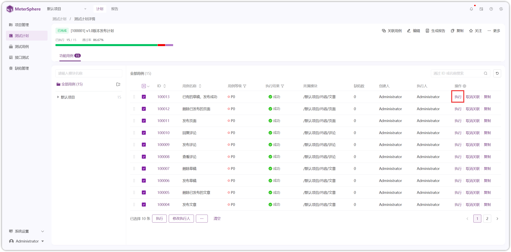{ width="900px" }

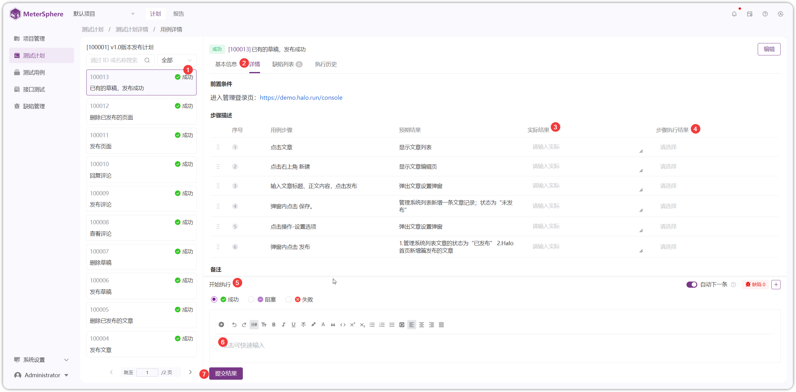{ width="900px" }

!!! ms-abstract ""
    如果用例执行失败，如下图缺陷处点击【+】，选择【新建】或者【关联】缺陷，给当前用例创建缺陷。
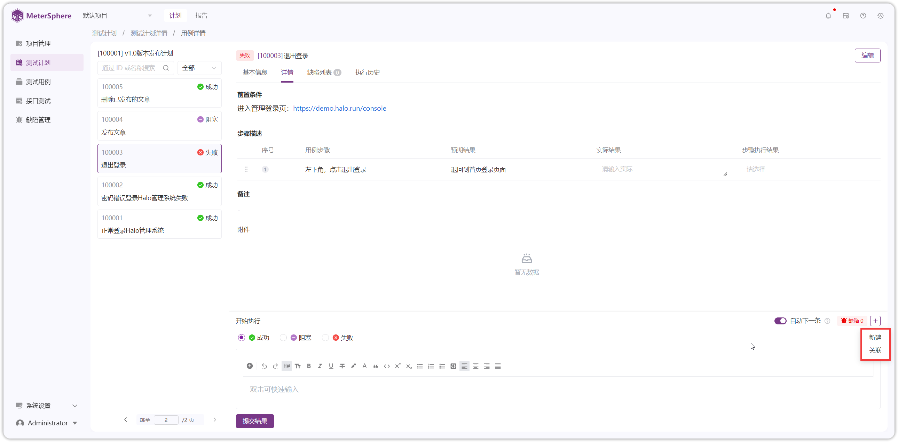{ width="900px" }

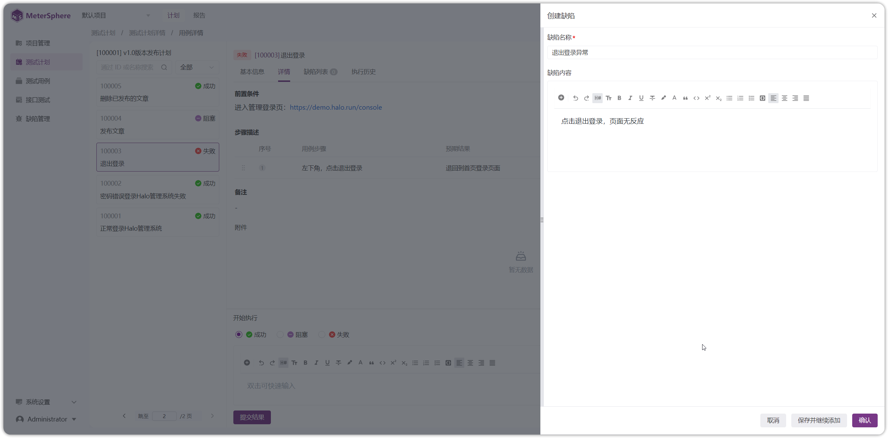{ width="900px" }

## 7 生成报告
!!! ms-abstract ""
    测试计划执行完成后，在【测试计划详情】页点击【生成报告】生成测试计划报告。
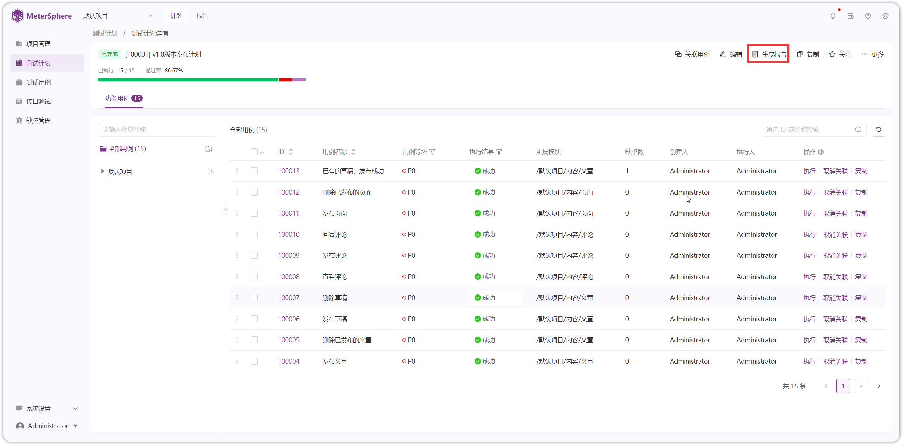{ width="900px" }

## 8 查看报告
!!! ms-abstract ""
    切换到【报告】页面，点击【报告 ID】查看报告详情。
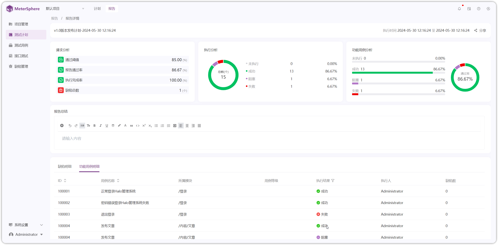{ width="900px" }
