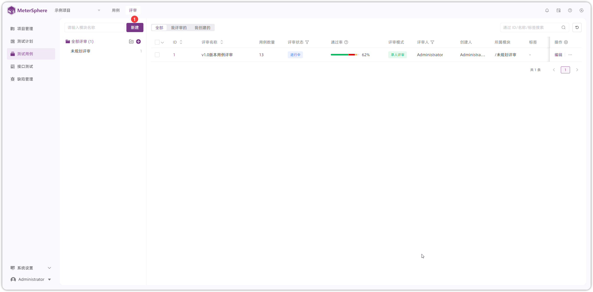

## 1 创建模块
!!! ms-abstract ""
    系统预置了部分用例，以 Halo 建站平台测试为例，创建 Halo 被测业务测试用例模块 `登录` 。 
{ width="900px" }

## 2 创建测试用例
!!! ms-abstract ""
    创建 Halo 测试用例，点击【新建】添加 `halo平台登录用例`用例，如：填写用例名称 `halo平台登录用例`、测试步骤`访问halo测试地址，输入用户名、密码`、期望`登录首页`、用例等级`p0`等字段创建用例。
{ width="900px" }
   
{ width="900px" }

## 3 用例评审
!!! ms-abstract ""
     编写完成 Halo 功能用例后发起用例评审活动。在【用例管理-用例评审】创建用例评审计划`halo用例评审`，评审标准`单人评审`、选择评审人`Administrator`、评审周期`2024-4-17--2024-4-18`，填写完成后创建评审。
{ width="900px" }

{ width="900px" }

!!! ms-abstract "说明"

     - 【评审标准】：单人评审：最后一次评审结果，为最终审结果；多人评审：所有评审人评审通过则通过，任意评审人不通过，则不通过。 
     - 【评审人】：只有评审人才可进行评审操作。新添加的用例，评审人为项目配置的评审人。 
     - 【评审周期】：评审预计时间，超过时间也可评审。 
     - 【关联用例】：选择需要评审的用例关联到评审计划中评审。

!!! ms-abstract ""
     评审关联用例  
    点击  `Halo 用例评审` ID进入评审详情关联用例，在点击【关联用例】按钮关联要评审`正常登录Halo管理系统` 、 `密码错误登录Halo管理系统失败`、 `退出登录`测试用例到评审任务中。
{ width="900px" }

{ width="900px" }

{ width="900px" }

## 4 评审
!!! ms-abstract ""
    用例评审人`Administrator`点击评审列表用例 ID 或【评审】按钮，对用例编写的测试点进行意见评审，选择评审结果标记用例状态为`通过`，每条用例都标记状态后，计划评审完成。
{ width="900px" }

{ width="900px" }
{ width="900px" }
!!! ms-abstract "操作说明"

     - 【评审标记】：选择评审结果，标记并提交，可选择通过、失败、建议等状态。 
     - 【编辑】：评审过程存在用例需要修改，有编辑用例权限的用户可以点击【编辑】按钮操作。 
     - 【自动下一条】:勾选后，提交评审结果自动进入下一条评审。 

<!--
## 3 创建测试计划
!!! ms-abstract ""
    在顶部菜单栏中，选择【测试计划】打开【测试计划】页面。

### 3.1 新建测试计划
!!! ms-abstract ""
    在【测试计划】页面，点击测试计划列表上方的【创建测试计划】按钮，打开【创建测试计划】对话框，在对话框中输入此次测试计划的名称、负责人等信息后，点击 【确定】 按钮完成测试计划创建。
{ width="900px" }

### 3.2 测试计划关联用例
!!! ms-abstract ""
    点击测试计划列表中新创建的测试计划，进入测试计划详情页面。 
    切换要关联的测试用例类型菜单，点击右侧列表上方的 【关联测试用例】 按钮，在弹出的用例选择列表中选择要添加到此次测试计划中的测试用例。可以通过搜索框及高级搜索功能进一步筛选特定的测试用例进行添加。
{ width="900px" }

{ width="900px" }

!!! ms-abstract ""
    记录用例执行结果  
    关联测试用例后，即可在测试计划页面右侧的测试用例列表中查看到已关联的测试用例。点击某个测试用例操作列中的【编辑】按钮，进入【用例详情】页面。 
    在执行步骤中，填写每一步的实际结果及该步的执行结果，基于各步骤执行情况及评定标准，点击上方的状态按钮为此条用例标记执行状态。 
    Tips:在测试计划中修改功能用例的状态，会同步更新【用例列表】的对应用例的状态。
{ width="900px" }

!!! ms-abstract ""
    同时在测试计划列表可直接在更新用例状态。
{ width="900px" }

!!! ms-abstract ""
    关联 【接口测试用例】、【UI 测试用例】、【性能测试用例】无需手动修改状态，关联方式和【功能测试用例】相同。

### 3.3 脑图方式记录用例执行结果
!!! ms-abstract ""
    与用例的创建和评审类似，用例执行结果同样可以通过脑图方式记录。在【用例列表】页面点击【脑图】标签切换到脑图展示页面，选中待执行用例，通过添加标签的方式来标记用例执行结果。
{ width="900px" }

## 4 测试计划执行
!!! ms-abstract ""
    点击测试计划列表右侧【执行】按钮，可以执行测试计划，同时执行时可选择运行环境、执行模式、运行资源池、失败重试等其他配置。
{ width="900px" }

## 5 查看测试报告
!!! ms-abstract ""
    当测试计划中的测试用例执行完成后，【报告】页签菜单下会自动生成一份测试报告。查看测试报告展示测试执行结果的详细信息并统计测试执行率、通过率等数据。测试报告详情右上角支持分享、导出操作。
{ width="900px" }
{ width="900px" }-->
