MeterSphere 测试跟踪模块支持测试用例管理、测试用例评审、测试计划跟踪等。
用户可以使用树状多级模块来分级分组管理项目下的测试用例，对已添加的测试用例进行评审，创建测试计划，将待测功能测试用例、接口测试用例及性能测试用例添加到测试计划，执行测试计划，查看测试报告。

## 1 添加测试用例
在顶部菜单栏中选择【测试跟踪】，在其二级菜单中选择【功能用例】打开【用例列表】页面。
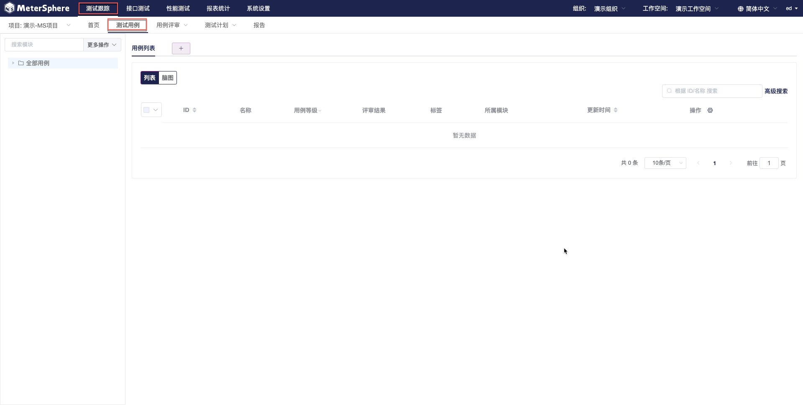

### 1.1 创建模块
MeterSphere 通过模块树的方式组织管理测试用例，用户可以在左侧查看到当前项目测试用例的模块树。
点击左侧的模块树中的【添加子模块】按钮，可为该项目添加模块。
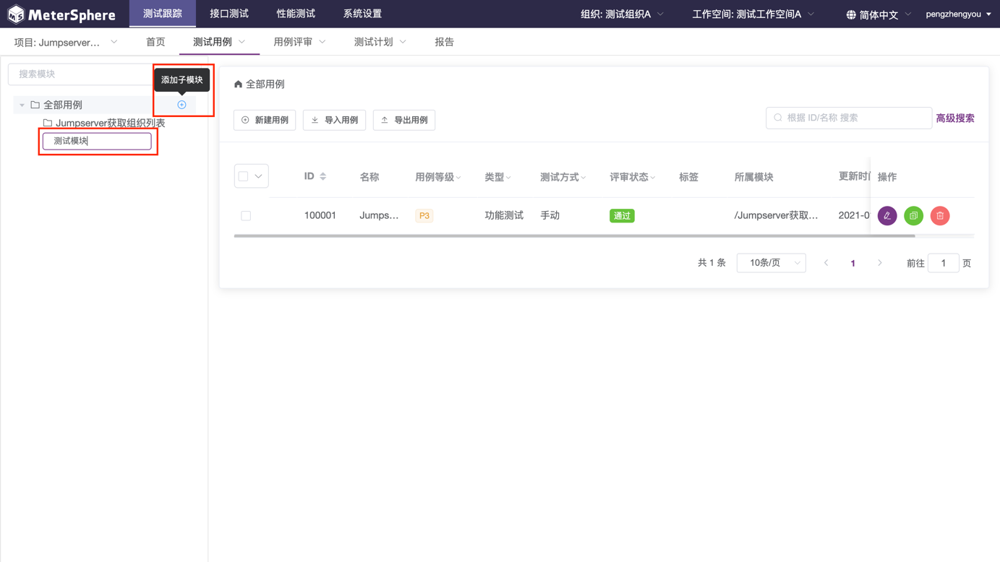

### 1.2 表单方式创建用例
创建好模块后，即可在各个模块中添加测试用例。在【用例列表】页面中，点击【用例列表】标签旁的【+】按钮，在下拉菜单中选择【新建用例】 按钮打开【新建用例】页面。
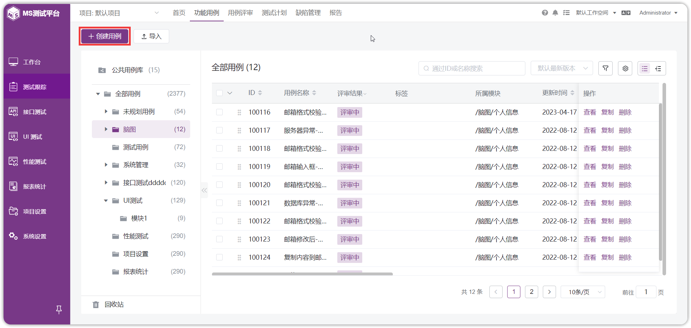

在打开的【新建用例】页面中，填写用例名称、前置条件、测试步骤等详细信息，之后点击【保存】 按钮完成用例创建。
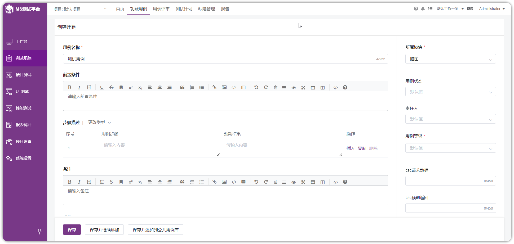

### 1.3 表单方式查看用例
在【用例列表】页面中，找到要编辑的用例，点击用例的紫色笔状【编辑】按钮打开【编辑用例】选项卡页面，在选项卡页面中可以查看用例详情和编辑用例。
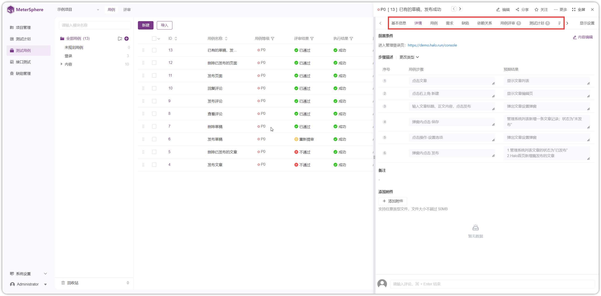

### 1.4 脑图方式创建用例
除了通过填写表单的方式编辑、展示用例，还可以通过脑图的方式实现此功能。在【用例列表】页面点击【脑图】标签切换到脑图展示模式，通过在模块下添加子节点并添加标签的方式创建用例。
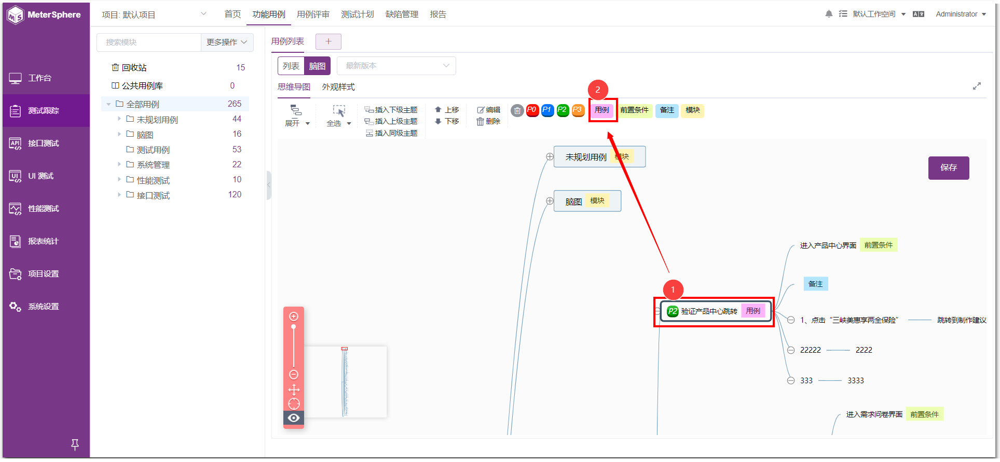

## 2 发起用例评审
在顶部菜单栏中，选择【测试跟踪】，在其二级菜单中选择【用例评审】打开【用例评审】页面。

### 2.1 创建用例评审
在【用例评审列表】页面中，点击列表上方的【创建用例评审】按钮，在打开的页面中输入用例评审任务名称、评审人等信息后，点击下方的【确定】按钮完成用例评审的创建。
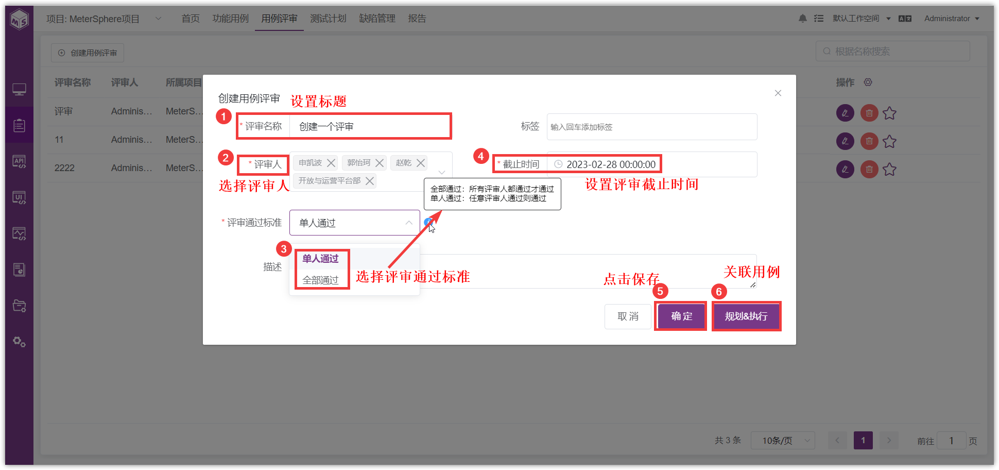

### 2.2 在用例评审中添加测试用例
（1）在【用例评审列表】页面，找到要添加用例的评审，点击打开【功能测试用例列表】页面。

（2）在【功能测试用例列表】页面，点击【关联用例】 按钮，打开【关联用例】对话框，在对话框中的用例列表中选择要添加到用例评审任务中的测试用例，选择后点击【确定】按钮保存。
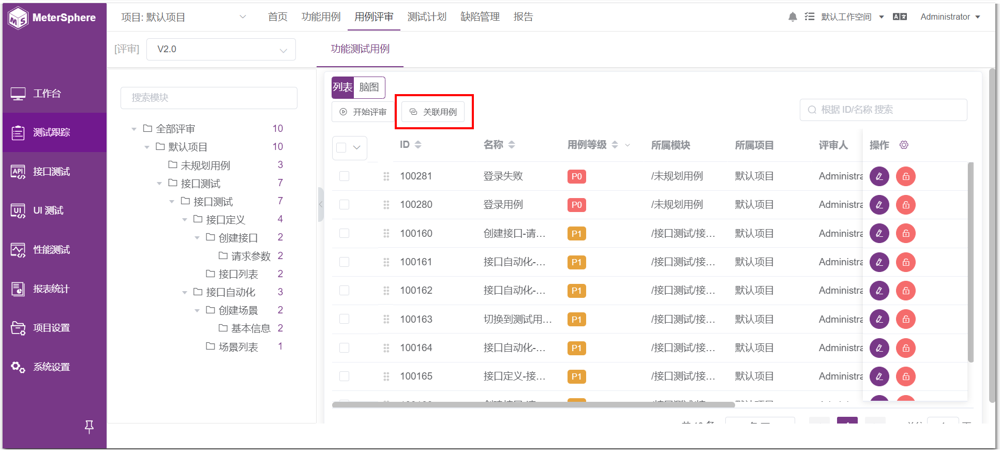

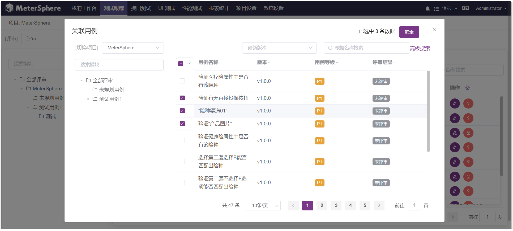

### 2.3 评审测试用例
关联测试用例后，即可在用例评审页面右侧的测试用例列表中查看到已关联的测试用例。点击某个测试用例操作列中的编辑按钮，进入【用例详情】页面。
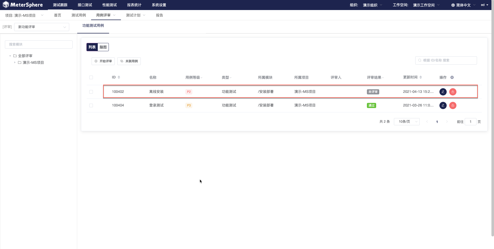

在【用例详情】页面右侧输入并发送针对此条测试用例的评论。基于评审结果，点击 `通过` 或 `未通过` 的状态按钮为本条用例标记评审状态。
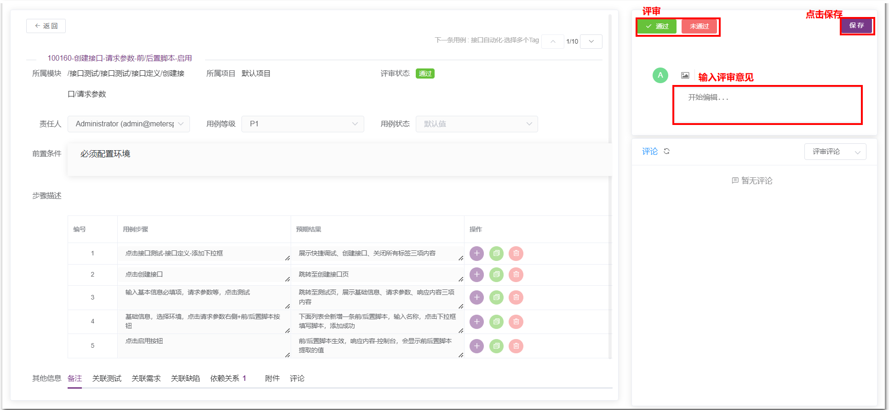

### 2.4 脑图方式评审用例
除了通过列表及表单方式评审用例外，还可以通过脑图方式实现此功能。在【用例列表】页面点击 `脑图` 标签切换到脑图展示模式，选中待评审用例，通过添加标签的方式来标记用例评审结果。
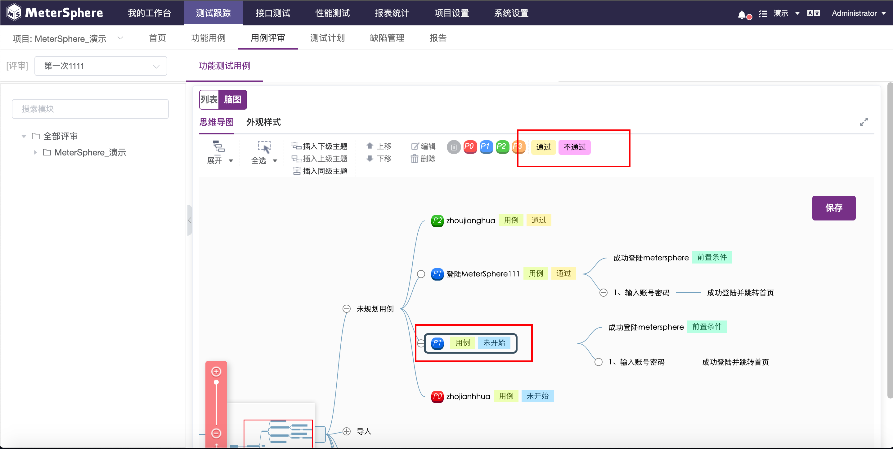

## 3 创建测试计划
在顶部菜单栏中，选择【测试跟踪】，在其二级菜单中选择【测试计划】打开【测试计划】页面。

### 3.1 新建测试计划
在【测试计划】页面，点击测试计划列表上方的【创建测试计划】按钮，打开【创建测试计划】对话框，在对话框中输入此次测试计划的名称、负责人等信息后，点击 `确定` 按钮完成测试计划创建。
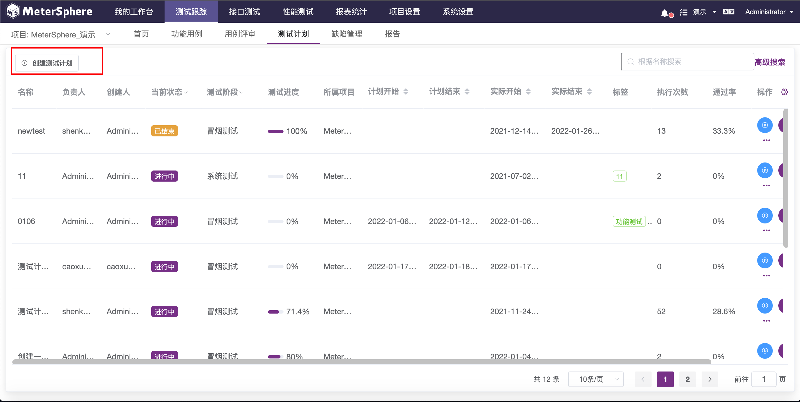

### 3.2 在测试计划中添加测试用例
点击测试计划列表中新创建的测试计划，进入测试计划详情页面。

切换要关联的测试用例类型菜单，点击右侧列表上方的 `关联测试用例` 按钮，在弹出的用例选择列表中选择要添加到此次测试计划中的测试用例。可以通过搜索框及高级搜索功能进一步筛选特定的测试用例进行添加。
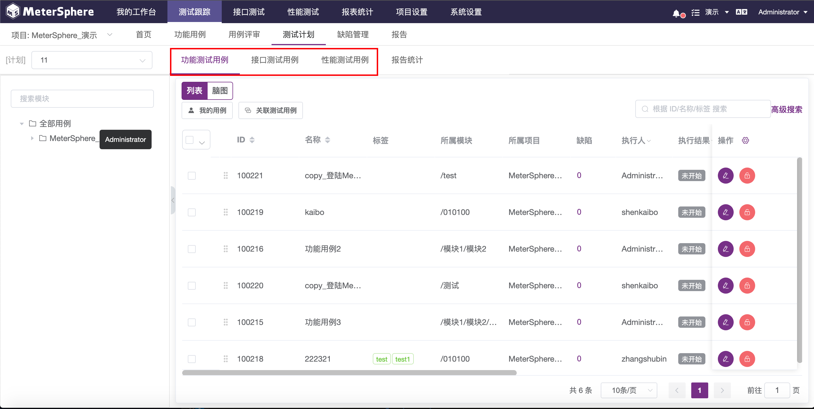

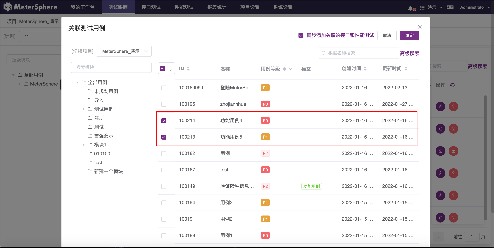

### 3.3 记录用例执行结果
关联测试用例后，即可在测试计划页面右侧的测试用例列表中查看到已关联的测试用例。点击某个测试用例操作列中的【编辑】按钮，进入【用例详情】页面。
在执行步骤中，填写每一步的实际结果及该步的执行结果，基于各步骤执行情况及评定标准，点击上方的状态按钮为此条用例标记执行状态。
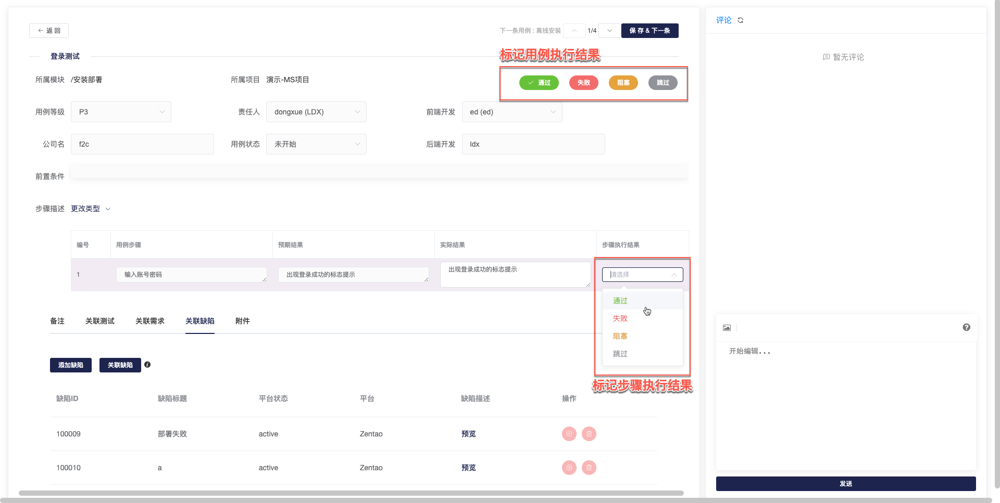

### 3.4 脑图方式记录用例执行结果
与用例的创建和评审类似，用例执行结果同样可以通过脑图方式记录。在【用例列表】页面点击【脑图】标签切换到【脑图展示】页面，选中待执行用例，通过添加标签的方式来标记用例执行结果。
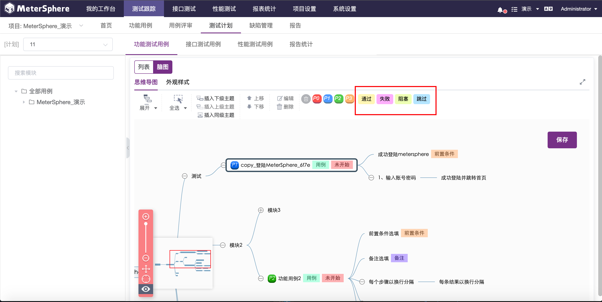

## 4 查看测试报告
当测试计划中的所有测试用例均执行完成后，在测试计划页面中，点击【测试报告】页签，可打开测试统计页面，查看测试报告。
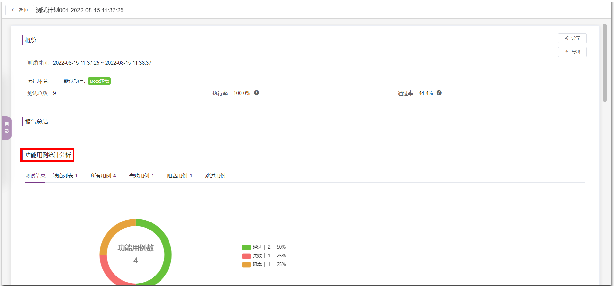

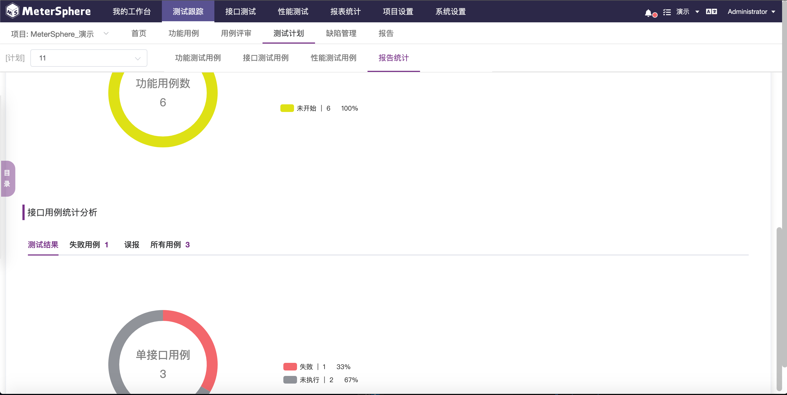