!!! ms-abstract ""

    MeterSphere UI 测试提供了元素库、UI 自动化、测试报告等UI测试相关功能。 用户可以使用多级模块来组织管理项目下的 UI 自动化场景，执行场景，生成查看测试报告。UI 测试模块是企业版 X-Pack 功能增强包功能，如需使用，请点击：[申请企业版试用](https://jinshuju.net/f/CzzAOe)。

!!! ms-abstract "注意事项"

    1. 修改 /opt/metersphere/.env 文件，MS_UI_ENABLED=true 修改配置后加载配置文件执行 msctl reload。 
    2. docker ps 检查 selenium-hub 容器是否成功启动。 
    3. v2.8.1之后版本在 MeterSphere 系统参数设置中修改 selenium-docker 地址为http://selenium-hub:4444。详情参考https://bbs.fit2cloud.com/t/topic/127 
    4. UI 测试用例，默认勾选 "性能模式" 没有截图展示，不勾选 "性能测试" 可以查看每个步骤的截图。 
    5. 如果导入 License 成功后，依然没有 UI 测试模块，请到【用户组与权限】处配置 UI 模块权限。

## 1 创建模块
!!! ms-abstract ""
    MeterSphere 通过模块树的方式组织管理场景，用户可以在左侧创建并管理模块树。元素库、UI自动化模块均支持创建模块树， 点击左侧的模块树中的【添加子模块】按钮，为该项目添加模块。

{ width="900px" }

## 2 创建元素
!!! ms-abstract ""
    点击左侧的模块树中的【添加子模块】 按钮，添加模块，然后创建元素。元素库可用于场景步骤中元素的选择。

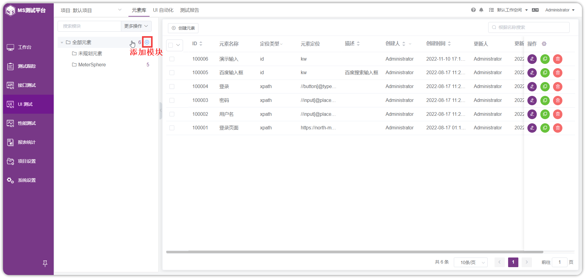{ width="900px" }
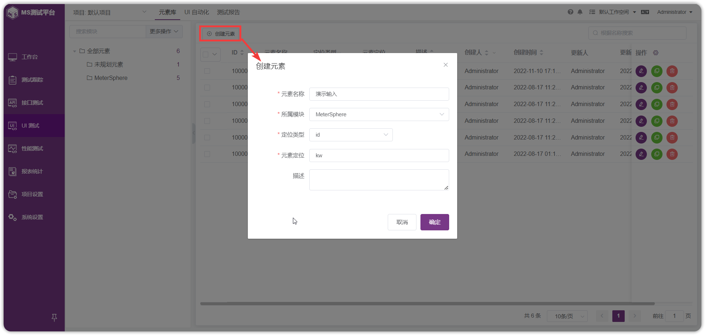{ width="900px" }
{ width="900px" }

## 3 创建场景
!!! ms-abstract ""
    用户可在各个模块中添加场景，可以手动创建，也可以通过导入的方式创建 UI 自动化场景。

### 3.1 导入 Selenium IDE 脚本

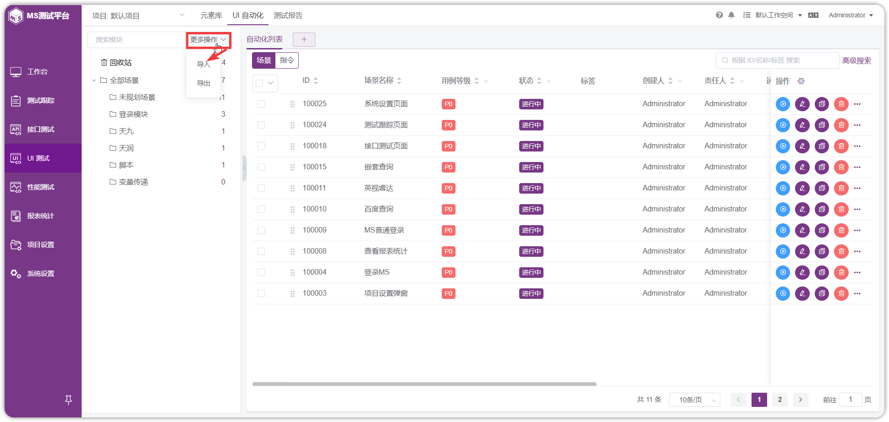{ width="900px" }
{ width="900px" }

### 3.2 手动创建场景
!!! ms-abstract ""
    点击右侧场景列表中的【+】号按钮，创建场景。
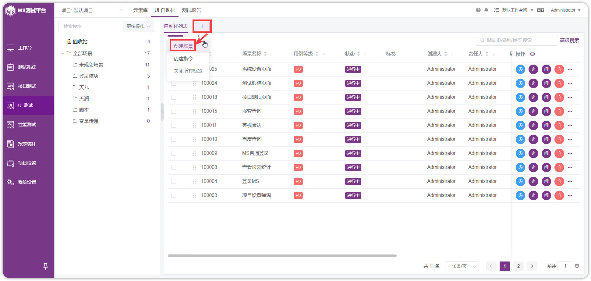{ width="900px" }

!!! ms-abstract ""
    在打开的【用例编辑】页面中填写名称、模块、状态、责任人等详细信息。
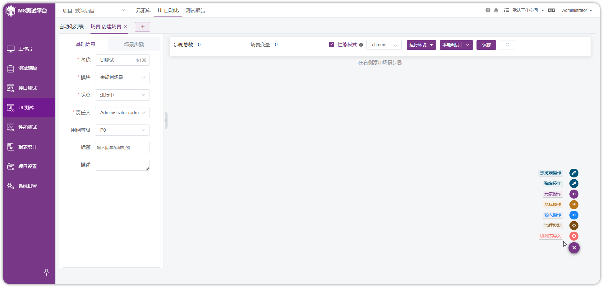{ width="900px" }

!!! ms-abstract ""
    点击页面右下角【+】号，可以添加场景步骤，场景步骤中的操作对象可以选择【元素对象】或者【元素定位】，【元素对象】是从元素库中选取配置好的元素，【元素定位】需要用元素定位的方式去定位元素。 
    以登录 MeterSphere 系统为例，添加如下几个步骤： 

    - 添加【浏览器操作】步骤，输入 MeterSphere 登录页面地址。

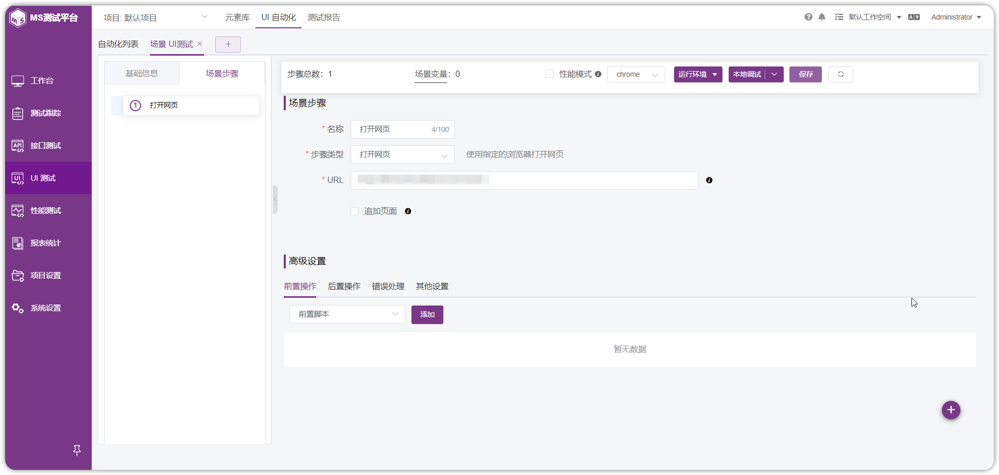{ width="900px" }

!!! ms-abstract ""

    - 添加【输入用户名】步骤: 操作对象选择【元素定位】，定位方式选择【xpath】，xpath 路径输入 `//input[@placeholder="ID 或 邮箱"]`。

{ width="900px" }

!!! ms-abstract ""
    
    - 获取 xpath 路径方式如下（以谷歌浏览器为例）：按下 F12 打开当前页的【元素】界面，选中左上方的【鼠标】按钮，拖到登录界面的【用户名输入框】上，点击鼠标可快速定位到【用户名】的 html 元素内容，输入【Ctrl+F】，根据元素内容的关键属性，在文本框中输入 xpath 路径，即可快速定位到元素，如果元素内容变黄，则表示 xpath 成功定位到元素。

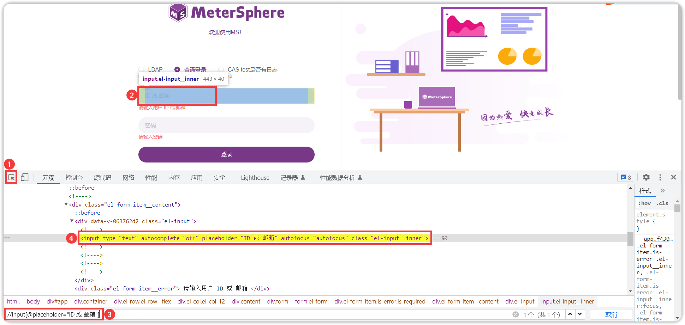{ width="900px" }

!!! ms-abstract ""
    
    - 添加【输入密码】步骤，方式同上，xpath 路径输入 `//input[@placeholder="密码"]`。

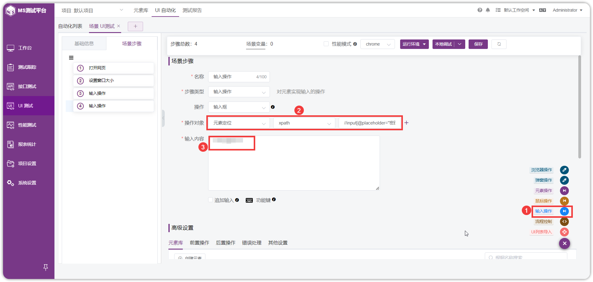{ width="900px" }

!!! ms-abstract ""

    - 添加【点击登录】步骤，点击页面右下角【+】号，选择【鼠标操作】，【步骤类型】选择鼠标点击，【点击方式】选择单机，元素位置选择【元素定位】，定位方式选择【xpath】，xpath 路径为 `//button[@type="button"]`。

{ width="900px" }

## 4 在场景步骤中添加高级设置
!!! ms-abstract ""
    在高级设置中，以后置操作为例，选择 后置操作 ，点击下拉框，选择需要的方式，点击添加。可以添加后置脚本，等待时间，断言和后置提取。

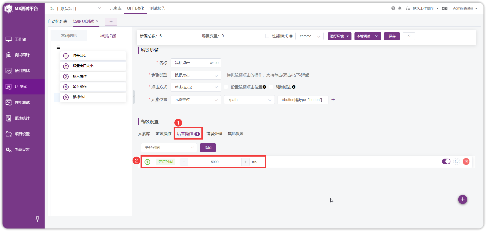{ width="900px" }
{ width="900px" }

## 5 调试 UI 自动化场景
!!! ms-abstract ""
    可在编辑场景页面调试 UI 场景，也可以在 UI 自动化场景列表页面执行UI场景。如图点击场景编辑页面的【生成报告】按钮，可生成并查看场景报告。 
    勾选性能模式，场景报告中无截图信息，不勾选性能模式，场景报告中有截图信息。 

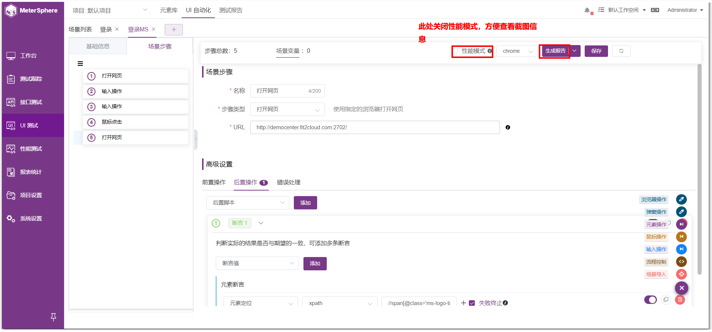{ width="900px" }

## 6 生成测试报告
!!! ms-abstract ""
    点击场景列表中执行按钮，会弹出页面显示本次场景的执行结果。

{ width="900px" }

!!! ms-abstract ""
    查看报告中步骤截图信息

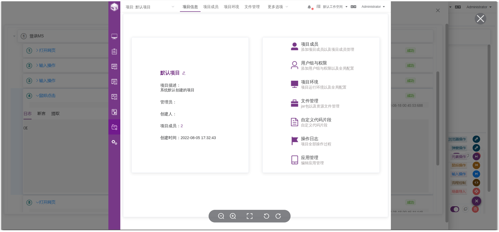{ width="900px" }

!!! ms-abstract ""
    也可在测试报告页面中，找到要查看的报告，点击其【报告详情】按钮打开【测试报告】页面查看测试报告。

{ width="900px" }