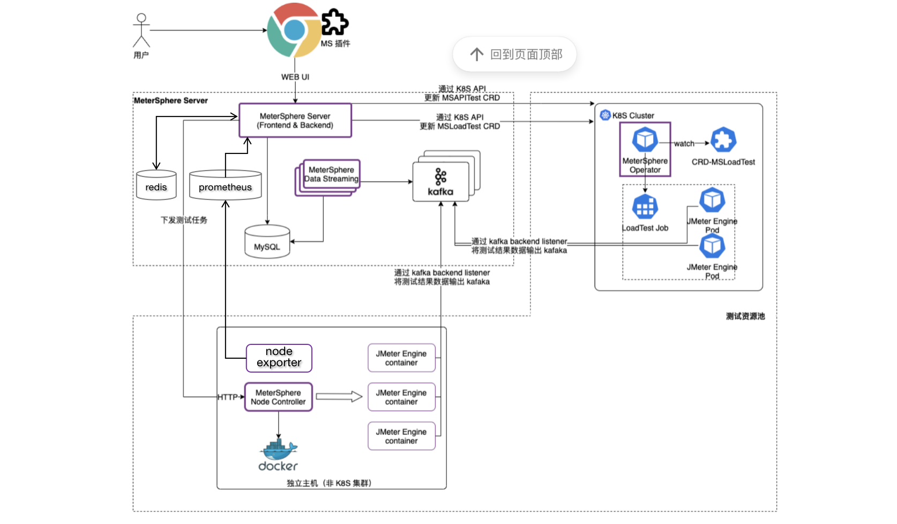
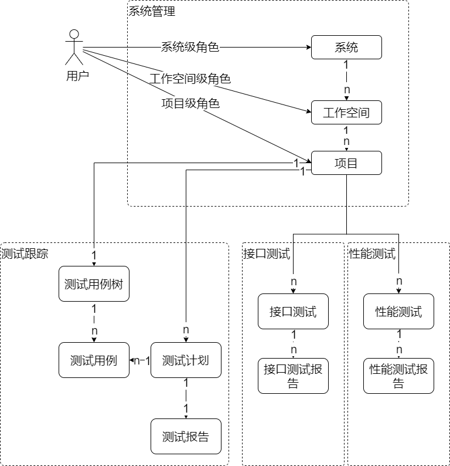
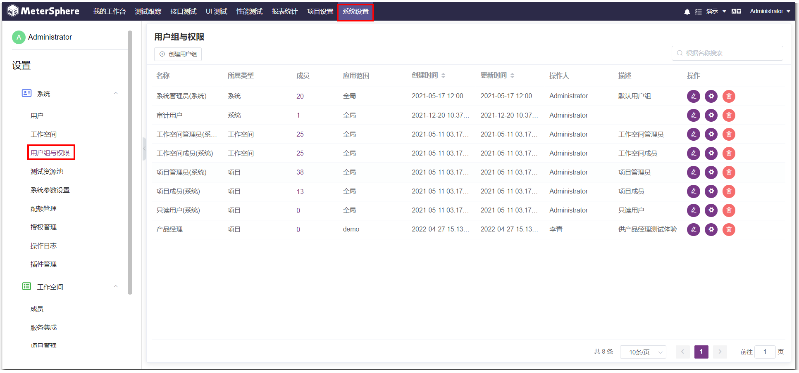
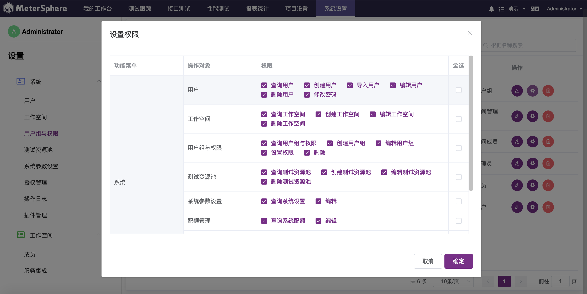

## 整体架构

### 组件说明

- **[Frontend](https://github.com/metersphere/metersphere)**: MeterSphere 的前端工程, 基于 Vue.js 进行开发。
- **[Backend](https://github.com/metersphere/metersphere)**: MeterSphere 的后端工程, 基于 Spring Boot 进行开发, 为 MeterSphere 的功能主体。
- **[Chrome Plugin](https://github.com/metersphere/chrome-extensions)**: 浏览器插件, 录制 Web 访问请求生成 JMeter 脚本并导入到 MeterSphere 中用于接口测试及性能测试。
- **[Jenkins Plugin](https://github.com/metersphere/jenkins-plugin)**: Jenkins 插件，在 Jenkins 中安装该插件后可将 Jenkins 任务中添加 MeterSphere 构建环节，用户在该构建环节中配置 MeterSphere 平台的认证信息后，可选择指定项目下的接口/性能测试进行触发执行。
- **[Node Controller](https://github.com/metersphere/node-controller)**: 为性能测试提供独立节点类型的测试资源池, 接收来自系统的性能测试任务, 动态的启动 JMeter容器完成性能测试。
- **MySQL**: MeterSphere 项目的主要数据均存储在 MySQL。
- **Redis**: MeterSphere 项目登录用户的session存储在 Redis。
- **Kafka**: 接收 JMeter 产生的接口测试或者性能测试的结果数据。
- **Prometheus**: 收集压力机及被测系统的监控数据。
- **[Data Streaming](https://github.com/metersphere/data-streaming)**: 从 Kafka 中获取接口测试或者性能测试结果数据进行处理后存入 MySQL 数据库。
- **Docker Engine**: 为 Node Controller 提供 JMeter 容器运行环境。

各个组件间的关系可参考下图

## 管理模型

### 概念说明

MeterSphere 提供了多租户、多角色的管理模型, 用户可根据所在团队的实际情况进行灵活的租户体系映射。

- **系统**: 每个独立部署的 MeterSphere 即称为一套系统。
- **系统级角色**: 角色的权限范围为整个系统, 常见的角色如系统管理员, 可管理整个系统内的租户、用户及测试资源, 同时可变更修改系统级配置参数。
- **工作空间**: MeterSphere 中的一级租户, 可映射为不同的部门或者产品线。
- **工作空间级角色**: 角色的权限范围限定在某个工作空间当中, 常见的角色如工作空间管理员及普通用户, 可在工作空间中创建项目、发起测试、查看测试报告等。
- **项目**: 以项目纬度管理各种类型测试数据，各个项目间数据隔离。
- **项目级角色**: 角色的权限范围限定在某个项目当中, 常见的角色如项目管理员、项目成员、只读用户等，可在项目中创建、修改、执行测试计划、功能测试用例、接口测试用例、性能测试用例、查看测试报告等。
- **自定义角色**: 可创建不同所属类型的自定义角色，满足更多样化的团队管理及在线协作。

不同的角色对应的具体权限，请到 `系统设置->用户组与权限->设置权限` 查看和设置。

 

## 技术栈

- 后端: [Spring Boot](https://www.tutorialspoint.com/spring_boot/spring_boot_introduction.htm)
- 前端: [Vue.js](https://vuejs.org/)
- 中间件: [MySQL](https://www.mysql.com/), [Kafka](https://kafka.apache.org/), [Redis](https://redis.io/), [Prometheus](https://prometheus.io/)
- 基础设施: [Docker](https://www.docker.com/), [Kubernetes](https://kubernetes.io/)
- 测试引擎: [JMeter](https://jmeter.apache.org/)
