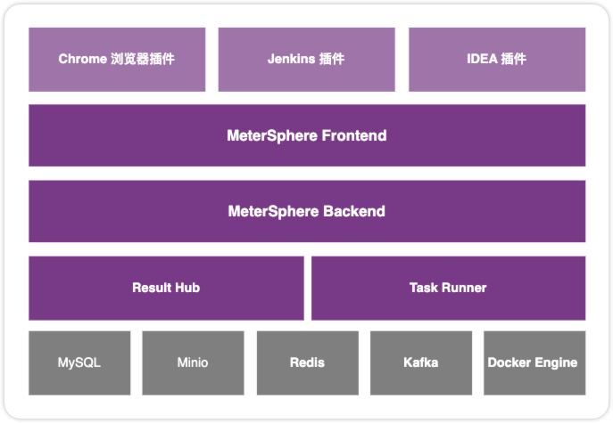
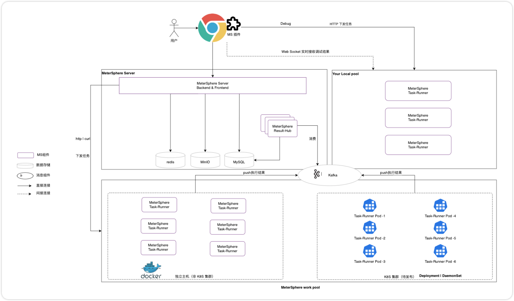
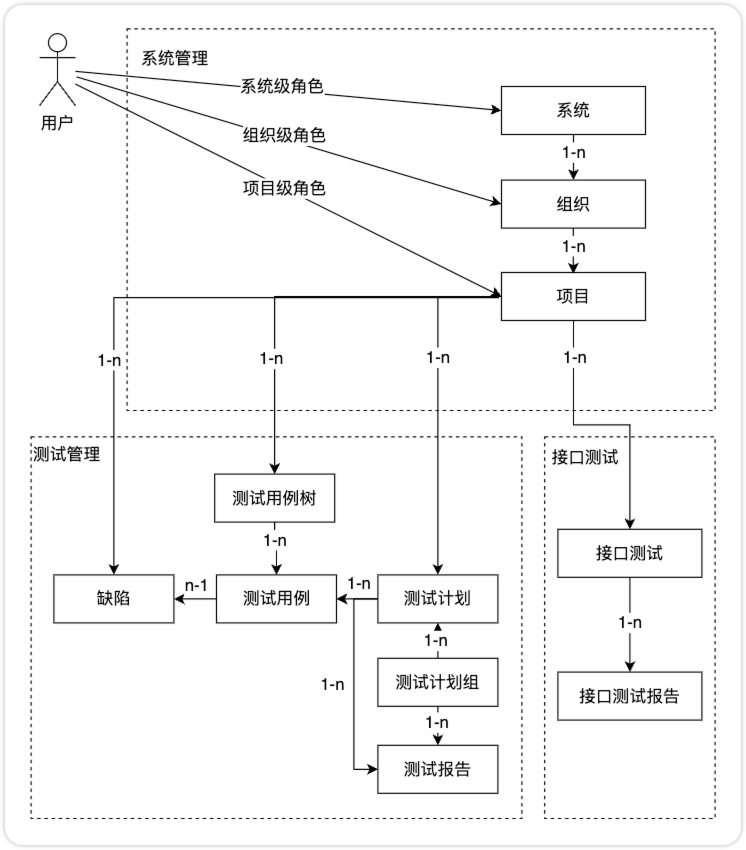

## 1 整体架构
{ width="900px" }

!!! ms-abstract "组件说明"

	- **[Frontend](https://github.com/metersphere/metersphere)**: MeterSphere 的前端工程, 基于 Vue.js 进行开发。
  	- **[Backend](https://github.com/metersphere/metersphere)**: MeterSphere 的后端工程, 基于 Spring Boot 进行开发, 为 MeterSphere 的功能主体。
  	- **[Chrome 浏览器插件]**: Chrome 浏览器插件, 录制 Web 访问请求生成 JMeter 脚本并导入到 MeterSphere 中用于接口测试及性能测试。
  	- **[Jenkins 插件]**: Jenkins 插件，在 Jenkins 中安装该插件后可将 Jenkins 任务中添加 MeterSphere 构建环节，用户在该构建环节中配置 MeterSphere 平台的认证信息后，可选择指定项目下的接口/性能测试进行触发执行。
  	- **[IDEA 插件]**: IDEA 插件，基于javadoc解析，能够自动识别类，同步接口定义到 MeterSphere。
	- **[Selenium IDE]**: Selenium 录制插件，录制 Web 访问请求生成 Selenium 脚本并导入到 MeterSphere 中用于 UI 测试。
  	- **[Task Runner]**: 所有执行任务统一交由 Task Runner 去调度 UI、接口、性能测试任务。
  	- **[Result Hub]**: UI、接口、性能测试的执行结果由 Result Hub 处理。
  	- **MySQL**: MeterSphere 项目的主要数据均存储在 MySQL。
  	- **Redis**: MeterSphere 项目登录用户的Session存储在 Redis。
  	- **Kafka**: 接收 Task Runner 产生的接口、UI、性能测试的结果数据。
  	- **Prometheus**: 收集压力机及被测系统的监控数据。
  	- **Docker Engine**: 为 Task Runner 提供 JMeter 容器运行环境。
  	- **Selenium Grid**: 为 UI自动化测试提供运行环境，支持分布式拓展。

!!! ms-abstract ""
	各个组件间的关系可参考下图： 

{ width="900px" }

## 2 管理模型
!!! ms-abstract ""
	MeterSphere 提供了多租户、多角色的管理模型, 用户可根据所在团队的实际情况进行灵活的租户体系映射。

    - **系统**: 每个独立部署的 MeterSphere 即称为一套系统。
    - **系统级角色**: 角色的权限范围为整个系统, 常见的角色如系统管理员、系统成员, 可管理整个系统内的租户、用户及测试资源, 同时可变更修改系统级配置参数。
    - **组织**: MeterSphere 中的一级租户, 可映射为不同的部门或者产品线。
    - **组织级角色**: 角色的权限范围限定在某个组织当中, 常见的角色如组织管理员及组织成员, 可在组织中创建项目、发起测试、查看测试报告等。
    - **项目**: 以项目纬度管理各种类型测试数据，各个项目间数据隔离。
    - **项目级角色**: 角色的权限范围限定在某个项目当中, 常见的角色如项目管理员、项目成员，可在项目中创建、修改、执行测试计划、功能测试用例、接口测试用例、、UI 测试、性能测试用例、查看测试报告等。
    - **自定义角色**: 可创建不同所属类型的自定义角色，满足更多样化的团队管理及在线协作。

{ width="900px" }

## 3 技术栈
!!! ms-abstract ""

    - 后端: [Spring Boot](https://www.tutorialspoint.com/spring_boot/spring_boot_introduction.htm)
    - 前端: [Vue.js](https://vuejs.org/)
    - 中间件: [MySQL](https://www.mysql.com/), [Kafka](https://kafka.apache.org/), [Redis](https://redis.io/), [MinIO](https://min.io/), [Prometheus](https://prometheus.io/)
    - 基础设施: [Docker](https://www.docker.com/), [Kubernetes](https://kubernetes.io/)
    - 测试引擎: [JMeter](https://jmeter.apache.org/)
