## 1 课程简介和线上环境介绍

[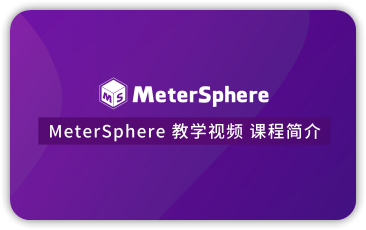{ width="280"}](https://www.bilibili.com/video/BV1XU4y127FK/)
[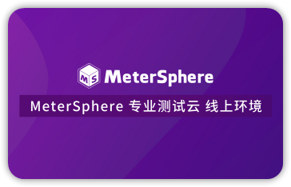{ width="280"}](https://www.bilibili.com/video/BV1YY4y1b7vz/)

## 2 测试跟踪

[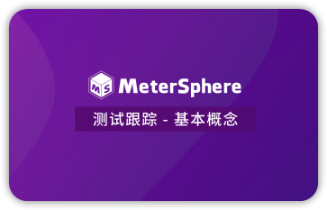{ width="280"}](https://www.bilibili.com/video/BV1BF411j7BB/)
[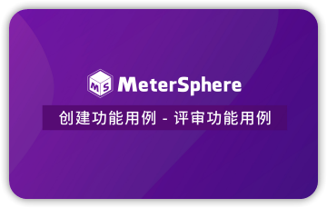{ width="280"}](https://www.bilibili.com/video/BV1nU4y1S7sR/)
[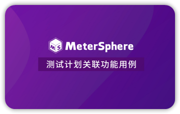{ width="280"}](https://www.bilibili.com/video/BV12A4y1S7NS/)

## 3 接口测试

[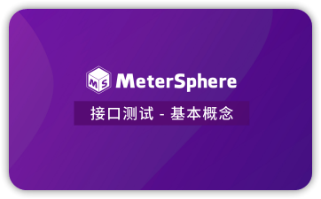{ width="280" }](https://www.bilibili.com/video/BV1x3411N72S/)
[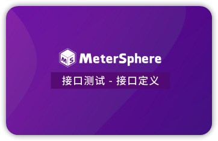{ width="280" }](https://www.bilibili.com/video/BV1Ta411Y7V7/)
[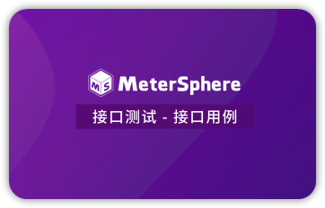{ width="280" }](https://www.bilibili.com/video/BV1h34y1h7ZT/)  

[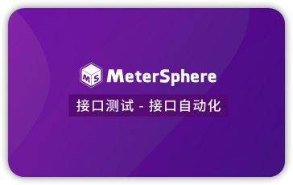{ width="280"}](https://www.bilibili.com/video/BV1ca411J79i/)
[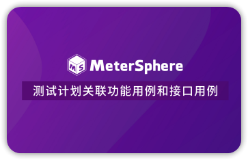{ width="280" }](https://www.bilibili.com/video/BV1Au411k7gw/)

## 4 性能测试

[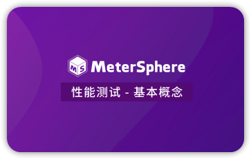{ width="280" }](https://www.bilibili.com/video/BV16Y411A7rD/)
[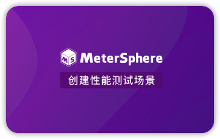{ width="280" }](https://www.bilibili.com/video/BV17L4y1F7ke/)
[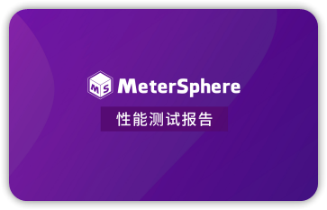{ width="280" }](https://www.bilibili.com/video/BV1EB4y1y7Sv/)  

[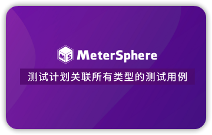{ width="280"}](https://www.bilibili.com/video/BV1Y5411d73E/)

## 5 UI 测试

[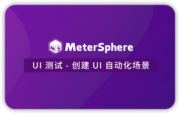{ width="280" }](https://www.bilibili.com/video/BV1EZ4y1a75S/)
[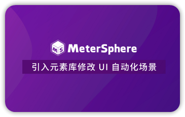{ width="280" }](https://www.bilibili.com/video/BV1gu411k7Px/)

## 6 融入 DevOps

[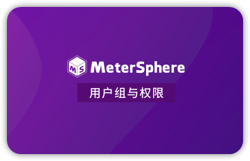{ width="280" }](https://www.bilibili.com/video/BV18A4y1S7hd/)
[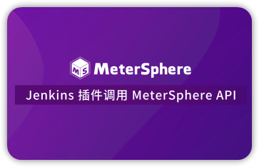{ width="280" }](https://www.bilibili.com/video/BV1TF41177cG/)

## 7 其它视频

!!! ms-abstract ""

    - [MeterSphere 如何与 TAPD和 Jira 对接](https://www.bilibili.com/video/BV1jr4y1c7Lg/)
    - [MeterSphere 如何对接邮件、钉钉、企业微信](https://www.bilibili.com/video/BV1dp4y167ch/)
    - [如何在 MeterSphere 中做场景化的接口测试](https://www.bilibili.com/video/BV1vy4y1q7f7/)
    - [如何在 MeterSphere 中导入 Postman 脚本做接口测试](https://www.bilibili.com/video/BV1W54y1C7uY)
    - [如何在 MeterSphere 中导入 Swagger UI 脚本做接口测试](https://www.bilibili.com/video/BV1YK411A7E8/)
