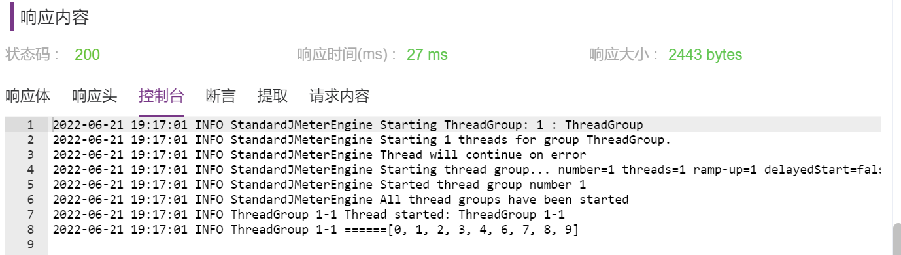

## Jar 包

Test.jar中是个冒泡排序：
```
public class Test {
    public static String BubbleSort (int[] arr) {
    	for (int i=0;i<arr.length-1;i++){
        	for (int j=0;j<arr.length-1-i;j++){
            	int temp = 0;
            	if (arr[j]>arr[j+1]) {
                	temp = arr[j];
                	arr[j] = arr[j+1];
                	arr[j+1] = temp;
            }
        }
    }
    return Arrays.toString(arr);
   }
}
```

## 上传外部 Jar 包


## BeanShell 引用外部 Jar 包

在接口前置/后置脚本中，选择 beanshell，引用Test.jar 中的方法<br>


