## 1 MOCK功能
MeterSphere 提供的 Mock 功能可以根据用户输入的请求参数、返回数据生成 Mock 接口，这些接口会自动生成模拟数据，以覆盖用户的一些测试需求。而 Mock 期望则是根据设置的请求触发条件来进行过滤，然后返回期望的数据。

列表功能，支持对Mock服务的开启/关闭、编辑、复制、删除操作。
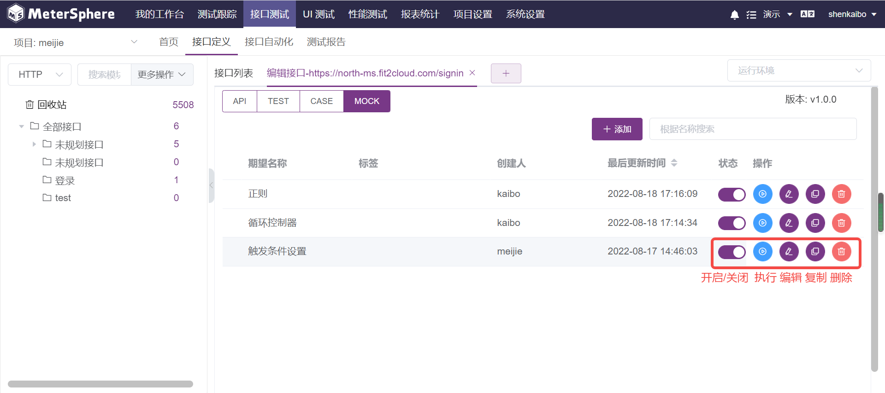

## 2 HTTP MOCK设置
在接口编辑页面可展示此接口的Mock信息，Mock默认地址是MeterSphere 系统地址+模块 ID+接口地址，一个接口定义可以设置多个Mock服务。点击Mock设置可跳转到Mock页面。点击MOCK页签也可以跳转到Mock页面。
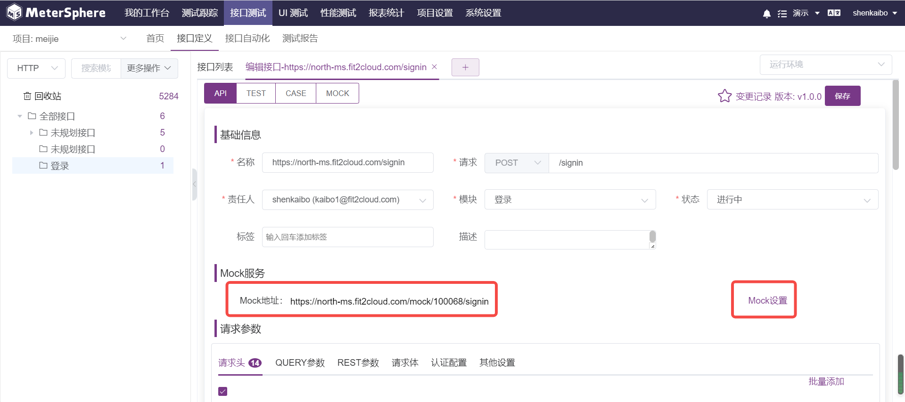

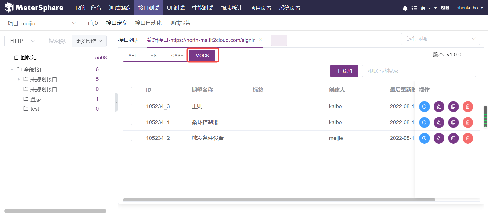

在MOCK页面中展示当前接口定义下的MOCK服务。 
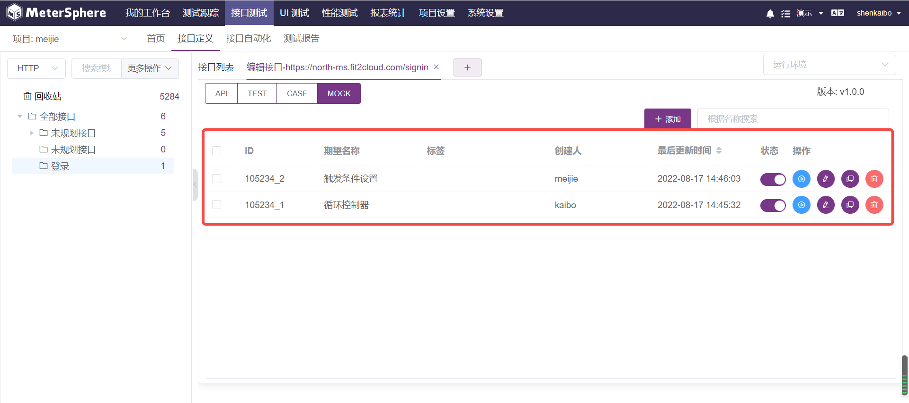

点击 +添加 按钮添加Mock服务。 

设置Mock服务触发条件,可以根据参数设定的值、长度、正则表达式Mock出相应的请求参数，同时参数与参数之间新增了逻辑判断（AND/OR），以提升触发条件的灵活性。
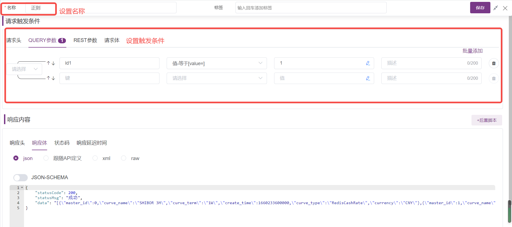

针对一些特定测试场景需要对返回信息进一步处理的情况，比如加解密操作、调用第三方 JAR 包等，MeterSphere在v1.18.0版本中Mock提供了对后置脚本的支持，可以通过编写脚本或添加系统已有的自定义代码片段来实现对返回信息的处理。
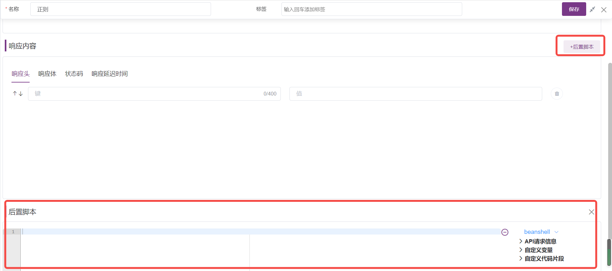

设置Mock服务响应内容。 
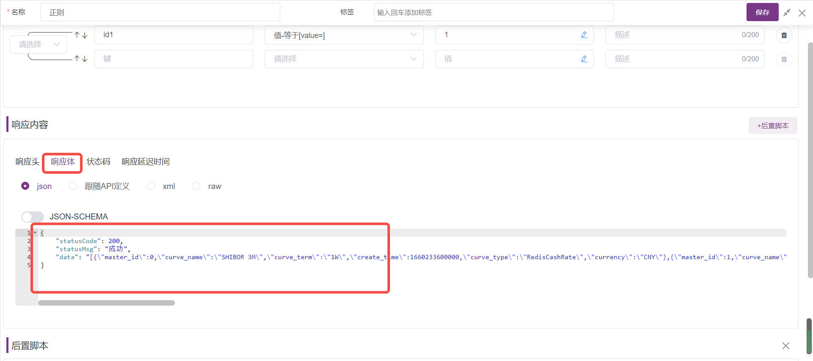

请求参数与设置的触发条件匹配，则返回设置的响应内容。 
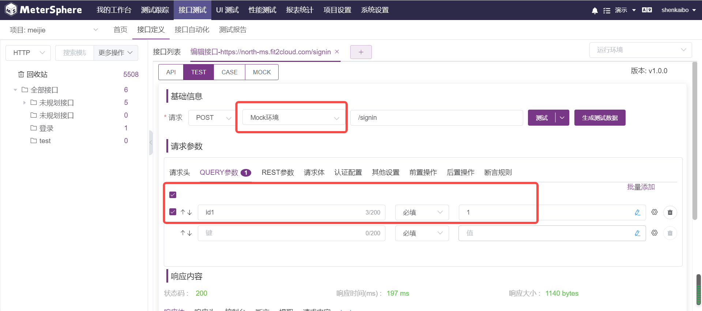

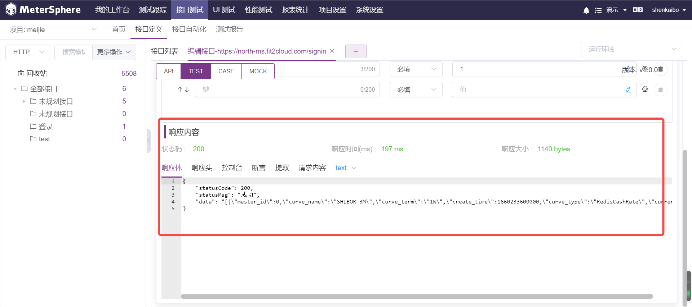

## 3 TCP MOCK设置
开启 TCP Mock 服务，Mock 服务显示未开启，需在【项目设置】-【应用管理】-【接口测试】中开启TCP Mock服务。
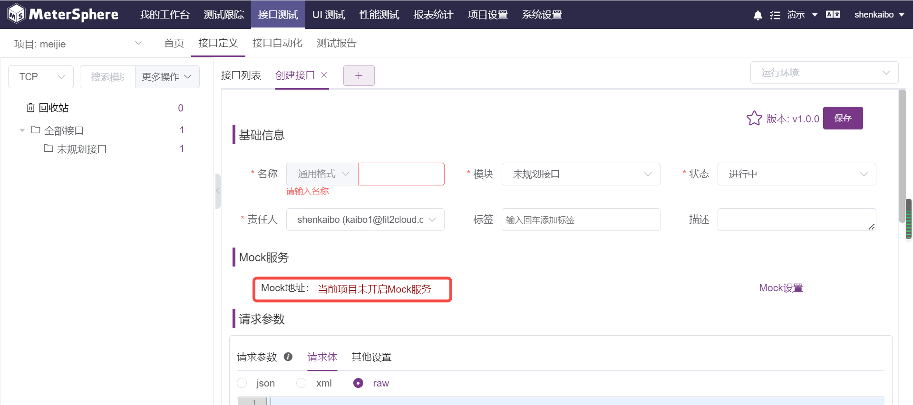

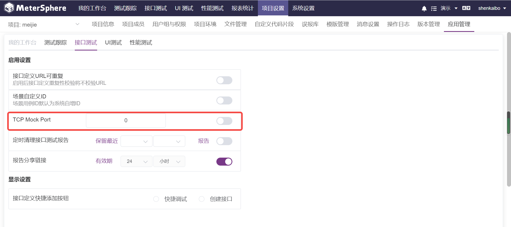

其他 TCP MOCK设置请参考【HTTP MOCK设置】

