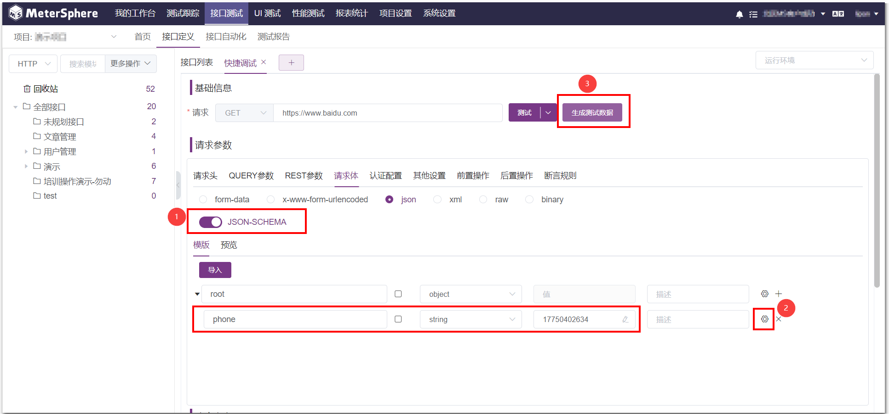
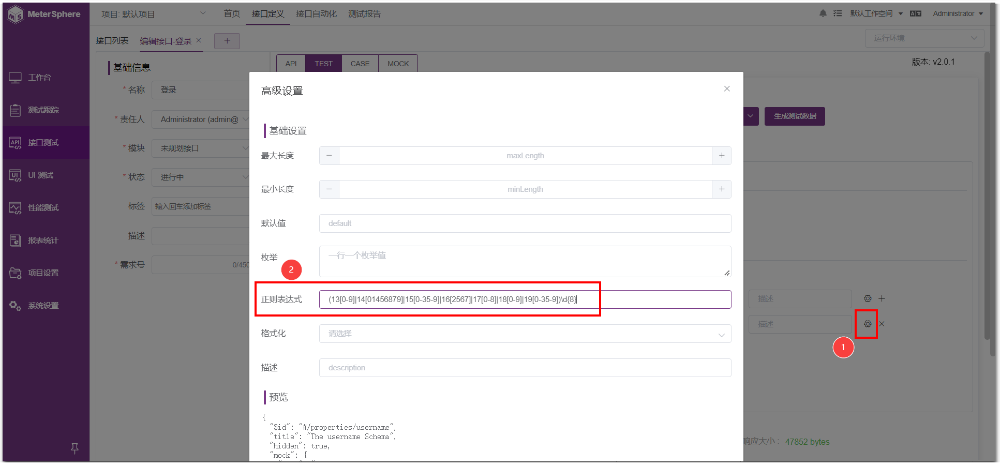
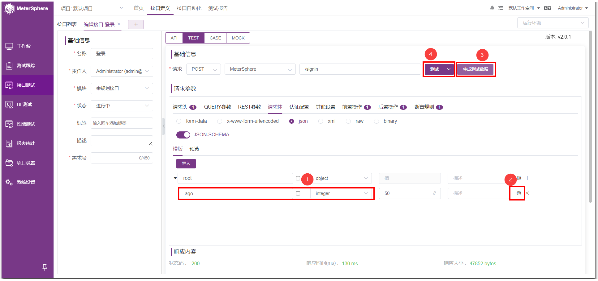
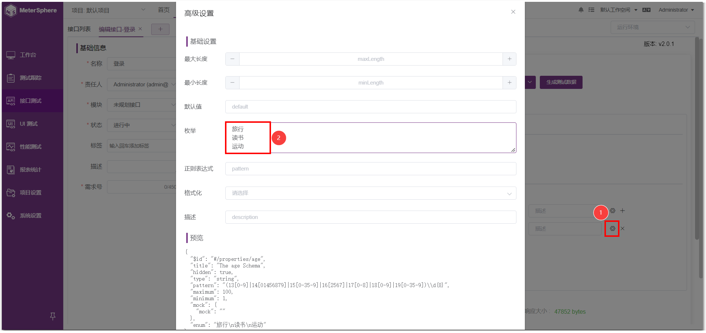
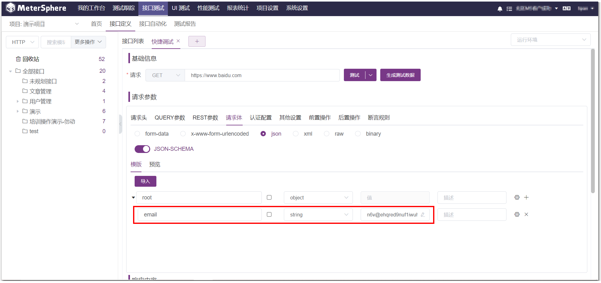
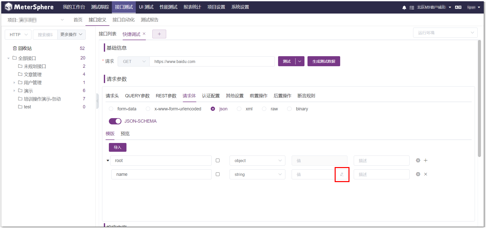
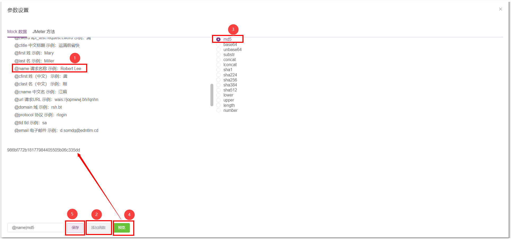

MeterSphere 快速生成测试数据功能，大大减少了手动造测试数据的时间和成本

## 1 接口 TEST 页面生成测试数据
eg: 接口参数 phone 的值为手机号，高级设置中配置正则生成数据  

第③步高级设置非必须设置，不设置时，生成的是该数据类型下随机值

补充：高级设置中默认值优先级最高；不同的数据类型高级设置可配置选项不一致；

比如 interger 类型无格式化选项；

高级设置配置11位手机号的正则【(13[0-9]|14[01456879]|15[0-35-9]|16[2567]|17[0-8]|18[0-9]|19[0-35-9])\d{8}】 

高级设置配置 age 字段，类型为 interger 的，最大值100，最小值1，点击生成数据效果  

高级设置配置 hobby 字段，类型为 string ，设置枚举值，点击生成数据可随机取其中一个  

高级设置中配置 string 类型值为 email 格式化，生成数据  

## 2 接口参数中使用函数生成测试数据
在接口测试下参数设置均适用，点击小铅笔也唤起函数助手 

可使用 Mock 函数生成测试数据，按需选择，如下图选择字符串后选择 md5，得到的值就是 md5 加密后的字符串 

使用 Jmeter 方法同样也可以生成测试数据，使用详情参考：[MeterSphere 中常用 Jmeter 函数使用详细](./MeterSphere 中常用 Jmeter 函数使用详细.md)