MeterSphere 接口测试支持环境配置，在 http 的环境以及环境组的使用场景中灵活配置运行环境

## 1. 环境配置
### 1.1 通用配置
在【项目设置-项目环境】中新建环境  
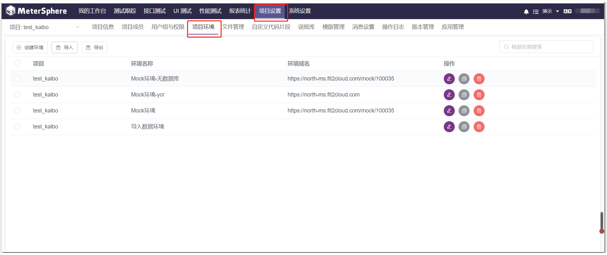

通用配置中包含三部分

- 环境变量：支持单个添加和批量添加 
- 配置域名解析：域名和服务器 IP 进行映射
- 链接超时和响应超时配置：可以设置超时时间

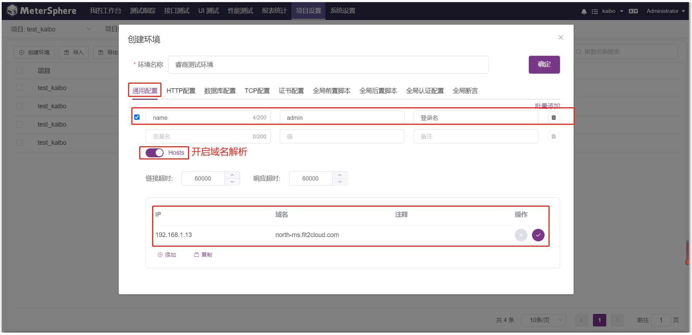

### 1.2 HTTP 配置
启用条件支持【无】【模块】【路径】等三种模式  
启用条件为【无】的 http 配置只能有一条，【模块】和【路径】的 http 配置可以有多条  
当一个接口既有【模块】又有【路径】匹配时，【模块】http 设置优先级大于【路径】http 设置 
!!! warning "注意"
    同一接口设置环境后优先级是【模块】>【路径】>【无】 
    当父子级模块只添加父级模块时，子级接口不能匹配到模块，模块需父子模块都选择上，才可匹配到

当一个项目的接口有多个服务端时，通过配置多个 http 配置，区分运行环境 
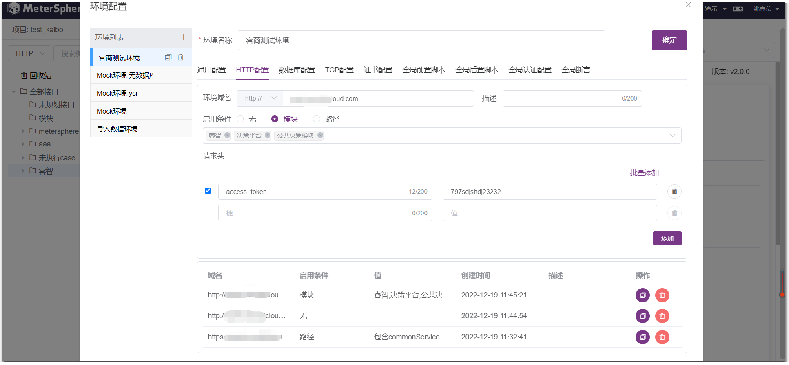

### 1.3 数据库配置
1.3.1 多数据源配置  
数据库可配置多个，支持配置 mysql，oracle，sqlserver，postgresql 数据库配置，点击校验可测试链接数据库 
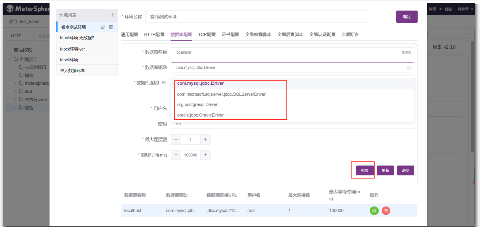

1.3.2 动态数据源切换 
配置多个数据库之后，环境变动，MeterSphere 会动态切换数据源 
如下图，在接口的前置/后置 SQL 中选择某环境，则数据源默认是改环境中数据库配置的第一个
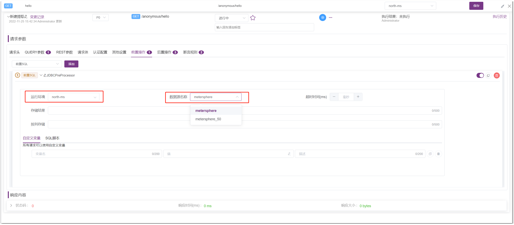

切换环境，会自动切换到数据库名称一致的数据源  
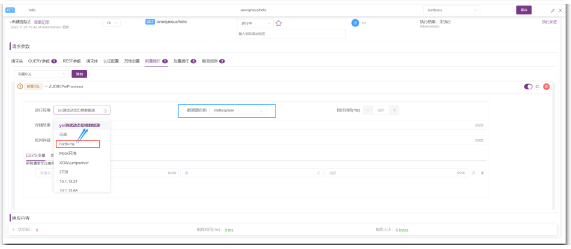

如环境中没有数据库配置，选择该环境，前置/后置 SQL 的数据库名称就为空，执行此 CASE 会报错误提示
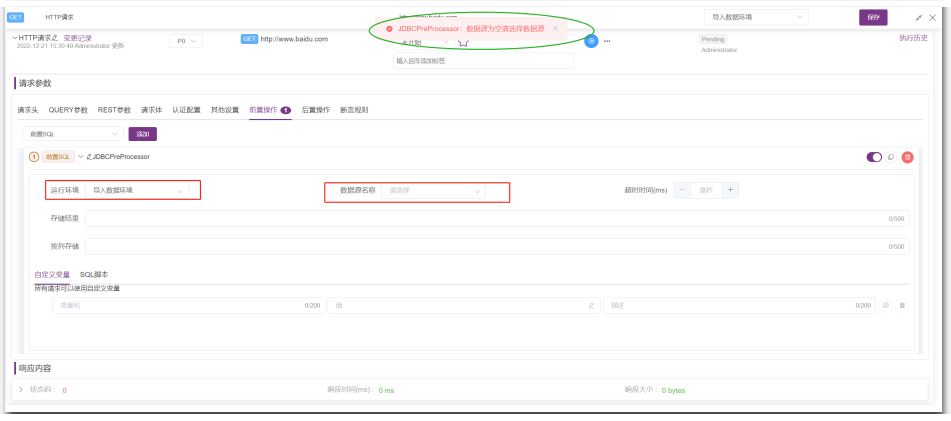

当 CASE 的执行环境发生变化时，CASE 中的 SQL 环境和数据源也会动态变化，当单个前置/后置 SQL 中的运行环境发生变化时，CASE 的执行环境不会动态变化，因此接口中的每一个前置/后置 SQL 都可以拥有各自独自且不一致的数据源 
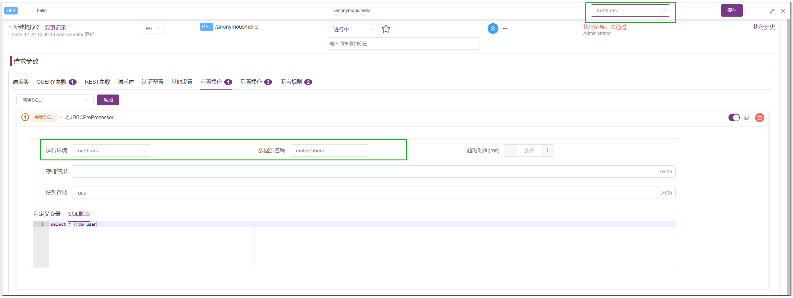

### 1.4 全局脚本配置
【全局前置脚本/全局后置脚本】可选择单个请求步骤前执行或所有场景步骤前执行，点击两个脚本选项，即可出现脚本框，使用该环境的接口/场景，会执行到脚本
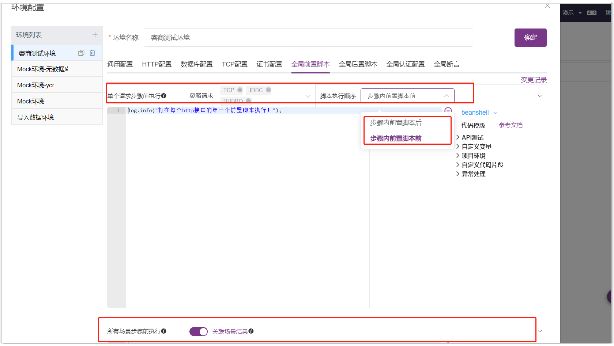

### 1.5 全局断言
环境可【开启/关闭误报库】，在环境中可添加环境的误报断言规则  
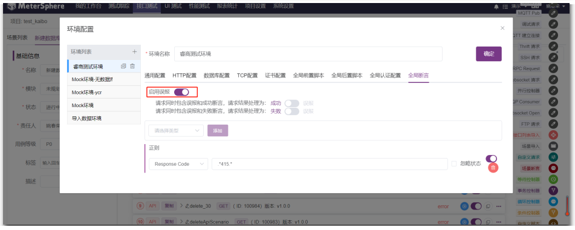

【项目设置-误报库】，可添加项目级别的误报规则设置  
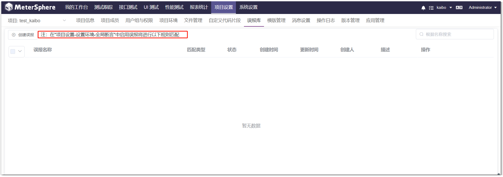

## 2 环境组配置
### 2.1 支持将多个项目中的环境配置进行组合
环境组应用于常用多个环境组合，减少重复环境配置，【系统设置-工作空间-环境管理】可新建环境组  
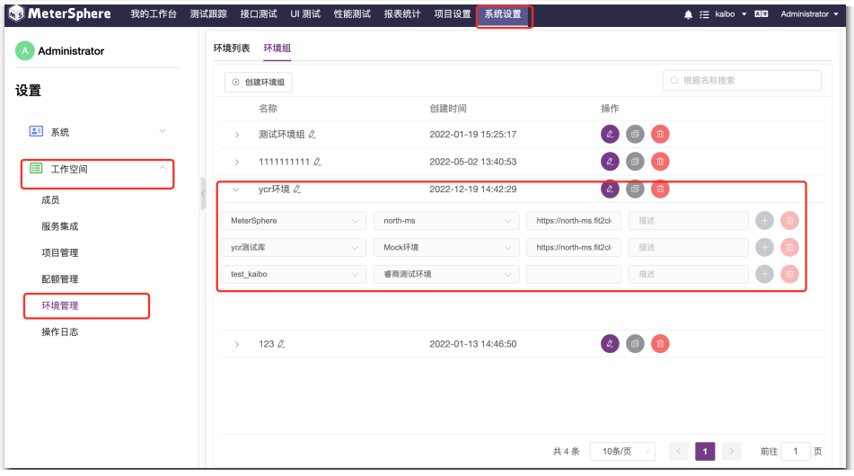

无环境组时，场景中多项目 CASE 执行，需要每次给每个项目设置运行环境  
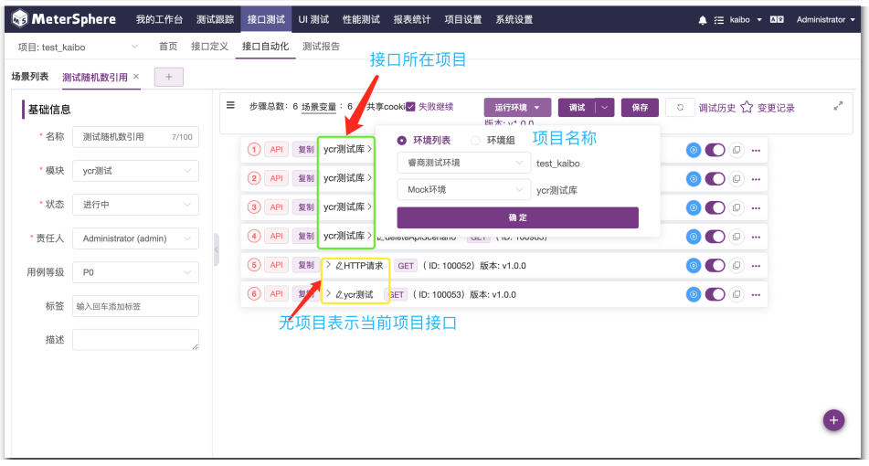

环境组设置后，显示可用环境组可选择，选择环境组后可直接运行，可用环境组是从环境组组中筛选同时包含当前场景的所有项目环境  
举例：某项目组中有 a/b/c 三个项目的环境，某场景中需要用到 a/b 环境，因此此场景可用环境组中包含此环境组   
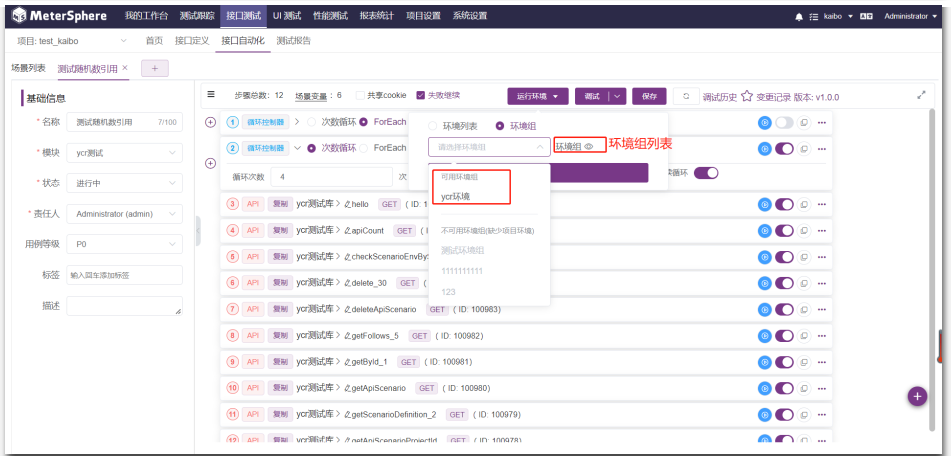

测试计划接口选择环境/执行测试计划选择环境，不显示可选环境组，点击确认环境时，才会验证环境是否可用   
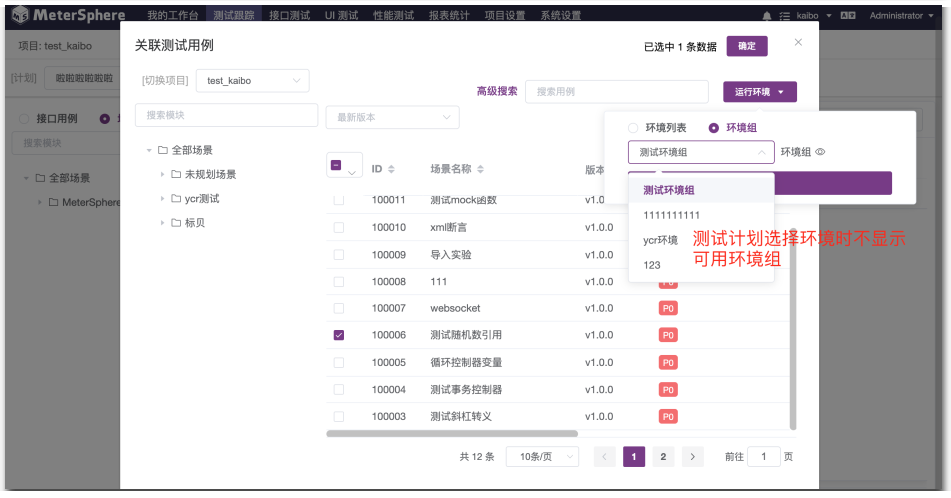

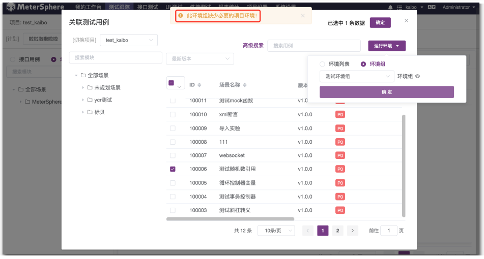

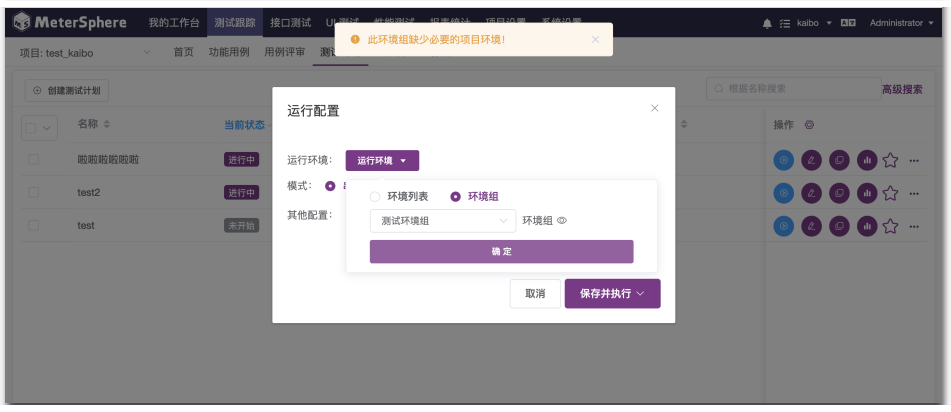