## 1 对接 Azure Devops 配置
### 1.1 配置 Azure Devops 
【系统设置-工作空间-服务集成】处，选择【Azure Devops】，填写配置信息，其中 PersonalAccessTokens 和 Azure 组织ID 来自 Azure Devops 平台如下位置。 
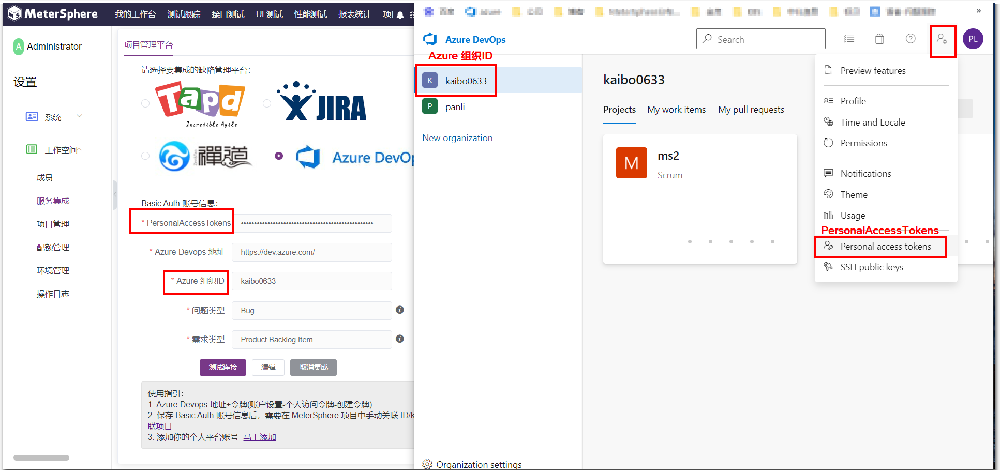

问题类型和需求类型来自 Azure Devops 平台-New Work Item 下拉类型  
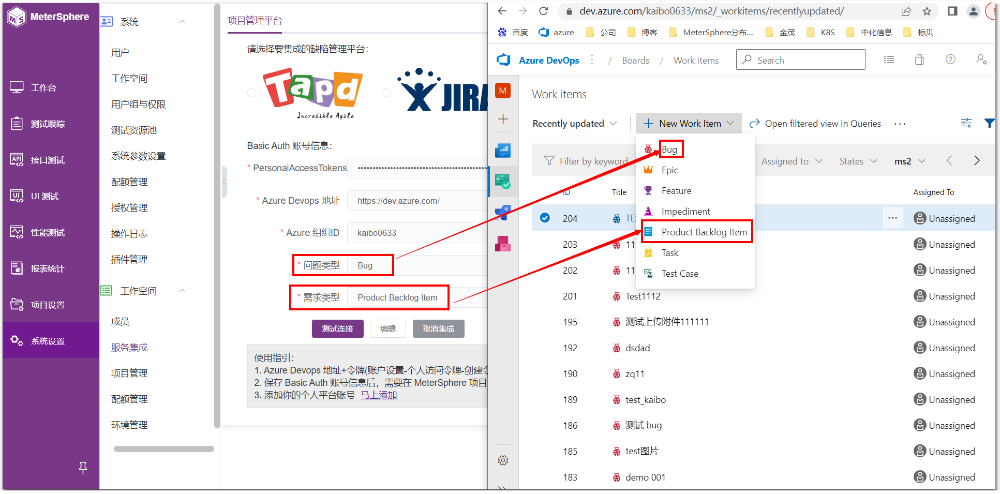

点击测试连接即可看到验证通过的提示  
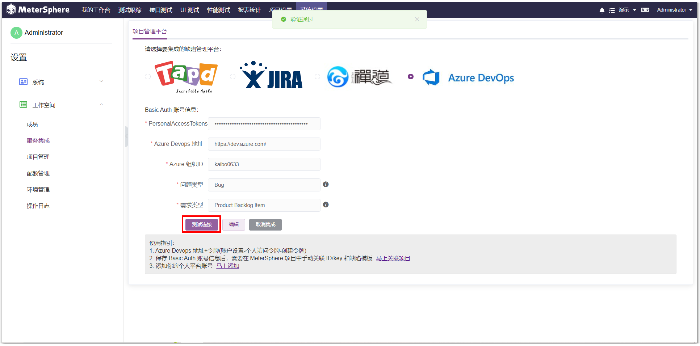

### 1.2 项目关联 Azure Devops
【系统设置-项目管理】处编辑项目，集成第三方平台选择 Azure Devops，项目 ID 取自 Azure Devops 平台该组织下的 Projects 名称，过滤 ID 是非必填项，取自该项目下的 Work Items 的 ID 

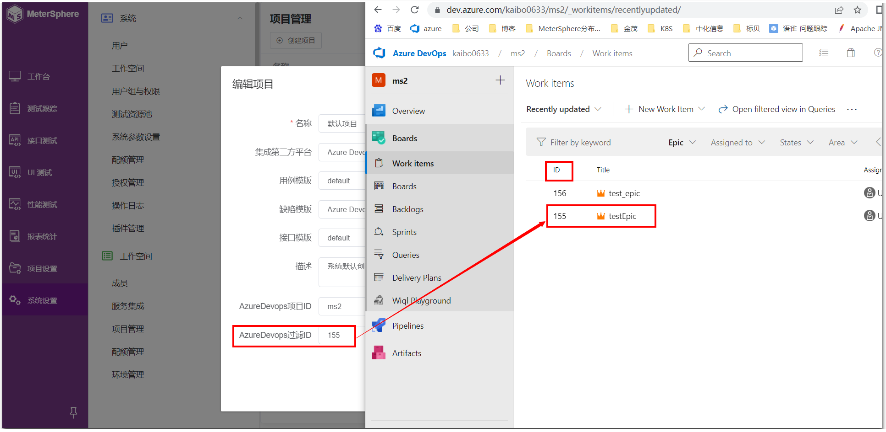

## 2 需求关联
Azure Devops平台的该过滤 ID 下挂有需求和缺陷，需求里又挂有子需求  
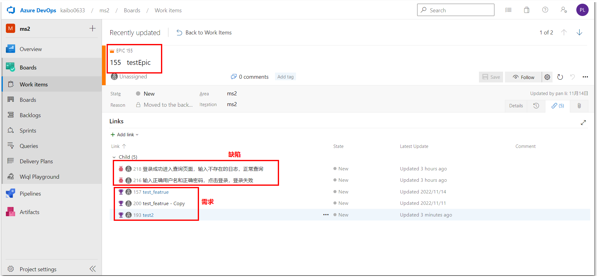

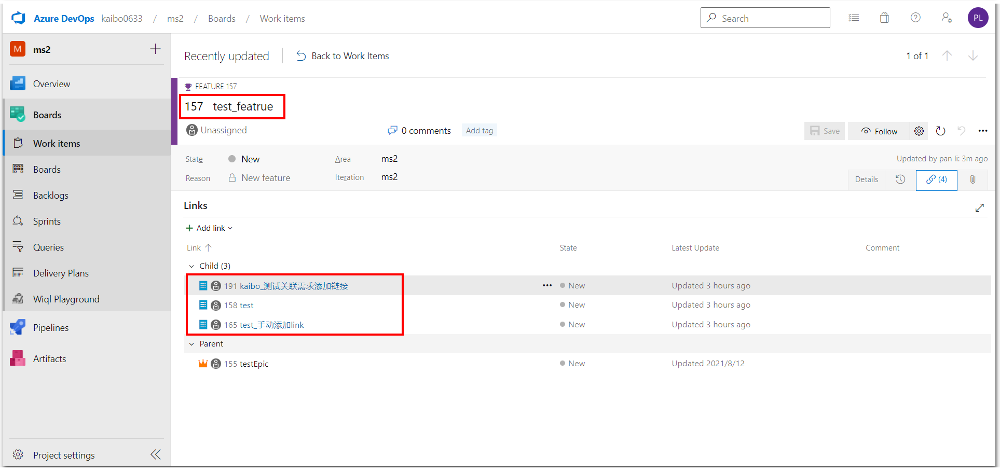

在 MS 平台功能用例需求处展示需求及子需求，若该需求下无子需求则不展示  
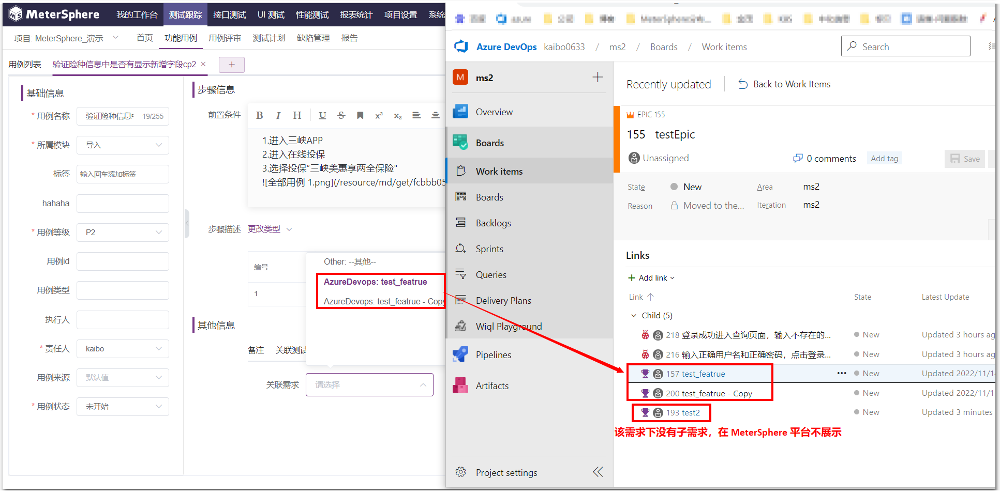

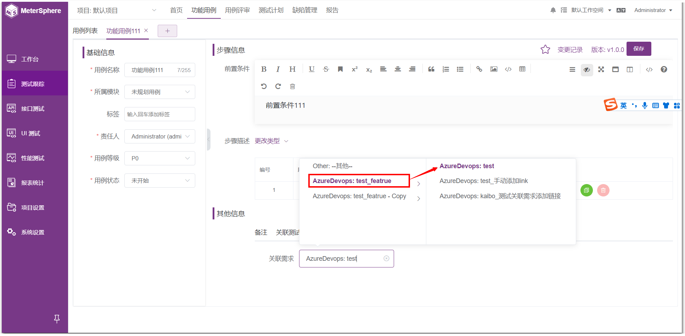

## 3 缺陷
### 3.1 同步缺陷
Azure Devops平台的该过滤 ID 下挂有需求和缺陷，需求里又挂有缺陷  

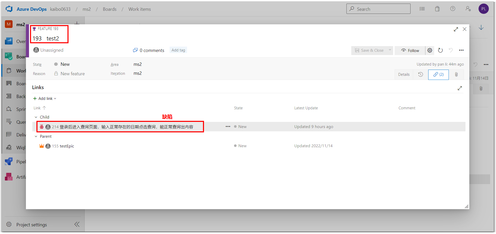

点击【同步缺陷】时，会将该过滤 ID 里的缺陷以及需求下挂有的缺陷都同步到 MS 平台。 
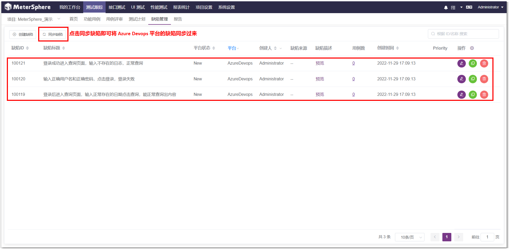

### 3.2 修改缺陷
修改同步过来的缺陷标题和缺陷状态，进行同步缺陷后，可在 Azure Devops 平台看到该缺陷的标题和缺陷状态已被同步修改。 
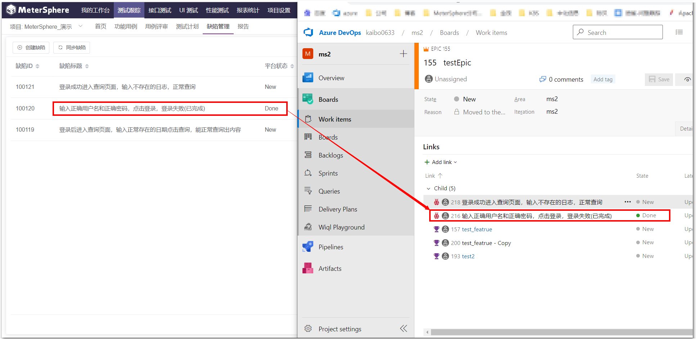

### 3.3 新增缺陷
在 MS 平台缺陷管理处新增缺陷，填写缺陷内容后点击保存 
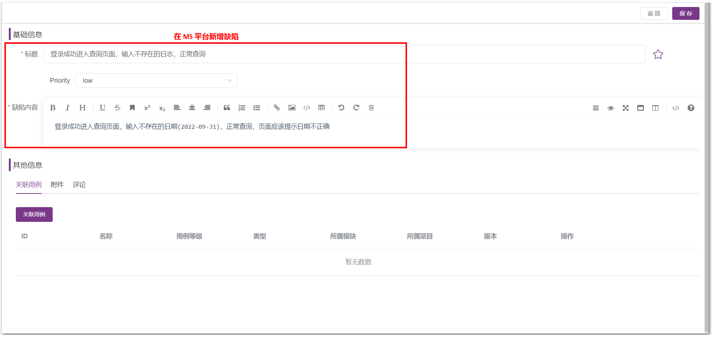

进行同步缺陷后，在 Azure Devops 平台可看到该缺陷已同步过来  
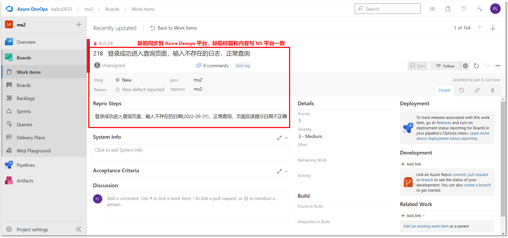

### 3.4 自定义缺陷字段
在 MS 平台自定义 Azure Devops 上的优先级 Priority 字段，可先使用 F12 进行抓取该字段的值  

在【项目设置-模板设置-模板字段】处新增字段 Priority，字段类型为 单选下拉框，选项内容自定义，选项ID为 Azure Devops该字段的显示值(1/2/3/4)  
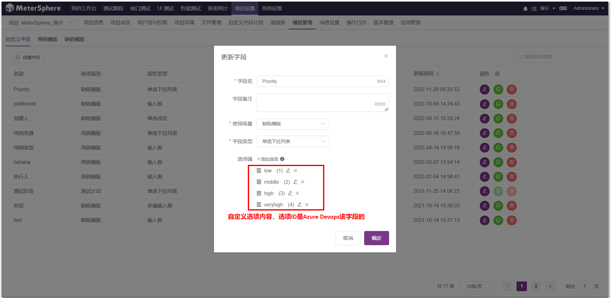

在 MS 平台的 Azure Devops 缺陷模板中使用已定义好的模板字段 Priority，API字段名为 Azure Devops 平台上 F12 抓取的字段值 
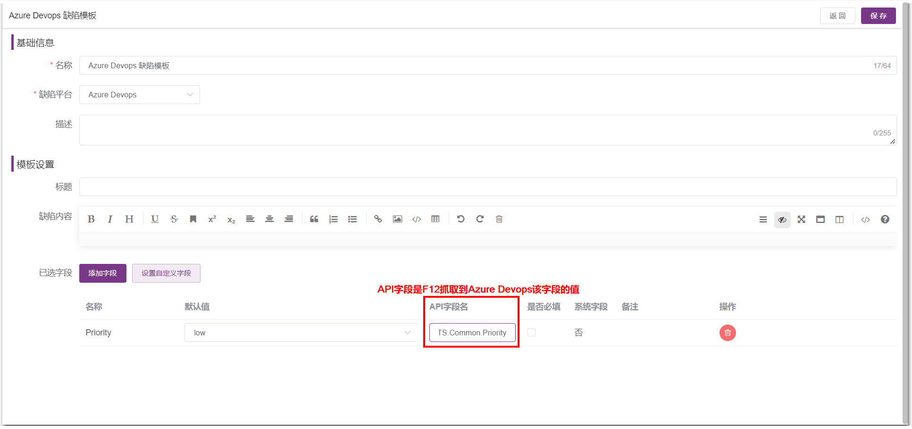

在 MS 上修改缺陷的 Priority 的值，由 low 修改为 veryhigh，进行保存  
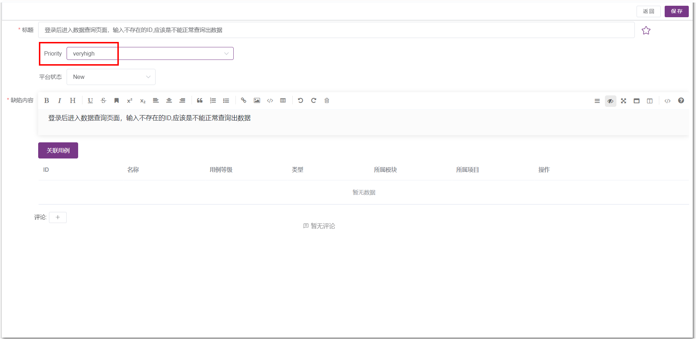

同步缺陷后，Azure Devops 平台上同一缺陷的内容处的 Priority 字段值变成了4  
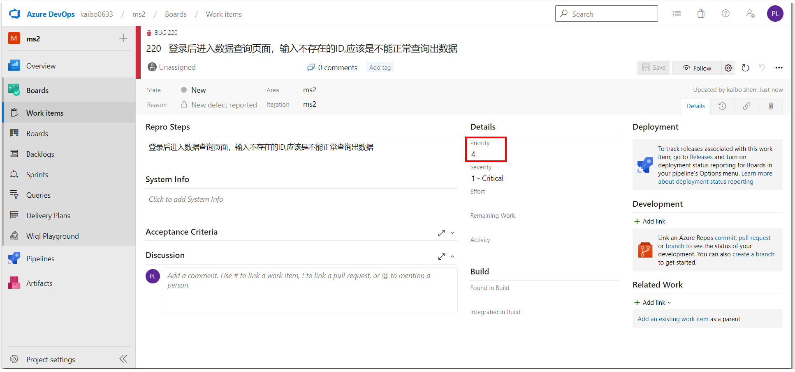