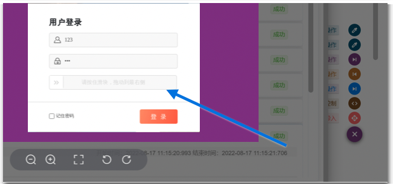
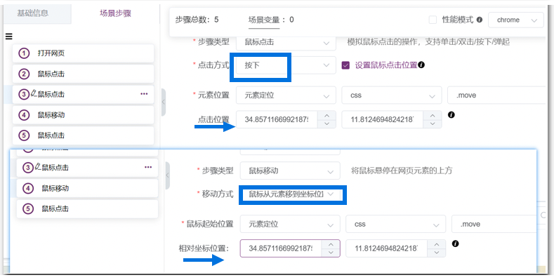
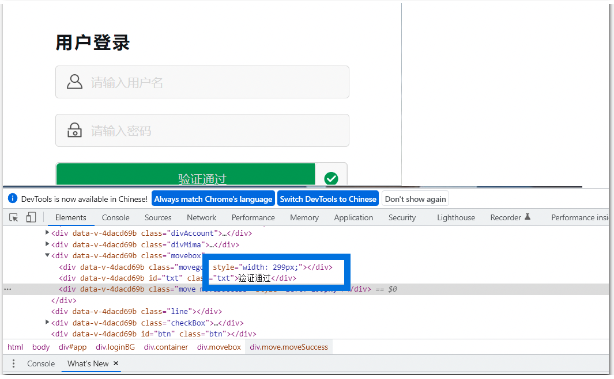
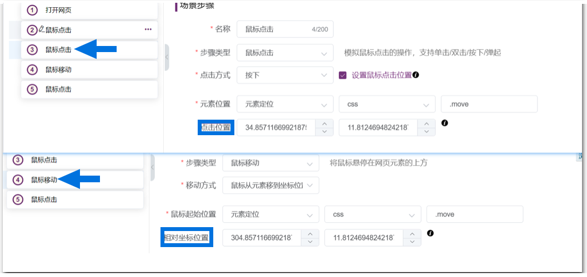
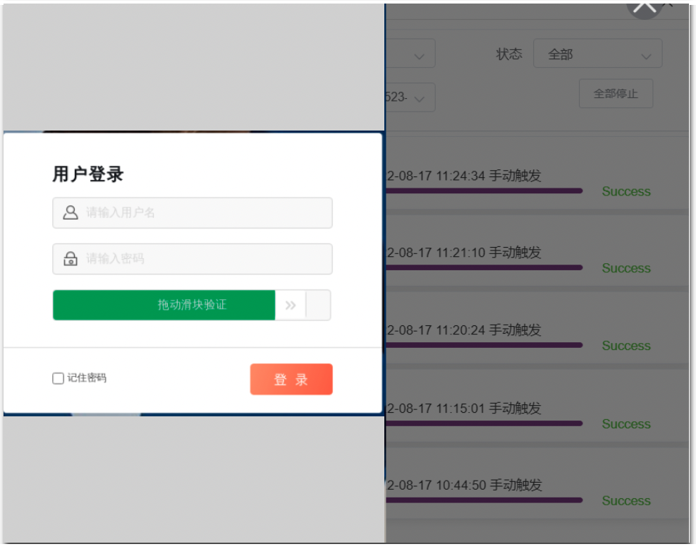
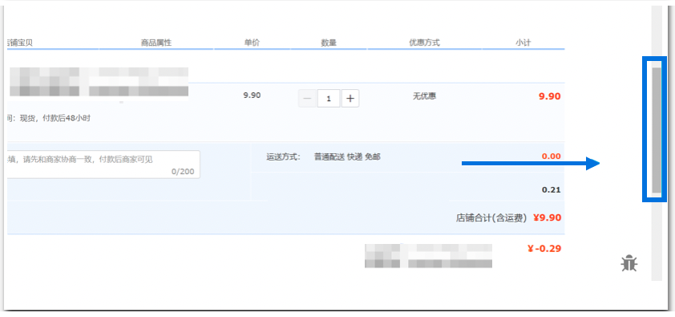
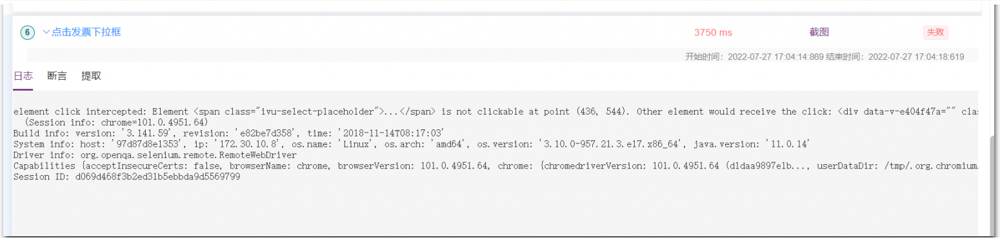
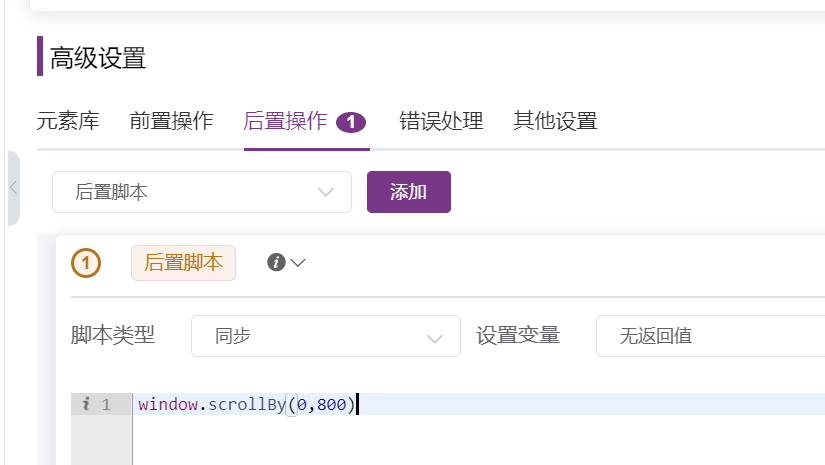

在日常登录各种 Web 网站时，我们总是会遇到需要输入各种验证码的场景：简单的如滑块验证，复杂一点的如随机数字图片验证码、滑动拼图验证、手机验证码、邮箱手机组合验证、随机汉字验证、转动图片验证等多种验证方式。其最终目的是通过设置验证码来防止机器大规模注册、机器暴力或爬虫破解数据密码对用户的网络安全和财产安全造成危害。

在测试活动中，对于长期存在的项目和系统中稳定使用的功能 ，测试团队一般会采用UI自动化测试来模拟用户界面操作及日常测试活动中高频场景，以确保系统界面能够向用户提供稳定访问和浏览操作的能力。同时，测试团队还要确保 UI 功能内部的对象符合预期要求，并遵循公司或行业的相关标准。

MeterSphere 一站式开源持续测试平台的UI测试模块，采用 Selenium 作为框架，在脚本语⾔、浏览器⽀持、并发、分布式以及插件录制视频录制⽅⾯都有完整的⽅案，并且与 JMeter（WebDriver Sampler）进行了深度集成，以解决企业对 UI 测试方面的需求。

本篇文章主要分享通过 MeterSphere 的 UI 测试模块，实现登录页面滑块验证。同样，在录制脚本元素识别方面，需要滑动网页右侧滚动条才能进行识别的问题也有简便的处理方案。具体的操作方式如下：

## 1 登录滑块验证处理

使用 Selenium IDE 插件录制脚本，生成对应的滑块验证 .side 文件：test-slide.side，并导入到 MeterSphere 的 UI 自动化场景列表
```
{
  "id": "54470853-1357-4246-892a-d02824bb11e8",
  "version": "2.0",
  "name": "test-slide",
  "url": "https://test.com.cn",
  "tests": [{
    "id": "f521905b-9a6d-42c5-a987-458e1bcb7b85",
    "name": "test-slide",
    "commands": [{
      "id": "1a8c905a-818a-413b-b853-259befb19ba8",
      "comment": "",
      "command": "open",
      "target": "/login",
      "targets": [],
      "value": ""
    }, {
      "id": "46fe6b50-cd1f-4005-b225-d080ec5ceee5",
      "comment": "",
      "command": "click",
      "target": "css=.move",
      "targets": [
        ["css=.move", "css:finder"],
        ["xpath=//div[@id='app']/div/div/div[3]/div[3]", "xpath:idRelative"],
        ["xpath=//div[3]/div[3]", "xpath:position"]
      ],
      "value": ""
    }, {
      "id": "ffa6c317-58c4-466e-a1df-ee2847c3c4c4",
      "comment": "",
      "command": "mouseDownAt",
      "target": "css=.move",
      "targets": [
        ["css=.move", "css:finder"],
        ["xpath=//div[@id='app']/div/div/div[3]/div[3]", "xpath:idRelative"],
        ["xpath=//div[3]/div[3]", "xpath:position"]
      ],
      "value": "34.85711669921875,11.812469482421875"
    }, {
      "id": "f44ad4c3-a361-41b4-9195-908fdb627b7b",
      "comment": "",
      "command": "mouseMoveAt",
      "target": "css=.move",
      "targets": [
        ["css=.move", "css:finder"],
        ["xpath=//div[@id='app']/div/div/div[3]/div[3]", "xpath:idRelative"],
        ["xpath=//div[3]/div[3]", "xpath:position"]
      ],
      "value": "304.85711669921875,11.812469482421875"
    }, {
      "id": "28e4d910-466f-4cb7-8bcf-2205000e06a5",
      "comment": "",
      "command": "mouseUpAt",
      "target": "css=.move",
      "targets": [
        ["css=.move", "css:finder"],
        ["xpath=//div[@id='app']/div/div/div[3]/div[3]", "xpath:idRelative"],
        ["xpath=//div[3]/div[3]", "xpath:position"]
      ],
      "value": "304.85711669921875,11.812469482421875"
    }]
  }],
  "suites": [{
    "id": "d45865d6-2f66-4d87-9689-d9c6c7b882d8",
    "name": "Default Suite",
    "persistSession": false,
    "parallel": false,
    "timeout": 300,
    "tests": ["f521905b-9a6d-42c5-a987-458e1bcb7b85"]
  }],
  "urls": ["https://test.com.cn/"],
  "plugins": []
}
```

直接点击【调试】按钮，从页面截图发现滑块始终未滑动但是测试提示成功，录制脚本滑块起始和终点位置相同；<br>
{ width="800px" }

{ width="800px" }

通过【F12】键验证检查，发现滑动条占 299px；此时调整测试脚本，修改滑块终点位置像素 +299px；再次调试滑块验证通过。注意：如果录制像素坐标为负坐标可以适当缩小录制窗口进行调节。<br>
{ width="800px" }

{ width="800px" }

{ width="800px" }

## 2 网页右侧滚动条处理
针对常见的购物结算网页 ，页面需识别元素一般在页面下方，需要滑动网页右侧滚动条才能进行识别。通过 Selenium IDE 插件录制脚本无法识别到元素；<br>
{ width="800px" }

{ width="800px" }

目前滚动条的处理方法是：在后置脚本插入 js 脚本：window.scrollBy(xnum,ynum) 处理网页滚动条（坐标位置同上由【F12】键获取位置），最后通过滑动进度条即可识别页面元素继续调试。<br>
{ width="800px" }

## 3 总结
MeterSphere 开源持续测试平台的UI测试功能模块成功将 Selenium 从工具转变为了平台，通过对 Selenium 框架进行简化和封装，实现了自然语言组件化操作，从而支持快速完成脚本编写。

针对测试活动中常见的问题处理方式，MeterSphere 都有对应处理策略，能满足企业在学习、管理 UI 测试方面的实际需求。同时，MeterSphere 还支持原生的 Selenium Gird 分布式方案，以满足企业对 UI 自动化的高并发需求。