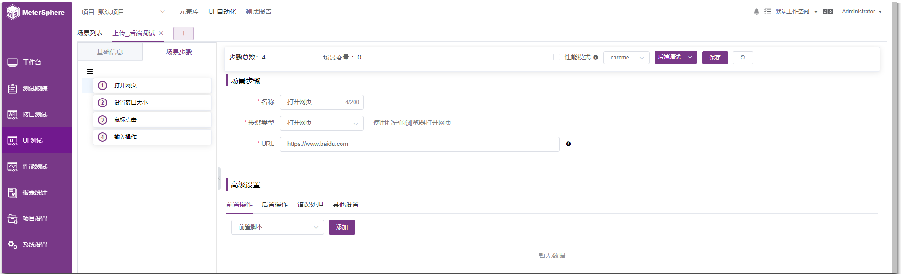
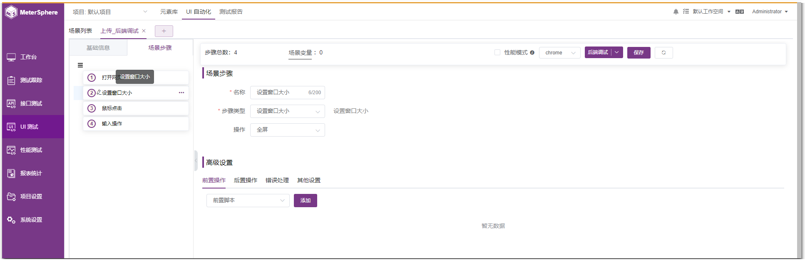
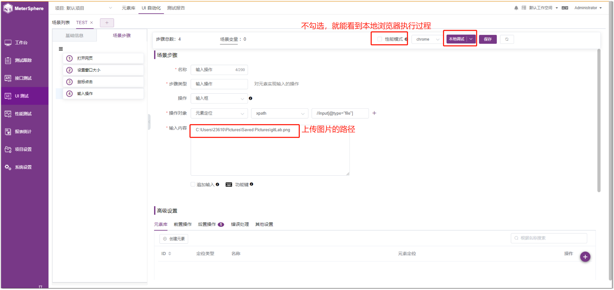
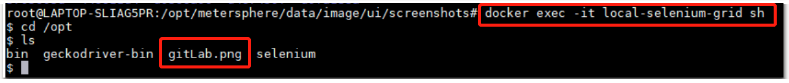
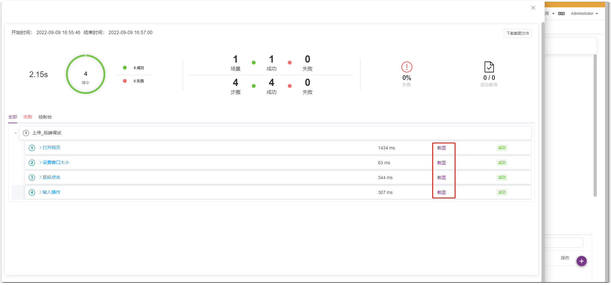
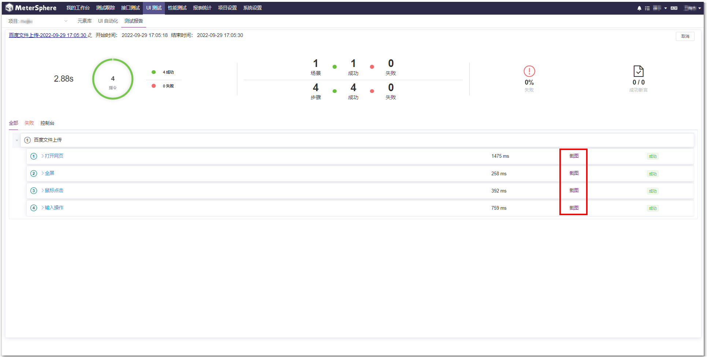

实际项目中，文件/图片上传的场景较多。本文以百度上传图片进行搜索为例。

场景: 在百度搜索框中，上传图片进行搜索  
{ width="1200px" }

场景步骤: 
打开网页，访问 https://www.baidu.com 网站  
{ width="1200px" }

设置窗口大小，将浏览器全屏展示  
{ width="1200px" }

鼠标点击上传图片的按钮，正确填写上传图片按钮的定位，在后置操作中设置等待时间  
{ width="1200px" }

上传图片，在 html 中上传图片定位到是个 input 标签，可使用输入框，输入图片路径进行上传。对于本地调试和后端调式而言，图片路径是不一样的。具体如下： 

## 1 本地调试
### 1.1 前提
MeterSphere 服务端和本机在同一网络环境  
下载浏览器驱动-运行驱动-将本地运行 Selenium-server 配置到 MeterSphere 平台，详情参考: [UI 测试调用远程服务器](https://metersphere.io/docs/v2.x/tutorial/UI 测试调用远程服务器/#2-metersphere)

### 1.2 上传图片
输入框中，可以直接写入图片的本地路径，进行图片上传，并且在后置操作中设置等待时间  
{ width="1200px" }

不勾选性能模式，点击保存按钮，点击【本地调试】，即可看到本地浏览器上传图片的操作  
{ width="1200px" }

## 2 后端调试
将图片上传到 local-selenium-grid 容器里，放到某一路径下   
{ width="1200px" }

可以直接写容器内图片的路径，不勾选性能模式，即可看到后端调试时的截图情况。可在【其他配置】处选择当前步骤截图。 
{ width="1200px" }

不勾选性能模式，点击保存按钮，点击【后端调试】，可看到该场景步骤正常执行  
{ width="1200px" }

## 3 生成报告
在 UI 测试场景中，不勾选性能模式，点击【生成报告】，即可看到该场景的报告，且每一步都带有截图  
{ width="1200px" }

也可以进入【测试报告】页面，找到该场景的报告进行查看，可看到该场景的报告详情  
{ width="1200px" }