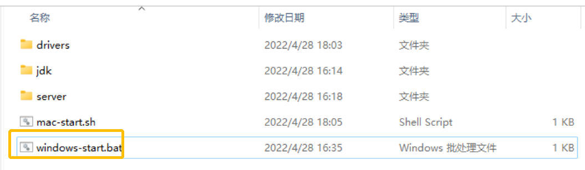

5月13日，MeterSphere 开源持续测试平台发布 v1.20.2 版本。在这一版本中，MeterSphere新增“UI场景用例支持启动本地浏览器调试”的功能。

在此前的版本中，UI场景调试默认调用 MeterSphere 服务端的 Selenium-server，用户无法看到浏览器被唤起执行的全过程。为了提升UI场景用例调试的用户体验以及调试效率，MeterSphere在调试方式上新增了“本地调试（即远程调用浏览器）”功能。

MeterSphere远程调用浏览器的效果如下图所示。 

## 1 MeterSphere 远程调用浏览器实现原理

MeterSphere 调起浏览器的动作其实是由浏览器驱动完成的。因为 MeterSphere 封装了 JMeter 的相关操作交由内部使用，所以在进行UI调试操作时，会调用到 JMeter 引擎。JMeter 通过 MeterSphere 配置的 RemoteDriverConfig 找到对应的 Selenium-server地址，以及所需要调起的浏览器信息（例如 Chrome、Firefox 等），并与 Selenium-server 建立 WebSocket 连接，进而使用Selenium-server 中配置的浏览器的驱动信息，通过浏览器驱动来完成浏览器的调起。

## 2 MeterSphere 远程调用浏览器配置过程
### 2.1 下载驱动程序

百度网盘链接：https://pan.baidu.com/s/1ya5orSd36fZFJchUltxfjA?pwd=yt5v

!!! info ""
    1. 网盘程序中包含100.0.4896.127版本的 Mac OS、Windows 的 ChromeDriver 插件，其他版本请通过（http://chromedriver.storage.googleapis.com/index.html）下载替换（驱动名称与程序中的驱动名称一致）即可。 
    2. 浏览器版本号与浏览器驱动只需对应前三段即可，例如100.0.4896.127。

{:height="100%" width="70%"}

{:height="100%" width="70%"}

### 2.2 运行驱动程序

2.2.1 Windows 操作系统：
解压附件中的压缩包到自定义目录，双击“windows-start.bat”运行即可。
{:height="100%" width="70%"}

看到如下日志则证明已经运行成功。

{:height="100%" width="70%"}

2.2.2 Mac OS 操作系统：
本地需要装有 JDK 环境，并且配置好环境变量。

解压附件中的压缩包到自定义目录，在终端中进入文件目录，执行sh mac-start.sh即可。

!!! info ""
    如果没有执行权限，则需在 mac-start.sh文件所在目录执行 chmod 777 mac-start.sh命令。

{:height="100%" width="70%"}

运行时默认会启动 19091 端口，若需要更改则需要编辑 bat 文件进行调整，具体细节请参考脚本参数说明。

脚本参数说明：
<table>
  <td bgcolor="#783887" align="middle" style="font-weight:bold;color: white">
   描述
  </td>
  <td bgcolor="#783887" align="middle" style="font-weight:bold;color: white">
   参数名
  </td>
  <td bgcolor="#783887" align="middle" style="font-weight:bold;color: white">
   默认值
  </td>
  <tbody>
    <tr>
        <td >启动端口</td>
        <td >--port</td>
        <td>19091</td>
    </tr>
    <tr>
        <td >配置Chrome驱动地址	</td>
        <td >-Dwebdriver.chrome.driver</td>
        <td>当前drivers目录下的chromedriver
</td>
    </tr>
    <tr>
        <td >配置Firefox驱动地址</td>
        <td >-Dwebdriver.gecko.driver</td>
        <td>当前drivers目录下的geckodriver</td>
    </tr>
  </tbody>
</table>    

### 2.3 将本地运行 Selenium-server 配置到 MeterSphere 平台
登录 MeterSphere 平台，进入“个人信息”→“UI设置”，将步骤2中启动的server地址（如http://192.168.0.114:19091）配置到本地Selenium-server 地址中。

!!! info ""
    UI设置菜单需要在权限中开启，目前仅项目管理员（系统）用户组默认开启。

{:height="100%" width="70%"}    

在UI自动化中选择一条用例，选择“本地调式”就可以看到 MeterSphere 唤起本地浏览器执行的效果了。
    

## 3 特别说明
上述操作均是基于 MeterSphere 服务端和本机在同一网络环境下进行的配置。如不在同一网络环境下，则需要使用 VPN 虚拟专用网络。

以 OpenVPN 为例：

1.打开 VPN 连接工具；

2.查找到 Private IP；

3.将此IP配置到“个人信息”→“UI设置”中的 Selenium-server 地址即可。

{:height="50%" width="50%"}   