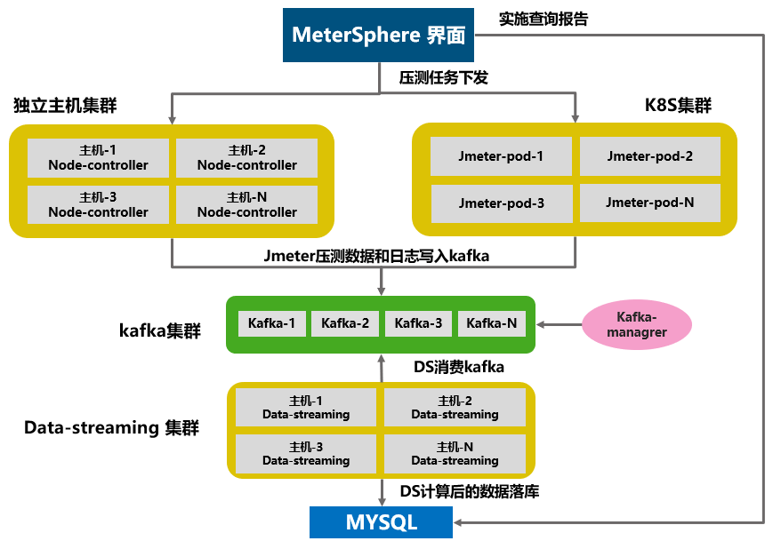
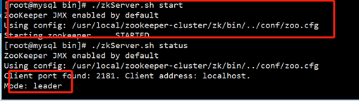
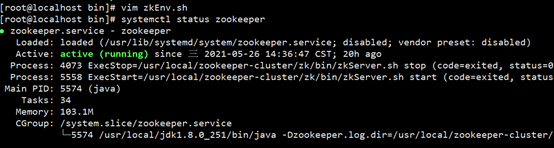

MeterSphere大规模的性能压测主要取决于三个组件：

■ Node controller: 为性能测试提供独立节点类型的测试资源池, 接收来自系统的性能测试任务, 动态的启动 JMeter容器完成性能测试<br>
■ Data streaming: 从 Kafka 中获取性能测试结果数据进行处理后存入 MySQL 数据库<br>
■ Kafka: 接收 JMeter 产生的性能测试结果数据<br>

所以如果需要进行大规模（5000vu以上）的性能测试，需要对上诉三个组件进行水平扩容操作。具体架构如下：<br>
{:height="100%" width="70%"} <br>

依据架构所示，需要独立部署kafka集群和ds集群（kafka和ds可以部署在一起），如果采用独立主机压测，还需要部署node-controller集群。部署步骤:

## 1 部署kafka集群

大致流程:先安装jdk,再部署zookeeper,再部署kafka

### 1.1 关闭防火墙和 selinux

关闭防火墙
```
systemctl stop firewalld.service
systemctl disable firewalld.service
```
关闭selinux
```
setenforce 0 （临时生效）
sed -i 's/^SELINUX=enforcing/SELINUX=disabled/' /etc/selinux/config（永久生效）
```

### 1.2 检查是否已经安装OPENjdk

```
rpm -qa|grep jdk  #如果安装先卸载jdk
```
下载jdk:
```
官网：https://www.oracle.com/java/technologies/javase-jdk8-downloads.html
```
选择jdk版本上传到服务器解压，这里我用的是jdk1.8.0版本
```
tar -xvf jdk-8u251-linux-x64.tar.gz
mv jdk1.8.0_251 /usr/local

vim  /etc/profile
 
export JAVA_HOME=/usr/local/jdk1.8.0_251
export CLASSPATH=$JAVA_HOME/lib/dt.jar:$JAVA_HOME/lib/tools.jar
export PATH=$PATH:$JAVA_HOME/bin

source /etc/profile

java -version （检查一下jdk版本查看是否安装成功）
```

### 1.3 搭建zookeeper集群

1.3.1 集群节点选用三台linux主机<br>

下载地址: https://archive.apache.org/dist/zookeeper/ <br>
或者: wget https://archive.apache.org/dist/zookeeper/zookeeper-3.5.5/apache-zookeeper-3.5.5-bin.tar.gz <br>

1.3.2 新建一个zookeeper-cluster目录，将安装包上传zookeeper-cluster目录下<br>
```
cd /usr/local
mkdir zookeeper-cluster
```

1.3.3 解压安装包
```
cd zookeeper-cluster
tar zxvf  apache-zookeeper-3.5.5-bin.tar.gz
```

1.3.4 配置zk1（先配一个节点，然后再复制修改相关配置）
```
1.修改解压包名称（直观区分）
mv apache-zookeeper-3.5.5-bin zk

2.新建data，logs 目录来存放数据和日志
cd zk
mkdir data logs 

3.进入conf，将zoo_sample.cfg复制重命名zoo.cfg
cd zk/conf
cp zoo_sample.cfg zoo.cfg

4.修改conf下zoo.cfg
vi zoo.cfg
① 修改：dataDir=/usr/local/zookeeper-cluster/zk1/data
② 添加：dataLogDir=/usr/local/zookeeper-cluster/zk1/logs
③ clientPort=2181【clientPort是客户端的请求端口】
④ 在zoo.cfg文件末尾追加
server.1=10.1.240.150:2888:3888
server.2=10.1.240.151:2888:3888
server.3=10.1.240.152:2888:3888
5.在zk的data目录下创建一个myid文件，内容为1
cd ../data/
echo 1 > myid
```

1.3.5 其他节点配置
其他节点配置相同，除以下配置<br>
```
echo 1 >/usr/local/zookeeper-cluster/zk/data/myid # echo 中的值需要唯一，节点1，输出1，节点2，就写2.保证唯一
```

1.3.6 启动
```
cd /usr/local/zookeeper-cluster/zk/bin
./zkServer.sh start
```
{:height="100%" width="70%"} <br>
查看集群状态
```
./zkServer.sh status
```
{:height="100%" width="70%"} <br>
可以看到，一台作为leader，两台作为follower，zookeeper集群搭建成功。

### 1.4 Kafka集群安装

1.4.1 下载安装包 <br>

kafka官网下载：http://kafka.apache.org/downloads <br>
或者wget，下载 https://mirrors.tuna.tsinghua.edu.cn/apache/kafka/2.6.2/kafka_2.12-2.6.2.tgz

1.4.2 新建一个Kafka-cluster目录，将安装Kafka-cluster目录下

```
cd /usr/local
mkdir kafka-cluster
```

1.4.3 解压安装包，重命名

```
tar zxvf kafka_2.12-2.6.2.tgz
mv kafka_2.12-2.6.2 kafka
```

1.4.4 修改配置文件

```
cd /usr/local/kafka-cluster/kafka/config/
vi server.properties修改
broker.id=1  #唯一
listeners=PLAINTEXT://172.16.150.154:9092  #修改为本机地址
log.dirs=/Data/kafka-logs #数据目录，kafka-logs会自动采集
zookeeper.connect=172.16.150.154:2181,172.16.150.155:2181,172.16.150.156:2181 #zokeeper集群地址，以","为分割其他的不用改
```

1.4.5 其他节点配置

其他节点配置相同，除以下内容：
```
broker.id=1  #唯一 （确定id值是唯一）
listeners=PLAINTEXT://172.16.150.154:9092  #修改为本机地址
```

1.4.6 启动

```
cd /usr/local/kafka-cluster/kafka/bin
./kafka-server-start.sh ../config/server.properties
可以发现在窗口启动之后是一个阻塞进程，会阻塞当前窗口，我们可以重新打开一个窗口进行接下来的操作，或者在启动kafka的时候使用 -daemon 参数将它声明为守护进程后台运行。
./kafka-server-start.sh  -daemon ../config/server.properties
```
到这一步kafka+zk已经是部署完成了

1.4.7 使用JMX监控Kafka

```
vim /usr/local/kafka-cluster/kafka/bin/kafka-server-start.sh
在这个字段加入export JMX_PORT="9999"
```
{:height="100%" width="70%"} <br>

1.4.8 服务设置开机自启，使用systemctl工具管理（在配置时，请先把原本服务关闭）

```
先设置zookeeper开机启动
cd /lib/systemd/system/
vim zookeeper.service  在当中输入一下内容
[Unit]
Description=zookeeper
After=network.target remote-fs.target nss-lookup.target

[Service]
Type=forking
ExecStart=/usr/local/zookeeper-cluster/zk/bin/zkServer.sh start
ExecReload=/usr/local/zookeeper-cluster/zk/bin/zkServer.sh restart
ExecStop=/usr/local/zookeeper-cluster/zk/bin/zkServer.sh stop
[Install]
WantedBy=multi-user.target
```
然后保存退出

echo $PATH 找到我们的jdk安装路径
{:height="100%" width="70%"} <br>
```
cd /usr/local/zookeeper-cluster/zk/bin
vim zkEnv.sh
```
{:height="100%" width="70%"} <br>

找到我们第一行的变量，把我们之前弄的java环境添加进去在后面插入export JAVA_HOME=/usr/local/jdk1.8.0_251，保存退出<br>
然后刷新一下命令<br>
```
systemctl daemon-reload 
systemctl start zookeeper #启动服务
systemctl enable zookeeper #加入开机自启
systemctl status zookeeper #检查服务状态
```

状态如下就是正确<br>
{:height="100%" width="70%"} <br>

1.4.9 kafka自启动设置

```
cd /lib/systemd/system/
vim kafka.service
添加一下内容：
[Unit]
Description=kafka
After=network.target  zookeeper.service

[Service]
Type=simple
Environment="PATH=/usr/local/sbin:/usr/local/bin:/usr/sbin:/usr/bin:/usr/local/jdk1.8.0_251/bin"
User=root
Group=root
ExecStart=/usr/local/kafka-cluster/kafka/bin/kafka-server-start.sh  /usr/local/kafka-cluster/kafka/config/server.properties
ExecStop=/usr/local/kafka-cluster/kafka/bin/kafka-server-stop.sh
PrivateTmp=on-failure
[Install]
WantedBy=multi-user.target
```
保存退出

刷新一下
```
systemctl daemon-reload
systemctl start kafka
systemctl enable kfka
systemctl status kafka
```
{:height="100%" width="70%"} <br>

1.4.10 建议启动kafka时先重新启动一下zookeeper，有时间可能会起不来 启动顺序，启动kafka必须先要启动zookeeper

## 2 部署kafka-manager

可以在任意一台kafka设备部署，kafka可视化，yaml如下（需要提前按照好docker环境和docker-compose环境，并下载好images）
```
version: '2'

services:

kafka-manager:
image: sheepkiller/kafka-manager:latest
restart: always
container_name: kafka-manager
hostname: kafka-manager
ports:
- 9000:9000
environment:
ZK_HOSTS: 10.1.240.154:2181,10.1.240.155:2181,10.1.240.156:2181  #修改为依据部署好的kafka集群
KM_ARGS: -Djava.net.preferIPv4Stack=true
networks:
- kafka-manager

networks:
kafka-manager:
```

## 3 部署data-streaming集群

准备好环境变量文件、compose文件。三台部署一样

环境变量文件 .env
```
vim .env   #参考ms的.env文件进行修改

MS_KAFKA_TOPIC=JMETER_METRICS
MS_MYSQL_HOST=10.1.240.110 #修改MS的数据库
MS_KAFKA_LOG_TOPIC=JMETER_LOGS
MS_TAG=v1.9.3
MS_JMETER_DATA_PATH=metersphere/data/jmeter
MS_BASE=/opt
MS_KAFKA_TEST_TOPIC=LOAD_TESTS
MS_MYSQL_USER=root
MS_EXTERNAL_MYSQL=true
MS_PREFIX=registry.cn-qingdao.aliyuncs.com/metersphere
MS_MYSQL_DB=metersphere
MS_MYSQL_PASSWORD=Password123@mysql
MS_JMETER_TAG=5.4.1-ms3-jdk8
MS_MYSQL_PORT=3307

MS_KAFKA_BOOTSTRAP_SERVERS=10.1.240.154:9092,10.1.240.155:9092,10.1.240.156:9092  #新加
```

docker-compose-base.yml
```
vim docker-compose-base.yml #拷贝ms服务器的docker-compose-base.yml 

version: "2.1"
volumes:
ms-conf:
driver_opts:
type: none
device: ${MS_BASE}/metersphere/conf
o: bind
ms-logs:
driver_opts:
type: none
device: ${MS_BASE}/metersphere/logs
o: bind
ms-data:
driver_opts:
type: none
device: ${MS_BASE}/metersphere/data
o: bind

networks:
ms-network:
```

docker-compose-ds.yml
```
vim docker-compose-base.yml #拷贝ms服务器的docker-compose-base.yml 
vim docker-compose-ds.yml #新加ds yaml文件

version: "2.1"
services:

ms-data-streaming:
image: ${MS_PREFIX}/ms-data-streaming:${MS_TAG}
container_name: ms-data-streaming
environment:
HOST_HOSTNAME: $HOSTNAME
SPRING_DATASOURCE_URL: jdbc:mysql://${MS_MYSQL_HOST}:${MS_MYSQL_PORT}/${MS_MYSQL_DB}?autoReconnect=false&useUnicode=true&characterEncoding=UTF-8&characterSetResults=UTF-8&zeroDateTimeBehavior=convertToNull&useSSL=false
SPRING_DATASOURCE_USERNAME: ${MS_MYSQL_USER}
SPRING_DATASOURCE_PASSWORD: ${MS_MYSQL_PASSWORD}
KAFKA_PARTITIONS: 60  #此处修改kafka分区
KAFKA_REPLICAS: 1
KAFKA_TOPIC: ${MS_KAFKA_TOPIC}
KAFKA_LOG_TOPIC: ${MS_KAFKA_LOG_TOPIC}
KAFKA_TEST_TOPIC: ${MS_KAFKA_TEST_TOPIC}
KAFKA_BOOTSTRAP-SERVERS: ${MS_KAFKA_BOOTSTRAP_SERVERS} #此处修改为kafka集群
ports:
- 8084:8084
- 8085:8085
healthcheck:
test: ["CMD", "nc", "-zv", "localhost", "8084"]
interval: 6s
timeout: 10s
retries: 20
restart: on-failure
volumes:
- ./conf/metersphere.properties:/opt/metersphere/conf/metersphere.properties
- ${MS_BASE}/metersphere/logs/data-streaming:/opt/metersphere/logs/data-streaming
networks:
- ms-network
```

启动ds，source .env ;docker-compose -f docker-compose-base.yml -f docker-compose-ds.yml up -d

## 4 如采用独立主机压测，需要部署node-controller

部署过程可以参考 https://metersphere.io/docs/installation/online_installation/，install.sh中安装模式修改为node-controller（环境变量文件需要指向同一个kafka和ms-server服务），注意资源池中jmeter的内存配置，建议调整到4g以上

## 5.修改MeterSphere 的docker-compose-server.yaml文件，按照下图修改为连接kafka地址

{:height="100%" width="70%"} <br>

## 6.如果采用k8s集群压测，需要提前准备好K8S集群，创建好SA和token，创建如下：

```
1、创建namespaces
kubectl create namespace metersphere

2、创建SA
kubectl create serviceaccount ms -n metersphere

3、创建namespace授权SA
kubectl create clusterrolebinding ms --clusterrole=admin --serviceaccount=metersphere:ms -n metersphere

4.查询SA token
kubectl describe sa/ms -n metersphere
kubectl describe secrets -n metersphere ms-token-xxxx
```

k8s对接界面配置如下，注意需要调整jmeter配置，经过测试，2500左右的vu，在无大量错误的情况下需要消耗2c4g左右资源:<br>
{:height="100%" width="70%"} <br>

## 7 最终压测效果如下，打了2.5万并发vu
{:height="100%" width="70%"} <br>
{:height="100%" width="70%"} <br>

## 8 此方案已经在客户现场进行了部署测试，验证了MS在不同大规模场景下可通过水平扩展的方式，弹性支持压测池的调度。