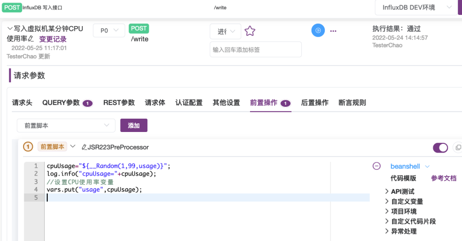
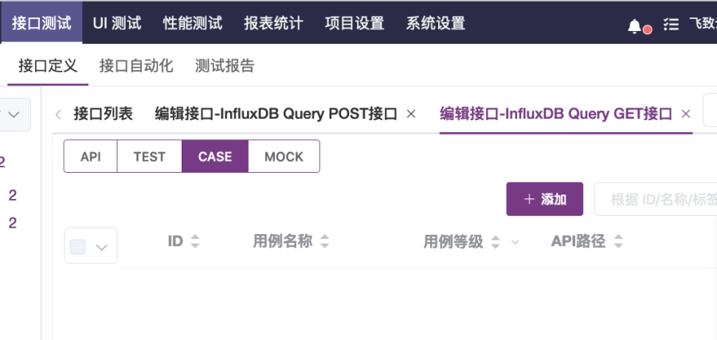
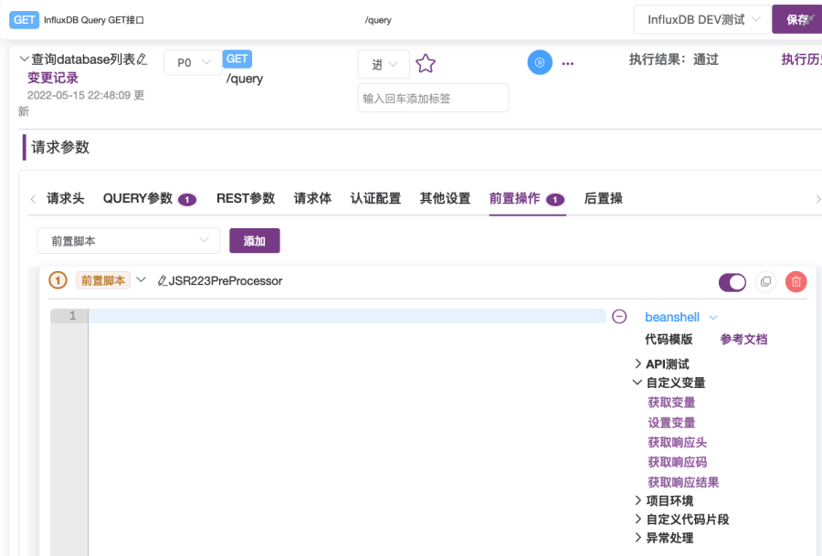
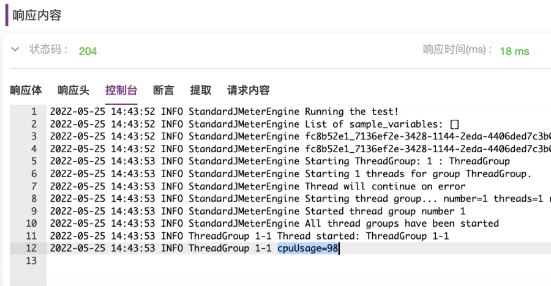
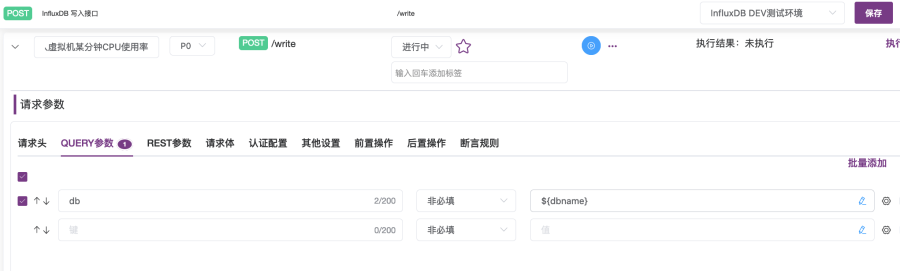
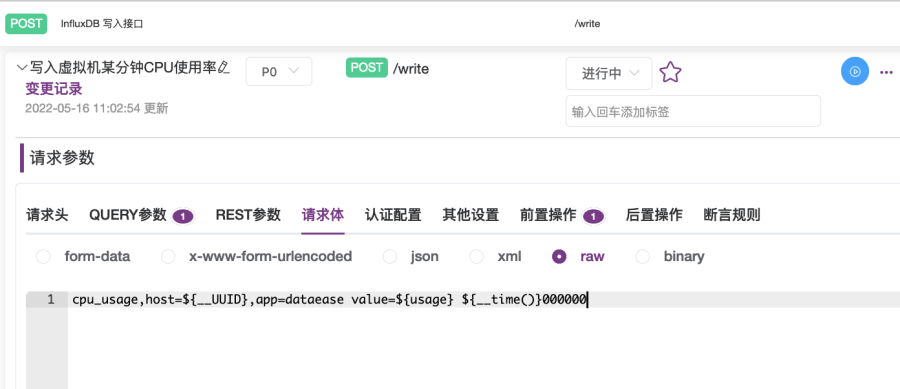
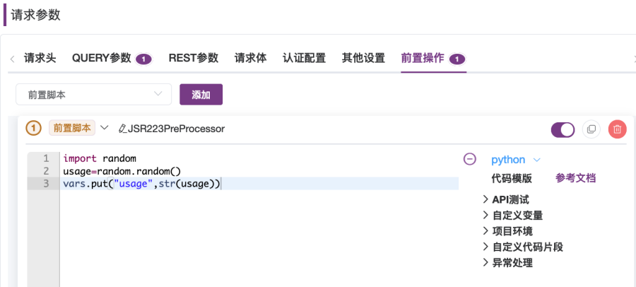

## 1 目的
MeterSphere的接口测试、性能测试均基于JMeter实现，兼容JMeter中的函数。在使用MeterSphere做接口测试、准备测试数据时，经常需要使用变量JMeter函数构造生成接口测试的测试数据，过程中经常需要查看具体的变量及JMeter使用范围方法和试验摸索一些具体的使用范围方法，为了备忘、方便查看了解具体的使用范围及方法、让大家减少一些摸索试验的时间，写了这个专题做一个集中深入详细的总结和演示，希望对大家有所帮助。

## 2 变量和JMeter函数的设置使用

### 2.1 设置使用变量

2.1.1 在环境中设置和使用

对于变量，在MeterSphere中，可以在环境、场景变量中设置，在请求参数的QUERY参数、REST参数、请求体、前置操作脚本、后置操作脚本中引用使用。也可以在前置脚本中设置变量，在请求体、后置操作脚本中引用使用。需要注意的是，在环境中设置的环境变量类型只支持常量类型，在场景变量中，除常量类型之外，还支持列表、CSV、计数器、随机数类型。
下表为在请求参数的QUERY参数、REST参数、请求体、前后置BeanShell脚本、前后置Python脚本中引用变量的方法、设置变量方法以及调试时需要打印变量值到控制台查看的方法。
<table>
  <td bgcolor="#783887" align="middle" style="font-weight:bold;color: white">
   引用使用
  </td>
  <td bgcolor="#783887" align="middle" style="font-weight:bold;color: white">
   使用方法及示例(假设变量名为dbname)
  </td>
  <tbody>
    <tr>
        <td >在请求参数之QUERY参数中引用</td>
        <td >${dbname}</td>
    </tr>
    <tr>
        <td >在请求参数之REST参数中引用</td>
        <td >${dbname}</td>
    </tr>
    <tr>
        <td >在请求参数之请求体中引用</td>
        <td >${dbname}</td>
    </tr>
     <tr>
        <td >
        在请求参数之前后置BeanShell脚本中引用及常用方法<br>
            BeanShell注意事项<br>
              1.每行须以分号结尾<br>
              2.注释是//<br>
              3.log.info打印变量和vars.put设置变量时，需要变量类型为字符串类型<br>
        </td>
        <td >1.获取变量值方法1 <br>
        dbname="${dbname}";<br>
        2.获取变量值方法2 <br>
        dbname2=vars.get("dbname");<br>
        3.打印到控制台输出查看变量值，调试时用<br>
        log.info("dbname="+dbname);<br>
        log.info("dbname2="+dbname2);<br>
        4.将字符串转换成数字类型<br>
        iCount=Integer.valueOf(strCount);<br>
        5.将数字转成成字符串，在设置变量时经常用到<br>
        strCount=String.valueOf(iCount);<br>
        vars.put("count", strCount);
        </td>
     </tr>
     <tr>
         <td >在请求参数之前后置Python脚本中引用及常用方法</td>
         <td >1.获取变量值<br>
              dbname="${dbname}";<br>
              2.获取变量值<br>
              dbname2=vars.get("dbname");<br>
              3.打印到控制台输出查看变量值，调试时用<br>
              log.info("dbname="+dbname);<br>
              log.info("dbname2="+dbname2);<br>
              4.将字符串转换成数字类型<br>
              iCount=int(strCount);<br>
              5.将数字转成成字符串，在设置变量时经常用到<br>
              strCount=str(iCount);<br>
              vars.put("count", strCount);
         </td>
     </tr>
  </tbody>
</table> 

设置环境变量步骤方法如下。<br>
在【项目环境】页面中，如图2-1所示，可以选择【创建环境】打开如图2-2所示【创建环境】对话框，在对话框中【通用配置】选项卡下配置环境变量。也可选择要设置变量的环境，选择【编辑】按钮打开如图2-3所示【配置环境】对话框，在对话框中【通用配置】选项卡下配置环境变量。<br>

{:height="100%" width="70%"} <br>
<font size=2 class="png-lable-span">图2-1 项目环境管理页面</font><br>
{:height="100%" width="70%"} <br>
<font size=2 class="png-lable-span">图2-2 创建环境对话框</font><br>
{:height="100%" width="70%"} <br>
<font size=2 class="png-lable-span">图2-3 配置环境对话框</font><br>

也可以在接口用例页面中，如图2-4所示，在右上角【保存】按钮旁，打开运行环境下拉列表，在列表中选择【环境配置】打开【环境配置】对话框，如图2-5所示，在对话框中【通用配置】选项卡中设置环境变量。

{:height="100%" width="70%"} <br>
<font size=2 class="png-lable-span">图2-4 接口用例页面</font><br>
{:height="100%" width="70%"} <br>
<font size=2 class="png-lable-span">图2-5 环境配置对话框</font><br>

<font size=4> 2.1.2 在前后置脚本中设置使用 </font>
在前后置脚本中，可使用BeanShell内置变量vars的put方法进行设置，如图2-6示。
```
vars.put("变量名", 变量值); //注意：变量值需为字符串类型
```
比如，在调用InfluxDB write API写入监控数据前，生成随机的cpu usage数据，可在前置脚本中生成随机数并设置到cpuUsage变量，之后调用接口时在请求体使用这个变量。
```
#BeanShell
cpuUsage=${__Random(1,99,usage)};
log.info("cpuUsage="+cpuUsage);
vars.put("usage", cpuUsage);
```
{:height="100%" width="70%"} <br>
<font size=2 class="png-lable-span">图2-6 前置脚本中设置变量</font><br>

<font size=4> 2.1.3 在场景变量中设置使用 </font>
在接口自动化的场景中，可以在场景变量中设置变量，之后在场景中导入的接口用例、自定义请求中的QUERY参数、REST参数、请求体、前后置脚本中引用使用。如图2-7所示，在【创建场景】页面中，选择【场景变量】打开【场景变量】对话框，如图2-8所示，在对话框中添加管理变量。可添加常量、列表、CSV、计数器、随机数变量。

{:height="100%" width="70%"} <br>
<font size=2 class="png-lable-span">图2-7 创建场景页面</font><br>
{:height="100%" width="70%"} <br>
<font size=2 class="png-lable-span">图2-8 场景变量对话框</font><br>

### 2.2 使用BeanShell内置变量
对于JMeter BeanShell的内置变量，使用范围为前置操作脚本、后置操作脚本中。常用的内置变量有以下变量。可使用vars获取变量值、设置变量，如图2-9所示。调试脚本时使用log打印查看变量值。在后置脚本中，使用prev获取调用接口后返回的信息和响应码。
<table>
  <td bgcolor="#783887" align="middle" style="font-weight:bold;color: white">
   BeanShell内置变量
  </td>
  <td bgcolor="#783887" align="middle" style="font-weight:bold;color: white">
   内置变量方法
  </td>
  <tbody>
    <tr>
        <td >vars <br>
             操作JMeter变量</td>
        <td >//获取变量值：<br>
             vars.get("变量名");<br>
             //设置变量值需为字符串类型：<br>
             vars.put("变量名", 变量值);<br>
        </td>
    </tr>
    <tr>
        <td >prev <br>
             获取之前Sampler返回的信息 </td>
        <td >//获取响应信息：<br>
             prev.getResponseDataAsString();<br>
             //获取响应Code码：<br>
             prev.getResponseCode();</td>
    </tr>
    <tr>
        <td >log<br>
             写日志并发送到控制台</td>
        <td >log.info("日志内容");<br>
             log.info("变量名="+变量值);</td>
    </tr>
  </tbody>
</table>  

{:height="100%" width="70%"} <br>
<font size=2 class="png-lable-span">图2-9 前置操作脚本中使用BeanShell内置变量</font><br>

### 2.3 设置使用JMeter函数
对于JMeter函数，在MeterSphere中，可在接口、接口用例的请求参数的QUERY参数、REST参数、请求体、前置操作脚本、后置操作脚本中设置使用。<br>
在QUERY参数、REST参数中设置使用时，选择如图2-10所示的【编辑】按钮打开【参数设置】对话框，在对话框中选择设置，如图2-11所示。<br>
设置之后，执行用例时，会使用JMeter函数生成的值发出请求。<br>
{:height="100%" width="70%"} <br>
<font size=2 class="png-lable-span">图2-10 选择打开【参数设置】对话框</font><br>
{:height="100%" width="70%"} <br>
<font size=2 class="png-lable-span">图2-11 参数设置-设置JMeter函数</font><br>

### 2.4 设置使用MockJS函数
对于MockJS函数，在MeterSphere中，在请求参数的QUERY参数、REST参数值设置时使用。MockJS函数，请加参数设置页面中列表，如图2-13所示。可将MockJS设置到参数值中，在请求时，随机生成布尔值、自然数、整数、浮点数、字符、字符串、日期、时间、日期时间、当前时间等参数值，使用生成的参数值发出请求。<br>
需要注意的是，在请求体和前后置脚本中，不能使用MockJS函数，可以使用JMeter函数。
{:height="100%" width="70%"} <br>
<font size=2 class="png-lable-span">图2-12 选择打开【参数设置】对话框</font><br>
{:height="100%" width="70%"} <br>
<font size=2 class="png-lable-span">图2-13 参数设置-选择MockJS函数</font><br>

以下通过一些场景示例演示具体引用使用变量、JMeter函数的方法。

## 3 变量设置使用示例
下面我们以InfluxDB接口测试场景演示变量的具体使用方法。假设我们是InfluxDB测试团队，现在要对InfluxDB支持的一系列操作进行测试，包括创建database、查询database列表、写入主机监控点数据等。<br>
如跟随本文的示例步骤实操，请先使用以下命令在CentOS7.x虚拟机上部署Influxdb,打开8086端口。
```
wget https://dl.influxdata.com/influxdb/releases/influxdb-1.8.0.x86_64.rpm

rpm -ivh influxdb-1.8.0.x86_64.rpm
#8086 端口：使用该端口与influxdb客户端进行数据交互。
firewall-cmd --zone=public --add-port=8086/tcp --permanent
firewall-cmd --reload
systemctl start influxdb
```

### 3.1 设置使用环境变量示例
以下我们用创建InfluxDB DEV测试环境，设置dbname环境变量，以及创建Influxdb database接口测试用例，演示设置环境变量，及在请求参数之QUERY参数中引用变量、在请求参数之请求体中引用、在请求参数之前后置BeanShell脚本中引用。

<font size=4> 3.1.1 设置环境变量 </font>
下面我们先在登陆MeterSphere进入指定工作空间下后，创建一个InfluxDB测试环境，并在测试环境中的设置dbname环境变量，后续在各个API接口测试用例中引用这个变量创建database，向其中写入监控数据，从中获取监控数据。操作步骤如下。<br>
（1）在【项目设置】下选择【项目环境】打开【项目环境】页面，如图3-1所示。<br>
（2）在【项目环境】页面中，选择【创建环境】按钮打开【创建环境】对话框，如图3-2所示。<br>
（3）在【创建环境】对话框中，

   * 输入环境名称【InfluxDB DEV测试环境】。
   * 打开【通用配置】选项卡，在选项卡中，添加变量dbname，值设置为monitoringdb。
   * 打开【HTTP配置】选项卡，在选项卡中，如图3-3所示，在【环境域名】输入框中输入【10.1.13.12:8086】(10.1.13.12是InfluxDB服务器的IP地址和端口)。

（4）最后，点击【确定】按钮完成【InfluxDB DEV测试环境】的创建，在如图3-4, 3-5所示页面中，可看到新建的【InfluxDB DEV测试环境】。<br>
{:height="100%" width="70%"} <br>
<font size=2 class="png-lable-span">图3-1 【项目环境】页面</font><br>
{:height="100%" width="70%"} <br>
<font size=2 class="png-lable-span">图3-2 【创建环境】对话框</font><br>
{:height="100%" width="70%"} <br>
<font size=2 class="png-lable-span">图3-3 【HTTP配置】选项卡</font><br>
{:height="100%" width="70%"} <br>
<font size=2 class="png-lable-span">图3-4 完成【HTTP配置】选项卡-添加环境域名</font><br>
{:height="100%" width="70%"} <br>
<font size=2 class="png-lable-span">图3-5 完成环境创建</font><br>

<font size=4> 3.1.2 在请求体中引用环境变量 </font>
前面已创建【InfluxDB DEV测试环境】，这里我们以创建【InfluxDB查询接口】及【InfluxDB查询数据库接口用例】演示在前后置脚本中设置变量，以及给后面演示引用获取使用变量使用。

操作步骤如下。

（1）在顶部菜单栏中选择【接口测试】下【接口定义】打开【接口列表】页面，如图3-6所示。

（2）在【接口列表】页面中，选择【+】下【创建接口】选项，打开【创建接口】页面，如图3-7所示，在页面中输入接口名称【InfluxDB Query POST接口】，请求协议选择【POST】，请求路径输入框输入【/query】，如图3-7所示，然后选择页面右上角的【保存】按钮，打开【编辑接口】页面，如图3-8所示。

{:height="100%" width="70%"} <br>
<font size=2 class="png-lable-span">图3-6 【接口列表】页面</font><br>
{:height="100%" width="70%"} <br>
<font size=2 class="png-lable-span">图3-7 【创建接口】页面</font><br>
{:height="100%" width="70%"} <br>
<font size=2 class="png-lable-span">图3-8 【编辑接口】页面</font><br>

（3）在【编辑接口】页面中，选择【CASE】标签打开【接口用例列表】页面，如图3-9所示，在页面中，选择【+添加】按钮，打开【创建用例】页面，如图3-10所示。<br>
{:height="100%" width="70%"} <br>
<font size=2 class="png-lable-span">图3-9 【接口用例】页面</font><br>
{:height="100%" width="70%"} <br>
<font size=2 class="png-lable-span">图3-10 【创建接口用例】页面</font><br>

（4）在【创建接口用例】页面中，如图3-10所示，

  * 输入名称【创建database接口用例】。<br>
  * 在右上角运行环境下拉列表中，选择【InfluxDB DEV测试环境】，如图3-11所示。<br>
  * 在【请求体】选项卡下，如图3-12所示，选择【x-www-form-urlencodeded】，第一个键输入框输入【q】，值输入框输入【create database ${dbname}】，使用${变量名}引用变量。<br>

然后点击【保存】按钮，点击蓝色的【执行】按钮执行。<br>
{:height="100%" width="70%"} <br>
<font size=2 class="png-lable-span">图3-11 选择环境</font><br>
{:height="100%" width="70%"} <br>
<font size=2 class="png-lable-span">图3-12 设置请求体-引用dbname变量</font><br>

（5）执行后，在【接口用例】执行页面中，如图3-13所示，可在最下方【响应内容】部分看到【响应体】，状态码为200，说明执行成功。

以上演示了在环境中设置了dbname变量，设置要创建使用的database名字为monitoringdb，然后在【创建database接口用例】的请求体中，通过【create database ${dbname}】引用了dbname变量，执行后，成功在influxDB中创建了database monitoringdb。
{:height="100%" width="70%"} <br>
<font size=2 class="png-lable-span">图3-13 执行接口用例完毕</font><br>

我们可以用以下curl命令调用influxDB query接口API查看databases列表，可以看到输出中，monitoringdb已被创建成功，如图3-14所示。
```
#查看influxdb下database, monitoringdb是否创建成功
curl -G 'http://10.1.13.12:8086/query?pretty=true' --data-urlencode "q=show databases"
```
{:height="100%" width="70%"} <br>
<font size=2 class="png-lable-span">图3-14 curl命令调用influxdb API查询database列表</font><br>

<font size=4> 3.1.3 在前后置脚本中引用环境变量并debug打印查看变量值 </font>
接上面完成【创建database接口用例】执行，接下来通过【查看database列表接口用例】演示在前后置脚本中引用环境变量并打印到控制台查看变量值，调试脚本时，经常需要打印查看变量值。我们将会在【查看database列表接口用例】实现中，在前置BeanShell脚本中获取dbname变量的值，并打印到控制台，在后置Python脚本中，获取dbname变量的值，并打印到控制台。<br>

操作步骤如下。

（1）如图3-15所示，创建接口【InfluxDB Query GET接口】，选择请求的协议为【GET】，请求路径输入【/query】，然后选择【保存】，打开【InfluxDB Query GET接口用例列表】页面，如图3-16所示。

{:height="100%" width="70%"} <br>
<font size=2 class="png-lable-span">图3-15 创建【InfluxDB Query GET接口】</font><br>

（2）在【InfluxDB Query GET接口用例列表】页面，点击【+添加】按钮，打开【接口用例】页面，如图3-17所示，
  
  * 在名称输入框中输入【查询database列表】。
  * 在运行环境下拉列表选择【InfluxDB DEV测试环境】。
  * 在【请求参数】的【QUERY参数】选项卡中，设置第一个键值的键为【q】，值为【show databases】。
 
 然后点击右上角【保存】按钮，最后点击蓝色的【执行】按钮。
 
 （3）执行完毕后，在页面【响应内容】下【响应体】选项卡中可看到接口用例执行后的接口返回响应内容，如图3-18所示，可以看到之前调用接口创建的monitoringdb datbase。

{:height="100%" width="70%"} <br>
 <font size=2 class="png-lable-span">图3-16 【InfluxDB Query GET接口用例列表】页面</font><br>
{:height="100%" width="70%"} <br>
<font size=2 class="png-lable-span">图3-17 【查询database列表接口用例】页面</font><br>
{:height="100%" width="70%"} <br>
<font size=2 class="png-lable-span">图3-18 【查询database列表接口用例】执行成功后响应体</font><br>

（4）在【查询database列表接口用例】页面中，在【请求参数】下【前置操作】标签打开【前置操作】选项卡，如图3-19所示，在选项卡中，选择【添加】按钮添加前置脚本，然后，如图3-20所示，点击前置脚本展开文本内容框，如图3-21所示。

（5）在前置脚本文本内容框中，脚本语言选择【BeanShell】，输入以下前置脚本内容，如图3-22所示，内容演示了通过两种方式获取dbname环境变量，以及设置hostname变量。输入完成后，点击蓝色【执行】按钮执行用例，之后可在【响应内容】下【控制台】中查看打印出来的变量值，如图23所示。
```
//前置脚本内容
//获取方法1，通过${变量名}方式
dbname="${dbname}";
log.info("dbname="+dbname);
//获取方法2，通过内置变量vars.get("变量名")方法
dbname2=vars.get("dbname");
log.info("dbname2="+dbname2);
```
{:height="100%" width="70%"} <br>
<font size=2 class="png-lable-span">图3-19 【查询database列表接口用例】前置操作选项卡</font><br>
{:height="100%" width="70%"} <br>
<font size=2 class="png-lable-span">图3-20 添加前置脚本完成</font><br>
{:height="100%" width="70%"} <br>
<font size=2 class="png-lable-span">图3-21 展开前置脚本文本框</font><br>
{:height="100%" width="70%"} <br>
<font size=2 class="png-lable-span">图3-22 设置前置脚本内容</font><br>
{:height="100%" width="70%"} <br>
<font size=2 class="png-lable-span">图3-23 响应内容-控制台输出</font><br>

### 3.2 在前后置脚本中设置使用变量示例
在前后置脚本中，可以使用BeanShell内置变量进行设置。这里我们以InfluxDB写入接口测试场景演示。我们现在实现一个写入接口用例，在前置脚本中计算生成监控cpu usage，并设置到usage变量中，之后在请求体中引用使用。
主要操作步骤如下。创建接口、接口用例，执行接口用例具体方法请参考上文中的步骤方法。

（1）创建InfluxDB写入接口，请求协议为POST，路径为/write

（2）创建InfluxDB写入接口用例【写入虚拟机某分钟CPU使用率监控数据】。
   * 设置QUERY参数添加参数db，值设置为${dbname}。
   * 设置BeanShell前置操作脚本为以下脚本内容，如图3-24所示。
```
//生成随机使用率并打印
cpuUsage="${__Random(1,99,usage)}";
log.info("cpuUsage="+cpuUsage);
//设置CPU使用率变量usage的值为上面生成的使用率数值。
vars.put("usage",cpuUsage);
```
   * 设置请求体为以下内容，在value值处引用前置脚本中设置的usage变量的值。
```
cpu_usage,host=10.1.13.131,app=dataease value=${usage} ${__time()}000000
```

（3）执行用例并查看控制台输出、请求体内容，如图3-25、3-26所示。
{:height="100%" width="70%"} <br>
<font size=2 class="png-lable-span">图3-24 设置前置脚本-设置usage变量</font><br>
{:height="100%" width="70%"} <br>
<font size=2 class="png-lable-span">图3-25 控制台中打印cpuUsage值</font><br>
{:height="100%" width="70%"} <br>
<font size=2 class="png-lable-span">图3-26 响应内容-查看请求体中变量值</font><br>

### 3.3 在自动化场景中设置使用变量示例
在自动化场景中可设置场景变量，在导入场景的接口用例请求参数中、自定义请求中使用。在场景变量中，由于需要在编排的多个任务中需要，因此除了常量类型外，还支持列表、CSV、计数器、随机数类型的变量。<br>
这里我们设计了一个场景演示常量、计数器、随机数变量的使用，即以实现向InfluxDB写入某台虚拟机的1小时的每分钟CPU使用率监控点数据。

 * 采用循环控制器，配置使用次数循环方式，循环60次，设置一个基准的时间点2022年5月25日0点0分，每次循环，根据循环的次数，加60秒。
 * 使用常量host定义虚拟机IP为10.1.13.131。
 * 使用常量startTime定义监控数据从2022年5月25日0点开始。使用date -d "2022-05-25 00:00:00" +%s 命令在Linux上执行可获得时间戳数值，1653408000。
 * 使用计数器变量counter，获取每次循环的计数，根据这个计数值，每多循环一次加60秒pointTime=1653408000 + counter * 60 。
 * 使用随机数变量，每次循环生成一个CPU使用率，取值范围为1到99之间。
 
操作步骤如下。<br>

（1）创建场景【写入某虚拟机1小时每分钟CPU使用率监控】。<br>

（2）设置场景变量。<br>

添加常量hostIP，值设置为10.1.13.131，如图3-27所示。
{:height="100%" width="70%"} <br>
<font size=2 class="png-lable-span">图3-27 添加变量hostIP</font><br>

添加常量startTime，值设置为1653148860。<br>
添加计数器变量counter，从0到59，每次循环加1，如图3-28所示。<br>
{:height="100%" width="70%"} <br>
<font size=2 class="png-lable-span">图3-28 添加计数器变量counter</font><br>

添加随机数变量cpuUsage，最小值为1，最大值为99,如图3-29所示。
{:height="100%" width="70%"} <br>
<font size=2 class="png-lable-span">图3-29 添加随机数变量cpuUsage</font><br>

（3）添加循环控制器，设置使用次数循环，次数为60次，如图3-30所示。
{:height="100%" width="70%"} <br>
<font size=2 class="png-lable-span">图3-30 添加循环控制器</font><br>

（4）导入之前已创建的接口用例【写入虚拟机某分钟CPU使用率监控数据】，导入时选择【复制】，导入之后添加到循环控制器下，之后修改请求体，设置请求体内容为以下内容，如图3-31所示。
```
cpu_usage,host=${hostIP},app=dataease value=${cpuUsage} ${pointTime}000000000
```
{:height="100%" width="70%"} <br>
<font size=2 class="png-lable-span">图3-31 设置请求体</font><br>

（5）设置接口用例的前置脚本，脚本类型选择BeanShell，内容填写以下内容，如图3-32所示。
```
//获取变量startTime开始时间点值，2022年5月25日零点时间戳
strStartTime=vars.get("startTime");
//获取计数器变量counter的值，循环一次加1
strCount=vars.get("counter");
log.info("strCount="+strCount);
//获取随机数变量cpuUsage生成的CPU使用率随机数值
usage=vars.get("cpuUsage");
log.info("usage="+usage);
//计算生成循环对应分钟的时间戳
pointTime=Integer.valueOf(strStartTime) + Integer.valueOf(strCount)*60;
log.info("pointTime=" + String.valueOf(pointTime));
vars.put("pointTime", String.valueOf(pointTime));
```
{:height="100%" width="70%"} <br>
<font size=2 class="png-lable-span">图3-32 设置前置BeanShell脚本</font><br>

（6）运行环境选择【InfluxDB DEV测试环境】，执行循环控制器，执行完毕后查看响应内容。在【响应内容】面板的【控制台】输出中可以看到，如图3-33所示，循环2的计数器变量的值为2，随机数变量的值为99，计算出的pointTime为1653148980，使用date -d @1653148980 查看时间为【Sun May 22 00:03:00 CST 2022】。在【请求内容】选项卡中，如图3-34所示，可看到请求内容里，场景变量${hostIP}、${cpuUsage}、均被替换为场景变量的值和根据计数器变量值计算出的时间点值。
{:height="100%" width="70%"} <br>
<font size=2 class="png-lable-span">图3-33 查看循环2控制台输出-场景变量值</font><br>
{:height="100%" width="70%"} <br>
<font size=2 class="png-lable-span">图3-34 查看循环2控制台输出-请求内容中场景变量值</font><br>

## 4 JMeter函数使用示例

### 4.1 常用的JMeter函数及示例
对于常用的JMeter函数可以百度查看JMeter官方文档，或搜索相关文章。<br>
函数调用的格式为：${__functionName(var1,var2,var3)} <br>
其中，_functionName 为函数名，括号内是函数的参数，无参数时可以不用括号，如 ${_UUID}。<br>
以下是常用的一些函数及使用示例。<br>
<table>
  <td bgcolor="#783887" align="middle" style="font-weight:bold;color: white">
   函数
  </td>
  <td bgcolor="#783887" align="middle" style="font-weight:bold;color: white">
   示例
  </td>
  <tbody>
    <tr>
        <td >__time 以多种格式返回当前时间</td>
        <td >${__time} //13位的毫秒级时间戳</td>
    </tr>
    <tr>
        <td >__counter 计数器函数</td>
        <td >${__counter(True,)} //每个线程分开计数</td>
    </tr>
    <tr>
        <td >__Random 返回指定最大值和最小值之间的随机整数</td>
        <td >${__Random(1,99, num)} //生成1到99之间的随机数</td>
    </tr>
    <tr>
        <td >__UUID 通用唯一标识符函数</td>
        <td >${__UUID} //生成uuid</td>
    </tr>
  </tbody>
</table>  

### 4.2 引用获取使用JMeter函数
在MeterSphere中，可以在请求参数的QUERY参数、REST参数、请求体、前后置脚本中引用使用JMeter函数，引用使用方法如下表以生成UUID函数为例所示。
<table>
  <td bgcolor="#783887" align="middle" style="font-weight:bold;color: white">
   引用使用
  </td>
  <td bgcolor="#783887" align="middle" style="font-weight:bold;color: white">
   使用方法及示例(假设函数为__UUID)
  </td>
  <tbody>
    <tr>
        <td >在请求参数之QUERY参数中引用</td>
        <td >${__UUID}</td>
    </tr>
    <tr>
        <td >在请求参数之REST参数中引用</td>
        <td >${__UUID}</td>
    </tr>
    <tr>
        <td >在请求参数之请求体中引用</td>
        <td >${__UUID}</td>
    </tr>
    <tr>
        <td >在请求参数之前后置BeanShell脚本中引用</td>
        <td >BeanShell注意事项 <br>
             1.每行须以分号结尾 <br>
             2.注释是// <br>
             uuid="${__UUID}"; <br>
             打印到控制台输出查看变量值，调试时用 <br>
             log.info("uuid="+uuid);
        </td>
    </tr>
    <tr>
       <td >在请求参数之前后置Python脚本中引用</td>
       <td >获取变量值<br>
            uuid="${__UUID}";<br>
            打印到控制台输出查看变量值，调试时用<br>
            log.info("uuid="+uuid);
       </td>
    </tr>
  </tbody>
</table>  

需要特别说明的是，在前置后置脚本中也是可以引用使用JMeter函数的。具体的使用方法就是用双引号阔住函数的调用方法，如图4-1所示，以Python脚本中引用为例，接着之前的在【查询database列表接口用例】页面中，将以下脚本内容设置为前置脚本内容，如图4-1所示。然后执行用例，在【控制台】输出中能够看到打印出的uuid和time函数生成的时间戳，如图4-2所示。
```
uuid="${__UUID()}";
strTime="${__time()}";
log.info("--------pre script begin-------------");
log.info("uuid="+uuid);
log.info("strTime="+strTime);
log.info("--------pre script end-------------");
```
{:height="100%" width="70%"} <br>
<font size=2 class="png-lable-span">图4-1 在前置脚本中使用JMeter函数</font><br>
{:height="100%" width="70%"} <br>
<font size=2 class="png-lable-span">图4-2 控制台输出JMeter函数</font><br>

### 4.3 使用JMeter函数做InfluxDB写入接口测试
下面用InfluxDB写入接口测试场景演示变量和JMeter函数的使用。
```
#写入接口API curl调用
curl -i -XPOST 'http://10.1.13.12:8086/write?db=monitoringdb' --data-binary 'cpu_usage,host=10.1.10.131,app=dataease value=0.10 1632761023000000000'
#cpu_usage为measurement，类似关系数据库里的表, host为主机ID，app为dataease
```

操作步骤如下。之前的示例步骤比较详细，这里就只列出关键的步骤截图了。

（1）在【接口列表】页面，创建【InfluxDB写入接口】，请求协议为POST，路径为/write，如图4-3所示。

（2）在【CASE】页面，如图4-4所示，选择【+添加】打开【创建接口用例】页面，创建写入接口用例，如图4-5所示。

（3）根据curl命令我们可以看到需要设置QUERY参数db，以及请求体raw内容。

如图4-6所示，设置QUERY参数db，设置值使用环境变量${dbname}，dbname变量已在环境中设置，并设置值为monitoringdb。

如图4-7所示，设置请求体，格式选择raw，内容设置为 cpu_usage,host=${_UUID},app=dataease value=${usage} ${_time()}000000 

使用JMeter函数_UUID做为host ID，使用_time函数生成13位的时间戳，使用usage变量，usage变量在前置脚本中使用python random函数计算，保存在usage变量中。

{:height="100%" width="70%"} <br>
<font size=2 class="png-lable-span">图4-3 创建写入接口</font><br>
{:height="100%" width="70%"} <br>
<font size=2 class="png-lable-span">图4-4 选择创建写入接口用例</font><br>
{:height="100%" width="70%"} <br>
<font size=2 class="png-lable-span">图4-5 设置QUERY参数db</font><br>
{:height="100%" width="70%"} <br>
<font size=2 class="png-lable-span">图4-6 设置请求体-监控数据</font><br>
{:height="100%" width="70%"} <br>
<font size=2 class="png-lable-span">图4-7 设置前置python脚本-生成usage并保存到变量</font><br>

（4）保存并执行用例，在【响应内容】下【请求内容】中查看请求内容POST data，如图4-8所示，可以看到使用JMeter函数生成的数值以及python random函数生成的值。

cpu_usage,host=e48222aa-e98e-4974-8dfb-df9a1aecc4cc,app=dataease value=0.00309123923176 1652670605313000000 <br>
{:height="100%" width="70%"} <br>
<font size=2 class="png-lable-span">图4-8 查看请求内容</font><br>

## 5 MockJS函数使用示例

我们在设置请求参数时，点击到值输入框后，会列出来一堆@boolean、@integrer、@float、@string、@date、@time的函数，选择这些函数后，可以随机生成对应类型的值，如@integer随机生成整数值，可以几个组合起来拼接成字符串。
如图5-1，添加了两个QUERY参数，一个键为pretty, 值为@booleam；一个键为serverName，值为date@time，执行用例后，可在响应体的【请求内容】选项卡中查看这些函数生成的随机值，如图5-2的【请求内容】所示。

  * pretty的@boolean函数生成的是false。
  * serverName的date@time函数生成的是gl8Im02011-12-2116:10:31

.png){:height="100%" width="70%"} <br>
<font size=2 class="png-lable-span">图5-1 MockJS函数(以@开头)</font><br>
{:height="100%" width="70%"} <br>
<font size=2 class="png-lable-span">图5-2 请求内容中查看函数输出</font><br>

## 6 总结
以上通过InfluxDB的接口测试场景演示了变量和JMeter函数在MeterSphere中的使用，如何设置，如何在请求参数的QUERY参数、REST参数、请求体、前置操作脚本、后置操作脚本中引用使用，以及MockJS函数的使用， 希望对大家有帮助。