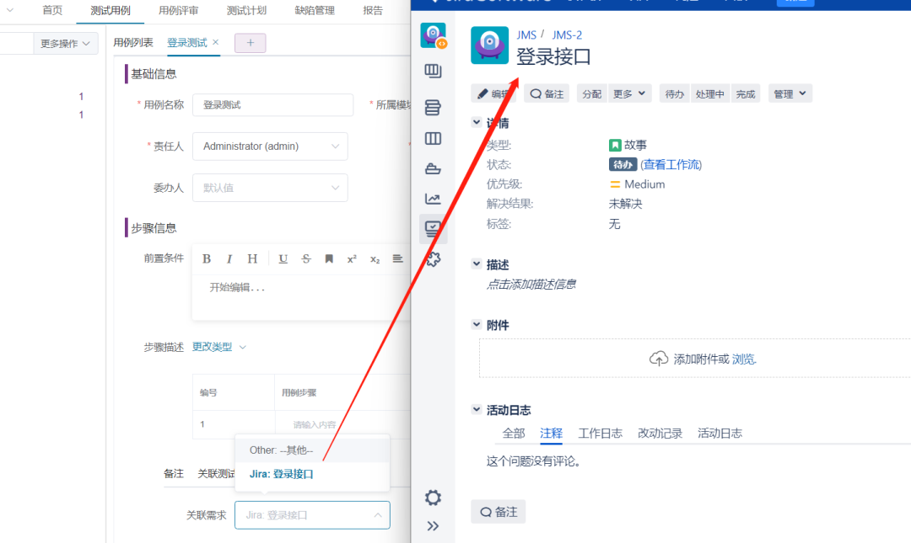
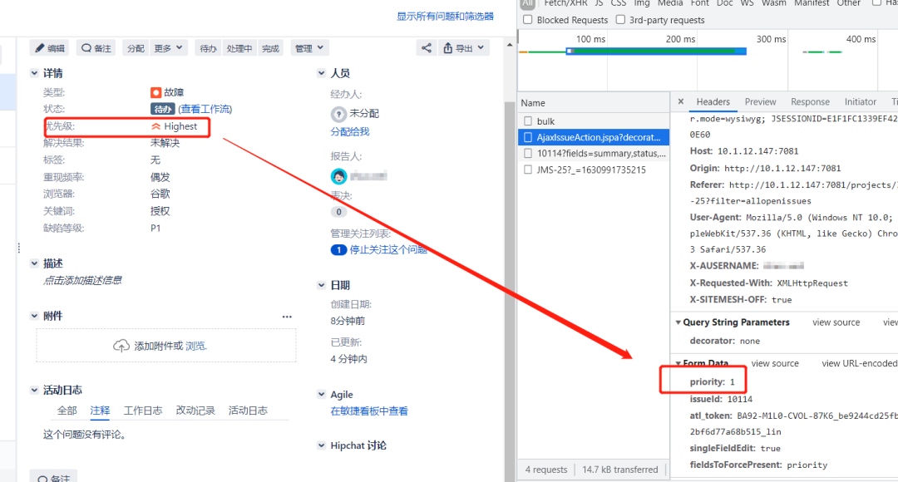
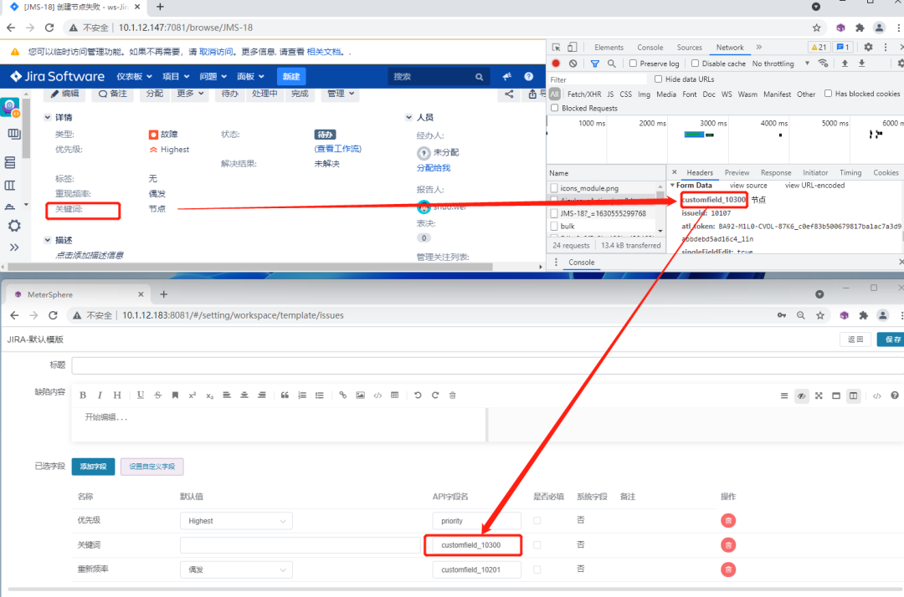

## 1 对接Jira配置
### 1.1 问题类型
在MeterSphere的测试跟踪模块创建缺陷时，如果在对接Jira的配置中选择了此类缺陷，则该缺陷就可以自动同步到Jira平台。这里问题类型需要和Jira平台里保持一致。如果在Jira中选择的问题类型是“故障”，MeterSphere中也应该填写“故障”。 

    
### 1.2 需求类型
配置需求类型的主要目的是，在MeterSphere中编写的测试用例，可以和在Jira平台中已经创建的需求进行关联。这里需求类型要和Jira平台中保持一致。如果在Jira中需求类型为“故事”，MeterSphere中也应该填写“故事”。 

### 1.3 关联项目
关联项目这个配置项主要是为了保证Jira项目和MeterSphere项目的一致性，MeterSphere中Jira项目Key对应Jira里面项目的关键字。

### 1.4 关联个人信息
关联个人信息的主要目的是把MeterSphere用户和Jira用户做关联。即在MeterSphere中提交缺陷时，Jira对应的报告人会是MeterSphere中填写的Jira账户。

## 2 需求关联效果
我们在编辑测试用例时选择关联需求，可以看到Jira中对应项目下的需求已经同步到了MeterSphere对应项目下，可以把不同的用例和需求进行关联。

## 3 配置缺陷模板自定义字段
MeterSphere里默认的Jira缺陷模板字段比较少，所以需要根据不同的测试需求创建自定义字段。比如下图中所示，我们需要将优先级、重现频率、浏览器、关键词和缺陷等级添加到缺陷模板中。 

下面介绍如何实现该自定义字段。
### 3.1 创建字段
#### 3.1.1 字段名及使用场景
创建字段的字段名可以和Jira平台字段名称保持一致，如果Jira里面字段名称是“优先级”，这里就可以填“优先级”。使用场景选择“缺陷模板”。

#### 3.1.2 字段类型
目前MeterSphere支持的字段类型包括输入框、文本框、单/多选下拉列表和单/多选框等。这里以输入框、单选下拉列表和单选框为例，介绍如何在MeterSphere中配置自定义缺陷字段。

A 输入框
Jira中的关键词字段是“输入框”类型，MeterSphere中关键字字段同样也选择“输入框”。

B 单选下拉列表
Jira中的优先级字段是单选“下拉列表”类型，MeterSphere中同样也选择单选“下拉列表”。其中选项值是在对接Jira平台提交缺陷时，对应字段的属性值。可以通过F12查看字段对应的属性值，例如Highest字段对应的属性值是1。 

C 单选框
Jira中的缺陷等级字段是“单选框”，MeterSphere中同样也选择“单选框”。可以通过F12查看字段对应的属性值，例如P1对应的属性值是10200。

### 3.2 新建或修改模块
在缺陷模板菜单中，可以选择创建新的缺陷模板，缺陷平台选择Jira。也可以编辑默认的Jira缺陷模板，并把自定义的字段添加到模板中。注意这里需要填写API字段名，字段名可以通过F12查看，如关键词对应的API字段名为customfield_10300，优先级对应的API字段名为priority。

### 3.3 关联模板
编辑项目，选择项目缺陷模板为刚才添加的自定义字段的模块。

## 4 提交缺陷
在测试用例中创建缺陷，选择对应的自定义属性。创建完成后，可以看到Jira平台成功创建了我们自定义字段的缺陷。

## 5 修改缺陷
我们在Jira平台上修改缺陷后，在MeterSphere上点击“同步缺陷”按钮，可以看到MeterSphere上的缺陷内容已经和Jira保持了一致。
