JMeter 提供了很多函数，如果能够熟练使用，可以为测试带来很多方便。<br>

函数调用的格式 ${__functionName(var1,var2,var3)} <br>

其中，__functionName 为函数名，括号内是函数的参数，无参数 JMeter 时可以不用括号，如 ${__UUID} <br>

如果参数包含逗号，那么一定要使用 “\” 来转义，否则 JMeter 会把它当作一个参数分隔符 <br>

在 Metersphere 实际使用时，可通过点击参数后面的铅笔选择函数，或在参数值一栏直接输入【${__】可自动联想补全<br>

函数亦可在脚本中使用，可参考：https://zhuanlan.zhihu.com/p/535824577 <br>
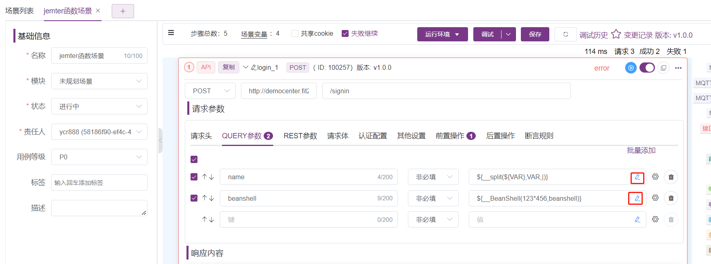

JMeter 中的函数主要分为如下几类：
<table>
  <td bgcolor="#783887" align="middle" style="font-weight:bold;color: white">函数类型</td>
  <td bgcolor="#783887" align="middle" style="font-weight:bold;color: white">函数名称</td>
  <td bgcolor="#783887" align="middle" style="font-weight:bold;color: white">函数作用</td>
  <tbody>
    <tr>
        <td rowspan="2">脚本函数</td>
        <td >__BeanShell</td>
        <td >执行 beanshell 脚本</td>
    </tr>
    <tr>
        <td >__javaScript</td>
        <td >执行 javaScript 脚本</td>
    </tr>
    <tr>
        <td rowspan="4">获取信息函数</td>
        <td >__log</td>
        <td >输出日志信息</td>
    </tr>
    <tr>
        <td >__machineIP</td>
        <td >返回机器（电脑）IP</td>
    </tr>
    <tr>
        <td >__machineName</td>
        <td >返回本机的主机名</td>
    </tr>
    <tr>
        <td >__time</td>
        <td >以多种格式返回当前时间</td>
    </tr>
     <tr>
        <td rowspan="4">变量操作函数</td>
        <td >__split</td>
        <td >根据分隔符分割传递给它的字符串</td>
    </tr>
    <tr>
        <td >__V</td>
        <td >执行嵌套函数引用</td>
    </tr>
    <tr>
        <td >__eval</td>
        <td >执行字符串表达式</td>
    </tr>
    <tr>
        <td >__evalVar</td>
        <td >执行保存在变量中的表达式</td>
    </tr>
     <tr>
        <td rowspan="6">数据计算函数</td>
        <td >__counter</td>
        <td >计数器</td>
    </tr>
    <tr>
        <td >__intSum</td>
        <td >整数求和</td>
    </tr>
    <tr>
        <td >__longSum</td>
        <td >长整型求和</td>
    </tr>
    <tr>
        <td >__Random</td>
        <td >随机数</td>
    </tr>
     <tr>
        <td >__RandomString</td>
        <td >随机字符串</td>
    </tr>
     <tr>
        <td >__UUID</td>
        <td >伪随机类型的唯一标识符ID</td>
    </tr>
  </tbody>
</table>  

## 1 脚本函数
### 1.1 __BeanShell
执行 beanshell 脚本，它有两个参数，第一个参数是要执行的语句，可以是beanshell语句或者是文件地址，是必选参数；第二个参数是保存结果的变量名称，非必选参数。
<table>
  <td bgcolor="#783887" align="middle" style="font-weight:bold;color: white">字段</td>
  <td bgcolor="#783887" align="middle" style="font-weight:bold;color: white">含义</td>
  <td bgcolor="#783887" align="middle" style="font-weight:bold;color: white">是否必传</td>
  <tbody>
    <tr>
        <td>BeanShell script</td>
        <td >beanshell 脚本（不是文件名）</td>
        <td >yes</td>
    </tr>
    <tr>
        <td >Name of variable</td>
        <td >该变量存储此函数返回的值，以便后续复用</td>
        <td >no</td>
    </tr>
  </tbody>
</table>  

示例：
```
${__BeanShell(vars.put("name"\,"value"))} 

${__BeanShell(123*456)}  返回56088

//根据不同系统返回端口号
${__BeanShell(import java.util.*;Properties props = System.getProperties();String osName  = props.getProperty("os.name");if(osName.contains("Linux"))return 443;return 8443;,beanshell)} 

//取数组中随机值
${__BeanShell(import java.util.*;Random random = new Random();int[] array = {1\,100\,1000\,1100};int i = array[random.nextInt(array.length-1)];return i;,beanshell)} 
与 beanshell 元件比较：

该函数与 beanshell 元件（beanshell sampler、beanshell preprocess等）作用是一样的，只是 beanshell 函数更常用于一些简单的判断或计算等，可以把少量的脚本放在函数中直接赋值给一个变量，而不用总是添加 beanshell 元件。

```
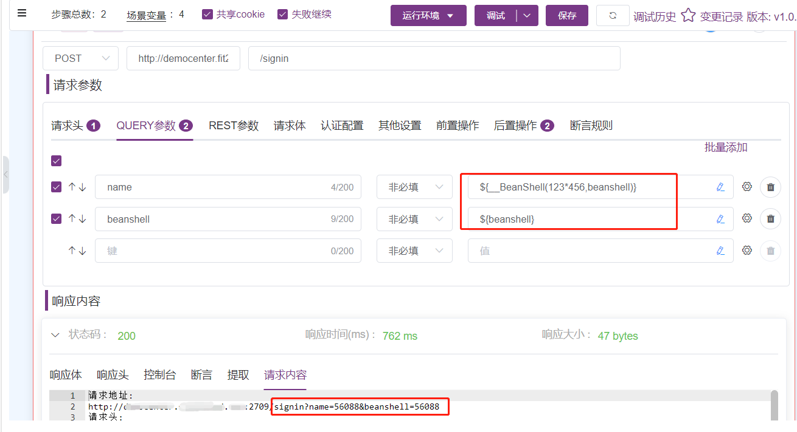

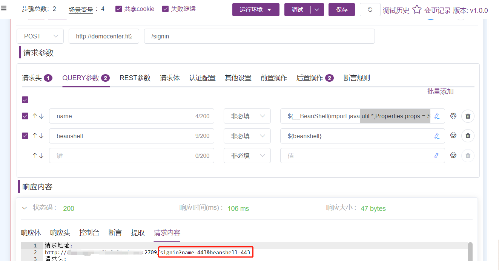

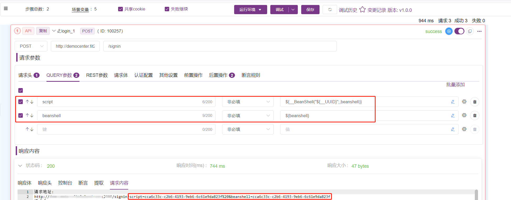

### 1.2 __javaScript
执行 js 脚本，函数 __javaScript 可以用来执行 JavaScript 代码片段，并返回结果值。<br>
该函数会调用标准的 JavaScript 解释器，还可以直接调用 JMeter 的内置函数。
<table>
  <td bgcolor="#783887" align="middle" style="font-weight:bold;color: white">字段</td>
  <td bgcolor="#783887" align="middle" style="font-weight:bold;color: white">含义</td>
  <td bgcolor="#783887" align="middle" style="font-weight:bold;color: white">是否必传</td>
  <tbody>
    <tr>
        <td>Expression</td>
        <td >要执行的 JavaScript 表达式</td>
        <td >yes</td>
    </tr>
    <tr>
        <td >Name of variable</td>
        <td >该变量存储此函数返回的值，以便后续复用</td>
        <td >no</td>
    </tr>
  </tbody>
</table>  

示例：
```
${__javaScript(new Date(),MYDATE)}- 返回当前日期和时间
${__javaScript(Math.floor(Math.random()*(${maxRandom}+1)),MYRESULT)}-将使用 maxRandom 变量，返回一个介于 0 和 maxRandom 之间的随机值并将其存储在 MYRESULT
${__javaScript(${minRandom}+Math.floor(Math.random()*(${maxRandom}-${minRandom}+1)),MYRESULT)}-将使用maxRandom和minRandom变量，返回maxRandom和minRandom之间的随机值并将其存储在变量MYRESULT下
${__javaScript("${VAR}"=="abcd",MYRESULT)} -将VAR变量的值与abcd进行比较，返回true或false并将结果存储在 MYRESULT
注意：文本字符串要添加必要的引号。如果表达式中有逗号，要确保对其转义。

如：${__javaScript('${sp}'.slice(7\,99999))}，对 7 之后的逗号进行了转义。
```
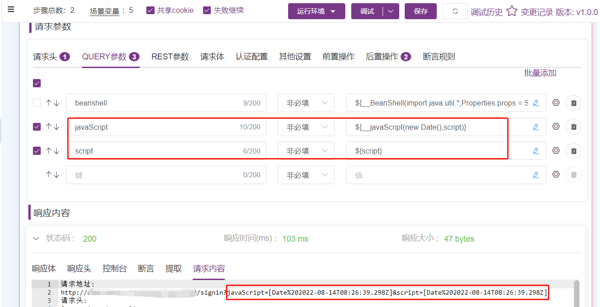

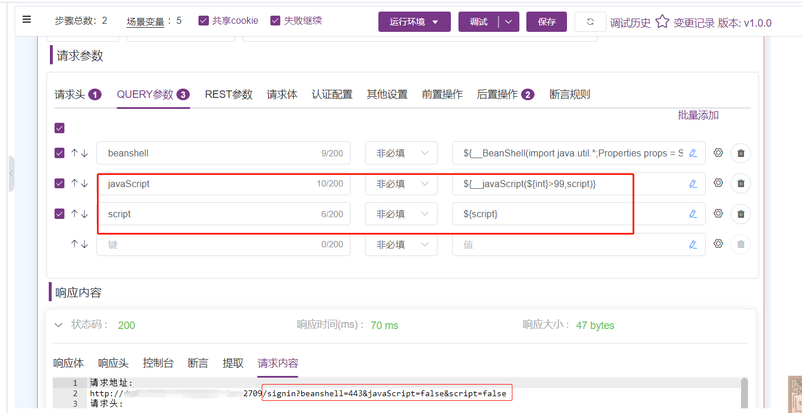

## 2 获取信息函数
### 2.1 __log
输出日志信息，函数记录一条消息，并返回其输入字符串<br>
```
${__log(Message)}：写入日志文件，形如"...threadName:Message"
${__log(Message,OUT)}：写到控制台窗口
${__log(${VAR},,,VAR=)}：写入日志文件，形如"...threadNameVAR=value"
```
<table>
  <td bgcolor="#783887" align="middle" style="font-weight:bold;color: white">字段</td>
  <td bgcolor="#783887" align="middle" style="font-weight:bold;color: white">含义</td>
  <td bgcolor="#783887" align="middle" style="font-weight:bold;color: white">是否必传</td>
  <tbody>
    <tr>
        <td>日志内容</td>
        <td >引用变量名</td>
        <td >yes</td>
    </tr>
    <tr>
        <td >Log Level</td>
        <td >OUT, ERR, DEBUG, INFO (default), WARN or ERROR</td>
        <td >no</td>
    </tr>
     <tr>
        <td >Throwable text</td>
        <td >如果非空，则创建一个 Throwable 传递给记录器</td>
        <td >no</td>
    </tr>
    <tr>
        <td >Comment</td>
        <td >如果存在，则显示在字符串中。用于识别正在记录的内容</td>
        <td >no</td>
    </tr>
  </tbody>
</table>  

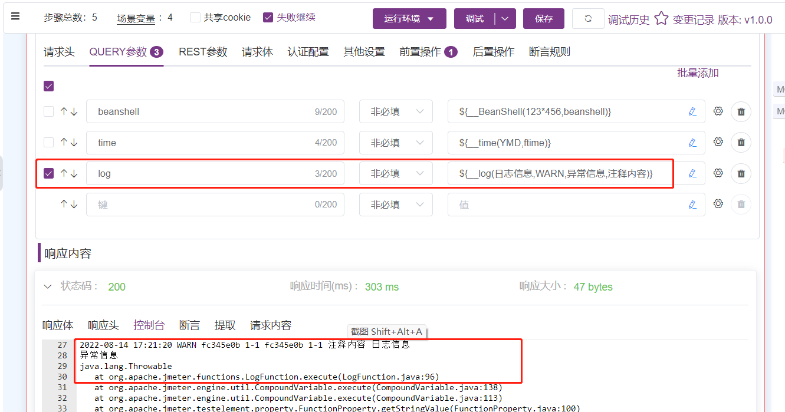

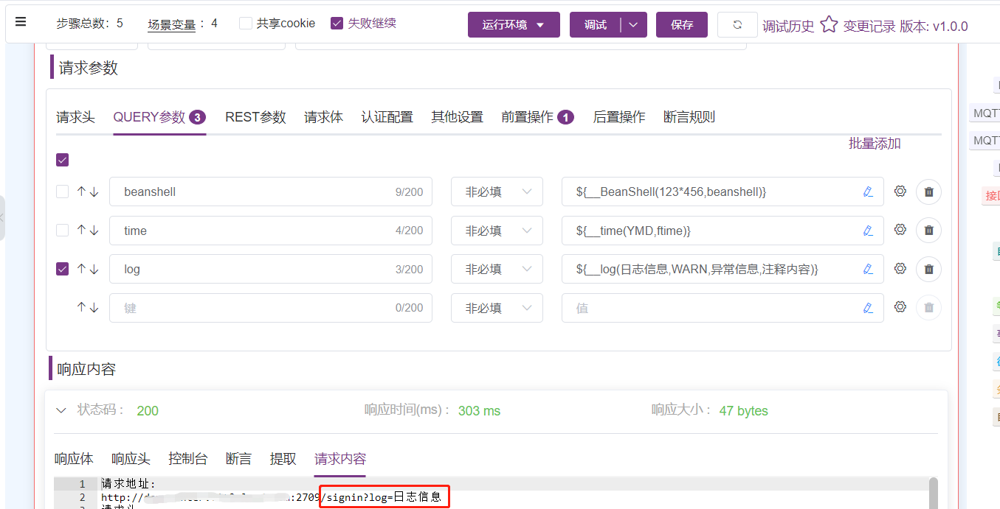

### 2.2 __machineIP 
返回机器（电脑）IP <br>
<table>
  <td bgcolor="#783887" align="middle" style="font-weight:bold;color: white">字段</td>
  <td bgcolor="#783887" align="middle" style="font-weight:bold;color: white">含义</td>
  <td bgcolor="#783887" align="middle" style="font-weight:bold;color: white">是否必传</td>
  <tbody>
    <tr>
        <td>Variable Name</td>
        <td >引用变量名</td>
        <td >no</td>
    </tr>
  </tbody>
</table>  

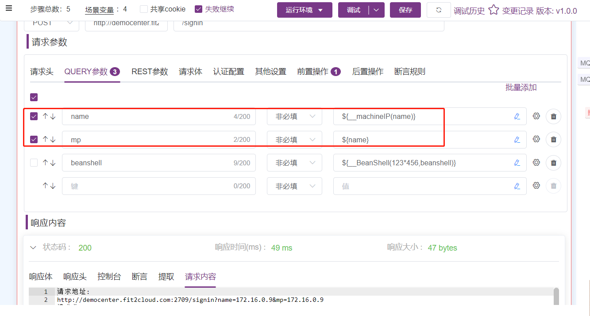

### 2.3 __time
通过多种格式返回当前时间 <br>
<table>
  <td bgcolor="#783887" align="middle" style="font-weight:bold;color: white">字段</td>
  <td bgcolor="#783887" align="middle" style="font-weight:bold;color: white">含义</td>
  <td bgcolor="#783887" align="middle" style="font-weight:bold;color: white">是否必传</td>
  <tbody>
    <tr>
        <td>格式</td>
        <td >要传递给SimpleDateFormat的格式。该函数支持各种速记别名，见下文。如果省略，则该函数返回自纪元以来的当前时间（以毫秒为单位）</td>
        <td >no</td>
    </tr>
    <tr>
        <td>变量名</td>
        <td >要设置的变量的名称</td>
        <td >no</td>
   </tr>
  </tbody>
</table>  
如果省略了格式字符串，那么函数会以毫秒的形式返回当前时间。其他情况下，当前时间会被转成简单日期格式。

```
JMeter 中默认定义的时间格式属性值有：
YMD = yyyyMMdd
HMS = HHmmss
YMDHMS = yyyyMMdd-HHmmss
```
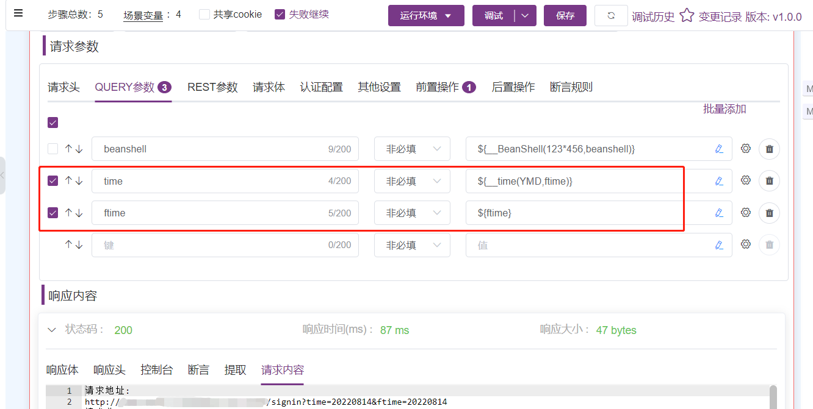

## 3 变量操作函数
###3.1 __split
字符串分割函数，函数 __split 会通过分隔符来拆分传递给它的字符串，并返回原始的字符串。如果分隔符紧挨在一起，那么函数就会以变量值的形式返回 "?"。拆分出来的字符串，以变量 ${VAR_1}、{VAR_2}…以此类推的形式加以返回。<br>

注意: 分隔符默认是逗号，如果你想要多此一举，明确指定使用逗号，需要对逗号转义，如 “\,”
<table>
  <td bgcolor="#783887" align="middle" style="font-weight:bold;color: white">字段</td>
  <td bgcolor="#783887" align="middle" style="font-weight:bold;color: white">含义</td>
  <td bgcolor="#783887" align="middle" style="font-weight:bold;color: white">是否必传</td>
  <tbody>
    <tr>
        <td>String to split</td>
        <td >分隔字符串，例如 “a|b|c”</td>
        <td >yes</td>
    </tr>
    <tr>
        <td>Name of variable</td>
        <td >用于重用此函数计算的值的引用名称</td>
        <td >no</td>
   </tr>
    <tr>
       <td>Delimiter</td>
       <td >指定分隔符，如 " |  :  , ”等，若省略，默认使用","进行分割。若指定","进行分割，则需要将","进行转义为"\,"</td>
       <td >no</td>
    </tr>
  </tbody>
</table>  

前后置脚本中，示例特殊情况"a||c|"分割，分隔符紧挨在一起，返回"?"，以分隔符结束，返回"?"
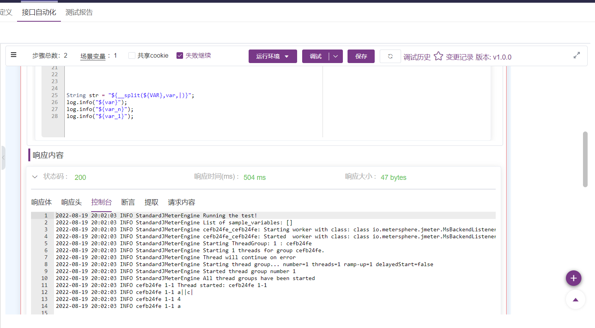

分割后的数组可搭配循环控制器使用，这里循环控制引用上图分割好的 ${var} 变量 <br>
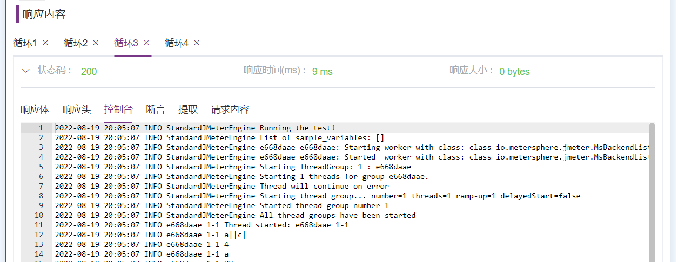

参数中示例分割字符串“admin|b|c” <br>
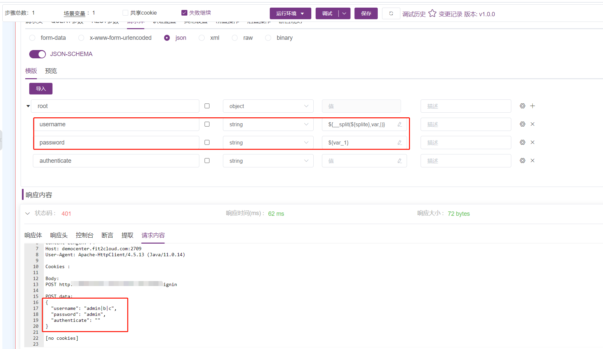

### 3.2 __V
执行变量名表达式，函数 __V 可以用于执行变量名表达式，并返回执行结果。它可以被用于执行嵌套函数引用
```
${A1}：能正常工作
${A${N}}：无法正常工作（嵌套变量引用）
${__V(A${N})}：可以正常工作。A${N}变为A1，函数 __V返回变量值A1
```
<table>
  <td bgcolor="#783887" align="middle" style="font-weight:bold;color: white">字段</td>
  <td bgcolor="#783887" align="middle" style="font-weight:bold;color: white">含义</td>
  <td bgcolor="#783887" align="middle" style="font-weight:bold;color: white">是否必传</td>
  <tbody>
    <tr>
        <td>Variable name</td>
        <td >要评估的变量</td>
        <td >yes</td>
    </tr>
    <tr>
        <td>Default value</td>
        <td >未找到变量时的默认值，如果为空且未找到变量，则函数返回变量名称</td>
        <td >no</td>
   </tr>
  </tbody>
</table>  

场景使用：将数据库获取的数据作为下一个接口的参数（循环控制器+计数器函数）${__V(name_${__counter(,)})} <br>
详细使用参考：https://zhuanlan.zhihu.com/p/547953530

### 3.3 __eval
返回计算字符串表达式的结果，这允许在存储在变量中的字符串中插入变量和函数引用 <br>
如: 给定变量 name=Smith、column=age、table=birthdays、SQL=select${column}from${table}wherename='${name}'，那么通过 ${__eval(${SQL})}，就能执行 "selectagefrombirthdayswherename='Smith'"。这样一来，就可以与 CSV 数据集相互配合，例如，将 SQL 语句和值都定义在数据文件中。
<table>
  <td bgcolor="#783887" align="middle" style="font-weight:bold;color: white">字段</td>
  <td bgcolor="#783887" align="middle" style="font-weight:bold;color: white">含义</td>
  <td bgcolor="#783887" align="middle" style="font-weight:bold;color: white">是否必传</td>
  <tbody>
    <tr>
        <td>Variable name</td>
        <td >要评估的变量</td>
        <td >yes</td>
    </tr>
  </tbody>
</table>  

使用场景：
场景内容对某商品的增删改查，该商品的 id 为固定前缀 xxx+32 位随机数。
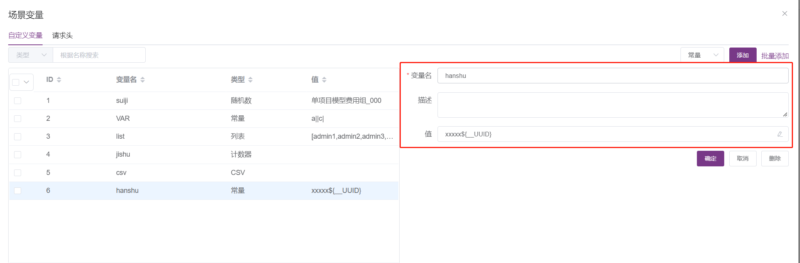

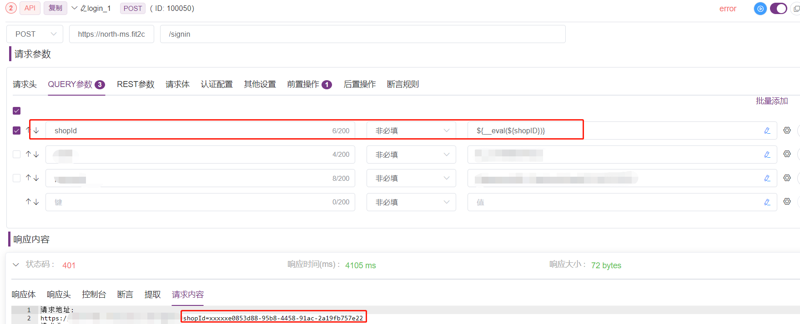

原来一个注册，因为用到的参数都是随机生成，所以不方便写入 csv 参数化文件里，只能出现这种多个 if 控制器+请求样本的脚本设计来跑这些用例。这样脚本就会很繁琐，改动也不方便。

数据文件中直接使用函数或者前文提取的变量。很方便的实现了数据驱动，脚本缩减。<br>
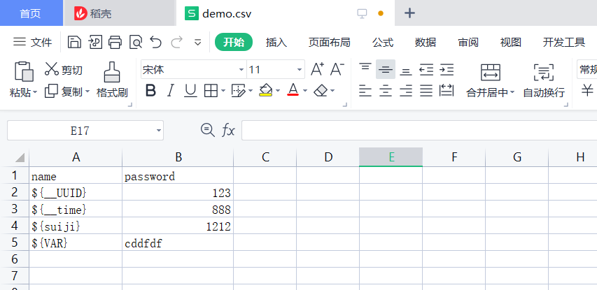

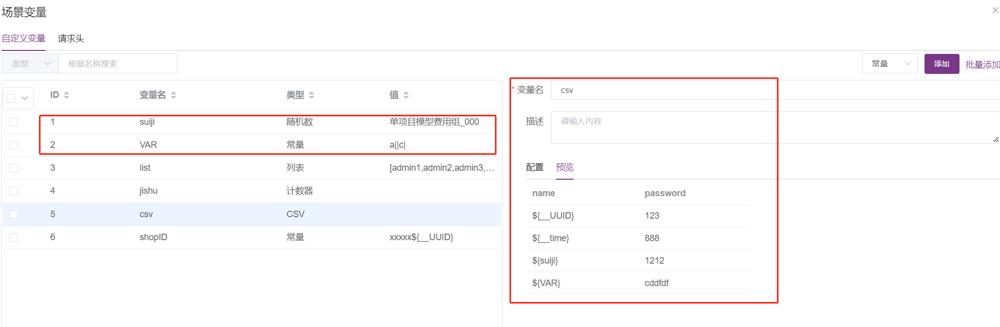

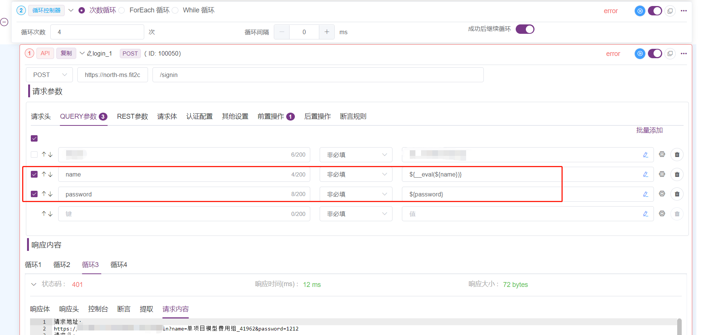

### 3.4 __evalVar
返回计算存储在变量中的表达式的结果，这允许人们从文件中读取字符串，并处理其中的任何变量引用。<br>
例如，如果变量“ query ”包含“ select ${column} from ${table} ”并且“ column ”和“ table ”包含“ name ”和“ customers ”，则${__evalVar(query)} 将评价为“select name from customers”
<table>
  <td bgcolor="#783887" align="middle" style="font-weight:bold;color: white">字段</td>
  <td bgcolor="#783887" align="middle" style="font-weight:bold;color: white">含义</td>
  <td bgcolor="#783887" align="middle" style="font-weight:bold;color: white">是否必传</td>
  <tbody>
    <tr>
        <td>Variable name</td>
        <td >要评估的变量</td>
        <td >yes</td>
    </tr>
  </tbody>
</table>  

使用场景同上，使用 __evalVar 里面不用 ${} 就可引用到变量
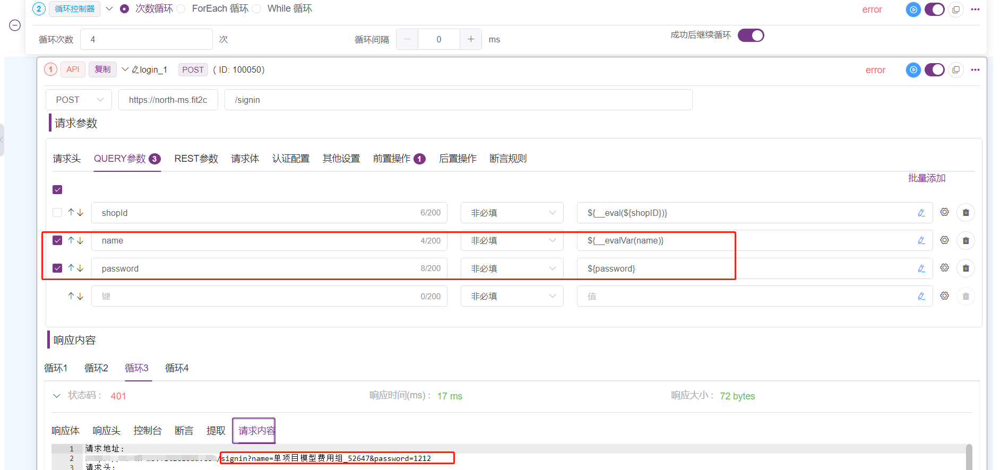

## 4 数据计算函数
### 4.1 __counter
计数器 <br>
1. 每次调用计数器函数都会产生一个新值，从1开始每次加1。计数器既可以被配置成针对每个虚拟用户是独立的，也可以被配置成所有虚拟用户公用的。<br>
2. 如果每个虚拟用户的计数器是独立增长的，那么通常被用于记录测试计划运行了多少遍。全局计数器通常被用于记录发送了多少次请求。<br>
3. 计数器使用一个整数值来记录，允许的最大值为 2,147,483,647。<br>
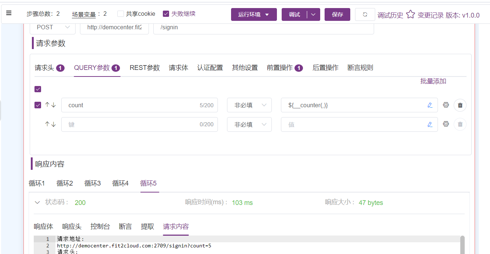

### 4.2 __intSum
整数求和函数 <br>
1. 函数__intSum可以被用来计算两个或者更多整数值的合。至少需要两个整数，如果指定变量名则名称中必须包含一个非数字字母，否则它会被当成另一个整数值，而被函数用于计算。<br>
2. 当有多个整数时点击添加按钮来增加参数，但是需要注意的是: 添加完参数后，点击”生成”的函数默认是把手动添加的函数放在后面，这时需要手动调整变量名的位置，把它放到最后，否则会报错。<br>
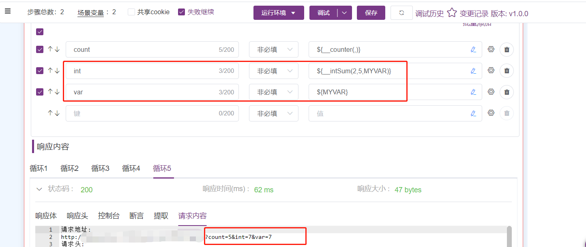

### 4.3 __longSum
计算两个或多个 long 类型的值，值不在 -2147483648 到 2147483647 的区间内，请使用它而不是 __intSum
<table>
  <td bgcolor="#783887" align="middle" style="font-weight:bold;color: white">字段</td>
  <td bgcolor="#783887" align="middle" style="font-weight:bold;color: white">含义</td>
  <td bgcolor="#783887" align="middle" style="font-weight:bold;color: white">是否必传</td>
  <tbody>
    <tr>
        <td>First argument</td>
        <td >第一个长值</td>
        <td >yes</td>
    </tr>
     <tr>
        <td>Second argument</td>
        <td >第二个长值</td>
        <td >yes</td>
    </tr>
     <tr>
        <td>nth argument</td>
        <td >第n个长值</td>
        <td >no</td>
    </tr>
     <tr>
        <td>last argument</td>
        <td >重用此函数计算的值的引用名称</td>
        <td >no</td>
    </tr>
  </tbody>
</table>  

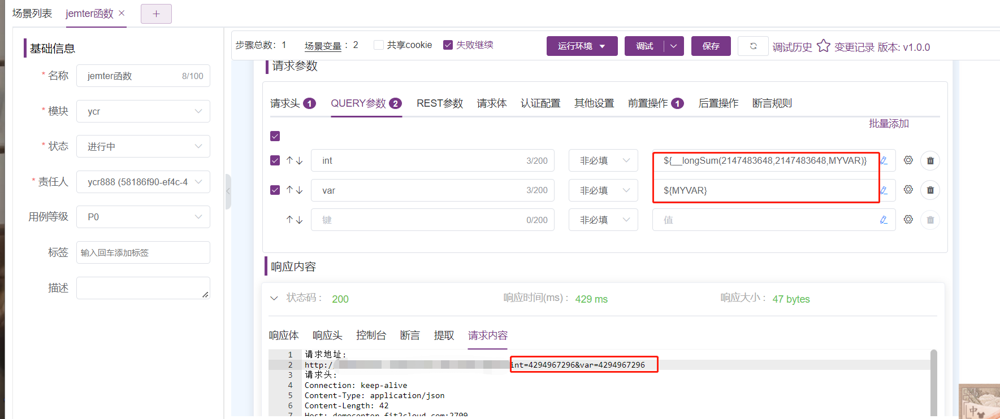

### 4.4 __Random
随机数函数，返回一个介于给定最小值和最大值之间的随机数。
<table>
  <td bgcolor="#783887" align="middle" style="font-weight:bold;color: white">字段</td>
  <td bgcolor="#783887" align="middle" style="font-weight:bold;color: white">含义</td>
  <td bgcolor="#783887" align="middle" style="font-weight:bold;color: white">是否必传</td>
  <tbody>
    <tr>
        <td>Minimum value</td>
        <td >最小值</td>
        <td >yes</td>
    </tr>
     <tr>
        <td>Maximum value</td>
        <td >最大值</td>
        <td >yes</td>
    </tr>
     <tr>
        <td>Variable Name</td>
        <td >重用此函数计算的值的引用名称</td>
        <td >no</td>
    </tr>
  </tbody>
</table>  

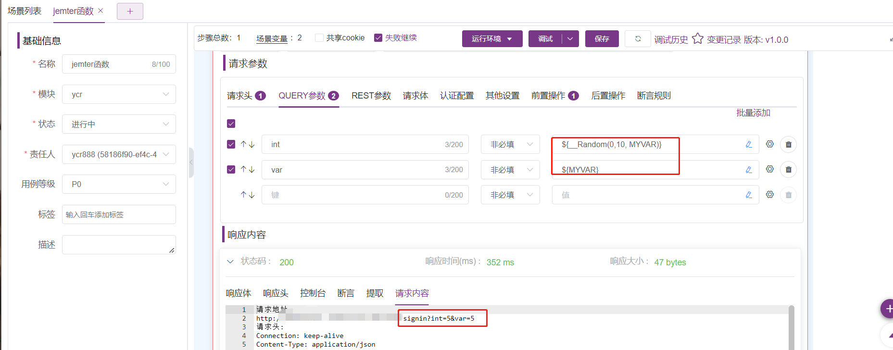

### 4.5 __RandomString
随机字符串，从指定字符中返回指定长度的随机字符串
<table>
  <td bgcolor="#783887" align="middle" style="font-weight:bold;color: white">字段</td>
  <td bgcolor="#783887" align="middle" style="font-weight:bold;color: white">含义</td>
  <td bgcolor="#783887" align="middle" style="font-weight:bold;color: white">是否必传</td>
  <tbody>
    <tr>
        <td>Length</td>
        <td >生成的字符串的数字长度</td>
        <td >yes</td>
    </tr>
     <tr>
        <td>Characters to use</td>
        <td >用于生成字符串的字符</td>
        <td >no</td>
    </tr>
     <tr>
        <td>Variable Name</td>
        <td >重用此函数计算的值的引用名称</td>
        <td >no</td>
    </tr>
  </tbody>
</table>  

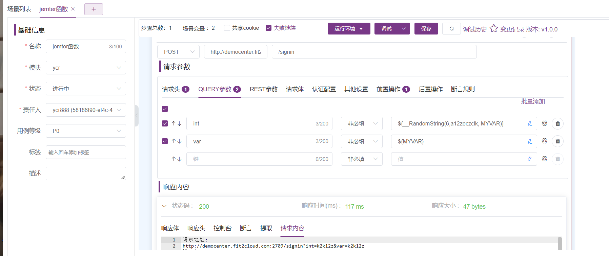

### 4.6 __UUID
随机数函数，返回一个伪随机类型通用唯一标识符 (UUID) <br>
注意：此函数无参数 <br>
将返回此格式的 UUID：c69e0dd1-ac6b-4f2b-8d59-5d4e8743eecd <br>
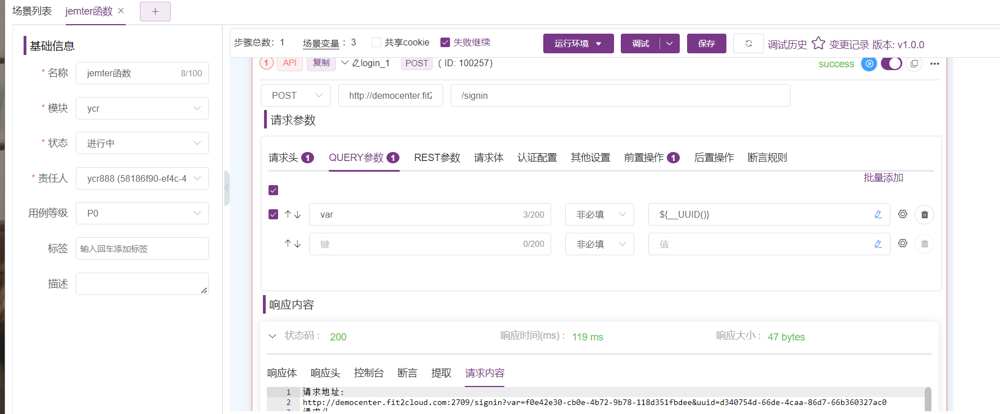