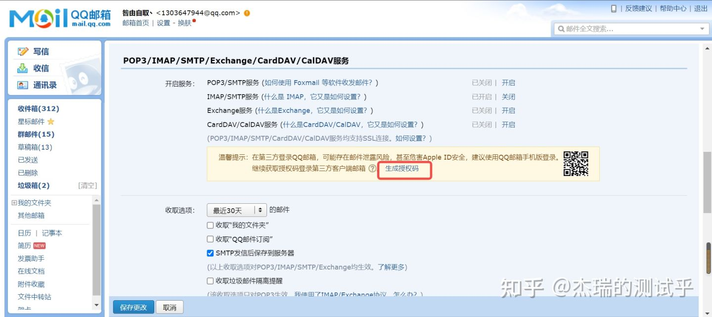
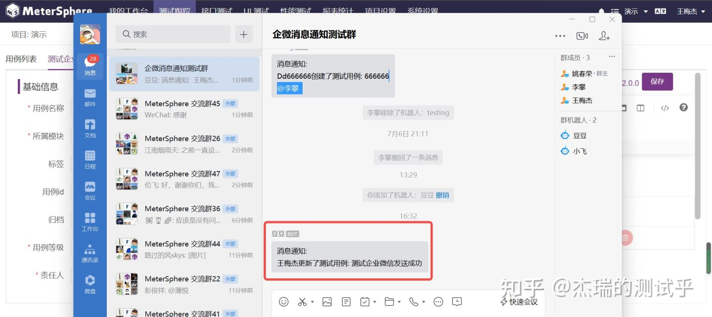
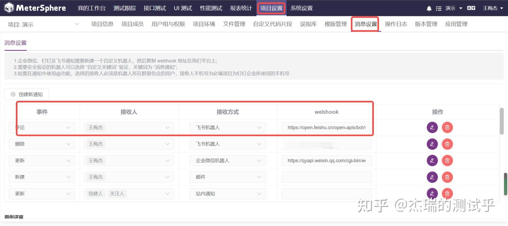
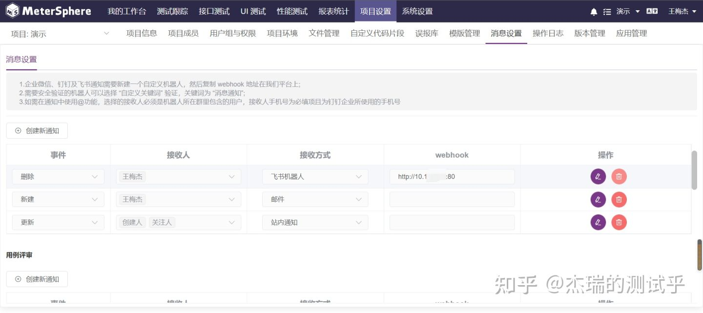

## 1 对接邮件 (以 QQ 邮箱配置为例)
### 1.1 开启 IMAP/SMTP 服务
配置邮箱账户信息，开启 IMAP/SMTP 服务，根据提示发送短信，生成授权码。

### 1.2 生成授权码
开启 IMAP/SMTP 服务时可以生成授权码，点击生成授权码，也可以生成授权码。

### 1.3 测试连接
在 MeterSphere 系统中，系统参数设置-邮件设置中配置邮件信息，之后点击测试连接测试。

### 1.4 设置的账户信息
系统设置-系统-用户，用户的邮箱配置与邮件设置的账户信息一致。

### 1.5 配置消息设置
项目设置-消息设置，配置邮件发送的条件

### 1.6 邮件发送
创建功能用例，测试邮件发送

## 2 对接企业微信
### 2.1 自定义机器人
企业微信需要建个群，然后在群里新建一个自定义机器人，复制创建机器人后生成的 webhook 地址到 MeterSphere 平台上。 

### 2.2 消息设置
项目设置-消息设置 配置接收方式、以及配置创建机器人生成的 webhook 地址。

### 2.3 消息推送
更新功能用例，测试消息推送

## 3 对接飞书
### 3.1 新建机器人
飞书通知需要建一个群，在设置-群机器人-添加机器人新建机器人，然后复制 webhook 地址到 MeterSphere 平台上。

### 3.2 自定义关键词
可以在安全设置设置自定义关键词，设定后，只有包含至少一个关键词的消息内容，所设 IP 范围的请求才会被正常发送。

### 3.3 消息设置
项目设置-消息设置 配置接收方式、以及创建机器人生成的 webhook 地址。

## 3.4 消息通知
删除功能用例，测试消息推送

## 4 对接钉钉
### 4.1 自定义机器人
钉钉通知需要建一个群，新建一个自定义机器人，在设置-智能群助手-添加机器人新建机器人，然后复制 webhook 地址到 MeterSphere 平台上。 

### 4.2 自定义关键词
可以安全设置设置自定义关键词，设定后，只有包含关键词的消息内容才会被正常发送。

### 4.3 消息设置
项目设置-消息设置 配置接收方式、以及创建机器人生成的 webhook 地址。

### 4.4 消息通知
更新功能用例，测试消息推送

## 5 内网环境，搭建 nginx 代理，转发消息 (以飞书为例)
### 5.1 安装配置 nginx
请参考: https://blog.csdn.net/weixin_51560103/article/details/121129037

### 5.2 消息设置
项目设置-消息设置模块配置通知，webhook 栏配置 nginx 地址。

### 5.3 配置 nginx.conf
到路径 /usr/local/nginx/conf/ 下修改 nginx.conf 配置文件。配置创建飞书机器人生成的 webhook 地址。 

### 5.4 消息通知
删除功能用例，测试消息推送

