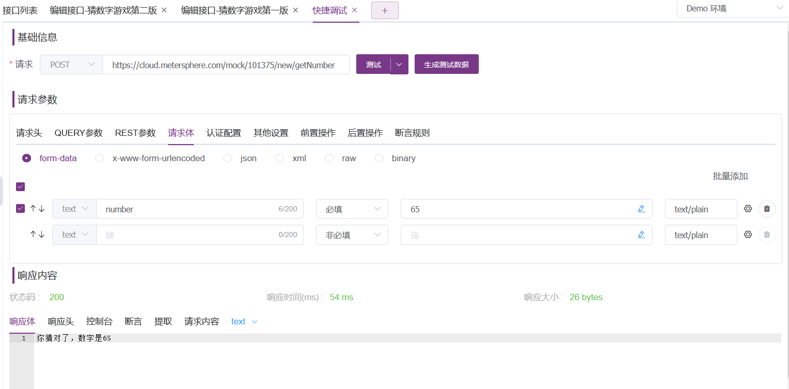

## 1 MOCK功能
- 某些大量联调系统，或者集成系统，比如：支付中最常用的扫码支付，需要和大量的银行对接，但是在测试环境中，没有这个条件模拟真实的场景，有时需要针对某些返回数据进行伪造。
- 某依赖系统还未开发完成，就需要对被测系统进行测试，前端开发比较依赖后端开发提供的接口，然后根据接口返回值设计各类场景页面。当服务端开发人员未及时提供接口时可能会影响到前端开发及整个项目的进度，特别是在敏捷开发中，对于上下游开发顺序更加依赖；
- 某些系统不支持重复请求，如支付功能，而Mock 服务在金融行业往往被称为“挡板”；
- 某些系统功能有访问频次限制，获取敏感信息的接口访问有频次限制等；

MeterSphere 提供的 Mock 功能可以根据用户输入的请求参数、返回数据生成 Mock 接口，这些接口会自动生成模拟数据，以覆盖用户的一些测试需求。而 Mock 期望则是根据设置的请求触发条件来进行过滤，然后返回期望的数据。

列表功能，支持对Mock服务的开启/关闭、编辑、复制、删除操作。

## 2 HTTP MOCK设置
在接口编辑页面可展示此接口的Mock信息，Mock默认地址是MeterSphere 系统地址+模块 ID+接口地址，一个接口定义可以设置多个Mock服务。点击Mock设置可跳转到Mock页面。点击MOCK页签也可以跳转到Mock页面。

在MOCK页面中展示当前接口定义下的MOCK服务。 

点击 +添加 按钮添加Mock服务。 

设置Mock服务触发条件,可以根据参数设定的值、长度、正则表达式Mock出相应的请求参数，同时参数与参数之间新增了逻辑判断（AND/OR），以提升触发条件的灵活性。

针对一些特定测试场景需要对返回信息进一步处理的情况，比如加解密操作、调用第三方 JAR 包等，MeterSphere在v1.18.0版本中Mock提供了对后置脚本的支持，可以通过编写脚本或添加系统已有的自定义代码片段来实现对返回信息的处理。

设置Mock服务响应内容。 

请求参数与设置的触发条件匹配，则返回设置的响应内容。 

## 3 TCP MOCK设置
开启 TCP Mock 服务，Mock 服务显示未开启，需在【项目设置】-【应用管理】-【接口测试】中开启TCP Mock服务。

其他 TCP MOCK设置请参考【HTTP MOCK设置】

## 4 Mock 后置脚本
注意: Mock 后置脚本不可打印，不能使用 Jmeter 内置函数。 
设置请求体，选择from-data格式，同模糊匹配操作和模糊匹配操作一类似，添加判断数字范围，如下图：

选择添加【后置脚本】，选择脚本类型（本次使用beanshell），对用户的请求内容进行判断，如图：

添加响应内容，将脚本中的返回值，作为变量传入响应内容中，如下图：

设置保存后，利用 MeterSphere 的快捷调试功能测试 
猜的数字小，返回的响应体

猜的数字大，返回的响应体

猜对的情况，返回的响应体

