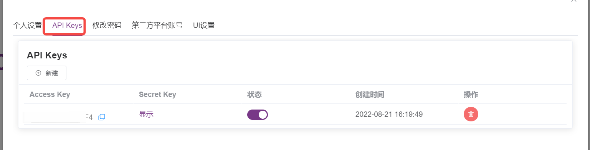
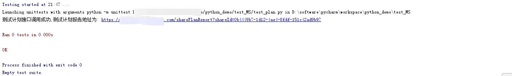
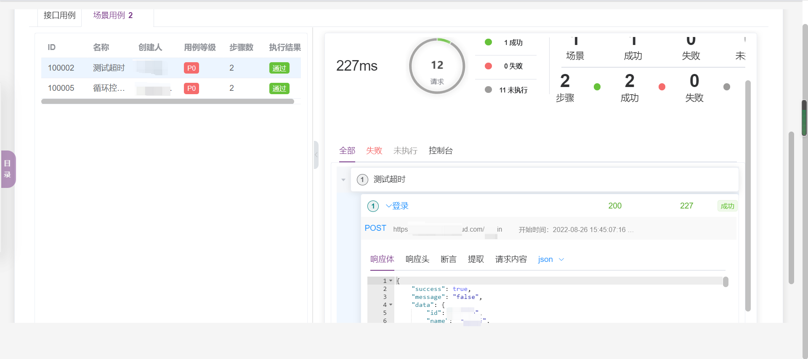

## 1 关于 MS 接口的 API 调用
加密方式：对称加密 <br>
加密算法：AES，加密模式：CBC，填充方式：PKCS5Padding

## 2 调用步骤
在 MeterSphere 系统【个人信息】-【API Keys】获取 accessKey 和 secretKey。


用 ak 和 sk 来生成 signatur 的方法
```
def aesEncrypt(text, secretKey, iv):
    BS = AES.block_size  # 这个等于16
    mode = AES.MODE_CBC
    def pad(s): return s + (BS - len(s) % BS) * \
                       chr(BS - len(s) % BS)
    cipher = AES.new(secretKey.encode('UTF-8'), mode, iv.encode('UTF-8'))
    encrypted = cipher.encrypt(pad(text).encode('UTF-8'))
    # 通过aes加密后，再base64加密
    b_encrypted = base64.b64encode(encrypted)
    return b_encrypted
```

生成签名，并设置到 header 
```
def setHeaders(s,accessKey,secretKey):
    timeStamp = int(round(time.time() * 1000))
    combox_key = accessKey + '|' + str(uuid.uuid4()) + '|' + str(timeStamp)
    signature = aesEncrypt(combox_key, secretKey, accessKey)
    print(signature.decode('UTF-8'))
    header = {'Content-Type': 'application/json', 'ACCEPT': 'application/json', 'accessKey': accessKey,
               'signature': signature.decode('UTF-8'),'Connection': 'close'}
    s.headers.update(header)
    return s
```

获取运行环境id、测试报告方法。
```
#获取运行环境id
def get_test_plan_env(s,host,projectId,name):
    url = host + "/api/environment/list/{}".format(projectId)
    r = s.get(url)
    data = r.json().get("data")
    if data:
        for dat in data:
            if dat.get("name") == name:
                return dat.get("id")
    else:
        print("没有data值")

#测试报告
def get_report_url(s,host,customData):
    url = host + "/share/info/generateShareInfoWithExpired"
    body = {"customData":customData,"shareType":"PLAN_DB_REPORT","lang":None}
    r = s.post(url,json=body)
    if r:
        data = r.json().get("data")
        if data:
            shareUrl=data.get("shareUrl")
            report_url = host + "/sharePlanReport" + shareUrl
            return report_url
        else:
            print("没有返回值...")
```

设置请求测试计划接口需要的参数和执行方法
```
def test_plan_run(s,host,testPlanId,projectId,envId,userId="王梅杰"):
    url = host + "/test/plan/run"
    body = {
   "mode": "serial",
   "reportType": "iddReport",
   "onSampleError": True,
   "runWithinResourcePool": False,
   "resourcePoolId": None,
   "envMap": {
      projectId: envId
   },
   "testPlanId": testPlanId,
   "projectId": projectId,
   "userId": userId,
   "triggerMode": "MANUAL",
   "environmentType": "JSON",
   "environmentGroupId": "",
   "requestOriginator": "TEST_PLAN"
}
    r = s.post(url,json=body)
    return r

def exec_run(accessKey,secretKey,host,projectId,testPlanName="测试环境使用", envName="MS环境"):
    s = requests.session()
    s = setHeaders(s,accessKey,secretKey) #设置请求头
    testPlanId="3e8b4795-c3dc-4899-8204-d88637912914"
    envId = get_test_plan_env(s,host,projectId,envName) #获取运行环境id,这里采用调Api获取的形式
    r = test_plan_run(s,host,testPlanId,projectId,envId)
    if r.json().get("success")==True:
        data = r.json().get("data")
        if data:
            report_url = get_report_url(s,host,data)#获取测试报告
            print("测试计划接口调用成功,测试计划报告地址为: {}".format(report_url))
```

方法调用执行
```
exec_run('8xr2ZLKqkTbqIHF4','rIBsWJPkdwE4UE0X',"https://north-ms.fit2cloud.com",'6d609951-4c38-4b8e-a05b-858699271ba5')
```

控制台执行结果，点击报告链接可以跳转到报告页


MeterSphere 查看测试报告，执行成功
