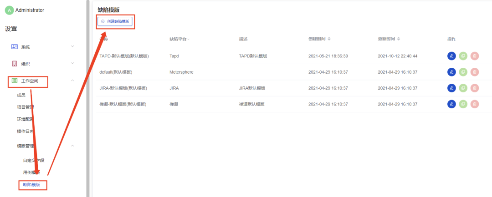
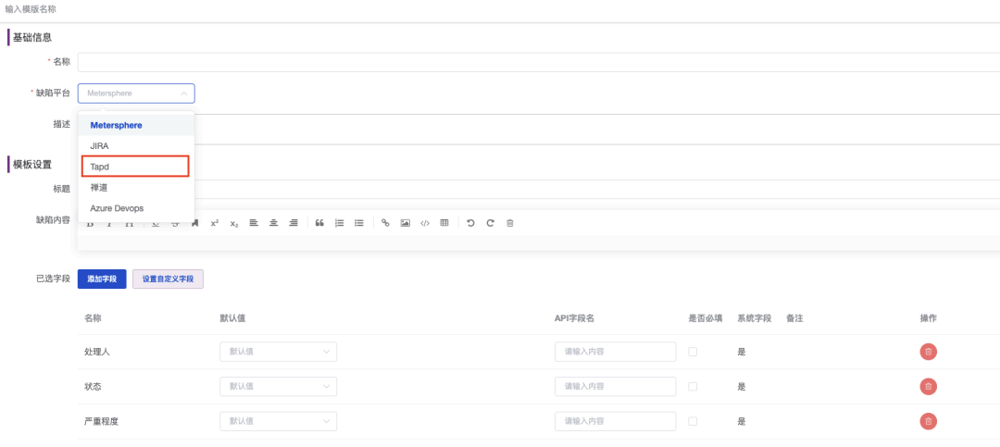

作为一款一站式开源持续测试平台，MeterSphere可以集成多种测试管理平台，包括TAPD、Jira、禅道和Azure DevOps。这里，笔者就跟大家介绍如何集成TAPD平台，以及集成后如何将缺陷自动推送到TAPD平台。

## 1 TAPD服务集成
首先进入MeterSphere界面，在“系统设置”→“组织”→“服务集成”页面中选择TAPD，并填写TAPD Basic Auth的账号信息，包括API账号和API口令。编辑完成后测试连接是否有效。如下图：

## 2 关联项目
为保证TAPD项目和MeterSphere项目的一致性，需要将这两个平台中的项目关联起来。项目ID可在进入TAPD项目后的URL中获取，如下图所示：

## 3 关联个人信息
将MeterSphere用户和TAPD用户做关联后，在MeterSphere中提交缺陷，TAPD上对应的处理人即为在MeterSphere中填写的账户名。

关联方法如下图所示，在MeterSphere的个人信息中的TAPD昵称处填写TAPD对应的昵称（查看位置在TAPD“我的设置”中）。
 

## 4 配置缺陷模版
### 4.1 创建缺陷模版
如果是第一次集成TAPD服务，需要创建TAPD缺陷模版，创建步骤如下图：
 

在新的模版中设置模版名称、缺陷平台（此处选择TAPD），并设置模版内容。模版包括缺陷标题、缺陷内容、缺陷字段。用户可以在缺陷标题和缺陷内容中预先定义格式，比如标题前缀、内容标题（包含测试环境、前置条件、测试步骤等）。 
 

### 4.2 自定义字段
如果MeterSphere中默认的TAPD缺陷模版不能满足当下需求，我们还可以选择创建自定义字段。下图展示的信息中，发现阶段、缺陷类型、发现版本、项目名称等均为自定义缺陷字段。
 

下面介绍具体的创建方法。点击“创建字段”按钮后，会出现下图所示界面。 
 

- 字段名：和TAPD平台保持一致，如TAPD中字段名称为“优先级”，此处就填“优先级”；
- 使用场景：选择“缺陷模版”选项；
- 字段类型：目前MeterSphere中支持多种字段类型，如“输入框”、“文本框”等。缺陷字段中使用最多的类型为“单选下拉列表”类型，所以这里就以这个类型为例，介绍如何在MeterSphere中创建自定义缺陷字段；
- 单选下拉列表：单选下拉列表需要设置选项值，其中包括选项内容和选项ID。选项内容就是我们在页面中看到的选项显示内容，选项ID为TAPD添加缺陷接口该字段接收的值（可通过点击F12快捷键查看字段对应的选项ID，如紧急选项对应的选项ID是urgent）。

 

添加完所有选项后，点击“确定”按钮，一个自定义字段就创建完成了，其他所有的自定义字段均可按照这个方法完成。

缺陷优先级（Priority）字段说明：
<table>
  <td bgcolor="#783887" align="middle" style="font-weight:bold;color: white">
   取值
  </td>
  <td bgcolor="#783887" align="middle" style="font-weight:bold;color: white">
   字面值
  </td>
  <tbody>
    <tr>
        <td >urgent</td>
        <td >紧急</td>
    </tr>
    <tr>
        <td >high</td>
        <td >高</td>
    </tr>
    <tr>
        <td >medium</td>
        <td >中</td>
    </tr>
    <tr>
        <td >low</td>
        <td >低</td>
   </tr>
   <tr>
        <td >insignificant</td>
        <td >无关紧要</td>
   </tr>
  </tbody>
</table>  

缺陷严重程度（Severity）字段说明：
<table>
  <td bgcolor="#783887" align="middle" style="font-weight:bold;color: white">
   取值
  </td>
  <td bgcolor="#783887" align="middle" style="font-weight:bold;color: white">
   字面值
  </td>
  <tbody>
    <tr>
        <td >fatal</td>
        <td >致命</td>
    </tr>
    <tr>
        <td >serious</td>
        <td >严重</td>
    </tr>
    <tr>
        <td >normal</td>
        <td >一般</td>
    </tr>
    <tr>
        <td >prompt</td>
        <td >提示</td>
   </tr>
   <tr>
        <td >advice</td>
        <td >建议</td>
   </tr>
  </tbody>
</table>  

### 4.3 配置缺陷模版
创建好自定义字段后，需要将字段应用到缺陷模板中。点击“添加字段”，可以在界面选择需要的字段添加到模板中。
 

添加好字段之后，需要将字段与TAPD添加缺陷接口中的API字段名做对应关系设置，才能将设置的字段作为缺陷的要素推送到TAPD。
 

TAPD自定义字段的字段名可以通过接口获取，也可以通过抓包的方式在创建缺陷时获取，自定义字段的字段名形式一般为：custom_field_one、custom_field_two等。

接口的链接为：https://www.tapd.cn/help/view#1120003271001001455

TAPD添加缺陷的API请求参数如下，如果在TAPD中定义了自定义字段，也要将自定义字段也传入。
<table>
  <td bgcolor="#783887" align="middle" style="font-weight:bold;color: white">
   字段名
  </td>
  <td bgcolor="#783887" align="middle" style="font-weight:bold;color: white">
   必选
  </td>
  <td bgcolor="#783887" align="middle" style="font-weight:bold;color: white">
     类型及范围
    </td>
    <td bgcolor="#783887" align="middle" style="font-weight:bold;color: white">
     说明
    </td>
  <tbody>
    <tr>
        <td >title</td>
        <td >是</td>
         <td >string</td>
         <td >标题</td>
    </tr>
    <tr>
         <td >priority</td>
        <td >否</td>
         <td >string</td>
         <td >优先级</td>
    </tr>
    <tr>
        <td >severity</td>
        <td >否</td>
        <td >string</td>
        <td >严重程度</td>
    </tr>
    <tr>
        <td >module</td>
        <td >否</td>
        <td >string</td>
        <td >模块</td>
   </tr>
   <tr>
        <td >release_id</td>
        <td >否</td>
        <td >integer</td>
        <td >发布计划</td>
   </tr>
<tr>
       <td >version_report</td>
       <td >否</td>
       <td >string</td>
       <td >发现版本</td>
  </tr>
  <tr>
      <td >version_test</td>
      <td >否</td>
      <td >string</td>
      <td >验证版本</td>
  </tr>
  <tr>
        <td >version_fix</td>
        <td >否</td>
        <td >string</td>
        <td >合入版本</td>
    </tr>
  <tr>
        <td >version_close</td>
        <td >否</td>
        <td >string</td>
        <td >关闭版本</td>
    </tr>
  <tr>
          <td >baseline_find</td>
          <td >否</td>
          <td >string</td>
          <td >发现基线</td>
      </tr>
    <tr>
          <td >baseline_join</td>
          <td >否</td>
          <td >string</td>
          <td >合入基线</td>
      </tr>
    <tr>
            <td >baseline_test</td>
            <td >否</td>
            <td >string</td>
            <td >验证基线</td>
        </tr>
  <tr>
        <td >baseline_close</td>
        <td >否</td>
        <td >string</td>
        <td >关闭基线</td>
    </tr>
   <tr>
           <td >current_owner</td>
           <td >否</td>
           <td >string</td>
           <td >处理人</td>
       </tr>
     <tr>
           <td >cc</td>
           <td >否</td>
           <td >string</td>
           <td >抄送人</td>
       </tr>
    <tr>
       <td >reporter</td>
       <td >否</td>
       <td >string</td>
       <td >创建人</td>
   </tr>
    <tr>
       <td >participator</td>
       <td >否</td>
       <td >string</td>
       <td >参与人</td>
     </tr>
    <tr>
       <td >te</td>
       <td >否</td>
       <td >string</td>
       <td >测试人员</td>
    </tr>
     <tr>
       <td >de</td>
       <td >否</td>
       <td >string</td>
       <td >开发人员</td>
       </tr>
     <tr>
        <td >auditer</td>
        <td >否</td>
        <td >string</td>
        <td >审核人</td>
     </tr>
      <tr>
        <td >confirmer</td>
        <td >否</td>
        <td >string</td>
        <td >验证人</td>
        </tr>
     <tr>
        <td >fixer</td>
        <td >否</td>
        <td >string</td>
        <td >修复人</td>
     </tr>
      <tr>
        <td >closer</td>
        <td >否</td>
        <td >string</td>
        <td >关闭人</td>
        </tr>
      <tr>
         <td >lastmodify</td>
         <td >否</td>
         <td >string</td>
         <td >最后修改人</td>
      </tr>
       <tr>
         <td >in_progress_time</td>
         <td >否</td>
         <td >datetime</td>
         <td >接受处理时间</td>
         </tr>
      <tr>
         <td >resolved</td>
         <td >否</td>
         <td >datetime</td>
         <td >解决时间</td>
      </tr>
       <tr>
         <td >verify_time</td>
         <td >否</td>
         <td >datetime</td>
         <td >验证时间</td>
         </tr>
        <tr>
          <td >closed</td>
          <td >否</td>
          <td >datetime</td>
          <td >关闭时间</td>
          </tr>
        <tr>
           <td >reject_time</td>
           <td >否</td>
           <td >datetime</td>
           <td >无关紧要</td>
        </tr>
         <tr>
           <td >begin</td>
           <td >否</td>
           <td >date</td>
           <td >预计开始</td>
           </tr>
        <tr>
           <td >due</td>
           <td >否</td>
           <td >date</td>
           <td >预计结束</td>
        </tr>
     <tr>
       <td >deadline</td>
       <td >否</td>
       <td >date</td>
       <td >解决期限</td>
       </tr>
     <tr>
      <td >os</td>
      <td >否</td>
      <td >string</td>
      <td >操作系统</td>
      </tr>
     <tr>
       <td >platform</td>
       <td >否</td>
       <td >string</td>
       <td >软件平台</td>
       </tr>
     <tr>
        <td >testmode</td>
        <td >否</td>
        <td >string</td>
        <td >测试方式</td>
     </tr>
      <tr>
        <td >testphase</td>
        <td >否</td>
        <td >string</td>
        <td >测试阶段</td>
        </tr>
     <tr>
        <td >testtype</td>
        <td >否</td>
        <td >string</td>
        <td >测试类型</td>
     </tr>
  <tr>
    <td >source</td>
    <td >否</td>
    <td >string</td>
    <td >缺陷根源</td>
    </tr>
    <tr>
       <td >bugtype</td>
       <td >否</td>
       <td >string</td>
       <td >缺陷类型</td>
    </tr>
     <tr>
       <td >frequency</td>
       <td >否</td>
       <td >string</td>
       <td >重现规律</td>
       </tr>
    <tr>
       <td >originphase</td>
       <td >否</td>
       <td >string</td>
       <td >发现阶段</td>
    </tr>
     <tr>
       <td >sourcephase</td>
       <td >否</td>
       <td >string</td>
       <td >引入阶段</td>
       </tr>
     <tr>
      <td >resolution</td>
      <td >否</td>
      <td >string</td>
      <td >解决方法</td>
      </tr>
     <tr>
       <td >estimate</td>
       <td >否</td>
       <td >integer</td>
       <td >预计解决时间</td>
       </tr>
     <tr>
        <td >description</td>
        <td >否</td>
        <td >string</td>
        <td >详细描述</td>
     </tr>
      <tr>
        <td >workspace_id</td>
        <td >否</td>
        <td >integer</td>
        <td >项目ID</td>
        </tr>
     <tr>
        <td >custom_field_</td>
        <td >否</td>
        <td >string或者integer</td>
        <td >自定义字段参数，具体字段名通过接口获取</td>
     </tr>  
  </tbody>
</table>  

### 4.4 关联模版
创建好缺陷模版后，还需要在项目中进行关联才能使用。选择“项目”→“项目管理”→“编辑项目”，在“缺陷模版”选项中选择新创建或修改的TAPD缺陷模版。
 

### 4.5 提交缺陷
至此，缺陷模版设置完毕。在MeterSphere的测试跟踪中创建一个缺陷，即能同步到TAPD平台中了
