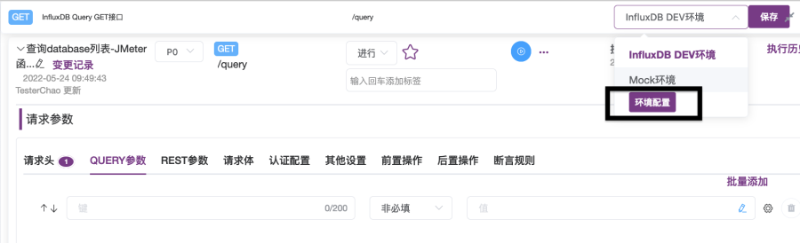
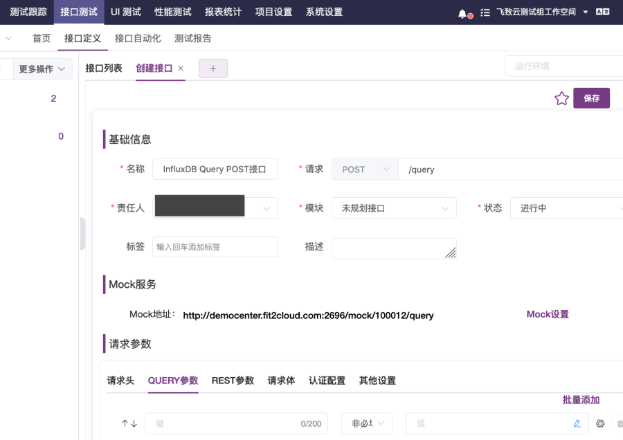
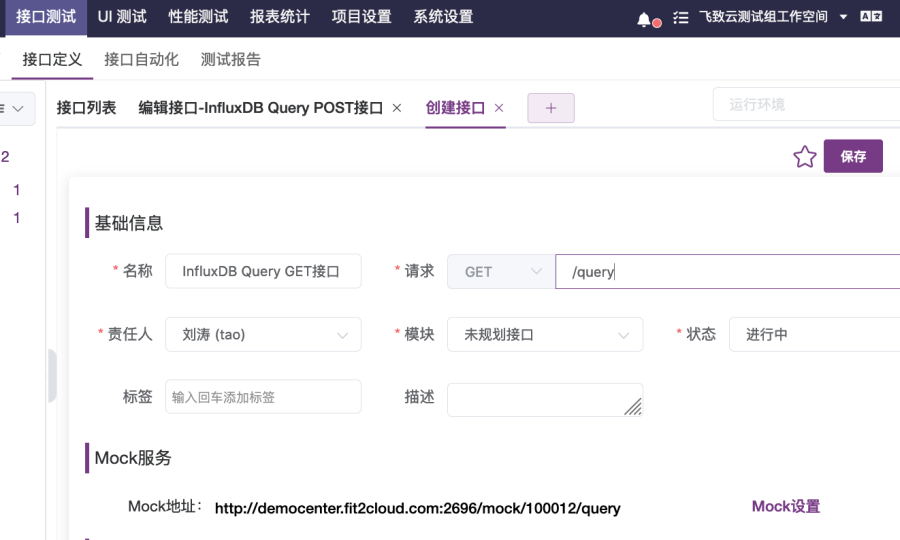
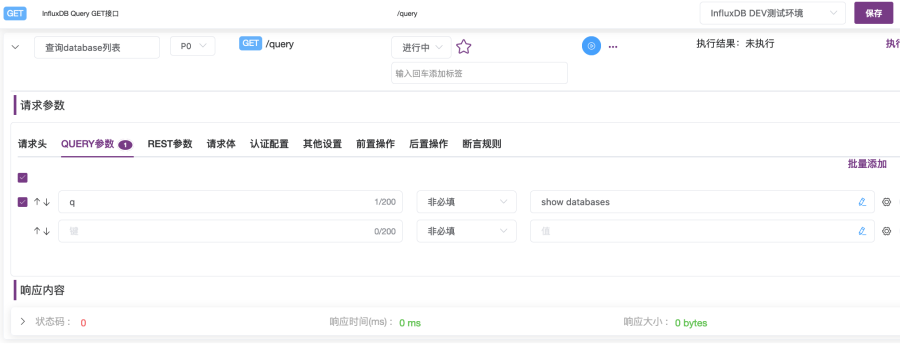

在MeterSphere接口测试中如何设置使用变量

## 1 设置使用变量

!!! info "在MeterSphere中有如下环境变量设置："
    1.可以在环境中设置环境变量，在接口用例请求参数的QUERY参数、REST参数、请求体、前置操作脚本、后置操作脚本中引用使用。在环境中设置的环境变量类型只支持常量类型，不支持列表、CSV、计数器、随机数类型；<br>
    2.可以在前置脚本中设置用例变量，在用例的请求体、后置操作脚本中引用使用；<br>
    3.可以在场景中设置场景变量，在场景下的接口用例、自定义请求的请求参数中引用使用。除常量类型之外，场景变量还支持列表、CSV、计数器、随机数类型。<br>

### 1.1 设置和使用环境变量

在MeterSphere中，可以设置“环境变量”，给使用指定同一测试环境参数测试的接口测试、场景自动化测试用例使用。
下表为在请求参数的QUERY参数、REST参数、请求体、前后置BeanShell脚本、前后置Python脚本中引用、设置变量的方法，以及调试时打印变量值且能够到控制台查看、转换变量类型的常用方法。
<table>
  <td bgcolor="#783887" align="middle" style="font-weight:bold;color: white">
   引用使用
  </td>
  <td bgcolor="#783887" align="middle" style="font-weight:bold;color: white">
   使用方法及实例(假设变量名为dbname)
  </td>
  <tbody>
    <tr>
        <td >在请求参数之QUERY参数中引用</td>
        <td >${dbname}</td>
    </tr>
    <tr>
        <td >在请求参数之REST参数中引用</td>
        <td >${dbname}</td>
    </tr>
    <tr>
        <td >在请求参数之请求体中引用</td>
        <td >${dbname}</td>
    </tr>
     <tr>
        <td >在请求参数之前后置BeanShell脚本中引用及常用方法 <br>
             BeanShell注意事项：<br>
               1.每行须以分号结尾；<br>
               2.注释行以“//”开始；<br>
               3.log.info打印变量和vars.put设置变量时，需要变量类型为字符串类型。<br>
        </td>
        <td >1.获取变量值方法1（直接引用方法）：
             dbname="${dbname}"; <br>
             2.获取变量值方法2（使用BeanShell内置变量获取）：<br>
             dbname2=vars.get("dbname"); <br>
             3.打印到控制台，输出并查看变量值（调试时常用）：<br>
             log.info("dbname="+dbname);<br>
             log.info("dbname2="+dbname2);<br>
             4.将字符串转换成数字类型：<br>
             iCount=Integer.valueOf(strCount);<br>
             5.将数字转成字符串（在设置变量时经常用到）：<br>
             strCount=String.valueOf(iCount);<br>
             vars.put("count", strCount);<br>
             6.将字符串转成数字：<br>
             iCount=Integer.valueOf(strCount);<br>
             7.JMeter函数赋值方法：<br>
             uuid="${__UUID}";<br>
        </td>
     </tr>
     <tr>
        <td >在请求参数之前后置Python脚本中引用及常用方法</td>
        <td >1.获取变量值：<br>
             dbname="${dbname}";<br>
             2.获取变量值：<br>
             dbname2=vars.get("dbname");<br>
             3.打印到控制台，输出并查看变量值（调试时用）：<br>
             log.info("dbname="+dbname);<br>
             log.info("dbname2="+dbname2);<br>
             4.将字符串转换成数字类型：<br>
             iCount=int(strCount);<br>
             注意，打印数字类型变量和设置变量时，需要先将其转换为字符串类型。<br>
             log.info("iCount="+str(iCount));<br>
             vars.put("count", str(iCount));<br>
             5.将数字转成成字符串（在设置变量时经常用到）：<br>
             strCount=str(iCount);<br>
             log.info("strCount="+strCount);<br>
             vars.put("count", strCount);<br>
             6.将字符串转成数字：<br>
             iCount=int(strCount);<br>
             7.JMeter函数赋值方法：<br>
             uuid="${__UUID}";<br>
             </td>
     </tr>
  </tbody>
</table>  

设置环境变量的页面操作步骤方法如下：

1.在“项目环境”页面中，如图1-1所示，可以选择“创建环境”，打开如图1-2所示的“创建环境”对话框，在对话框中的“通用配置”选项卡下配置环境变量。

2.也可选择要设置变量的环境，选择“编辑”按钮打开如图1-3所示的“配置环境”对话框，在对话框中的“通用配置”选项卡下配置环境变量。
{:height="100%" width="70%"} <br> 
<font size=2 class="png-lable-span">图1-1 项目环境管理页面</font><br>
{:height="100%" width="70%"} <br>
<font size=2  class="png-lable-span">图1-2 创建环境对话框</font><br>
{:height="100%" width="70%"} <br>
<font size=2  class="png-lable-span">图1-3 配置环境对话框</font><br>

3.也可以如图1-4所示，在接口用例页面中打开右上角“保存”按钮左侧的运行环境下拉列表，在列表中选择“环境配置”，打开“环境配置”对话框。如图1-5所示，在对话框中的“通用配置”选项卡中设置环境变量。<br>
{:height="100%" width="70%"} <br> 
<font size=2  class="png-lable-span">图1-4 接口用例页面</font><br>
{:height="100%" width="70%"} <br>
<font size=2  class="png-lable-span">图1-5 环境配置对话框</font><br>

### 1.2 设置使用用例变量
在前后置脚本中，可使用BeanShell内置变量vars的put方法设置变量，如图1-6所示。
```
vars.put("变量名", 变量值); 
//注意：变量值需为字符串类型
```
比如，要在调用InfluxDB write API写入监控数据前生成随机的cpu usage数据，可在前置脚本中生成随机数并设置到cpuUsage变量，之后调用接口时在请求体使用这个变量。
```
//BeanShell
cpuUsage=${__Random(1,99,usage)};
log.info("cpuUsage="+cpuUsage);
vars.put("usage", cpuUsage);
```
{:height="100%" width="70%"} <br>
<font size=2  class="png-lable-span">图1-6 前置脚本中设置变量</font><br>

### 1.3 设置使用场景变量
在接口自动化的场景中，可以在“场景变量”中设置变量，然后在场景中导入的接口用例、自定义请求中的QUERY参数、REST参数、请求体、前后置脚本中引用使用。如图1-7所示，在“创建场景”页面中，选择“场景变量”，打开“场景变量”对话框；如图1-8所示，在对话框中添加管理变量，可添加的有常量、列表、CSV、计数器、随机数变量。 <br>
{:height="100%" width="70%"} <br>
<font size=2  class="png-lable-span">图1-7 创建场景页面</font><br>
{:height="100%" width="70%"} <br>
<font size=2  class="png-lable-span">图1-8 场景变量对话框</font><br>

### 1.4 BeanShell内置变量
JMeter BeanShell内置变量的使用范围为前置操作脚本和后置操作脚本中。

常用的内置变量如下表。可使用vars获取变量值、设置变量，如图1-9所示。调试脚本时使用log打印、查看变量值。在后置脚本中，可以使用prev获取调用接口后返回的信息和响应码。
<table>
  <td bgcolor="#783887" align="middle" style="font-weight:bold;color: white">
   BeanShell内置变量
  </td>
  <td bgcolor="#783887" align="middle" style="font-weight:bold;color: white">
   内置变量方法
  </td>
  <tbody>
    <tr>
        <td >vars <br>
             操作JMeter变量</td>
        <td >获取变量值：<br>
             vars.get("变量名");<br>
             设置变量值需为字符串类型：<br>
             vars.put("变量名", 变量值);<br>
        </td>
    </tr>
    <tr>
        <td >prev <br>
             获取之前Sampler返回的信息 </td>
        <td >获取响应信息：<br>
             prev.getResponseDataAsString();<br>
             获取响应Code码：<br>
             prev.getResponseCode();</td>
    </tr>
    <tr>
        <td >log<br>
             写日志并发送到控制台</td>
        <td >log.info("日志内容");<br>
             log.info("变量名="+变量值);</td>
    </tr>
  </tbody>
</table>   

{:height="100%" width="70%"} <br>
<font size=2 class="png-lable-span">图1-9 前置操作脚本中使用BeanShell内置变量</font><br>

## 2 变量设置使用示例
接下来我们将在InfluxDB接口测试场景中演示变量的具体使用方法。

假设我们是InfluxDB测试团队，现在要对InfluxDB支持的一系列操作进行测试，包括创建database、查询database列表、写入主机监控点数据等。
   
如跟随本文的示例步骤实操，请先使用以下命令在CentOS7.x虚拟机上部署Influxdb，打开8086端口。
```
wget https://dl.influxdata.com/influxdb/releases/influxdb-1.8.0.x86_64.rpm

rpm -ivh influxdb-1.8.0.x86_64.rpm
#8086 端口：使用该端口与influxdb客户端进行数据交互。
firewall-cmd --zone=public --add-port=8086/tcp --permanent
firewall-cmd --reload
systemctl start influxdb
```

### 2.1 设置使用环境变量示例
接下来我们可以创建InfluxDB DEV测试环境，设置dbname环境变量，创建Influxdb database接口测试用例，演示设置环境变量，并在请求参数之QUERY参数、请求体、前后置BeanShell脚本中引用变量。

<font size=4> 2.1.1 设置环境变量 </font>
登录MeterSphere进入指定工作空间后，需要先创建一个InfluxDB测试环境，并在测试环境中设置dbname环境变量。后续需要在各个API接口测试用例中引用这个变量创建database，向其中写入监控数据，并从中获取监控数据。

操作步骤如下：<br>
1.在“项目设置”栏下选择“项目环境”一项，打开“项目环境”页面，如图2-1所示；

2.在“项目环境”页面中，选择“创建环境”按钮，打开“创建环境”对话框，如图2-2所示；

3.在“创建环境”对话框中：

① 输入环境名称“InfluxDB DEV测试环境”，

② 打开“通用配置”选项卡，在选项卡中，添加变量dbname，值设置为“monitoringdb”，

③ 打开“HTTP配置”选项卡，在选项卡中，如图2-3所示，在“环境域名”输入框中输入“10.1.13.12:8086”(10.1.13.12是InfluxDB服务器的IP地址和端口)；

4.最后，点击“确定”按钮完成“InfluxDB DEV测试环境”的创建，在如图2-4、2-5所示页面中，可看到新建的“InfluxDB DEV测试环境”。
{:height="100%" width="70%"} <br>
<font size=2 class="png-lable-span">图2-1 “项目环境”页面</font><br>
{:height="100%" width="70%"} <br>
<font size=2 class="png-lable-span">图2-2 “创建环境”对话框</font><br>
{:height="100%" width="70%"} <br>
<font size=2 class="png-lable-span">图2-3 “HTTP配置”选项卡</font><br>
{:height="100%" width="70%"} <br>
<font size=2 class="png-lable-span">图2-4 完成“HTTP配置”选项卡-添加环境域名</font><br>
{:height="100%" width="70%"} <br>
<font size=2 class="png-lable-span">图2-5 完成环境创建</font><br>

<font size=4>2.1.2 在请求体中引用环境变量 </font>
创建“InfluxDB DEV测试环境”成功之后，我们可以接着以创建“InfluxDB查询接口”及“InfluxDB查询数据库接口用例”为例演示在前后置脚本中设置变量的过程，并在之后要进行的引用步骤演示如何获取所需的使用变量。

操作步骤如下：

1.在顶部菜单栏中选择“接口测试”下的“接口定义”，打开“接口列表”页面，如图2-6所示；

2.在“接口列表”页面中，选择“+”下的“创建接口”选项，打开“创建接口”页面，如图2-7所示。在页面中输入接口名称“InfluxDB Query POST接口”，请求协议选择“POST”，请求路径在输入框输入“/query”，如图2-7所示。然后点击页面右上角的“保存”按钮，打开“编辑接口”页面，如图2-8所示；
{:height="100%" width="70%"} <br>
<font size=2 class="png-lable-span">图2-6 “接口列表”页面</font><br>
{:height="100%" width="70%"} <br>
<font size=2 class="png-lable-span">图2-7 “创建接口”页面</font><br>
{:height="100%" width="70%"} <br>
<font size=2 class="png-lable-span">图2-8 “编辑接口”页面</font><br>

3.在“编辑接口”页面中，选择“CASE”标签，打开“接口用例列表”页面，如图2-9所示。在“接口用例列表”页面中，选择“+添加”按钮，打开“创建用例”页面，如图2-10所示；
{:height="100%" width="70%"} <br>
<font size=2> &emsp; &emsp; &emsp;&emsp; &emsp; &emsp;&emsp; &emsp; &emsp; &emsp; 图2-9 “接口用例”页面</font><br>
{:height="100%" width="70%"} <br>
<font size=2> &emsp; &emsp; &emsp;&emsp; &emsp; &emsp;&emsp; &emsp; &emsp; &emsp; 图2-10 “创建接口用例”页面</font><br>

4.如图2-10所示，在“创建接口用例”页面中：

① 输入名称“创建database接口用例”，

② 在右上角运行环境下拉列表中，选择“InfluxDB DEV测试环境“，如图2-11所示，

③ 在”请求体“选项卡下，选择“x-www-form-urlencodeded”，第一个键输入框输入“q”，值输入框输入“create database ${dbname}”，使用${变量名}引用变量，如图2-12所示；

5.点击“保存”按钮，然后点击蓝色的“执行”按钮执行；
{:height="100%" width="70%"} <br>
<font size=2 class="png-lable-span">图2-11 选择环境</font><br>
{:height="100%" width="70%"} <br>
<font size=2 class="png-lable-span">图2-12 设置请求体-引用dbname变量</font><br>

6.执行后，在“接口用例”执行页面中，可在最下方“响应内容”部分看到“响应体”，若状态码为200，则说明执行成功，如图2-13所示。

设置要创建使用的database名字为“monitoringdb”。以上步骤已经演示了如何在环境中设置dbname变量，所以在“创建database接口用例”的请求体中，通过“create database ${dbname}”直接引用dbname变量。执行后，就可以成功在influxDB中创建名为“database monitoringdb”的接口用例。
{:height="100%" width="70%"} <br>
<font size=2 class="png-lable-span">图2-13 执行接口用例完毕</font><br>

使用以下curl命令调用influxDB query接口API来查看databases列表。可以看到输出内容中，“monitoringdb”已被成功创建，如图2-14所示。
```
#查看influxdb下database，monitoringdb是否创建成功
curl -G 'http://10.1.13.12:8086/query?pretty=true' --data-urlencode "q=show databases"
```
{:height="100%" width="70%"} <br>
<font size=2 class="png-lable-span">图2-14 curl命令调用influxdb API查询database列表</font><br>

<font size=4>2.1.3 在前后置脚本中引用环境变量、debug并打印查看变量值 </font>
完成“创建database接口用例”执行后，可以接着在“查看database列表接口用例”页面演示在前后置脚本中引用环境变量、打印到控制台并查看变量值的过程。由于调试脚本时经常需要打印、查看变量值，我们将会在“查看database列表接口用例”的实现过程中，在前置BeanShell脚本以及后置Python脚本中获取dbname变量的值，并打印到控制台。

操作步骤如下：<br>
1.如图2-15所示，创建接口“InfluxDB Query GET接口”，选择请求的协议为“GET”，请求路径输入“/query”，然后点击“保存”，打开“InfluxDB Query GET接口用例列表”页面，如图2-16所示；
{:height="100%" width="70%"} <br>
<font size=2 class="png-lable-span">图2-15 创建 “InfluxDB Query GET接口”</font><br>

2.在“InfluxDB Query GET接口用例列表”页面，点击“+添加”按钮，打开“接口用例”页面，如图2-17所示：<br>
① 在名称输入框中输入“查询database列表”，

② 在运行环境下拉列表选择“InfluxDB DEV测试环境”，

③ 在“请求参数”的“QUERY参数”选项卡中，设置第一个键值的键为“q”，值为“show databases”，

④ 点击右上角“保存”按钮，最后点击蓝色的“执行”按钮；

3.执行完毕后，在页面“响应内容”下的“响应体”选项卡中，可以看到接口用例执行后的接口返回响应内容。如图2-18所示，可以看到之前调用接口创建的“monitoringdb database”；<br>
{:height="100%" width="70%"} <br>
<font size=2 class="png-lable-span">图2-16 “InfluxDB Query GET接口用例列表”页面</font><br>
{:height="100%" width="70%"} <br>
<font size=2 class="png-lable-span">图2-17 “查询database列表接口用例”页面</font><br>
{:height="100%" width="70%"} <br>
<font size=2 class="png-lable-span">图2-18 “查询database列表接口用例”执行成功后的响应体</font><br>

4.在“查询database列表接口用例”页面中，在“请求参数”下的“前置操作”标签打开“前置操作”选项卡，在选项卡中点击“添加”按钮添加前置脚本，如图2-19所示；然后点击前置脚本，展开文本内容框，如图2-20、图2-21所示。

5.在前置脚本文本内容框中，选择脚本语言“BeanShell”，输入以下前置脚本内容，如图2-22所示。内容演示了两种获取dbname环境变量，以及设置hostname变量的方法。输入完成后，点击蓝色“执行”按钮执行用例，之后可在“响应内容”下的“控制台”中查看打印出来的变量值，如图2-23所示。
```
//前置脚本内容
//获取方法1，通过${变量名}方式：
dbname="${dbname}";
log.info("dbname="+dbname);
//获取方法2，通过内置变量vars.get("变量名")方法：
dbname2=vars.get("dbname");
log.info("dbname2="+dbname2);
```

{:height="100%" width="70%"} <br>
<font size=2 class="png-lable-span">图2-19 “查询database列表接口用例”前置操作选项卡</font><br>
{:height="100%" width="70%"} <br>
<font size=2 class="png-lable-span">图2-20 添加前置脚本完成</font><br>
{:height="100%" width="70%"} <br>
<font size=2 class="png-lable-span">图2-21 展开前置脚本文本框</font><br>
{:height="100%" width="70%"} <br>
<font size=2 class="png-lable-span">图2-22 设置前置脚本内容</font><br>
{:height="100%" width="70%"} <br>
<font size=2 class="png-lable-span">图2-23 响应内容-控制台输出</font><br>

### 2.2 设置使用用例变量示例
在前后置脚本中，可以使用BeanShell内置变量进行用例变量的设置使用。这里我们以InfluxDB写入接口测试场景为例演示，先实现一个写入接口用例，再在前置脚本中计算生成监控cpu usage，并设置到usage变量中，之后在请求体中引用使用。
主要操作步骤如下（创建接口、接口用例，执行接口用例请参考上文中的具体步骤方法）：<br>

1.创建InfluxDB写入接口，设置请求协议为POST、路径为/write；

2.创建InfluxDB写入接口用例“写入虚拟机某分钟CPU使用率监控数据”：

① 设置QUERY参数添加参数db，设置值为${dbname}，

② 设置BeanShell前置操作脚本为以下脚本内容，如图2-24所示，
```
//生成随机使用率并打印：
cpuUsage="${__Random(1,99,usage)}";
log.info("cpuUsage="+cpuUsage);
//设置CPU使用率变量usage的值为上面生成的使用率数值：
vars.put("usage",cpuUsage);
```

③ 设置请求体为以下内容，在value值处引用前置脚本中设置的usage变量的值；
```
cpu_usage,host=10.1.13.131,app=dataease value=${usage} ${__time()}000000
```

3.执行用例。查看控制台输出，如图2-25所示；查看请求体内容，如图2-26所示；<br>
{:height="100%" width="70%"} <br>
<font size=2 class="png-lable-span">图2-24 设置前置脚本-设置usage变量</font><br>
{:height="100%" width="70%"} <br>
<font size=2 class="png-lable-span">图2-25 控制台中打印cpuUsage值</font><br>
{:height="100%" width="70%"} <br>
<font size=2 class="png-lable-span">图2-26 响应内容-查看请求体中变量值</font><br>

### 2.3 设置使用场景变量示例
在自动化场景中可设置场景变量，并在导入场景的接口用例请求参数和自定义请求中使用。由于编排的多个任务中的需要，除了常量类型外，在场景变量中还支持列表、CSV、计数器、随机数类型的变量。
这里我们设计了一个场景来演示常量、计数器、随机数变量的使用，即实现向InfluxDB写入某台虚拟机1小时中的每分钟CPU使用率监控点数据。

■ 采用循环控制器，配置使用次数循环方式，设置60次一个循环。设置一个基准的时间点2022年5月25日0点0分，每次循环根据循环的次数加60秒；

■ 使用常量host定义虚拟机IP为10.1.13.131；

■ 使用常量startTime定义监控数据从2022年5月25日0点开始。使用date -d "2022-05-25 00:00:00" +%s 命令在Linux上执行，可获得时间戳数值1653408000；

■ 使用计数器变量counter获取每次循环的计数，并根据这个计数值，每多循环一次增加60秒（pointTime=1653408000 + counter * 60 ）；

■ 使用随机数变量，每次循环生成一个CPU使用率数值，取值范围为1到99之间。


操作步骤如下：<br>

1.创建场景“写入某虚拟机1小时每分钟CPU使用率监控”；

2.设置场景变量：

① 添加常量hostIP，设置值为10.1.13.131，如图2-27所示，
{:height="100%" width="70%"} <br>
<font size=2 class="png-lable-span">图2-27 添加变量hostIP</font><br>
② 添加常量startTime，设置值为1653148860；

③ 添加计数器变量counter，每次从0到59循环一次后加1，如图2-28所示；
{:height="100%" width="70%"} <br>
<font size=2 class="png-lable-span">图2-28 添加计数器变量counter</font><br>

④ 添加随机数变量cpuUsage，设置最小值为1、最大值为99，如图2-29所示；
{:height="100%" width="70%"} <br>
<font size=2 class="png-lable-span">图2-29 添加随机数变量cpuUsage</font><br>

3.添加循环控制器，选择“次数循环”，设置循环次数为60次，如图2-30所示；
{:height="100%" width="70%"} <br>
<font size=2 class="png-lable-span">图2-30 添加循环控制器</font><br>

4.导入之前已创建的接口用例“写入虚拟机某分钟CPU使用率监控数据”。接口用例导入时选择“复制”，导入后将它添加到循环控制器下，然后修改请求体，设置请求体内容为如图2-31所示内容。<br>

{:height="100%" width="70%"} <br>
<font size=2 class="png-lable-span">图2-31 设置请求体</font><br>

5.设置接口用例的前置脚本，脚本类型选择BeanShell，内容填写以下内容，如图2-32所示；
```
//获取变量startTime开始时间点值，2022年5月25日零点时间戳
strStartTime=vars.get("startTime");
//获取计数器变量counter的值，循环一次加1
strCount=vars.get("counter");
log.info("strCount="+strCount);
//获取随机数变量cpuUsage生成的CPU使用率随机数值
usage=vars.get("cpuUsage");
log.info("usage="+usage);
//计算生成循环对应分钟的时间戳
pointTime=Integer.valueOf(strStartTime) + Integer.valueOf(strCount)*60;
log.info("pointTime=" + String.valueOf(pointTime));
vars.put("pointTime", String.valueOf(pointTime));
```
{:height="100%" width="70%"} <br>
<font size=2 class="png-lable-span">图2-32 设置前置BeanShell脚本</font><br>

6.选择“InfluxDB DEV测试环境”运行环境，执行循环控制器，执行完毕后查看响应内容。在“响应内容”面板的“控制台”输出内容中可以看到，循环2计数器变量的值为2，随机数变量的值为99，计算出的pointTime为1653148980，使用date -d @1653148980 查看的时间为“Sun May 22 00:03:00 CST 2022”，如图2-33所示。在“请求内容”选项卡，可以看到请求内容中，场景变量${hostIP}、${cpuUsage}均被替换为场景变量的值和根据计数器变量值计算出的时间点值，如图2-34所示。<br>
{:height="100%" width="70%"} <br>
<font size=2 class="png-lable-span">图2-33 查看循环2控制台输出-场景变量值</font><br>
{:height="100%" width="70%"} <br>
<font size=2 class="png-lable-span">图2-34 查看循环2控制台输出-请求内容中场景变量值</font><br>

## 3 总结
本篇总结了在MeterSphere中使用各类变量的方式和方法，并通过InfluxDB的接口测试场景进行了详细的演示。大家可以通过保存并阅读、学习这篇文章，在实现接口测试用例和自动化测试场景时，查阅、复制粘贴，缩短试错和摸索的时间。希望本文能对大家有所帮助。