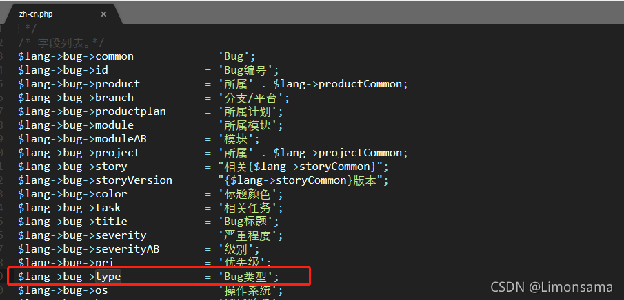

本文主要演示在已有禅道管理软件的情况下，如何在MeterSphere平台提交缺陷并推送至禅道。

## 1 MeterSphere与禅道对接
本文档所使用的Metersphere平台为v1.13.1版本（建议至少更新至v1.11.2版本，该版本及以后版本对接禅道的问题已基本解决）。

本文档所使用的禅道为开源版12.5.3版本。

### 1.1 禅道配置修改
对接禅道的本质就是调用禅道提供的接口，然后传入相应的参数。想要调用禅道的接口，需要先修改相关的配置文件。

在禅道安装路径中：${安装路径}/zentao/config/目录下创建一个my.php文件，然后在里面添加如下内容：
```
<?php
$config->features->apiGetModel    = true;
```
注意：如果有my.php，则直接在最下方添加"$config->features->apiGetModel = true;"即可。

### 1.2 开启禅道账号超级Model权限
访问禅道需要账号具有超级Model权限，可用管理员账号登录禅道，在权限中进行设置，如下图：


在权限维护中，开启超级Model调用接口权限，保存即可。<br>


### 1.3 在MeterSphere中配置禅道信息
在MeterSphere平台中，配置好禅道对接的信息，如下图：<br>


测试连接，显示验证通过即可完成连接的配置。

## 2 从MeterSphere中提交缺陷至禅道
上一个部分仅仅是让MeterSphere可以和禅道进行通信了，就像是在河中建好了一座桥，下面需要让车在上面跑了，也就是在MeterSphere中提交缺陷，自动推送至禅道对应的项目中去。

### 2.1 配置项目ID
在禅道项目准备好之后，会自动生成一个项目ID，比如下图：


然后将这个项目ID，关联到MeterSphere平台的项目中去，并保存，如下图：


### 2.2 配置缺陷模板
其实项目ID配置完毕后，就已经可以在MeterSphere的缺陷管理中提交Bug至禅道了。但是当我们尝试提交一个Bug并登录禅道后会发现，很多字段都没有填写，比如Bug类型、严重等级、测试阶段、浏览器和操作系统等等。

所以我们需要在MeterSphere中配置一个提交模板，声明禅道中需要用到的字段，这样提交过去的Bug就是完整的。配置模板如下：


模板中分为两大块，一个是标题和内容，另外就是需要填写的字段：


#### 2.2.1 配置模板标题与内容
推荐的内容设置如下：
```
[步骤]
<br/>
<br/>
<br/>

[结果]
<br/>
<br/>
<br/>

[期望]
<br/>
<br/>
<br/>

**请在自己的环境中完成自测（包括部署），自测结果请备注在BUG单中！**
```
补充：<br/>标签是换行符。MeterSphere平台目前还不支持回车换行，如果不加这个换行符，提交到禅道后，所有的文字信息都在一行，阅读体验不友好，所以暂时用这种方式进行换行。

#### 2.2.2 设置自定义字段
设置自定义字段就是在模板基础上增加一些填写的字段。当字段名且值与禅道保持一致时，提交后就会自动填充禅道中的字段值。下面举个字段的例子进行演示，比如我们需要添加一个Bug类型的字段，禅道中的字段是这样的：<br>


在MeterSphere平台中添加自定义字段：<br>


##### Q：禅道中的选项值在哪里看？
A：用管理员账号登入禅道，依次进入后台→自定义→Bug，如下图：


#### 2.2.3 模板中绑定自定义字段的API字段名
当我们自定义字段准备好后，就可以添加到模板中了。这里的关键在于配置API字段名，如下图：


##### Q：API字段名从哪里获取呢？
A：在禅道安装目录：zentao/module/bug/lang下，打开zh-cn.php查看。如下图：


可以看到上图中，Bug类型对应的字段是Type，所以在MeterSphere平台中配置Type即可。

最后可以根据你的需求，继续添加其他字段，保存最终模板即可。

### 2.3 设置提交人信息
上面的步骤都做完后，其实已经可以正常提交一个Bug至禅道了。但是在这个设置下，即使在MeterSphere平台上提交缺陷的是不同的账号，在禅道上Bug的创建人都是admin（也就是对接的时候配置的用户名），我们需要进一步地设置，来分辨该Bug是由谁提交的。在MeterSphere界面右上角设置个人信息，如下图：<br>


输入禅道账号密码，校验通过后保存。<br>


如果校验失败，可以尝试在禅道中开启该用户的超级Model权限，就可以通过了。

## 效果展示
在MeterSphere中新增一个缺陷并保存：<br>


保存后的界面如下：<br>


再来看看禅道的界面：<br>


