## 关于 Dubbo
[Dubbo](https://dubbo.io) 是阿里巴巴公司开源的一个优秀的 Java 高性能服务框架，使得应用可通过高性能的 RPC 实现服务的输出和输入功能，可以和 Spring 框架无缝集成，随着近几年微服务架构的兴起，因为其理念很契合微服务，在国内有着比较广泛的用户群体。

### Dubbo 架构


### 节点角色说明
- Provider：暴露服务的服务提供方
- Consumer：调用远程服务的服务消费方
- Registry：服务注册与发现的注册中心
- Monitor：统计服务的调用次数和调用时间的监控中心
- Container：服务运行容器

### 调用关系说明
1. 服务容器负责启动，加载，运行服务提供者。
2. 服务提供者在启动时，向注册中心注册自己提供的服务。
3. 服务消费者在启动时，向注册中心订阅自己所需的服务。
4. 注册中心返回服务提供者地址列表给消费者，如果有变更，注册中心将基于长连接推送变更数据给消费者。
5. 服务消费者，从提供者地址列表中，基于软负载均衡算法，选一台提供者进行调用，如果调用失败，再选另一台调用。
6. 服务消费者和提供者，在内存中累计调用次数和调用时间，定时每分钟发送一次统计数据到监控中心。

## 部署 Dubbo 服务
要针对 Dubbo 接口进行测试，首先我们需要有一套基于 Dubbo 框架的应用系统。这里我准备了一个使用了 Dubbo 框架的 SpringBoot Demo 应用来进行说明，项目地址：https://github.com/metersphere/dubbo-docker（在此感谢下 [原项目](https://github.com/binblee/dubbo-docker) 作者 [binblee](https://github.com/binblee) 提供的项目）。如果大家自己已经有了现成的基于 Dubbo 框架的应用，可以忽略掉这一部分。

应用整体比较简单，只提供了如下的一个接口两个方法。
```java
package com.example.service.producer;
 
import com.example.service.Greetings;
import com.example.service.User;
 
/**
 * Created by libin on 9/19/16.
 */
public class GreetingsImpl implements Greetings {
    public String say(String name) {
        return "Greetings from " + name;
    }
 
    public String hello(User user) {
        return "Name: "+user.name+", Age: "+user.age+", Gender: "+user.gender;
    }
}
```
项目的启动方式在 GitHub 上的 README 中已经有说明了，在此就不再赘述。当我们将项目运行起来以后，通过 HTTP GET 方法请求下 consumer 的 / 路径，可以看到 consumer 给我们返回了如下信息，说明 provider 是可以正常提供服务的。
```bash
[~/Documents/workspace/dubbo-docker/docker]# curl http://localhost:8899
Greetings from Dubbo Docker
```
## 常见的 Dubbo 接口测试方法
像 Dubbo 这样的 RPC 框架，其提供的接口更多是一个应用系统之间各个组件/服务内部通信使用的，不像基于 HTTP 的接口那样，其实可选择的测试工具不是特别多。
根据我自己的经验，一般有如下几种方式来进行 Dubbo 接口的测试，如果大家有其他更好的方式和工具，欢迎联系作者进行补充。

- 自己写 Java 或 Python 等代码注册成一个 consumer 调用服务进行测试。
- 像上面例子里的 consumer 一样，由开发团队把需要测试的接口再包装成 HTTP 接口，通过测试 HTTP 接口测手段进行测试。
- 在测试环境中通过官方提供的 telnet 命令，直接 invoke 特定服务进行测试。


```bash
[~/Documents/workspace/dubbo-docker]# telnet localhost 20880
Trying ::1...
Connected to localhost.
Escape character is '^]'.
 
dubbo>ls
com.example.service.Greetings
dubbo>ls com.example.service.Greetings
say
hello
dubbo>invoke com.example.service.Greetings.say("Tom")
"Greetings from Tom"
elapsed: 0 ms.
dubbo>
```

- 使用 JMeter 配合 Dubbo Sampler 插件进行测试。
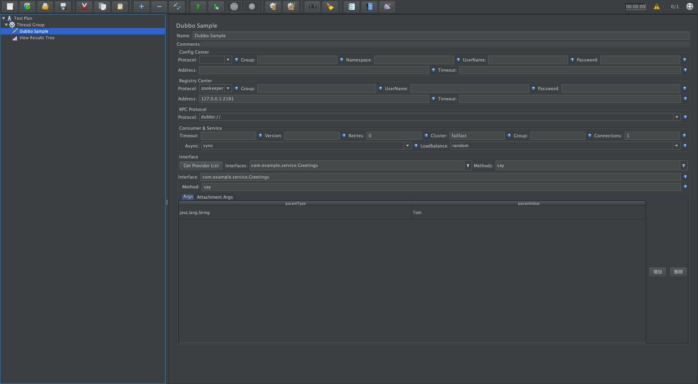


## 使用 MeterSphere 持续测试平台进行 Dubbo 接口测试
除了上面提到的方法以外，我们还可以使用 MeterSphere 这样的完全兼容 JMeter 的测试平台来进行 Dubbo 接口测试。关于 MeterSphere 的详细介绍及部署使用方式，可以参考下面提供的链接。在这篇文章中，我们只聚焦于使用 MeterSphere 进行 Dubbo 接口测试进行介绍。

- [MeterSphere 项目官网](https://metersphere.io)
- [MeterSphere 代码仓库](https://github.com/metersphere)
- [MeterSphere 跟 JMeter 的比较](https://metersphere.io/jmeter-load-testing.html)

### 准备工作
- 已经部署了 MeterSphere 的环境，并且有具有执行接口测试权限的账号。
- 准备 Dubbo 接口相关信息，包括注册中心连接信息、接口定义等。
- 如果使用了本文中提到的 Duboo Demo 项目，由于服务注册时的 IP 地址是 producer 容器的 IP，可能会出现调用不通的情况。这里我们通过 zk 命令手动地把这个 Demo 环境的 provider 信息改一下，把原来 provider 中的容器 IP 改为部署该 Demo 应用的主机 IP。

```bash
[~/Documents/workspace/dubbo-docker/docker]# zkcli -s 192.168.2.170:2181
2020/08/06 18:55:25 Connected to 192.168.2.170:2181
>>> ls /dubbo/com.example.service.Greetings/providers
[dubbo%3A%2F%2F172.19.0.2%3A20880%2Fcom.example.service.Greetings%3Fanyhost%3Dtrue%26application%3Dproducer-app%26dubbo%3D2.5.3%26interface%3Dcom.example.service.Greetings%26methods%3Dsay%2Chello%26pid%3D1%26revision%3D1.0-SNAPSHOT%26side%3Dprovider%26timestamp%3D1596709972791]
>>> delete /dubbo/com.example.service.Greetings/providers/dubbo%3A%2F%2F172.19.0.2%3A20880%2Fcom.example.service.Greetings%3Fanyhost%3Dtrue%26application%3Dproducer-app%26dubbo%3D2.5.3%26interface%3Dcom.example.service.Greetings%26methods%3Dsay%2Chello%26pid%3D1%26revision%3D1.0-SNAPSHOT%26side%3Dprovider%26timestamp%3D1596709972791
Deleted /dubbo/com.example.service.Greetings/providers/dubbo%3A%2F%2F172.19.0.2%3A20880%2Fcom.example.service.Greetings%3Fanyhost%3Dtrue%26application%3Dproducer-app%26dubbo%3D2.5.3%26interface%3Dcom.example.service.Greetings%26methods%3Dsay%2Chello%26pid%3D1%26revision%3D1.0-SNAPSHOT%26side%3Dprovider%26timestamp%3D1596709972791
>>> create /dubbo/com.example.service.Greetings/providers/dubbo%3A%2F%2F192.168.2.170%3A20880%2Fcom.example.service.Greetings%3Fanyhost%3Dtrue%26application%3Dproducer-app%26dubbo%3D2.5.3%26interface%3Dcom.example.service.Greetings%26methods%3Dsay%2Chello%26pid%3D1%26revision%3D1.0-SNAPSHOT%26side%3Dprovider%26timestamp%3D1596709972791 ""
Created /dubbo/com.example.service.Greetings/providers/dubbo%3A%2F%2F192.168.2.170%3A20880%2Fcom.example.service.Greetings%3Fanyhost%3Dtrue%26application%3Dproducer-app%26dubbo%3D2.5.3%26interface%3Dcom.example.service.Greetings%26methods%3Dsay%2Chello%26pid%3D1%26revision%3D1.0-SNAPSHOT%26side%3Dprovider%26timestamp%3D1596709972791
>>>
```


### 创建项目
登录 MeterSphere 平台后，点击在上方菜单「系统设置」中的「工作空间」-「项目管理」，在项目列表中点击「创建项目」。
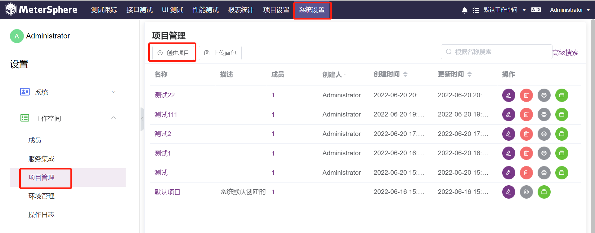

### 创建接口测试
点击界面上方的「接口测试」下的「接口定义」，选择项目后切换到「DUBBO」协议，创建 DUBBO 接口测试集。
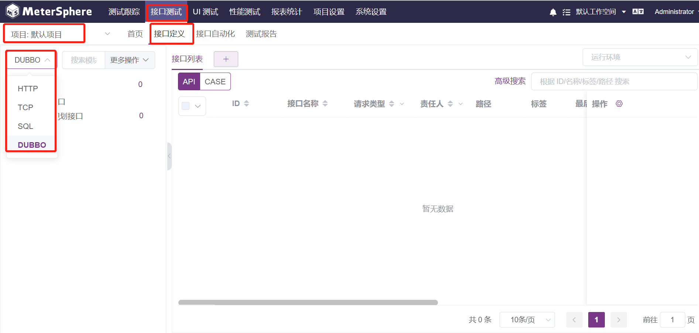

在创建接口页面填入接口测试名称，模块，状态，责任人，描述等等相关信息
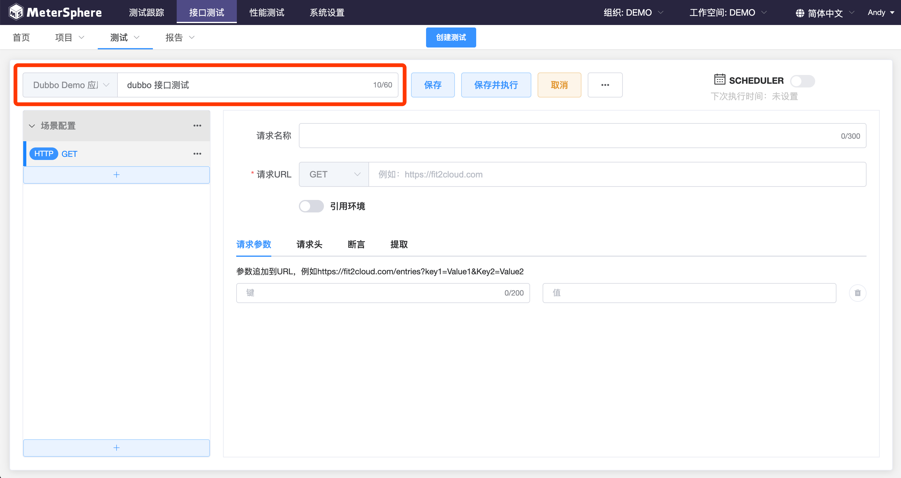

### 配置信息

在该页面中把准备的注册中心连接信息，接口版本等信息填好。
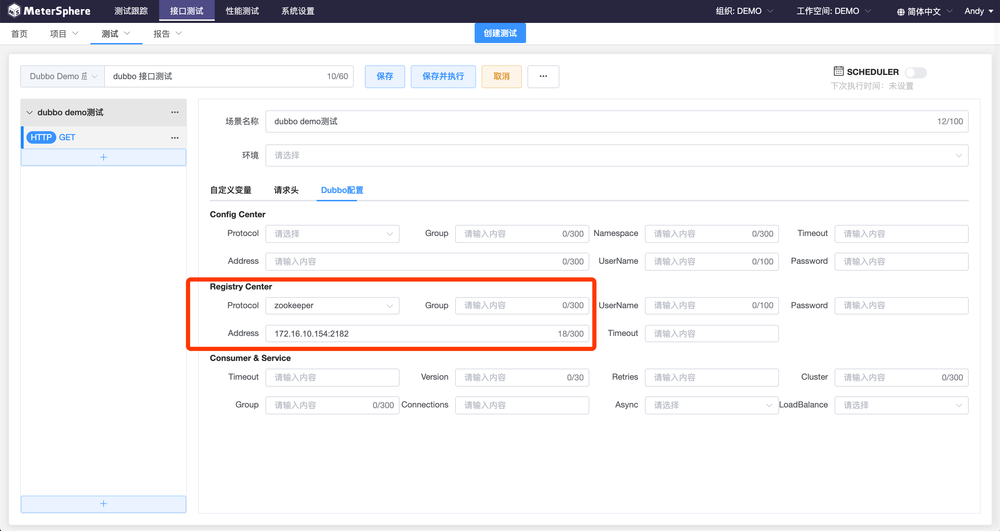

点击「Get Providers List」从注册中心中获取服务列表，从下拉列表中选择需要测试的接口及方法，根据该方法的定义，传入所需的参数。
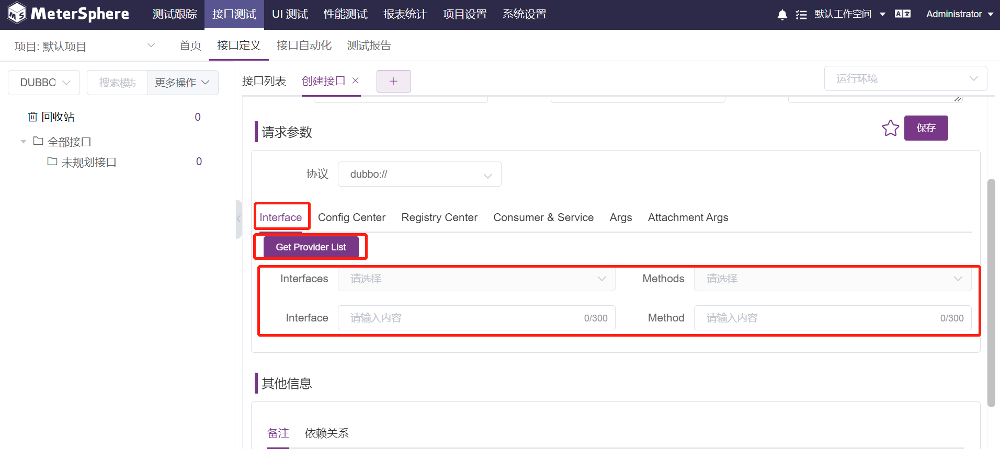

上面添加的接口只有一个 String 类型的参数，再次添加一个参数类型为自定义类的请求。这里我们查看一下代码中这个接口的定义，发现其需要一个 User 类的对象作为参数。
```java
package com.example.service;
 
/**
 * Created by libin on 9/19/16.
 */
public interface Greetings {
    String say(String name);
    String hello(User user);
}
```
同时结合 User 类的定义
```java
package com.example.service;
 
enum Gender {
    MALE, FEMALE;
}
 
public class User {
    public String name;
    public Integer age;
    public Gender gender;
}
```
我们可以通过这样的形式传入参数值 {"name":"姓名", "age":年龄, "gender": "MALE 或 FEMALE"}。
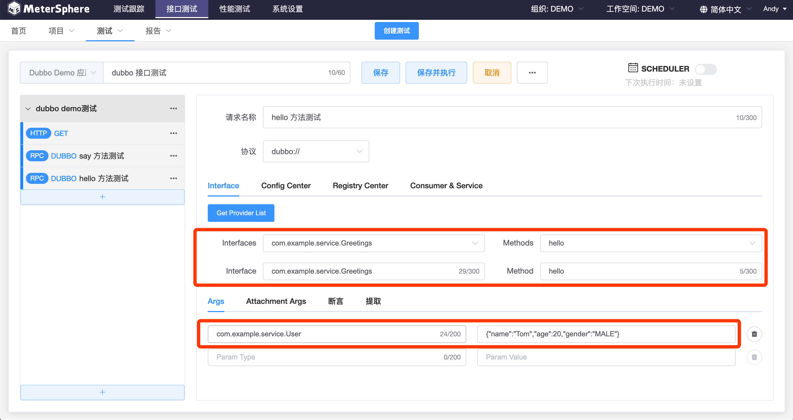

当接口请求都添加完成后，然后就可以点击「保存」按钮，切换到「TEST」页面，点击「测试」，即可运行该 Dubbo 接口了。
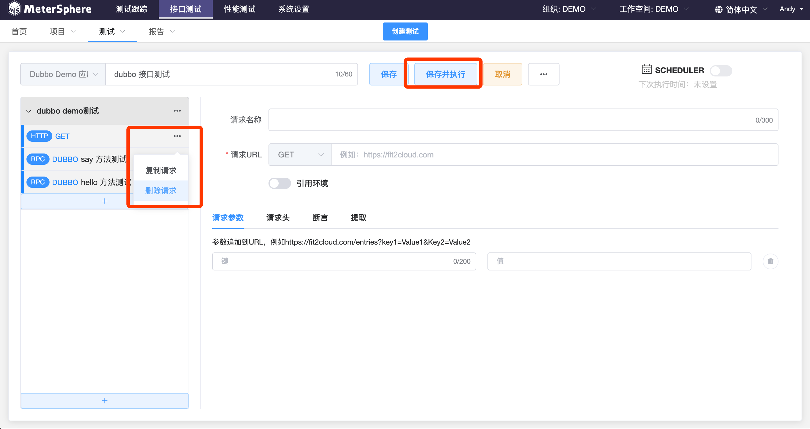

测试执行完成后，即可在页面上查看到测试执行的结果报告。<br>
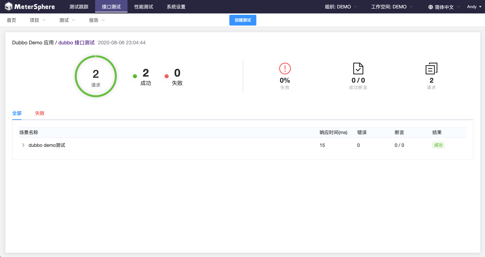


### 转化为接口自动化场景
切换到「接口自动化」页面，创建场景时，填写左边基础信息以及点击右边「接口列表导入」


将创建的 dubbo 接口导入后点击「保存」，选择「运行环境」，点击「调试」


调试完成后，点击「生成报告」或者切换到「测试报告」页面，可查看到请求的详细内容及响应内容。<br>
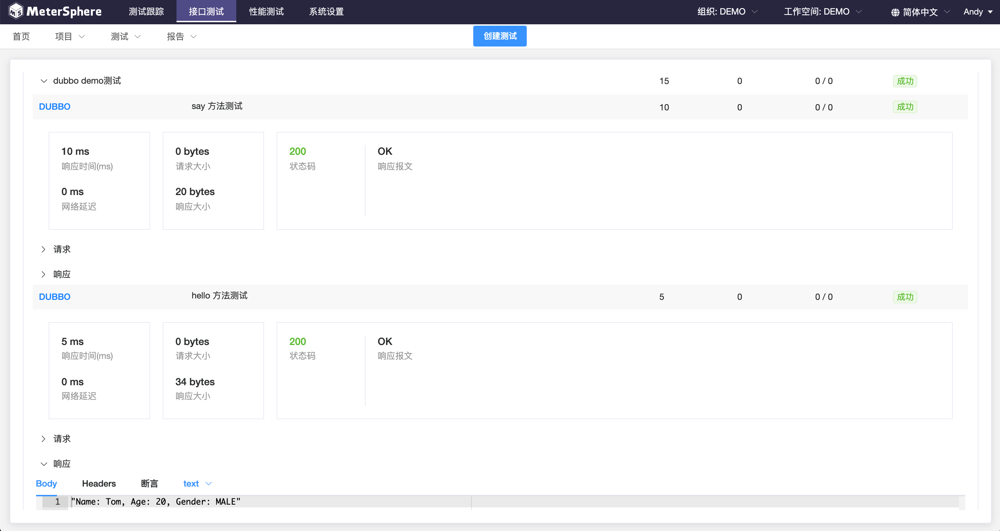

### 转化为性能测试
接口自动化测试执行通过后，我们还可以通过 MeterSphere 提供的接口测试转性能测试的功能，直接发起针对 Dubbo 接口的性能测试。

在「性能测试」页面的「场景配置」点击下「引用接口自动化场景」，选择我们刚创建的接口自动化场景。
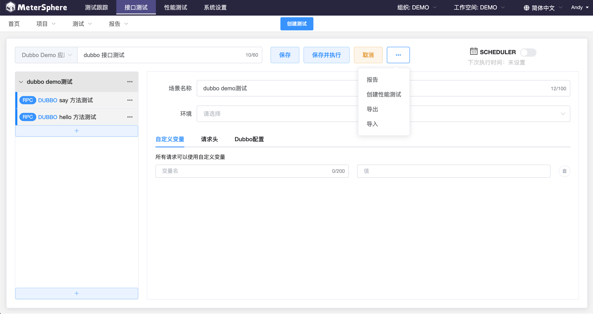

切换到「压力配置」页面，根据需求配置压力参数后，点击「保存并执行」按钮即可发起性能测试。
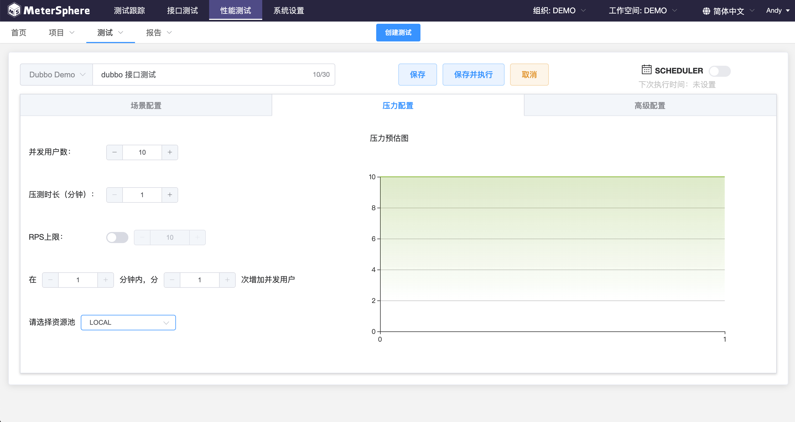

