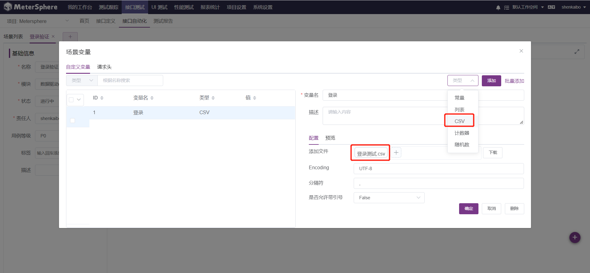

## 1 什么是数据驱动
相同的测试脚本使用不同的测试数据来执行，测试数据和测试行为完全分离，这样的测试脚本设计模式称为数据驱动。

## 2 整体流程如下图

## 3 测试数据准备

## 4 数据驱动测试
### 4.1 切换到接口测试-接口自动化菜单下，选择一个模块，点击创建场景

### 4.2 点击场景变量，上传 CSV 文件

### 4.3 点击场景页面右下角 “+” 号，导入登录接口用例和循环控制器

### 4.4 设置请求参数

### 4.5 设置断言规则，判断预期结果和实际结果

### 4.6 选择环境，点击执行，生成测试报告
