接口自动化功能中的基本管理单元是场景。场景是由一组用例和接口组装而成，类似用户管理场景，包含用户注册、用户登陆、用户修改、用户注销、用户销户等用例或者接口。场景支持定时、API调用、Jenkins调用等自动化执行。场景支持拖拽的方式进行编排和设计，可添加的步骤包括各种协议的请求、断言、自定义脚本、逻辑控制器等。

## 模块树管理
每个接口都需要属于一个特定的模块，在创建场景前需要先规划并创建模块树。

!!! info "说明"
    接口自动化与接口定义中的模块树相互独立，接口定义中创建的模块不会出现在接口自动化的模块树中。

### 创建一级模块
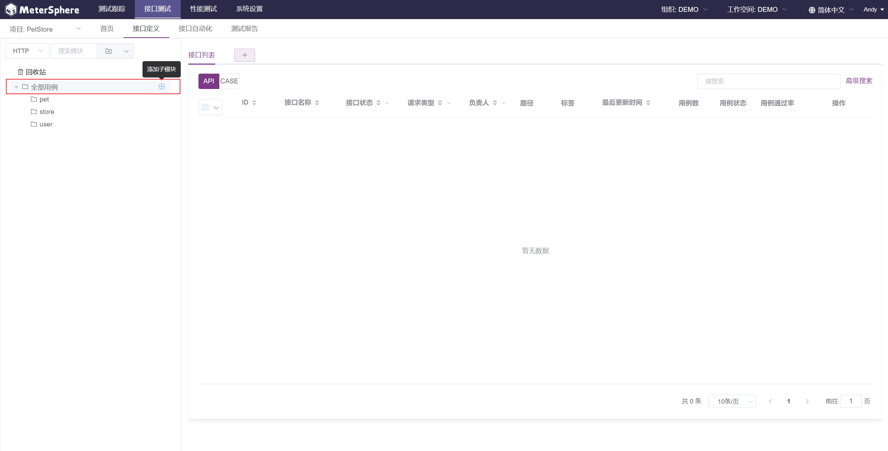

!!! info "说明"
    模块树支持最多 8 层的树状结构。

### 模块操作
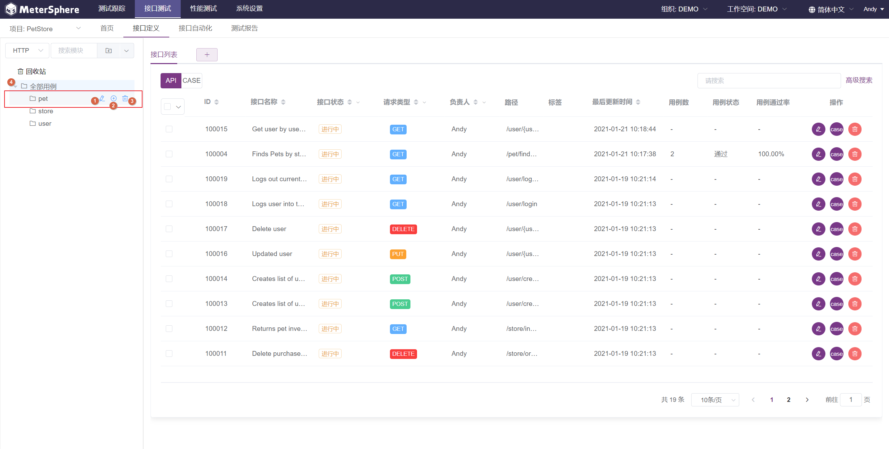

!!! info "操作说明"
    1. `重命名` 按钮，鼠标悬停在要操作的模块时出现，点击可以重命名该模块。
    2. `添加子模块` 按钮，鼠标悬停在要操作的模块时出现，点击可以在该模块下添加子模块。
    3. `删除` 按钮，鼠标悬停在要操作的模块时出现，点击将删除该模块和其所有子模块。
    4. `展开/收起` 操作，当模块下存在子模块时出现，点击将展开/收起该模块下的所有子模块。

!!! error "注意"
    删除某个模块不仅会删除该模块及其所有子模块，被删除模块中的接口自动化场景也将被移入回收站中，请谨慎使用该功能。

模块树还支持鼠标拖拽操作，用户可以根据需求调整模块顺序及其层级关系。
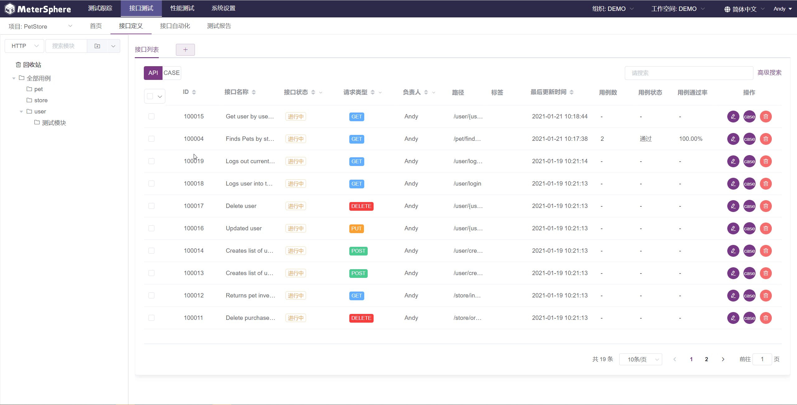

## 场景管理

### 快速创建场景
在模块树中选择模块，点击模块树上方搜索框右侧的 `创建场景` 按钮 可以仅填写接口基本信息，在该模块下快速创建接口。
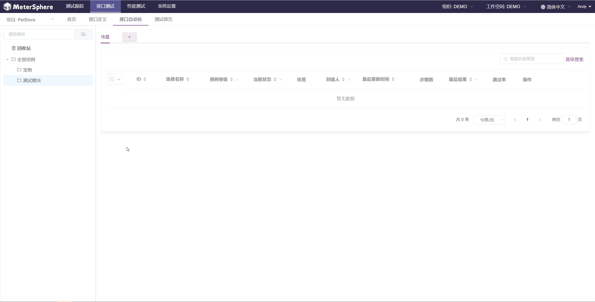

### 编辑接口详情
在接口列表中点击指定接口操作列中的 `编辑` 按钮，进入接口详情编辑页面。在该页面中可以对接口的基础信息、请求及响应定义进行进一步编辑。
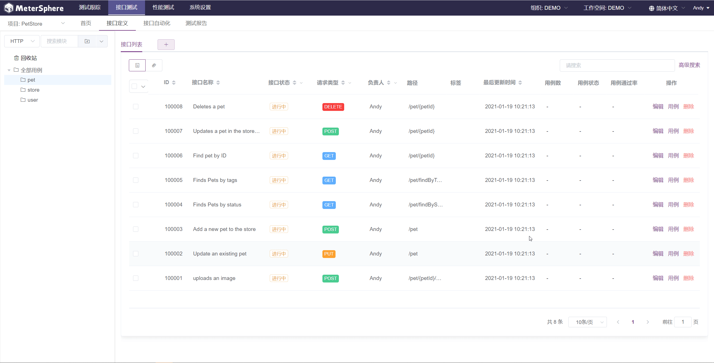

!!! info "说明"
    不同协议的接口详情说明请参考 [TBD](TBD)。

### 针对单个接口发起测试
在接口列表中点击指定接口操作列中的 `编辑` 按钮，进入接口详情编辑页面。点击页面右上方的 `测试` 按钮，进入单个接口测试页面。

在该页面中系统将自动加载接口定义中已定义的 URL、参数等信息，选择接口执行环境，并根据接口定义填入实际参数值后，点击 `测试` 按钮。
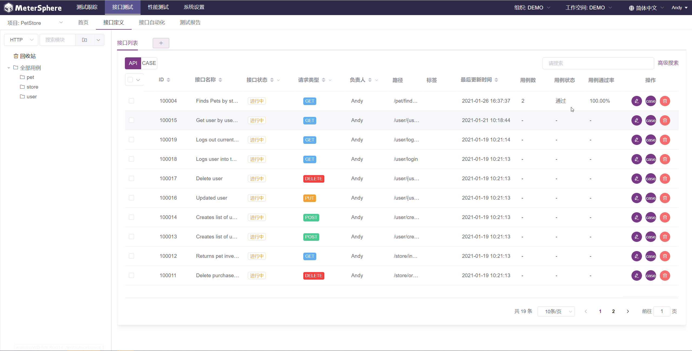

同时在测试过程中也可以点击右侧按钮，添加前后置脚本、断言及变量提取等子步骤。

!!! info "说明"
    前后置脚本、断言及变量提取等子步骤的详情说明请参考 [TBD](TBD)。

除此之外，在单个接口的测试页面还提供了各种快捷操作。
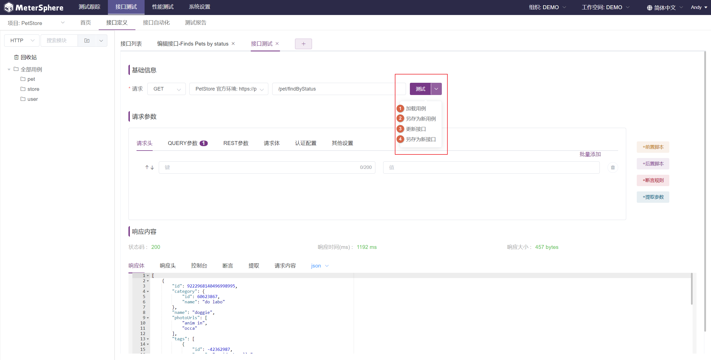

!!! info "操作说明"
    1. `加载用例`：选择并加载该接口下的一个已有用例。
    2. `另存为新用例`：使用当前页面填写的参数及添加的子步骤在该接口下创建一个新用例。
    3. `更新接口`：使用当前页面填写的参数更新该接口的接口定义。
    4. `另存为新接口`：使用当前页面填写的参数创建一个新的接口。

### 将接口移入回收站
在接口列表中点击指定接口操作列中的 `删除` 按钮，接口及接口下的用例将被移入回收站，同时接口变为 `废弃` 状态。用户可以点击左侧模块树中的 `回收站` 查看已废弃的接口。

### 恢复接口
点击左侧模块树中的 `回收站`，选择要恢复的接口点击操作列中的 `恢复` 按钮。
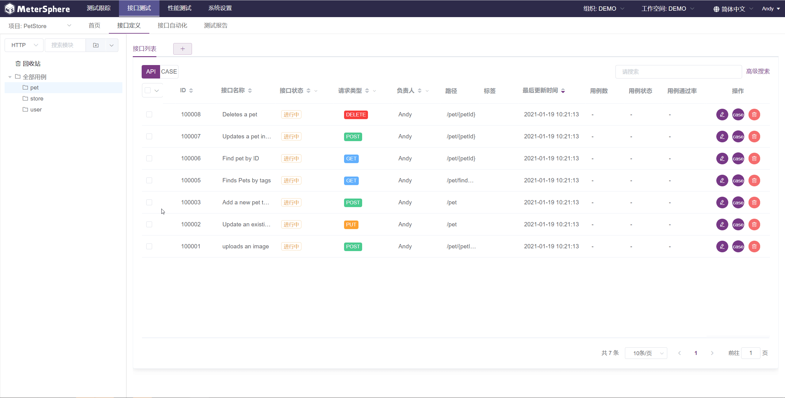

### 彻底删除接口
点击左侧模块树中的 `回收站`，选择要彻底删除的接口点击操作列中的 `删除` 按钮。
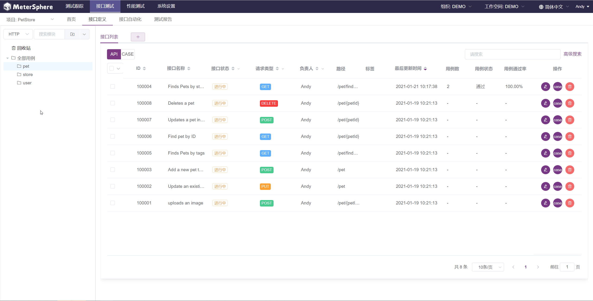

!!! error "注意"
    从回收站中删除某个接口时，该接口及接口下的用例将从数据库中删除且无法恢复，请谨慎使用该功能。

## 接口用例管理

### 查看指定接口下的用例
在接口列表中点击指定接口操作列中的 `用例列表` 按钮，弹出该接口下的用例列表页面。
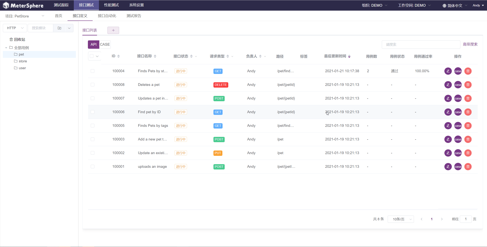

### 查看指定模块下的用例
点击接口列表上方且列表切换按钮中的 `用例列表` 按钮，将当前列表切换为接口用例列表。
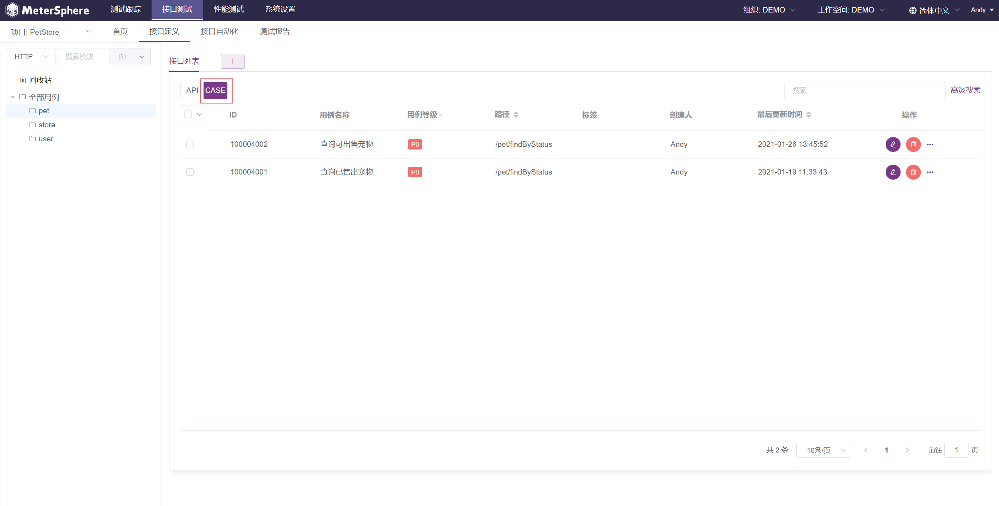

### 新建接口用例
在单个接口用例列表中点击 `添加用例` 按钮，输入用例的名称、标签及参数详情后，点击保存按钮完成用例创建。

同时接口用例中也可以点击右侧按钮，添加前后置脚本、断言及变量提取等子步骤。
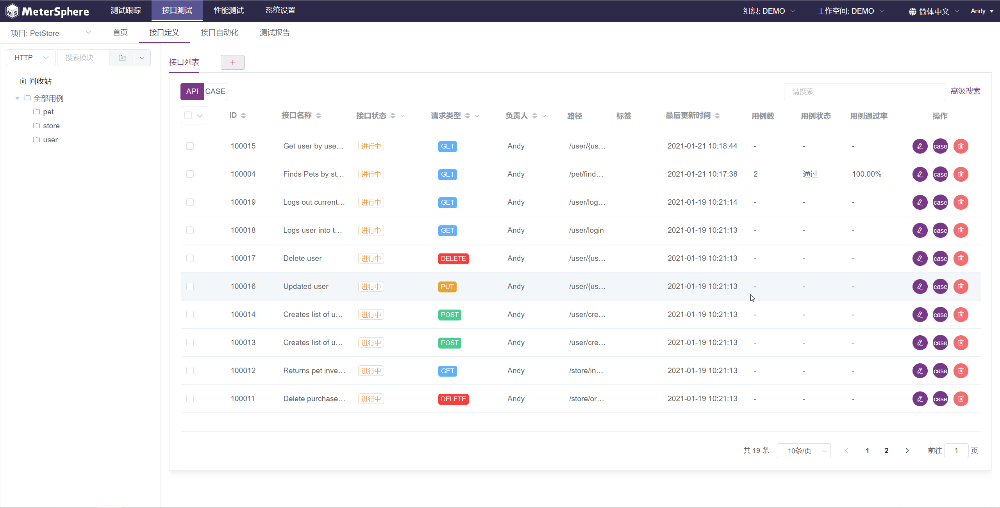

!!! info "说明"
    前后置脚本、断言及变量提取等子步骤的详情说明请参考 [TBD](TBD)。

### 执行接口用例
接口用例创建完成后，选择用例执行环境并点击 `执行` 按钮，用例执行完成后可点击查看 `执行结果`。
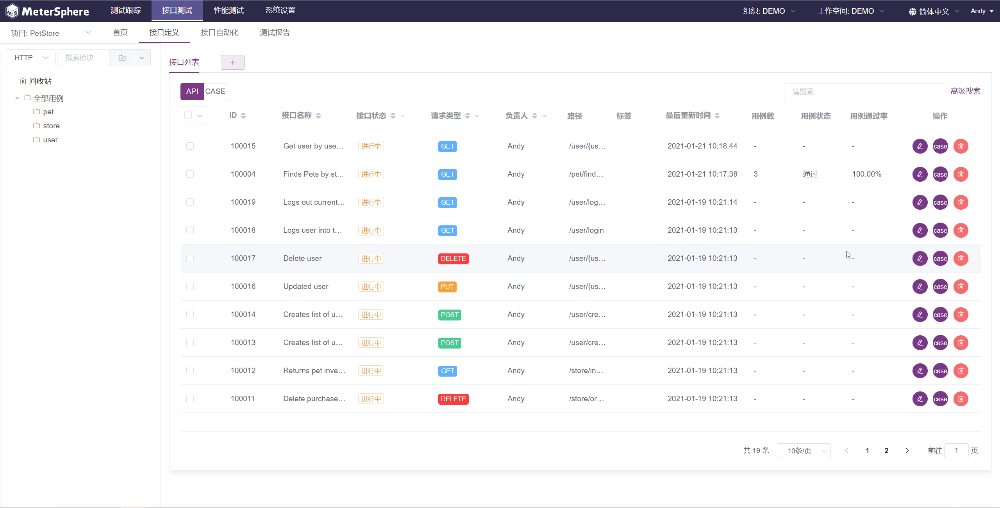

### 批量执行接口用例
在单个接口用例列表中选择用例执行环境，选中多个接口后点击批量操作按钮中的 `批量执行`，所有用例执行完成后可点击指定用例查看 `执行结果`。
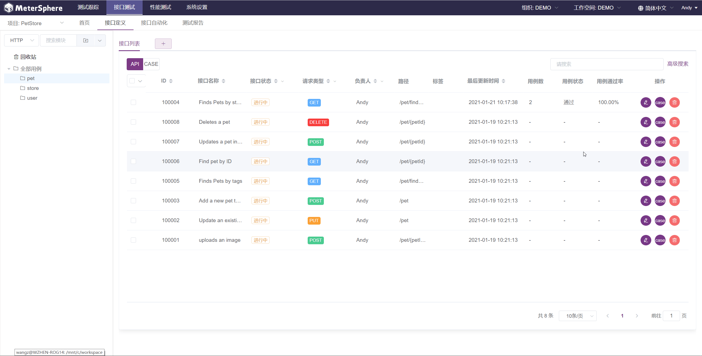

### 删除接口用例
在单个接口用例列表中点击 `删除` 按钮，弹出的确认对话框中再次点击确定后即可删除该用例。
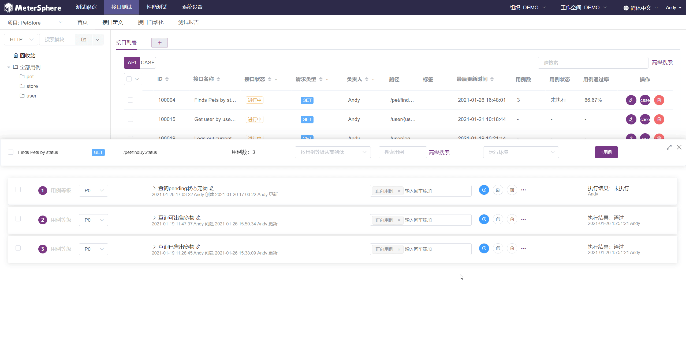

!!! error "注意"
    删除某个接口用例时，该接口用例将从数据库中删除且无法恢复，请谨慎使用该功能。