## 1 场景创建
!!! ms-abstract ""
    点击【序号1】或者【序号2】创建场景。
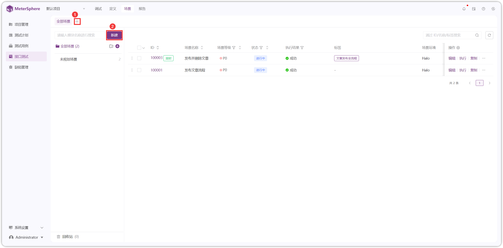{ width="900px" }

### 1.1 步骤
!!! ms-abstract ""
    点击【添加步骤】添加接口或测试组件。详情参考：[场景步骤](./api_automation.md#2)
{ width="900px" }

!!! ms-abstract "说明"
    - 【导入系统请求】可以复制/引用已创建的接口、用例、场景。
    - 【自定义请求】可选择引用环境或不引用环境创建自定义请求。
    - 【循环控制器】包括次数循环、while 循环、forEach 循环，需要将请求拖拽进循环控制器里才能循环。
    - 【条件控制器】请求需要拖拽进条件控制器里，只有满足特定条件才能运行该请求。
    - 【仅一次控制器】请求需要拖拽进仅一次控制器里，确保所包含的测试步骤仅执行一次。
    - 【脚本操作】与前后置脚本使用方式类似，可以独立添加，不再需要依赖于请求作为其子步骤。
    - 【等待时间】不是对整个场景所有步骤都生效，只对添加等待时间后的某个请求生效。

### 1.2 参数 
!!! ms-abstract ""
    【参数】可设置场景中请求使用的常量、列表参数进行传参。
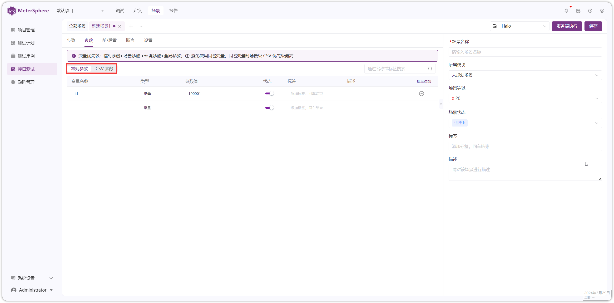{ width="900px" }

!!! ms-abstract "注意"
    尽量避免使用同名变量，使用同名变量时，按如下优先级取值。  
    **参数优先级**：临时参数 > 场景参数 > 环境参数。 
    **临时参数**: vars.put() 方式存储参数 和 后置操作提取的参数，一般采用就近原则使用参数。

### 1.3 前/后置
!!! ms-abstract ""
    场景前后置可以进行脚本操作和设置等待时间。详情参考：[前后置操作](../api_test/request_params.md/#6)
{ width="900px" }

### 1.4 断言
!!! ms-abstract ""
    场景有多种断言方式，如状态码、响应头、响应体、响应时间、脚本等。详情参考：[断言](../api_test/request_params.md/#8)
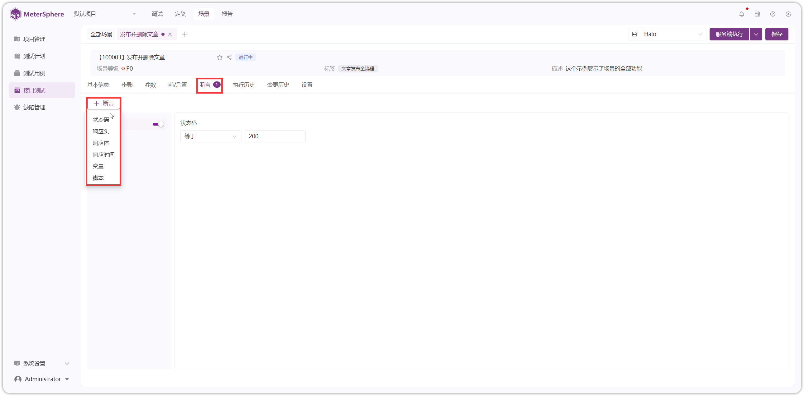{ width="900px" }

### 1.5 设置
!!! ms-abstract ""
    【设置】处可进行 Cookie 配置、等待时间配置、步骤执行规则配置。
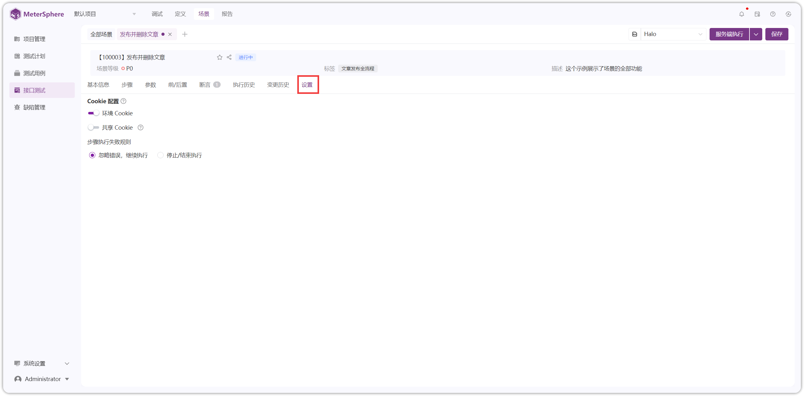{ width="900px" }

!!! ms-abstract "配置说明"

    - 【Cookie 配置】同时存在共享 cookie、全局 Cookie 与场景变量 Cookie 时，共享 Cookie 会覆盖全局 Cookie 与场景变量 Cookie。
        - **环境 Cookie**：默认使用环境 Cookie，启用环境 Cookie，场景步骤的请求头也设置 Cookie ，会使用两个 Cookie 的值。
        - **共享 Cookie**：从某个步骤提取返回的 Cookie 信息，则后续步骤都会使用此 Cookie ，如果请求里添加了 Cookie 变量也会被覆盖。
    - 【等待时间配置】运行场景时，场景的每一个步骤执行，都会等待相应的时间后，再触发下一个步骤开始执行。
    - 【步骤执行规则配置】有"忽略错误，继续运行"、"继续运行/结束运行"两种规则。

!!! ms-abstract ""
    场景创建完成，点击【保存】后，页面会多【执行历史】和【变更历史】标签页面。
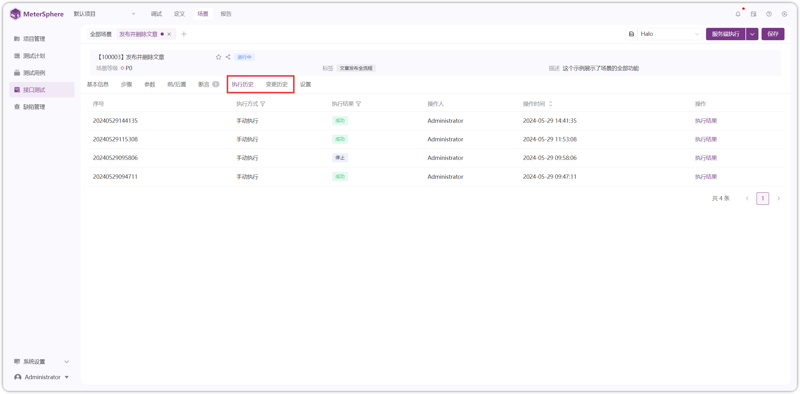{ width="900px" }

!!! ms-abstract "说明"

    - **执行历史**：默认保留全部执行历史记录，手动删除报告，不影响查看详情；系统清理报告后，则不能查看详情，显示“执行结果被清理”。
    - **变更历史**：变更历史默认保存最近的变更记录，场景每变更一次，产生一个变更记录，生成一个变更序号。

## 2 场景步骤
### 2.1 导入系统请求
!!! ms-abstract ""
    【导入系统请求】可对接口、用例、场景进行复制和引用。
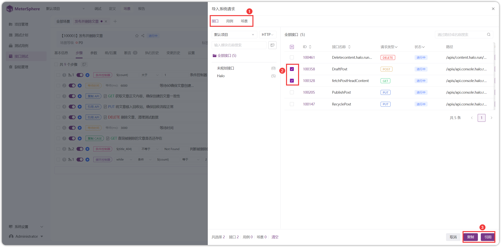{ width="900px" }

!!! ms-abstract "说明"

    - **复制**：修改复制步骤，源数据不发生变化，若源数据被删除，复制的步骤 ID 置灰，无法跳转。
    - **引用**：参数值可编辑，除参数值以外都跟随源数据变化而变化，引用的源数据被删除时，ID和步骤名置灰，操作仅支持“移除”。
        
!!! ms-abstract ""
    导入引用场景后，可配置场景引用模式、参数取值规则等内容。
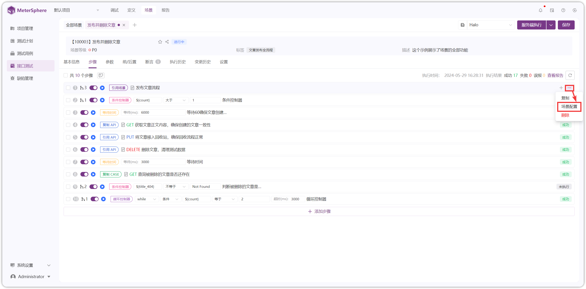{ width="900px" }

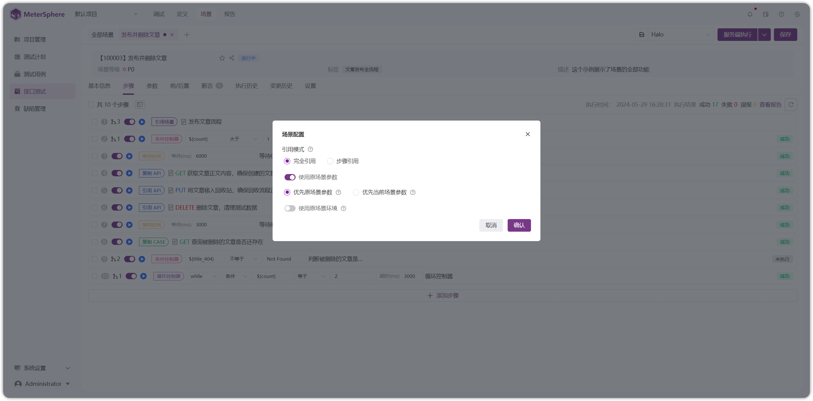{ width="900px" }

!!! ms-abstract "字段说明"

    - **引用模式**：引用步骤不可修改，跟随源数据变化而变化，引用的源数据被删除时，ID和步骤名置灰，操作仅支持“移除”。
         - **完全引用**：跟随源步骤内容及步骤状态变化，步骤状态不可调整。
         - **步骤引用**：仅跟随源步骤内容变化，步骤状态可调整。
    - **参数取值规则**：可设置优先使用当前场景参数或源场景参数，场景参数不存在时为空值还是源场景参数值。
    - **源场景环境**：设置该引用场景的运行环境，包含环境参数。

### 2.2 自定义请求
!!! ms-abstract ""
    【自定义请求】的创建使用与快捷调试请求类似。详情参考：[快捷调试请求](../debug#1)
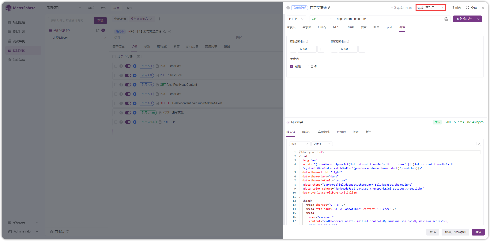{ width="900px" }

!!! ms-abstract "说明"

    - **引用环境**：请求地址自动填充 http 或 https 环境，只需输入接口地址。
    - **不引用环境**：请求地址需要输入包含 http 或 https 的完整的 URL。

### 2.3 循环控制器
!!! ms-abstract ""                                               
    【循环控制器】包括次数循环、while 循环、forEach 循环。详情参考：[循环控制器使用教程](https://kb.fit2cloud.com/?p=247)
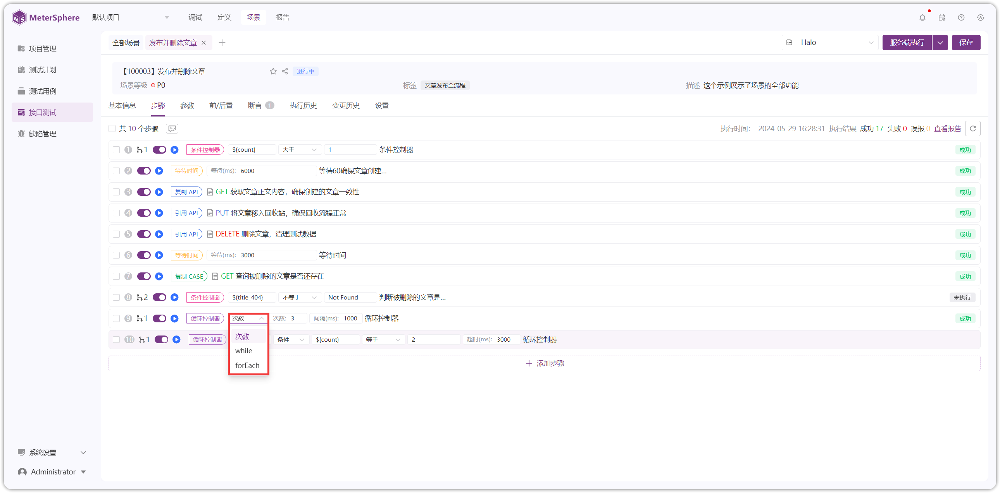{ width="900px" }

!!! ms-abstract ""
    【次数循环】，将请求拖拽到控制器里，设置循环次数、间隔时间等。
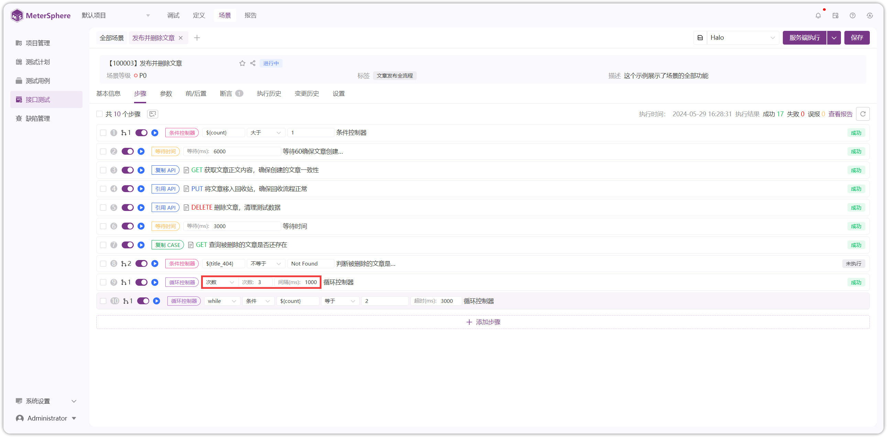{ width="900px" }

!!! ms-abstract ""
    【while 循环】，将请求拖拽到控制器里，设置表达式类型、循环条件、超时时间。
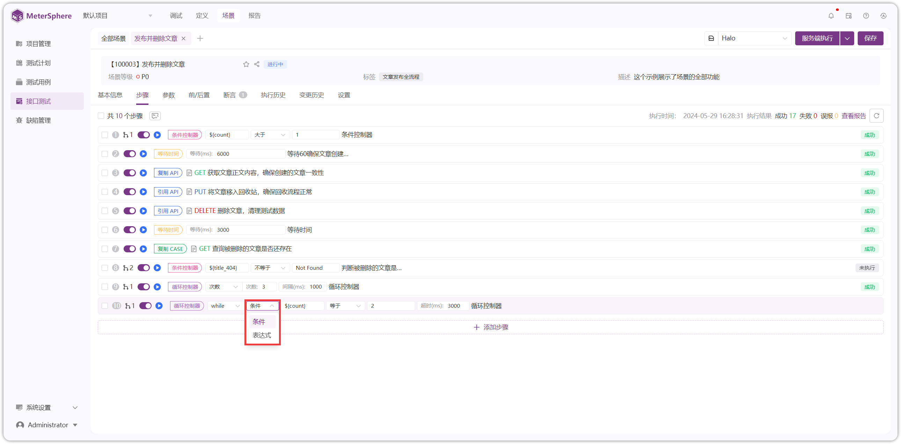{ width="900px" }

!!! ms-abstract "说明"

    - **表达式类型**：可分为【条件】和【表达式】两种类型。
        - **条件**： 匹配条件可以下拉选择。
        - **表达式**：数值表达式，如 1 == 1，1 !=  2，2 > 1 ；
                     字符串表达式，如 "abc".equals("abc")，"abc".contains("a")。
    - **超时时间**：由于 while 循环的特殊性，当条件满足时将会一直循环，为了避免死循环的情况出现，用户可以配置循环超时时间，到超过该时间后，不管循环条件是否满足，循环都将被终止。

!!! ms-abstract ""
    【forEach 循环】，将请求拖拽到控制器里，设置 forEach 遍历变量、时间间隔。
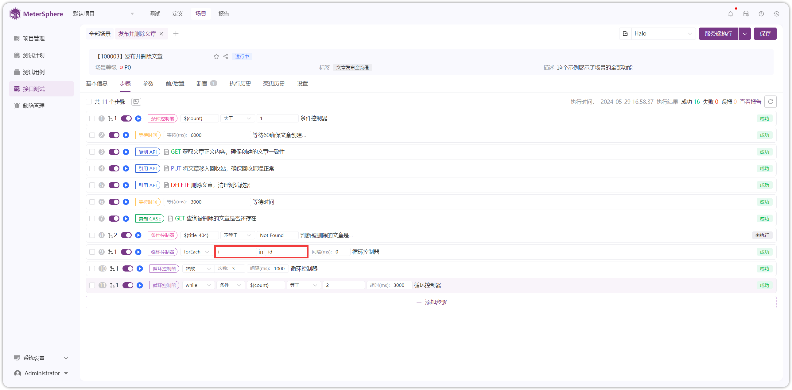{ width="900px" }

!!! ms-abstract "注意"
    - **存储形式**：forEach 循环一般配合列表变量或提取列表变量或自定义列表变量进行使用，存储形式为 ID_1，ID_2，ID_3 的一组变量，才能进入 forEach 循环。  
    - **遍历形式**：遍历列表变量时，不需要使用 ${ID} ，而是直接填写 ID。
    
### 2.4 条件控制器
!!! ms-abstract ""
    【条件控制器】设置条件后，只有满足设定的条件才会进入控制器里，执行里面的请求。
{ width="900px" }

### 2.5 仅一次控制器
!!! ms-abstract ""
    请求需要拖拽进【仅一次控制器】里，确保所包含的测试步骤仅执行一次。
{ width="900px" }

!!! ms-abstract "注意"
    仅一次控制器常用于"性能测试"中的登录/登出场景。

### 2.6 脚本操作
!!! ms-abstract ""
    【脚本操作】不再需要依赖于请求作为其子步骤，可以独立为场景步骤运行，使用方式与前后置脚本使用方式类似。详情参考：[前后置操作](../api_test/request_params.md/#61)

### 2.7 等待时间
!!! ms-abstract ""
    【等待时间】只对添加等待时间后的某个请求生效，不是对整个场景所有步骤都生效，默认 1000 ms。

## 3 场景执行
### 3.1 服务端执行
!!! ms-abstract ""
    点击【服务端执行】即可在资源池上执行场景，默认服务端为默认资源池。
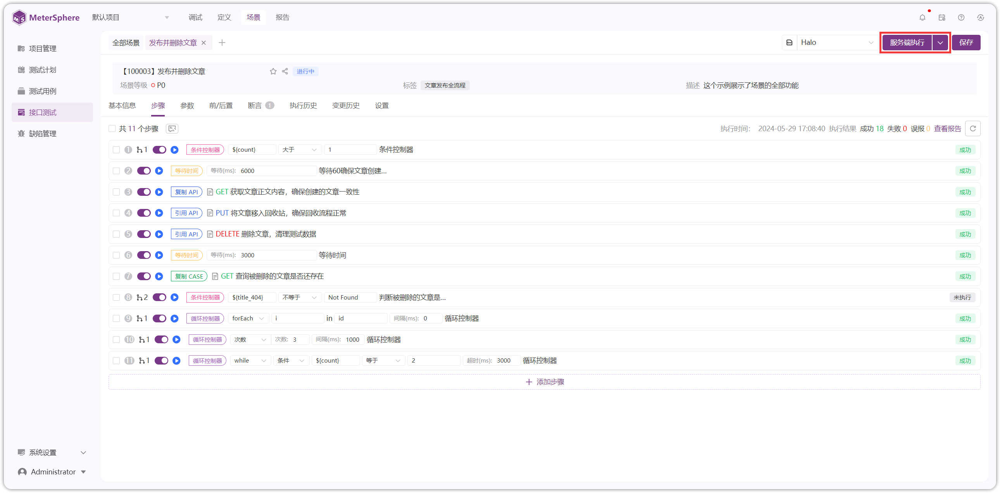{ width="900px" }

!!! ms-abstract "注意"
    - **新增资源池**：除了默认资源池，可新增其他资源池。详情参考：[新增资源池](../system_management/system.md#5)
    - **切换资源池**：可以切换其他资源池进行使用。详情参考：[切换资源池](../project_management/project_permissions.md#23)

### 3.2 本地执行
!!! ms-abstract ""
    点击【本地执行】即可在本地服务执行场景。
{ width="900px" }

!!! ms-abstract "注意"
    本地执行需在本地安装 task_runner 服务。  
    需要在【个人信息】处配置本地 task_runner 的地址。详情参考：[配置本地执行](../personal_center/information#4)

## 4 场景功能
!!! ms-abstract ""
    单步骤可以进行【启用/禁用】、【执行】、【复制】、【删除】、【添加子步骤】、【在之前插入步骤】、【在之后插入步骤】操作。
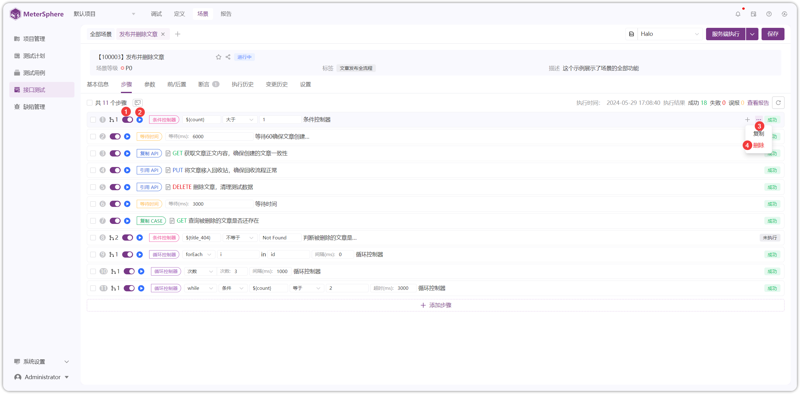{ width="900px" }

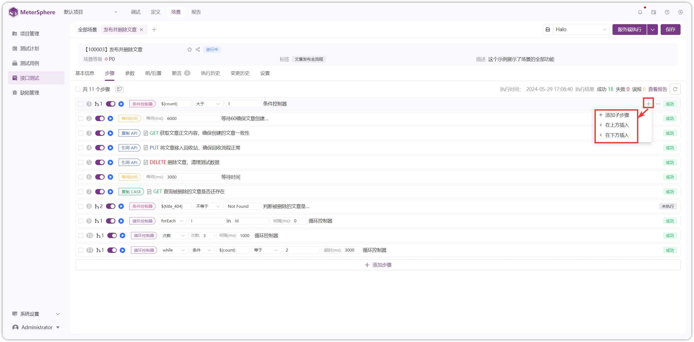{ width="900px" }

!!! ms-abstract "操作说明"

    - **【启用/禁用】** 启用，场景执行该步骤；禁用后，场景执行不再执行该步骤。
    - **【执行】** 服务端执行该步骤。
    - **【复制】** 复制该步骤。
    - **【删除】** 删除该步骤。
    - **【添加子步骤】** 循环控制器、条件控制器、仅一次控制器可以添加子步骤。
    - **【在之前插入步骤】** 在该步骤之前插入其他步骤。
    - **【在之后插入步骤】** 在该步骤之后插入其他步骤。

!!! ms-abstract ""
    勾选多个步骤可以进行【展开全部子步骤】、【批量启用】、【批量禁用】、【批量调试】、【批量删除】操作。
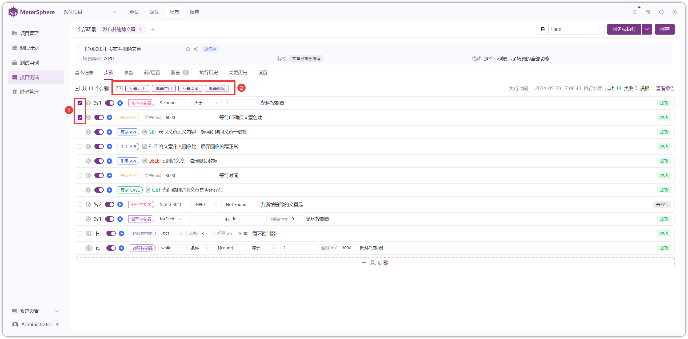{ width="900px" }

!!! ms-abstract ""
    可以进行【关注】、【复制链接】、【查看报告】等操作。
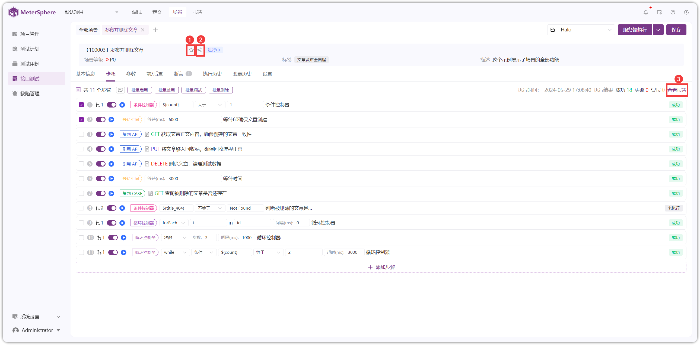{ width="900px" }

!!! ms-abstract "操作说明"

    - **【关注】** 点击后，可加入到"我的关注"列表。
    - **【复制链接】** 复制链接后，粘贴到浏览器上，可打开该场景。
    - **【查看报告】** 可查看本次场景的执行情况。

!!! ms-abstract ""
    可对列表场景进行【编辑】、【执行】、【复制】、【删除】等操作。
{ width="900px" }

