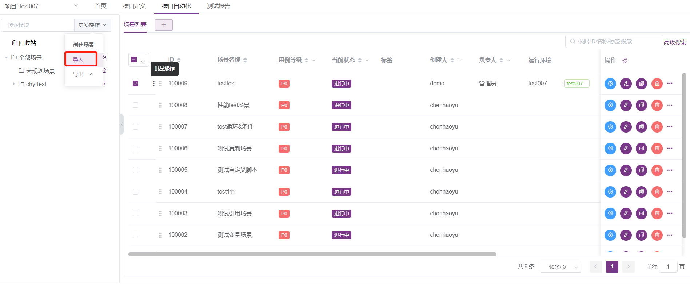

!!! ms-abstract "" 
    场景是接口自动化中的基本管理单元，由一组用例和接口组装而成。如用户管理场景，包含用户注册、用户登陆、用户修改、用户注销、用户销户等用例或者接口。<br />
    MeterSphere 支持导入接口通过拖拽的方式对上述场景进行用例/接口的编排设计。在接口自动化脚本中支持添加各种协议的请求、断言、自定义脚本、逻辑控制器等组件完成一个接口测试场景，并且支持定时、API调用、Jenkins调用方式触发自动化执行任务。

## 1 模块树管理
!!! ms-abstract "" 
    每个场景都需要属于一个特定的模块，在创建场景前需要先规划并创建模块树。接口自动化与接口定义中的模块树相互独立，接口定义中创建的模块不会出现在接口自动化的模块树中。<br/>
    具体的模块管理操作与接口定义中的模块树类似，请参考接口定义中的 [模块树管理](./api_definition.md#22-模块树管理)。


## 2 场景管理
### 2.1 快捷功能
!!! ms-abstract "" 
    场景列表的快捷按钮有【执行】【编辑】【复制】【删除】点击更多可操作【查看引用】【定时任务】【创建性能测试】。
{ width="900px" }

### 2.2 快速创建
!!! ms-abstract "" 
    选择一个模块，点击【更多操作-创建场景】按钮，可仅填写接口基本信息，在该模块下快速创建接口。
{ width="900px" }

{ width="900px" }

### 2.3 编辑详情
!!! ms-abstract "" 
    在场景列表中点击指定场景操作列中的【编辑】按钮，进入场景详情编辑页面。<br />在该页面中可对场景的基础信息，场景的具体步骤等进行进一步编辑，编辑完成后点击右上角的保存按钮进行保存。
{ width="900px" }
{ width="900px" }

### 2.4 场景变量配置
!!! ms-abstract "" 
    在添加场景步骤前可以添加整个场景公用的变量参数，支持多种不同类型，在场景中的步骤均可引用这些参数。<br />
    
{ width="900px" }

{ width="900px" }

!!! ms-abstract "参数说明"

    - 【常量】
        - `变量名`: 该变量的变量名，可以在场景步骤中通过 ${varName} 的形式引用该变量。
        - `描述`：针对该变量的详细说明。
        - `值`：该变量的值，可以使用 JMeter 中的[内置函数](./functions.md)。
        - **举例说明**：定义变量名为 `varName`，变量值为 `varValue` 的变量，在后续步骤中通过 `${varName}` 引用得到 `varValue`。 
    
    - 【列表】
        - `变量名`: 该变量的变量名，可以在场景步骤中通过 ${varName} 的形式引用该变量。
        - `描述`：针对该变量的详细说明。
        - `值`：以逗号 `,` 分隔的值列表，可以在步骤中通过 ${varName_n} 的形式引用指定位置的值，其中 n 代表要引用的值的位置，从 1 开始。
        - **举例说明**：定义变量名为 `listVar`，变量值为 `value1,value2,value3` 的变量，在后续步骤中通过 `${listVar_1}` 引用得到 `value1`，通过 `${listVar_2}` 引用得到 `value2`。 
    
    - 【CSV】
        - `变量名`: CSV 文件的名称，仅起到标记作用，无法在场景步骤中通过 ${varName} 的形式引用该变量。
        - `描述`：针对该变量的详细说明。
        - `添加文件`：CSV 文件选择，从本地上传 CSV 文件。
        - `Encoding`：CSV 文件的编码格式。
        - `分隔符`：CSV 文件中的数据分隔符，默认为 `,`。
        - **举例说明**：上传 CSV 中的内容如下所示，第一列为变量名列，可以在场景的后续步骤中通过 `${name}`，`${age}` 分别引用第一列和第二列的值。当在循环控制器外引用变量时，变量值为第一个数据值，`${name}=Andy`，`${age}=20`；当在循环控制器内引用变量时，每迭代一次都会取下一行的数据值。

            ```csv
            name,age
            Andy,20
            Tom,22
            ```
    
    - 【计数器】
        - `变量名`: 该变量的变量名，可以在场景步骤中通过 ${varName} 的形式引用该变量。
        - `描述`：针对该变量的详细说明。
        - `开始`：计数器变量的起始值，即最小值。
        - `结束`：计数器变量的结束值，即最大值。
        - `增量`：计数器变量每次增加的增量值，默认为 1。
        - **举例说明**：定义变量名为 `counter1` 的计数器变量，开始值为 `1`，结束值为 `100`，增量为 `1`。当在循环控制器外引用变量时，变量值不会递增，一直为当前值；当在循环控制器内引用变量时，每迭代一次变量值都会增加一次。
    
    - 【随机数】
        - `变量名`: 该变量的变量名，可以在场景步骤中通过 ${varName} 的形式引用该变量。
        - `描述`：针对该变量的详细说明。
        - `最小值`：随机范围的最小值。
        - `最大值`：随机范围的最大值。
        - `输出格式`：随机数的输出格式，例如设定最小值 `1`，最大值 `100`，输出格式为 `000`，则变量值为 `013`，`074` 这样的格式。
        - **举例说明**：定义变量名为 `random1`，最小值 `1`，最大值 `100`，输出格式为 `000` 的变量。当在循环控制器外引用变量时，多次引用变量值不会重新随机，一直为当前值；当在循环控制器内引用变量时，每迭代一次变量值都会重新随机一次。

### 2.5 场景步骤编排
!!! ms-abstract "" 
    **添加一级步骤**<br /> 
    在场景详情编辑页面，点击页面右下方的【+】按钮，可在当前场景中添加步骤。

{ width="900px" }

!!! ms-abstract "" 
    点击步骤条目的空白处，可以展开查看步骤详情。
{ width="900px" }


!!! ms-abstract "" 
    **添加子步骤**<br /> 
    在步骤的请求参数详情界面，可选择添加【前置操作】、【后置操作】、【断言规则】子步骤。

    - 【前置操作】可添加【前置脚本】、【前置SQL】、【等待控制器】。
    - 【后置操作】可添加【提取参数】、【后置SQL】、【后置脚本】。
    - 【断言规则】可添加多种类型的【断言】。具体步骤可参考接口用例操作中的 [操作步骤](./api_step.md#3-前置-sql)。

{ width="900px" }
{ width="900px" }
{ width="900px" }

!!! ms-abstract "" 
    **调整步骤顺序及层级**<br /> 
    选中某个步骤后长按鼠标左键可以对步骤进行拖拽，拖拽支持调整步骤顺序及层级，通过拖拽可将其变为一级步骤或某个步骤的子步骤。
{ width="900px" }

{ width="900px" }

!!! ms-abstract "" 
    **针对步骤的其他操作**<br /> 

    - 【编辑名称】：对于支持配置名称的步骤，点击该按钮可以修改该步骤的名称。<br>
    -  【启用/禁用】：点击该按钮启用/禁用该步骤。<br>
    -  【调试】：对于支持单独执行的步骤，点击该按钮可以单独执行步骤，执行后点击步骤空白处可以在其详情中查看执行结果。<br>
    -  【复制】：复制该步骤。<br>
    - 【删除】：删除该步骤。<br>
{ width="900px" }


!!! ms-abstract "" 
    **调针对场景的其他操作**<br /> 

     - 【场景变量】：自定义场景变量，包括常量、列表变量、csv、计数器、随机数等。<br>
     - 【共享cookie】：场景里的所有步骤共享cookie。<br>
    - 【失败继续】：场景中有步骤失败不影响后面步骤执行。<br>
    - 【运行环境】：场景运行环境配置，可选项目环境或者环境组两种类型。<br>
	- 【调试】：调整场景和生成报告。<br>
    - 【保存】：保存场景。<br>
    - 【刷新】：场景内刷新步骤。<br>
    - 【调试历史】：查看场景的调试历史和报告详情。<br>
    - 【变更记录】：查看场景变更记录。<br>
    - 【版本（X-Pack）】：展示当前场景所属版本信息。<br>
    - 【批量操作】：场景内部的批量操作，包含 批量启用步骤、批量禁用步骤、批量展开步骤，批量折叠步骤、批量删除步骤。<br>
{ width="900px" }

{ width="900px" }


### 2.6 调试指定场景
!!! ms-abstract "" 
    场景及场景中的步骤创建完成后，点击【调试】可实时查看场景内各个步骤执行状态及响应结果信息，只点击【调试】产生的结果仅临时存在，无法保存为测试报告供后续查看。
{ width="900px" }


!!! ms-abstract "" 
    点击【调试】按钮下拉图标，再点击生成测试报告。弹出执行结果页面，当场景执行完成后可查看到详细的执行报告。
{ width="900px" }

{ width="900px" }

### 2.7 执行指定场景
!!! ms-abstract "" 
    在场景列表中点击指定场景操作列中的【执行】按钮，弹出执行结果页面，当场景执行完成后可查看到详细的执行结果。
{ width="900px" }

{ width="900px" }

### 2.8 批量执行场景
!!! ms-abstract "" 
    在场景列表中选中多个场景后点击批量操作按钮中的【批量执行】，所有用例执行完成后可进入【测试报告】页面查看执行结果。

    - 【运行环境】：批量执行场景选择的环境，支持项目环境和环境组两种方式。<br>
    -  【模式】：串行表示多场景依次执行；并行表示多场景同时执行。<br>
    -  【其他配置】：独立报告表示每个场景都生成一份报告；集合报告表示所有场景只生成一份报告。<br>
	-  【资源池】：支持选择不同节点执行场景，可以选择普通资源池和 K8S 资源池，K8S 资源池是企业版功能。<br>
{ width="900px" }

{ width="900px" }

### 2.9 批量编辑场景
!!! ms-abstract "" 
    在场景列表中选中多个场景后点击批量操作按钮中的【批量编辑】，支持批量编辑【用例等级、状态、责任人、运行环境、标签】四个属性。
{ width="900px" }

{ width="900px" }

### 2.10 批量移动场景
!!! ms-abstract "" 
    在场景列表中选中多个场景后点击批量操作按钮中的【批量移动】，支持将场景到移动其他模块位置。
{ width="900px" }
{ width="900px" }


### 2.11 批量复制场景
!!! ms-abstract "" 
    在场景列表中选中多个场景后点击批量操作按钮中的【批量复制】，支持复制多个场景。
{ width="900px" }

{ width="900px" }

### 2.12 批量删除场景
!!! ms-abstract "" 
    在场景列表中选中多个场景后点击批量操作按钮中的【批量删除】，支持删除多个场景。
{ width="900px" }

### 2.13 生成依赖关系
!!! ms-abstract "" 
    在场景列表中选中多个场景后点击批量操作按钮中的【生成依赖关系】。  【依赖关系图】可以导出【JPG】和【PNG】图片格式。
{ width="900px" }

{ width="900px" }

### 2.14 批量添加测试计划
!!! ms-abstract "" 
    在场景列表中选中多个场景后点击批量操作按钮中的【批量添加测试计划】，支持将多个场景添加到测试计划。

{ width="900px" }

!!! ms-abstract "" 
    勾选要添加的测试计划，点击确定即可添加成功。

{ width="900px" }

### 2.15 批量创建性能测试
!!! ms-abstract "" 
    在场景列表中选中多个场景后点击批量操作按钮中的【批量创建性能测试】，支持将多个场景导入性能测试。

{ width="900px" }
{ width="900px" }

### 2.16 场景定时任务
!!! ms-abstract "" 
    场景列表页点击右侧【...】， 选择定时任务。弹出定时任务配置页面，定时任务可以配置自动生成，能看到近 5 次运行结果，支持选择运行资源池。

{ width="900px" }
{ width="900px" }


### 2.17 场景导出 导入
!!! ms-abstract "" 
    场景列表支持导出【MeterSphere 格式】和【JMETER 格式】 两种格式。
{ width="900px" }

!!! ms-abstract "" 
    场景列表支持导入【MeterSphere】、【Postman】、【JMeter】、【HAR】四种格式，场景导入支持【覆盖】和【不覆盖】两种模式。

{ width="900px" }
{ width="900px" }

!!! ms-abstract "" 
    场景在跨项目、跨工作空间甚至是跨服务迁移数据导入、导出时，能够保留自身步骤的引用关系，保证数据的完整性和一致性。同一工作空间下，支持导入不同工作空间下的数据导入。 
{ width="900px" }

### 2.18 场景查看引用
!!! ms-abstract ""
    支持查看场景在另外场景和测试计划的引用情况。

{ width="900px" }
{ width="900px" }

### 2.19 将场景移入回收站
!!! ms-abstract "" 
    在场景列表中点击指定场景操作列中的【删除】按钮，该场景将被移入回收站，同时场景变为【废弃】状态。用户可以点击左侧模块树中的【回收站】查看已废弃的场景。

{ width="900px" }

### 2.20 回收站操作
!!! ms-abstract "" 
    点击左侧模块树中的【回收站】，进入回收站页面，支持对已经删除的场景进行【恢复】【删除】操作。<br >选择要恢复的场景点击操作列中的【恢复】按钮，可以将数据恢复到接口自动化列表；点击操作列中的【删除】按钮。 从回收站中删除某个场景时，该场景将从数据库中删除且无法恢复，请谨慎使用该功能。
{ width="900px" }

### 2.21 MQTT协议 (X-Pack)
!!! ms-abstract "" 
    点击【系统设置-系统-插件管理】，点击【点击上传】，将 MQTT 协议的 Jar 包上传上去。
{ width="900px" }

!!! ms-abstract "" 
    点击【接口自动化-创建场景】，右侧会出现 MQTT 请求相关内容。
{ width="900px" }

!!! ms-abstract "" 
    根据需要，选择 MQTT 请求的组件
{ width="900px" }

### 2.22 Websocket协议 (X-Pack)
!!! ms-abstract "" 
    点击【系统设置-系统-插件管理】，点击【点击上传】，将 Websocket 协议的 Jar 包上传上去。
{ width="900px" }

!!! ms-abstract "" 
    点击【接口自动化-创建场景】，右侧会出现 Websocket 请求相关内容，根据需要，选择 Websocket 请求的组件。
{ width="900px" }

### 2.23 Thrift协议 (X-Pack)
!!! ms-abstract "" 
    与上面 MQTT协议 (X-Pack) 和 Websocket协议 (X-Pack) 操作步骤相同