## 1 概述
!!! ms-abstract "" 
	接口定义展示当前项目的所有接口数据，包含左侧接口模块树、API 接口列表、接口 CASE 列表、文档四个部分。
{ width="900px" }

## 2 接口管理
### 2.1 接口协议
!!! ms-abstract "" 
	点击左上角【HTTP】下拉框，可切换接口协议，目前支持 HTTP、TCP 、SQL 和 DUBBO 四种协议。
{ width="900px" }

### 2.2 模块树管理
!!! ms-abstract "" 
	接口数据可以分模块管理，可按照企业实际测试项目划分为多级模块进行管理，最多可分八级。 鼠标悬浮在模块上点击【+】创建一级模块。模块支持添加子模块、模糊搜索、删除、重命名操作，选中目录可进行拖拽调整。
{ width="900px" }

### 2.3 接口快捷调试
!!! ms-abstract "" 
	鼠标悬浮在【+】可以完成【快速调试】【创建接口】【关闭所有页签】操作。 点击【快捷调试】进入快捷调试页面。填写完整的测试地址和基本请求参数，点击【测试】按钮即可进行接口调试。测试完成点击【另存为新用例】，填写接口用例名称可保存为一个新的接口用例。
{ width="900px" }
{ width="900px" }

### 2.4 快速创建接口
!!! ms-abstract "" 
	鼠标悬浮在【+】，点击如上图【创建接口】弹出创建接口详情页面。创建接口页面填写接口基础信息、请求方式、请求参数、响应内容即可。 

	-  请求方式：支持GET、POST、PUT、PATCH、DELETE、OPTIONS、HEAD、CONNECT。 
	-  请求参数：包含默认请求头变量；常用query、rest参数，鼠标悬浮会有提示。 
	-  请求体：支持多种形式：form-data，x-www-form-urlencoded，json，xml，raw，binary。

{ width="900px" }

!!! ms-abstract "" 
	参数填写完成点击【确定】按钮即可完成接口定义创建，并跳转到接口展示【编辑详情】页面，可在【API】【TEST】【CASE】【MOCK】菜单下对接口做进一步调整。
{ width="900px" }

## 3 API
### 3.1 编辑 API
!!! ms-abstract "" 
	在编辑接口【API】页面中可以对接口的基础信息、请求及响应定义、前后置依赖关系进行详细编辑。 
	在企业版【Xpack】功能包中：对已有 CASE 的接口，更改接口地址、请求头、请求参数等内容。点击【保存】，会弹出同步更新设置确认框，可一键同步被使用的 CASE 参数，便于维护脚本。
{ width="900px" }
### 3.2 关注接口
!!! ms-abstract "" 
	点击页面右上角的【五角星图标】，可关注/取消关注该接口定义。若接口有变更会及时提醒关注者。
{ width="900px" }

### 3.3 接口变更记录
!!! ms-abstract "" 
	点击页面右上角的【变更记录】可查看此接口所有的变更记录。可查看具体的变更字段、变更前、变更后的信息。
{ width="900px" }

### 3.4 版本管理 (X-Pack)
!!! ms-abstract ""
	点击页面右上角的【版本: v1.1.0】可查看所有的版本号，选择当前版本号，创建接口。 在接口列表默认展示所有接口的最新版本数据，并支持批量操作复制指定版本的 CASE 和 Mock 数据，可快速切换版本及历史数据对比，优化对接口的管理方法。
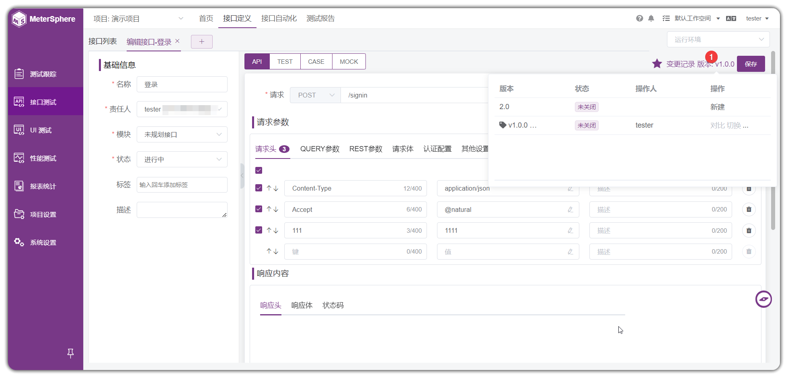{ width="900px" }

### 3.5 HTTP 请求
!!! ms-abstract ""
	**请求头** 
	请求头：提供请求头变量，点击即可弹出方法列表。点击参数【铅笔图标】还可添加 Mock 数据和 JMeter 方法内置函数。 

	 -  函数 Tab 页签默认选中【Mock方法】，选择数据类型可添加函数使用，数据类型列表下方会展示函数预览效果，点击【保存】按钮生效。 
	 -  函数 Tab 页签选择选择【JMeter方法】，即可选择使用内置的 Jmeter 函数，点击【保存】按钮生效。 
    内置函数的详细说明请参考 [内置函数](./functions.md)
	
{ width="900px" }
	
{ width="900px" }

!!! ms-abstract ""
	**QUERY参数**  
	QUERY 参数是在接口地址栏中跟在？后面的参数，如 updateapi?id=11；可直接在下方列表输入 QUERY 参数键值对。 点击参数上面的 【设置图标】，可添加参数的其他属性如编码、最大长度、描述等。点击【批量添加】按钮，可以批量添加参数：填写参数键值对点击确定即可解析到参数列表。
{ width="900px" }
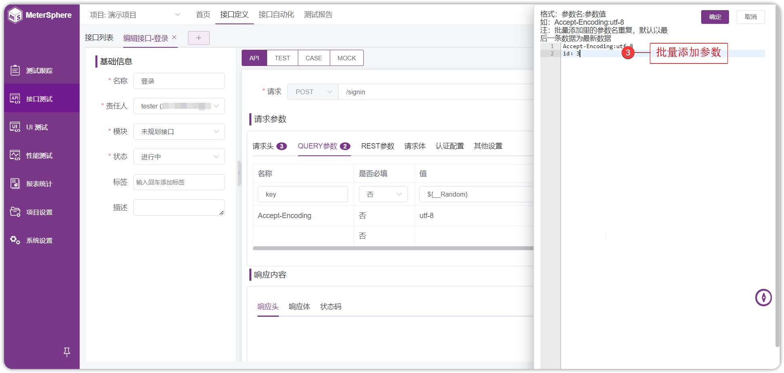{ width="900px" }

!!! ms-abstract ""
	**REST参数**  
	REST参数是在接口地址栏中被【/】分隔的参数，如 updateapi/{id}。使用方法同上。
{ width="900px" }

!!! ms-abstract ""
	**请求体**  
	请求体参数支持多种形式：form-data，x-www-form-urlencoded，json，xml，raw，binary。  
	 请求体是 form-data 和 x-www-form-urlencoded 格式时，可以选择参数类型。不同的参数类型，系统会提供 默认属性。
{ width="900px" }

!!! ms-abstract ""
	 请求体是 json 格式时，可以使用 Json-schema 用于验证json数据格式。
{ width="900px" }
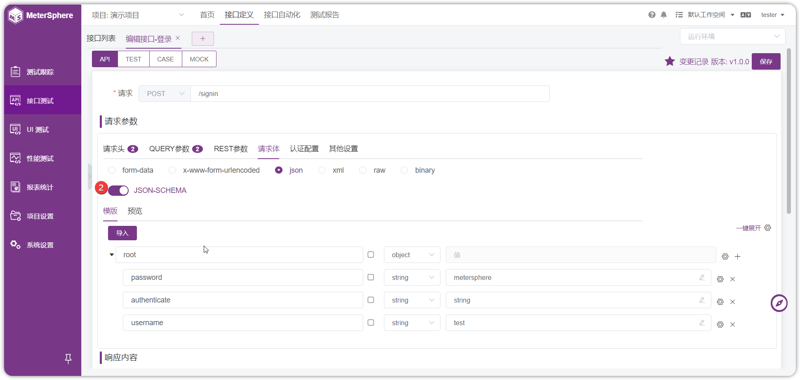{ width="900px" }

!!! ms-abstract ""
	**认证配置** 
	支持 Basic Auth 的认证方式和对数据加密，此处可以配置认证信息及加密方式。
{ width="900px" }

!!! ms-abstract ""
	**其他设置** 
    可设置证书、跟随重定向、连接超时、响应超时时间等。
{ width="900px" }

### 3.6 TCP 请求

!!! ms-abstract ""
	**请求参数** 
	请求参数可以在请求模板通过 ${xxx} 引用。
{ width="900px" }

!!! ms-abstract ""
	**请求体** 
	请求体参数支持 json、xml、raw 三种数据格式。其中在 xml 参数中点击【添加】按钮，支持以表格形式添加参数。 xml 可添加 object、string、array 三种数据类型的参数。点击【保存】按钮保存添加的 xml 参数。
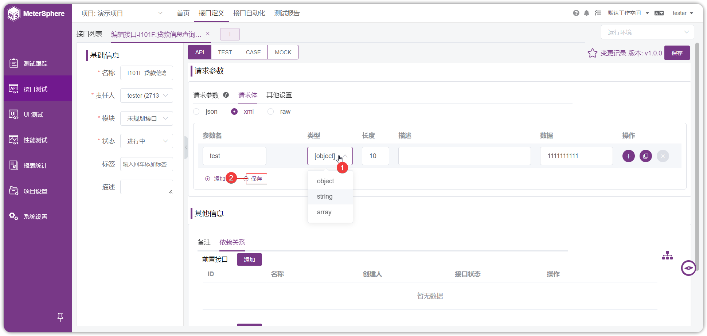{ width="900px" }

!!! ms-abstract ""
	**其他设置** 
	在其他设置中可设置 TCP 客户端、连接时间、响应时间等参数。TCPClient 默认提供三种连接方式。
{ width="900px" }
### 3.7 SQL 请求
!!! ms-abstract ""
	SQL 请求支持配置多个数据源，选择运行环境、数据源，编写sql脚本（sql脚本支持传递变量`${变量名}`），查询结果可以【按结果存储】【按列存储】两种方式。  
	**按结果存储**：是将返回结果所有的字段存储到一个变量中去，如果需要使用其中的某个字段则需要对变量进行解析，里面的实际数据是集合嵌套集合。每一行数据都是以  <字段名>：<字段值>( 即key :value)的格式存到map中的，而整个返回数据就是以一个大的map去存储每一行的数据的map ，最后得到一个结果集合，如果需要其中的数据，需要通过 beanshell 或 python 脚本去解析。 
	**按列存储**：直接指定返回字段的结果值，列数要和 SQL 语句中查询字段返回结果的列数相同。同时可以用逗号作为占位符代替列名，只写出 要提取的列名即可，引用时 ${列名变量_n} 
	
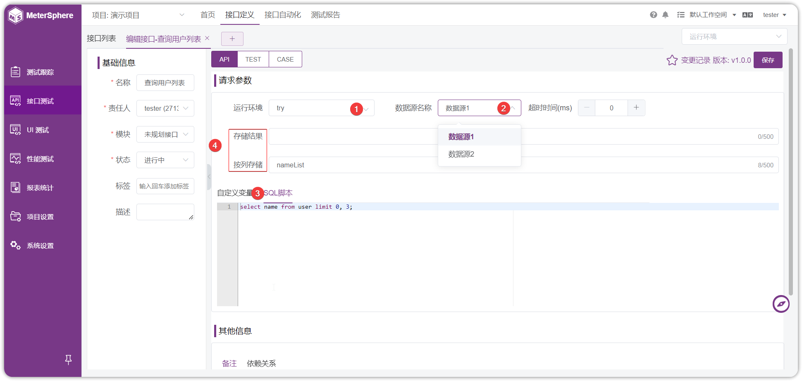{ width="900px" }

### 3.8 DUBBO 请求

!!! ms-abstract ""
	**Interface**  
	点击【Get Providers List】按钮，可从【Registry Center】中获取服务列表。可在字段 Interfaces 下拉列表中选择需要测试的接口及方法，根据该方法的定义传入所需的参数。
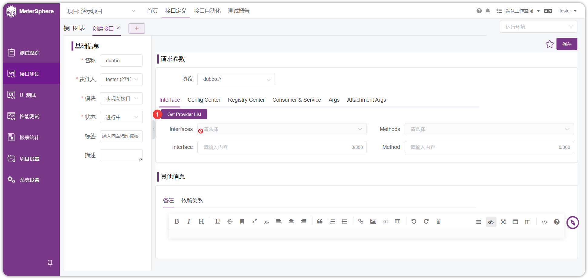{ width="900px" }

!!! ms-abstract ""
	**Config Center**  
	可在【Config Center】中填写配置超时时间、用户名、密码等相关基础信息。
{ width="900px" }

!!! ms-abstract ""
	**Registry Center**  
	可在【Registry Center】页面中选择协议、填写连接信息等。
{ width="900px" }

!!! ms-abstract ""
	**Consumer & Service**  
	可在【Consumer & Service】填写 Consumer 和 Service 信息。
{ width="900px" }

!!! ms-abstract ""
	 **Args** 
	可在【Args】中添加请求相关参数。
{ width="900px" }

!!! ms-abstract ""
	**Attachment Args** 
	可在【Attachment Args】中设置其他键值对参数。
{ width="900px" }

### 3.9 依赖关系设置
!!! ms-abstract ""
	
	接口定义支持设置接口的前后置依赖关系。点击【添加】按钮，可以添加前置接口、后置接口依赖。
{ width="900px" }
### 3.10 API 列表功能
!!! ms-abstract ""
	支持对接口定义的执行、编辑、删除、复制操作点击更多操作【...】可以 查看引用、查看CASE。 

    - 执行：进入【编辑接口详情-TEST】页面  
	- 编辑：进入【编辑接口详情-API】页面  
	- 删除：删除该接口到【回收站】 
	- 复制：复制该接口定义信息  
	- 查看引用：可以查看接口具体哪个场景引用 
	- 查看 CASE :可以查看接口下写好的 CASE 用例 
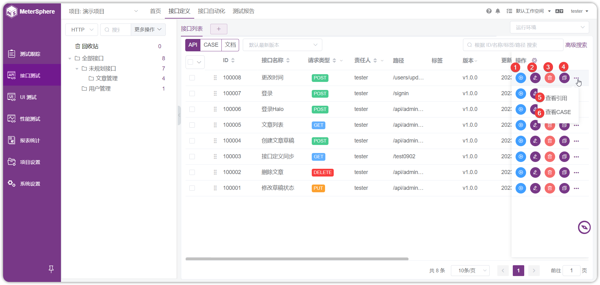{ width="900px" }
	

## 4 TEST
!!! ms-abstract ""
	在【TEST】页面中可以选择运行环境调试接口，同时可以添加前后置脚本、前后置SQL、断言、提取参数等子步骤。
### 4.1 自动生成测试数据 
!!! ms-abstract ""
	接口请求体为 json 格式可开启 【JSON-SCHEMA】模式，点击【生成测试数据】会生成随机参数值 ，用于快速传参测试。 
	如需定制生成规则可点击【设置】图标，对枚举值生成规则进行设置。
{ width="900px" }

!!! ms-abstract ""
	快速生成数据规则在【高级设置】页面，可以设置默认值、枚举值、最大最小长度、正则表达、描述相关信息，规则设置好后点击【生成测试数据】生效。 如有设置了默认值，则生成测试数据是默认值；如设置枚举值，生成的数据是枚举值其中一个，枚举值可以换行设置多个。
{ width="900px" }

### 4.2 针对单个接口发起测试
!!! ms-abstract ""
	选择运行环境，点击 【测试】按钮即可调试接口。在响应内容可以看到接口的请求响应体、响应头、控制台、断言、提取、请求内容信息。 
	前后置脚本、前后置SQL、断言及参数提取等子步骤的详情说明请参考。 [用例步骤说明](./api_step.md)
{ width="900px" }

### 4.3 其他功能
!!! ms-abstract ""
	点击【测试】按钮旁边的向下箭头【V】，还提供了加载用例、另存为新用例、更新接口、另存为新接口快捷功能。
{ width="900px" }

!!! ms-abstract ""
	【加载用例】加载该接口下的所有用例。
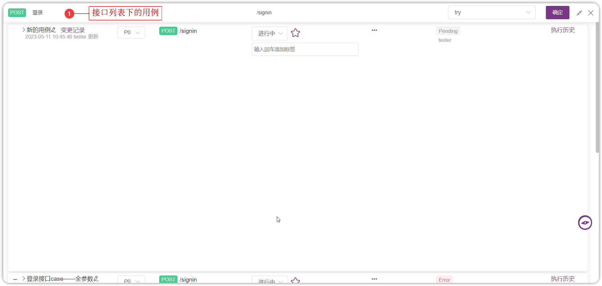{ width="900px" }
 
!!! ms-abstract ""
	【另存为新用例】可使用该接口页面填写的参数信息及添加的子步骤，创建一个新的接口用例。输入用例名称，点击【保存】按钮，即可保存为一个新的接口用例。
{ width="900px" }

!!! ms-abstract ""
	【更新接口】可将当前页面填写的参数信息更新到对应的接口定义中。
{ width="900px" }

!!! ms-abstract ""
	【另存为新接口】即可使用当前页面接口信息来创建新的接口定义。
{ width="900px" }

## 5 CASE
!!! ms-abstract ""
	在 CASE 页面中展示当前接口下的所有接口用例列表。
### 5.1 列表功能
!!! ms-abstract ""
	支持对接口用例的 编辑 执行 复制 删除鼠标悬浮【…】可展示更多功能、查看引用、执行历史、创建性能测试操作。 

	- 编辑：编辑该接口用例  
	- 执行：调试该接口  
	- 复制：复制该接口用例信息  
	- 删除：删除该接口用例到回收站  
	- 查看引用：查看该接口用例被场景引用和测试计划引用情况  
	- 执行历史：可查看该接口用例执行历史列表及执行结果详情  
	- 创建性能测试：可使用当前接口用例快速创建性能测试  
{ width="900px" }
	
### 5.2 批量操作
!!! ms-abstract ""
	选择多条接口用例，点击【…】，可对多个接口用例进行批量删除、批量编辑、批量执行、批量同步操作。

	- 批量删除：批量删除接口用例到回收站  
	- 批量编辑：批量编辑接口用例等级、标签属性  
	- 批量执行：批量调试接口用例，运行模式可选择串行或并行，生成报告可选生成独立报告、集合报告。 
	- 批量同步：批量同步接口用例，可对同步用例进行基本信息、请求参数、其他设置相关内容进行配置。 

{ width="900px" }

### 5.3 新建接口用例
!!! ms-abstract ""
	点击 【+添加】按钮，可使用当前接口定义的参数信息创建新的接口用例。
{ width="900px" }

### 5.4 搜索
!!! ms-abstract ""
	普通搜索支持通过接口用例的 ID 、名称、标签进行模糊搜索。 高级搜索支持按 ID 、名称、用例等级、标签、执行结果、更新时间、创建时间、创建人、关注人、路径搜索。
{ width="900px" }
{ width="900px" }

## 6 MOCK 
!!! ms-abstract ""
	在 MOCK 页面中展示当前接口定义下的 MOCK 服务。在接口编辑页面可展示此接口的 Mock 信息，Mock 默认地址是 MeterSphere 系统地址+模块 ID + 接口地址，一个接口定义可以设置多个 Mock 服务。

###  6.1 HTTP Mock服务设置
!!! ms-abstract ""
	MeterSphere 提供的 Mock 功能可以根据用户输入的请求参数、返回数据生成Mock接口，这些接口会自动生成模拟数据，以覆盖用户的模拟测试需求。 Mock 期望是根据设置的请求触发条件来进行过滤，然后返回期望的数据。在【MOCK】页面点击【+添加】按钮添加 Mock 服务。	
{ width="900px" }

!!! ms-abstract ""
	设置 Mock 服务触发条件。可以在请求头、QUERY参数、REST参数、请求体设置触发条件；在响应内容中设置自定义响应头、响应体、状态码、响应延迟时间相关信息
{ width="900px" }

!!! ms-abstract ""
	Mock 服务触发条件设置规则匹配及逻辑判断: 
	请求参数设置规则匹配，可以根据参数设定的值、长度、正则表达式 Mock 出相应的请求参数，同时参数与参数之间新增了逻辑判断（AND/OR），以提升触发条件的灵活性。
{ width="900px" }

!!! ms-abstract ""
	针对一些特定测试场景需要对返回信息进一步处理的情况，比如加解密操作、调用第三方 JAR 包等操作。 MeterSphere 在 Mock 服务中添加 后置脚本，用户可以通过编写脚本或添加系统已有的 自定义代码片段来实现对返回信息的处理。
{ width="900px" }

!!! ms-abstract ""
	在【MOCK】数据列表，选择一条数据点击执行，选择 MOCK 环境，当请求参数与设置的触发条件匹配时候，则返回设置的响应内容。
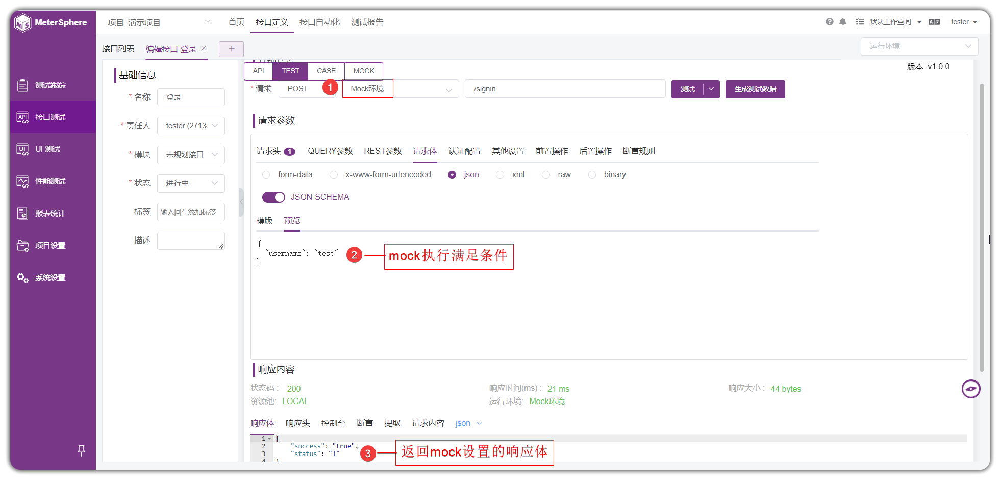{ width="900px" }

### 6.2 TCP Mock设置
!!! ms-abstract ""
	TCP Mock 服务需在【项目设置-应用管理-接口测试】中开启 TCP Mock 服务。其功能设置同 [HTTP MOCK](#61-http-mock服务设置)。
{ width="900px" }

### 6.3 MOCK 列表功能
!!! ms-abstract ""
	支持对 Mock 数据进行执行、编辑、复制 、删除操作。
{ width="900px" }

## 7 定时同步
!!! ms-abstract ""
	接口定义列表，点击【更多操作-定时同步】可设置 Swagger 在线接口文档定时同步。
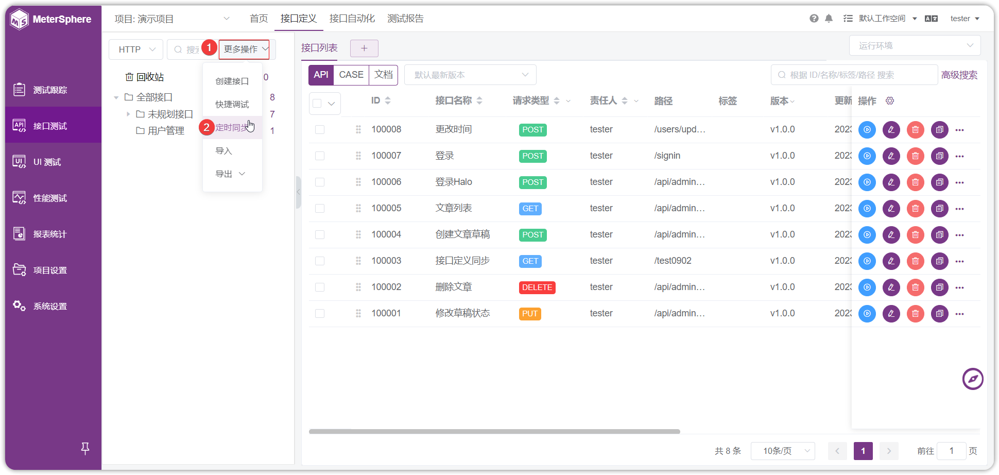{ width="900px" }

!!! ms-abstract ""
	定时同步页面需设置同步的路径（以/api-docs结尾）、定时Cron表达式（支持自动生成可以预览近5次运行时间）、导入模块、导入模式，点击【添加】按钮完成接口定时同步设置。
{ width="900px" }

!!! ms-abstract ""
	接口定时同步任务支持设置任务通知方式，点击任务通知按钮，弹出任务通知设置页面，消息通知方式：邮件、钉钉机器人、企业微信机器人、飞书机器人、自定义 Webhook 。
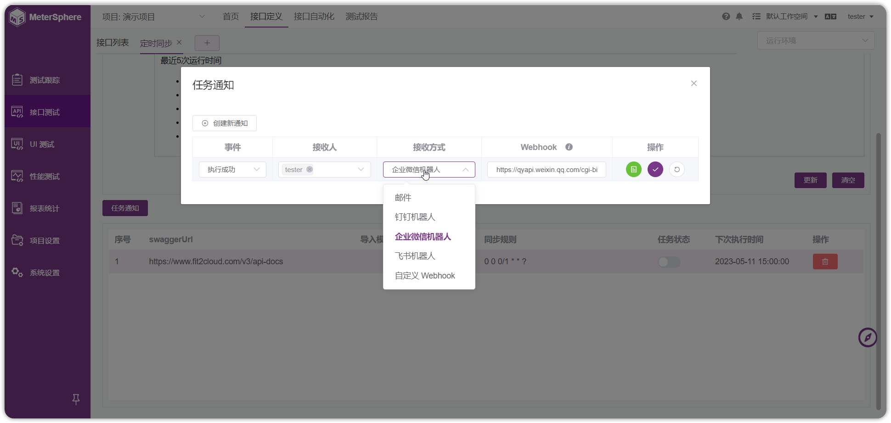{ width="900px" }

!!! ms-abstract ""
	定时同步任务支持定时同步任务查看、开启、关闭、删除操作。
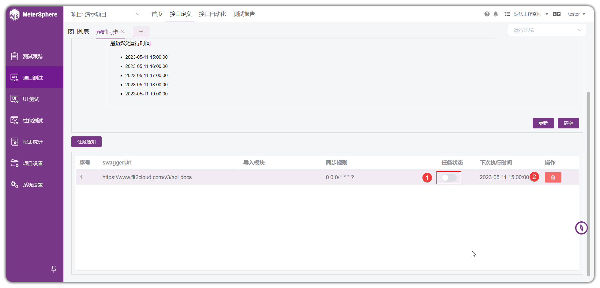{ width="900px" }

##  8 导入接口
!!! ms-abstract ""
	接口定义列表【更多操作-导入】，支持多种类型接口文档的导入，包括：MeterSphere、Postman、Swagger、HAR、JMX类型数据。
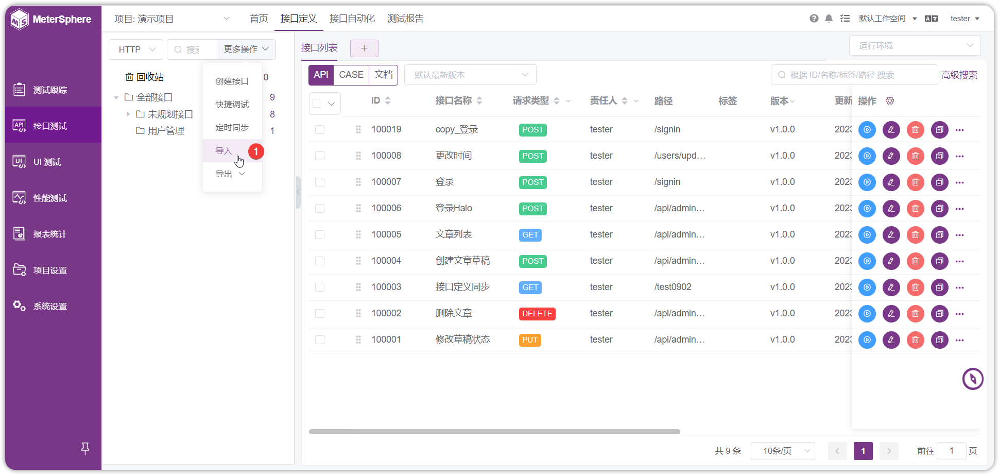{ width="900px" }

{ width="900px" }

!!! ms-abstract ""
	支持 Swagger Json 文件的离线导入，同时也支持使用 Swagger URL 进行在线同步，导入规则请看导入页面下方的提示。注意: 若导入的接口为新建接口且没有用例，则默认为接口创建一个用例。
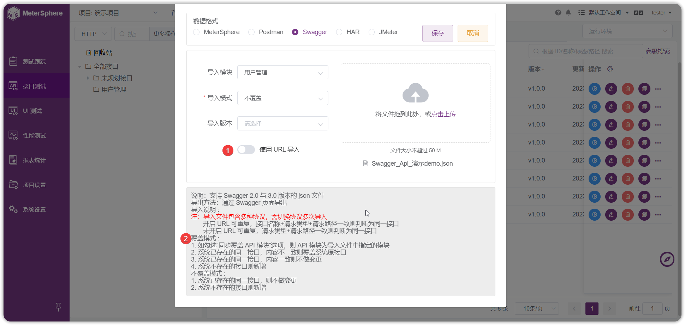{ width="900px" }

## 9 导出接口定义
!!! ms-abstract ""
	接口定义列表【更多操作-导出】支持导出 MeterSphere 和 Swagger3.0 格式的接口文件导出。选择要导出的接口，点击 【更多操作-导出】选择要导出的文件格式，系统自动完成接口导出。
{ width="900px" }

## 10 批量操作
!!! ms-abstract ""
	选择多条 API 数据点击【…】，可对多个接口进行批量操作。批量删除、批量编辑、批量移动、批量复制、复制版本数据、生成依赖关系  

	- 批量删除：批量删除接口到回收站 
	- 批量编辑：批量编辑接口属性  
	- 批量移动：批量将接口移动到其他模块  
	- 批量复制：批量将接口复制到其他模块  
	- 复制版本数据(X-Pack)：随着版本的迭代，同一接口，当新版接口参数变更需要创建对应新版本的接口 CASE 和 Mock 数据。使用此功能可批量将历史版本的 CASE 和 Mock 数据快速复制到新版本，方便快速维护接口的用例数据。 
      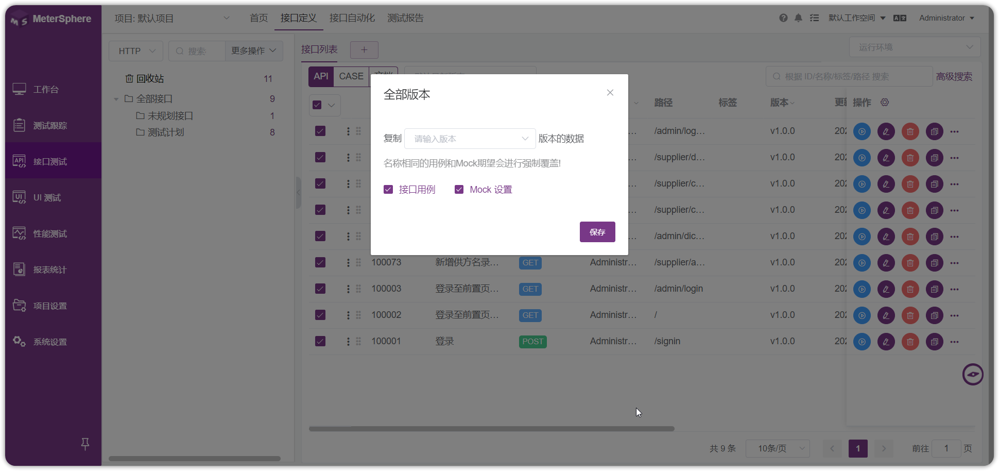{ width="900px" }
	- 生成依赖关系：批量接口之间的联系生成依赖关系拓扑图  

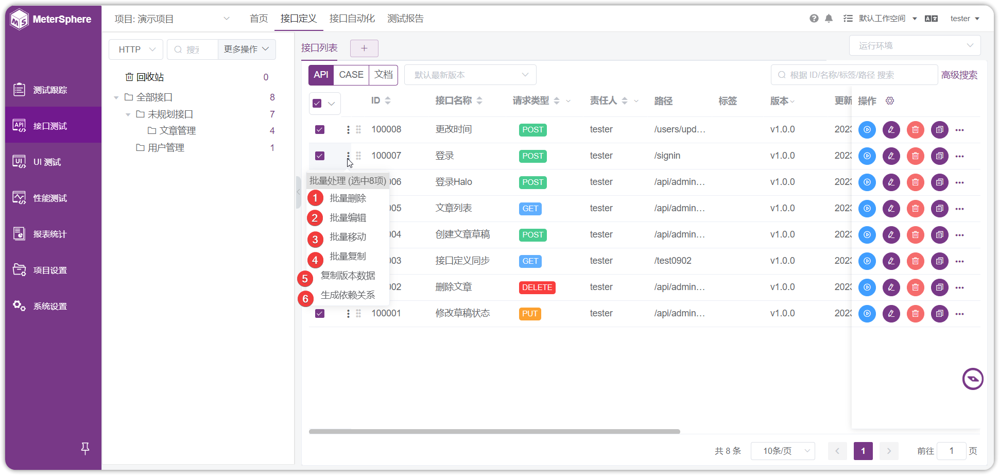{ width="900px" }

	
## 11 搜索
!!! ms-abstract ""
	接口定义列表支持普通搜索接口定义的 ID、名称、标签、路径 进行模糊搜索。高级搜索支持 ID 、名称、请求类型、路径、状态、标签、更新事件、创建事件、责任人、所属模块、关注人进行搜索。
{ width="900px" }
{ width="900px" }

## 12 回收站
!!! ms-abstract ""
	回收站展示已删除的接口 API、CASE 列表。支持把回收站的数据恢复到接口列表和彻底删除操作。
{ width="900px" }

!!! ms-abstract ""
	回收站列表批量选择数据，点击【...】按钮弹出操作菜单，支持批量删除、批量恢复操作。
{ width="900px" }

## 13 文档管理
!!! ms-abstract ""
	API 接口支持以文档形式展示接口定义详细信息，页面右侧展示接口列表，点击接口名称可快速定位到该接口详情所在位置。 
	点击【分享】图标，系统会生成接口的 URL 地址。
	点击【复制】按钮即可将接口的 URL 地址分享给他人。

{ width="900px" }

## 14 版本管理 (X-Pack)
!!! ms-abstract ""
	接口定义列表可切换查看当前定义接口的版本信息，列表默认展示最新版数据，可切换查看各版本的接口定义信息。
{ width="900px" }