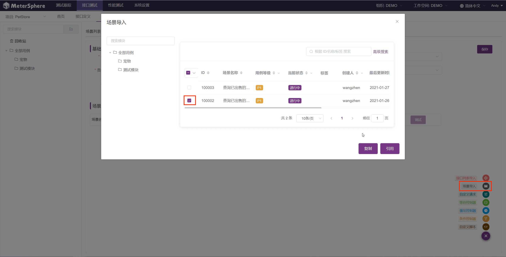
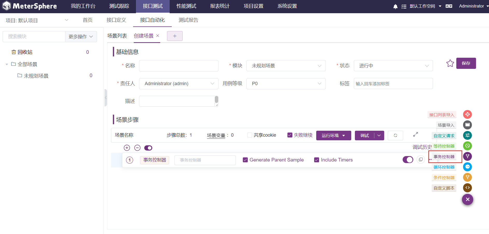

## 1 接口列表导入
!!! ms-abstract "" 
    通过接口列表导入功能，可以直接添加接口定义中已维护好的接口或用例，减少重复工作。 

### 1.1 导入接口
!!! ms-abstract "" 
    接口自动化场景右下角菜单【+】选择 【接口列表导入】，从接口列表可以选择 API 里面的数据，使用方式支持 【复制】模式。  
    【复制】方式导入的用例，当原用例发生变化时，场景中导入的用例不会改变。 

{ width="900px" }
{ width="900px" }

### 1.2 导入用例 
!!! ms-abstract "" 
    接口自动化场景右下角菜单【+】选择【接口列表导入】，从接口列表可以选择 CASE 里面的数据，使用方式支持 【复制】、【引用】两种模式。  

    - 【复制】方式导入的用例，当原用例发生变化时，场景中导入的用例不会改变；
    - 【引用】方式导入的用例，当原用例发生变化时，场景中导入的用例也会随之改变。

{ width="900px" }
{ width="900px" }

## 2 自定义请求
!!! ms-abstract "" 
    除了导入已有定义的接口或用例，还可以通过自定义请求的方式增加请求，目前支持 HTTP、TCP、DUBBO、SQL 等不同类型。

{ width="900px" }
{ width="900px" }

## 3 自定义脚本
!!! ms-abstract "" 
    自定义脚本与前后置脚本使用方式类似，但是可以独立添加，不需要依赖于某个已有请求作为其子步骤。目前支持的脚本语言及内置变量请参考 [前置脚本](#1-前置脚本)。

{ width="900px" }

## 4 场景导入
!!! ms-abstract "" 
    用户可以维护一些基础、通用场景，通过场景导入功能，可以直接将已有的场景添加到当前场景中，减少重复工作，提高场景的复用性。  

    -【复制】方式导入的场景，当原场景发生变化时，场景中导入的场景不会改变。
    - 【引用】方式导入的场景，当原场景发生变化时，场景中导入的场景也会随之改变。

{ width="900px" }
{ width="900px" }

## 5 条件控制器
!!! ms-abstract "" 
    当条件控制器中配置的条件满足时，条件控制器下的子步骤才会执行，否则子步骤会被跳过。

{ width="900px" }

## 6 循环控制器
!!! ms-abstract "" 
    通过使用循环控制器，可以重复执行循环控制器下的子步骤。

{ width="900px" }

### 6.1 次数循环 
!!! ms-abstract "" 
    次数循环支持自定义设置次数、间隔等方式进行循环控制。

    - 【循环次数】：该循环控制器下的子步骤总共执行的次数。
    - 【循环间隔】：每次执行间的时间间隔，以毫秒为单位。
    - 【成功后是否继续循环】：仅循环控制器下存在一个请求时可以关闭。当关闭时，若循环控制器下的请求是成功状态，则立即终止循环，无论有没有达到循环次数。可以用在异步请求后轮询查询执行结果的场景，当查询结果符合预期时终止循环，避免多余的查询操作。

{ width="900px" }

!!! ms-abstract "示例"
    开启【成功后继续循环】，循环总共执行了 5 次。
    { width="900px" }
    
    关闭【成功后继续循环】，由于循环下的请求第一次便执行成功，循环仅执行了 1 次。
    { width="900px" }

### 6.2 ForEach 循环 
!!! ms-abstract ""
    ForEach 循环一般配合列表变量使用，例如存在 `ID_1`，`ID_2`，`ID_3` 形式的一组变量时，可以通过 ForEach 循环使用其中每个 ID 发送特定请求。 

    - 【输出变量名称】：在循环中可以通过该变量引用到列表变量中当前迭代的变量值。
    - 【输入变量前缀】：列表变量的变量前缀。
    - 【循环间隔】：每次执行间的时间间隔，以毫秒为单位。

{ width="900px" }

!!! ms-abstract "示例"
    在场景变量中设置列表变量 id，列表值为`1`，`2`，`3`。
    { width="900px" }
    
    遍历场景变量中的列表变量，在【前置脚本】中打印列表变量中的每个值。
    { width="900px" }
    
    循环次数与列表长度相同，且输出列表变量中的每个值。
    { width="900px" }
    
### 6.3 While 循环 
!!! ms-abstract ""
    While 循环更为灵活，当配置的条件满足时循环会一直进行。

    - 【变量】：要进行判断的变量。
    - 【判断条件】：变量与期望值的比较方式。
    - 【值】：要对变量进行判断的值。
    - 【循环超时时间】：由于 while 循环的特殊性，当条件满足时将会一直循环，为了避免死循环的情况出现，用户可以配置循环超时时间，到超过该时间后，不管循环条件是否满足，循环都将被终止。

{ width="900px" }

!!! ms-abstract "示例"
      在场景变量中设置常量变量 NUM，值为5。
     { width="900px" }
     
     设置 While循环的条件，在前置脚本获取变量值并更改变量值
     { width="900px" }
     
     每次循环修改的值在控制台进行打印
     { width="900px" }

## 7 等待控制器
!!! ms-abstract ""
    当某个步骤执行后需要等待一段时间时，可使用等待控制器进行控制。当作为步骤添加时，与之同级的所有步骤均会等待若干时间；作为某个步骤的子步骤添加时，该步骤将等待若干时间后再执行。

{ width="900px" }

## 8 事务控制器
!!! ms-abstract ""
    事务控制器将一组请求当成一个事务进行处理，比如用户一个动作包含很多个请求，这部分请求就都可以放在一个事务控制器下，当成一个事务，常用语性能测试。

{ width="900px" }

## 9 前置脚本
!!! ms-abstract ""
    与接口用例操作中的前置脚本类似，请参考 [前置脚本](../api_step##-1-前置脚本)。

## 10 后置脚本
!!! ms-abstract ""
    与接口用例操作中的后置脚本类似，请参考 [后置脚本](../api_step##-2-后置脚本)。

## 11 前置SQL
!!! ms-abstract ""
    与接口用例操作中的前置SQL类似，请参考 [前置SQL](../api_step##-3-前置-sql)。

## 12 后置SQL
!!! ms-abstract ""
    与接口用例操作中的后置SQL类似，请参考 [后置SQL](../api_step##-4-后置-sql)。

## 13 断言规则
!!! ms-abstract ""
    与接口用例操作中的断言规则类似，请参考 [断言规则](../api_step##-5-断言规则)。

## 14 提取参数
!!! ms-abstract ""
    与接口用例操作中的提取参数类似，请参考 [提取参数](../api_step##6-提取参数)。