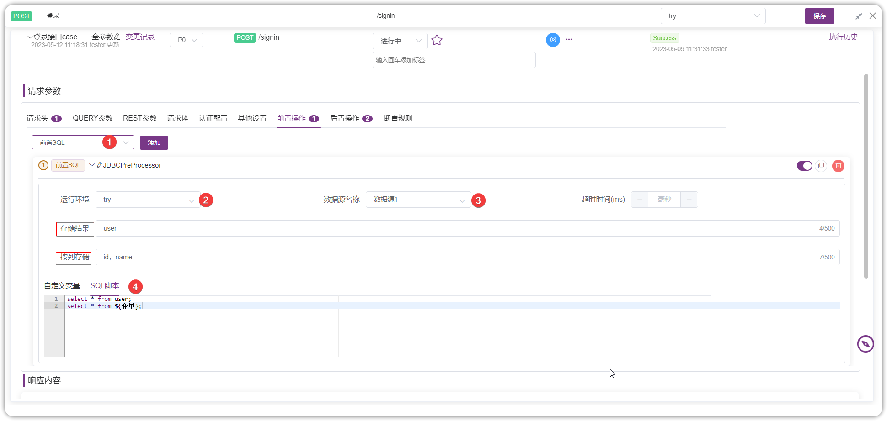
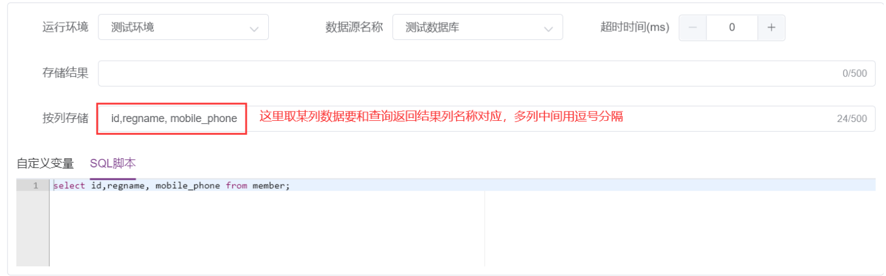
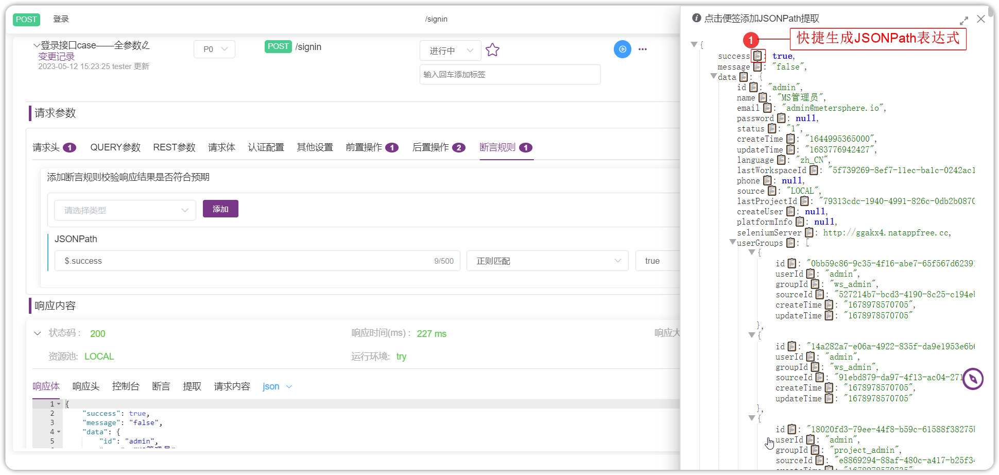

#接口用例操作步骤

##1 前置脚本
!!! ms-abstract "" 
    前置脚本可以添加为请求的子步骤，在请求发送前执行，可以用在修改请求内容、初始化请求需要的参数值等场景。<br>
    目前 MeterSphere 支持以下几种语言的前置脚本：<br>

    - BeanShell
    - Python2
    - Groovy
    - NashornScript
    - RhinoScript

    在前置脚本中可以直接引用JMeter 预定义对象，例如：<br>
    - `log`：用于在脚本执行过程中打印日志
    ```
    //打印 `Hello World!` 到 info 日志中
    log.info("Hello World!");
    ```
    - `Label`：前置脚本所属请求的请求名称<br>
    - `SampleResult`：当前请求请求结果 [SamplerResult]() 的指针
    ```
    //设置请求结果成功或失败
    SampleResult.setSuccessful(true/false);
    //设置请求返回码
    SampleResult.setResponseCode("code");
    //设置请求返回消息
    SampleResult.setResponseMessage("message");
    ```
    - `sampler`：当前请求 [sampler]() 的指针
    ```
    //获取当前请求名称
    sampler.getName();
    ```
    - `vars`：[JMeterVariables]()，用于操作变量
    ```
    //获取变量 VAR1 的值
    vars.get("VAR1");
    //设置变量 VAR2 的值为 value
    vars.put("VAR2","value");
    //移除变量 VAR3
    vars.remove("VAR3");
    ```

    **【注意】** 不同脚本语言语法不同，以上示例仅针对 BeanShell 或 Groovy。

    在接口 CASE 编辑页面，操作 Tab 页前置操作菜单：提供了多种不同类型和范围的标准代码模板，同时还支持用户自定义代码模板。代码模版分为：API测试、自定义变量、项目环境、自定义代码片段、异常处理。

{ width="900px" }

### 1.1 API测试 
!!! ms-abstract "" 
    【从API定义导入】：API定义导入可以直接导入 API / CASE 自动生成脚本。<br >点击【API定义导入】按钮，从接口列表  API/ CASE 选择目标数据点击【确定】会在前置脚本中默认生成 beanshell 脚本。脚本语言可切换，默认支持 beanshell 、python2 、groovy 、javascript 语言。

{ width="900px" }
{ width="900px" }

!!! ms-abstract "" 
    点击【新API测试[json]】可以自动生成 json 请求方式的 API 请求模板。

{ width="900px" }

### 1.2 自定义变量 
!!! ms-abstract "" 
    在【自定义变量】方法列表，选择需要的自定义变量方法可自动生成获取变量的脚本。包括获取响应头、获取响应码、获取响应等脚本，以获取接口调试结果中的响应头、响应码、响应结果等信息。

{ width="900px" }

### 1.3 项目环境 
!!! ms-abstract "" 
    选择【项目环境】设置环境参数，自动生成设置环境变量方法填写对应方法键值对即可试用。<br>
    `vars.put(${__metersphere_env_id}+"key","value");` // 将值存储为环境变量，可在【环境-通用设置】处看到值。当前环境下的所有接口使用。<br>
    `vars.put("key","value")` // 将值存储为场景变量 <br>

{ width="900px" }

### 1.4 自定义代码片段 
!!! ms-abstract "" 
    选择【自定义代码】插入代码片段，选择在【项目管理-自定义代码片段】定义好的自定义代码片段，可实现复用脚本优化测试管理办法。

{ width="900px" }
{ width="900px" }

### 1.5 异常处理
!!! ms-abstract ""  
    选择【异常处理】终止测试，可自动生成 终止测试线程的脚本。设置终止测试异常条件，接口或场景执行过程中匹配到终止条件则终止该进程。

{ width="900px" }

## 2 后置脚本
!!! ms-abstract ""  
    后置脚本与前置脚本类似，可以添加为请求的子步骤，在请求发送后执行，可以用于处理响应结果，从中提取变量等场景。

{ width="900px" }

## 3 前置 SQL
!!! ms-abstract ""  
    在请求发送之前执行 SQL 脚本。前置操作下拉选择 前置SQL，配置 运行环境及 目标数据源，可直接在 SQL脚本中编写 SQL 语句，返回的接口支持存储结果、按列存储，支持在 SQL脚本中设置变量传参。<br>

    - 存储结果：返回结果的所有字段存储到一个变量中。可配合脚本处理获返回结果中的某一部分值。<br>
    - 按列存储：直接指定取出返回结果字段的值，列名要和SQL语句中查询返回结果列名对应。可以用逗号作为占位符代替列名，只写出要提取的列名即可。<br>

    如图所示查询，用户【按列存储】查询 `id` 和 `name`，通过`${name_n}`进行引用，n为行数，`${name_1}` 为 name 列的第一行值。

{ width="900px" }
{ width="900px" }

## 4 后置 SQL
!!! ms-abstract ""  
    后置SQL与前置SQL类似，在请求执行完成后再进行SQL处理。

## 5 断言规则
!!! ms-abstract ""  
    断言的主要功能是通过验证响应报文是否满足需求规约来确认接口运行是否正确。 目前 MeterSphere 支持以下几种形式的断言规则：

    - 文本 
    - 正则
    - JSONPath
    - XPath
    - 响应时间
    - 脚本
    - 文档结构校验

{ width="900px" }
{ width="900px" }

### 5.1 文本断言
!!! ms-abstract ""
    文本断言即对响应对象按文本方式跟进指定判断条件进行判断。

    - 对象包括： `Response Code`，`Response Headers`，`Response Data` 。
    - 条件支持： `包含`，`不包含`，`等于`，`以...开始`，`以...结束` 。
    - 值：断言对象需要匹配的值，匹配成功则断言成功，否则断言失败。

{ width="900px" }


### 5.2 正则断言
!!! ms-abstract "" 
    正则断言适用于响应内容不是 JSON、XML、HTML 等这样的标准且常见的结构化文本的请求进行断言操作。<br />
  
    - 对象包括：`Response Code`，`Response Headers`，`Response Data`。
    - Perl型正则表达式：断言对象需要匹配的正则表达式，匹配成功则断言成功，否则断言失败。

{ width="900px" }

!!! ms-abstract "示例"
    请求的响应体：
    ```
    id="ddc86657-d402-4c10-b458-2ba2e4604cef"&name="myorg"&description="test org"
    ```
    断言需求：判断响应体中包含 `name="任意文本"`。

    断言配置：
    
    - 对象：`Response Data`
    - Perl型正则表达式：`name=".*?"`

### 5.3 JSONPath 断言 
!!! ms-abstract "" 
    JSONPath 断言适用于响应内容是 JSON 格式进行断言。

    - JSONPath表达式：JSONPath 表达式，通过该表达式定位到特定字段。
    - 期望值：通过 JSONPath 表达式定位的字段的期望值，支持正则表达式。

{ width="900px" }
{ width="900px" }


### 5.4 XPath 断言 
!!! ms-abstract "" 
    XPath 断言适用于对响应内容是 XML、HTML 等格式的请求进行断言。<br />

    - XPath表达式：需要进行匹配的 XPath 表达式。

{ width="900px" }

!!! ms-abstract "示例" 
    **请求的响应体**：
    ```xml
    <root xmlns:foo="http://www.foo.org/" xmlns:bar="http://www.bar.org">
        <employees>
            <employee id="1">Johnny Dapp</employee>
            <employee id="2">Al Pacino</employee>
            <employee id="3">Robert De Niro</employee>
            <employee id="4">Kevin Spacey</employee>
            <employee id="5">Denzel Washington</employee>
        </employees>
        <foo:companies>
            <foo:company id="6">Tata Consultancy Services</foo:company>
            <foo:company id="7">Wipro</foo:company>
            <foo:company id="8">Infosys</foo:company>
            <foo:company id="9">Microsoft</foo:company>
            <foo:company id="10">IBM</foo:company>
            <foo:company id="11">Apple</foo:company>
            <foo:company id="12">Oracle</foo:company>
        </foo:companies>
    </root>
    ```
    **断言需求**：判断响应体中的 id 为 10 的公司名称为 `IBM`

    **断言配置**：
    
        - XPath 表达式：//foo:company[@id=10]/text()='IBM'

### 5.5 响应时间断言 
!!! ms-abstract "" 
    响应时间断言适用于对响应时间有特定要求时的请求进行断言操作。<br />

    - 响应时间在...毫秒以内：以毫秒为单位的响应时间期望，当实际响应时间小于等于该值时断言成功。

{ width="900px" }

### 5.6 文档结构校验
!!! ms-abstract "" 
    文档结构校验断言适用于响应结果为XML/JSON格式的请求进行断言操作。

{ width="900px" }

!!! ms-abstract "" 
    导入文档校验： 点击【导入】可导入需断言 Json/xml 数据，自动生成文档结构校验元素表格。可以自定义设置 校验规则。<br />
    跟随 API 定义：是 API 响应体设置返回值一致，勾选【跟随API定义】可以自动生成内容校验。

{ width="900px" }
{ width="900px" }

### 5.7 脚本断言 
!!! ms-abstract ""
    当常规断言无法满足需求时，可以选择脚本断言，即选择合适的语言编写脚本来对结果进行判断。

    - 与前后置脚本一样，脚本在加载前已经内置了部分变量，目前支持 `BeanShell`、`Groovy`、`Python` 、`javascript` 脚本语言。除了在之前已经介绍过的变量外，脚本断言中的脚本还额外提供了断言结果对象`AssertionResult`，通过 `AssertionResult.setFailure(true)` 方法设置断言是否成功，通过 `AssertionResult.setFailureMessage("message")` 方法设置断言失败提示信息。

{ width="900px" }
{ width="900px" }

## 6 提取参数
!!! ms-abstract "" 
    提取参数主要用于从请求响应中提取特定返回值并存储到变量中，便于在后续的步骤中引用该返回值。<br />
    MeterSphere已支持的提取参数方式包括：
    
    - 正则
    - JSONPath
    - XPath
    
{ width="900px" }


### 6.1 正则提取 
!!! ms-abstract "" 
    正则提取适用于请求非 JSON、XML、HTML 标准且常见的结构化文本的响应内容。<br />
    
    - 对象：支持 `Body`，`Request Headers`，`Response Headers`，`URL`，`Response Code`，`Response Message` 
    - 变量名：保存提取值的变量名，后续可以通过 `${varName}` 形式引用到，如果选择了 【匹配多个】可以通过 `${varName_matchNr}` 获取到匹配的总个数，通过 `${varName_n}` 依次获取到每个匹配值。
    - Perl型正则表达式：提取特定值使用的正则表达式，将提取正则表达式中的第一个组。

{ width="900px" }

!!! ms-abstract ""
    请求的响应体：
    ```
    id="ddc86657-d402-4c10-b458-2ba2e4604cef"&name="myorg"&description="test org"
    ```
    提取需求1：响应体中 `name` 字段的值。

    提取配置：
    
    - 对象：`Body`
    - 变量名：`name`
    - Perl型正则表达式：`name="(.*?)"`

### 6.2 JSONPath 提取 
!!! ms-abstract "" 
    JSONPath 提取适用于响应内容是 JSON 格式的响应内容的处理，可以方便地通过 JSONPath 表达式定位到特定字段进行提取。<br />
  
    - 变量名：保存提取值的变量名，后续可以通过 `${varName}` 形式引用到，如果选择了【匹配多个】，可以通过 `${varName_matchNr}` 获取到匹配的总个数，通过 `${varName_n}` 依次获取到每个匹配值。
    - JSONPath表达式：JSONPath 表达式，通过该表达式定位到要提取的字段。

{ width="900px" }
{ width="900px" }

!!! ms-abstract ""
    请求的响应体：
    ```json
    {
        "success": true,
        "message": null,
        "data": {
            "id": "ddc86657-d402-4c10-b458-2ba2e4604cef",
            "name": "myorg",
            "description": "form api",
            "createTime": 1611154807818,
            "updateTime": 1611154807818
        }
    }
    ```
    提取需求：提取响应体 `data` 中的 `name` 字段并存储在 `name` 变量中。<br />
    提取配置：

    * 变量名：name
    * JSONPath 表达式：$.data.name

### 6.3 XPath 提取 
!!! ms-abstract "" 
    XPath 提取适用于处理 XML、HTML 等格式的响应内容，可以方便地通过 XPath 表达式定位到特定字段进行提取。<br />

    - 变量名：保存提取值的变量名，后续可以通过 `${varName}` 形式引用到，如果选择了【匹配多个】，可以通过 `${varName_matchNr}` 获取到匹配的总个数，通过 `${varName_n}` 依次获取到每个匹配值。
    - XPath表达式：需要进行匹配的 XPath 表达式。

{ width="900px" }

!!! ms-abstract "示例" 
    请求的响应体：
    ```xml
    <root xmlns:foo="http://www.foo.org/" xmlns:bar="http://www.bar.org">
        <employees>
            <employee id="1">Johnny Dapp</employee>
            <employee id="2">Al Pacino</employee>
            <employee id="3">Robert De Niro</employee>
            <employee id="4">Kevin Spacey</employee>
            <employee id="5">Denzel Washington</employee>
        </employees>
        <foo:companies>
            <foo:company id="6">Tata Consultancy Services</foo:company>
            <foo:company id="7">Wipro</foo:company>
            <foo:company id="8">Infosys</foo:company>
            <foo:company id="9">Microsoft</foo:company>
            <foo:company id="10">IBM</foo:company>
            <foo:company id="11">Apple</foo:company>
            <foo:company id="12">Oracle</foo:company>
        </foo:companies>
    </root>
    ```
    提取需求：提取响应体中的 `id` 为 3 的员工的姓名，即上述响应中的 `Robert De Niro`，并存储在 `employeeName` 变量中。

    提取配置：
    
    - 变量名：employeeName
    - XPath 表达式：string(//employee[@id='3'])


