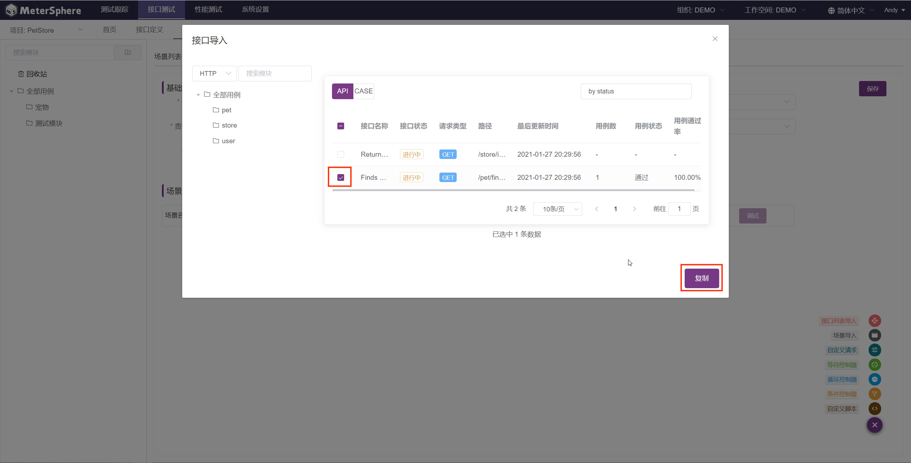
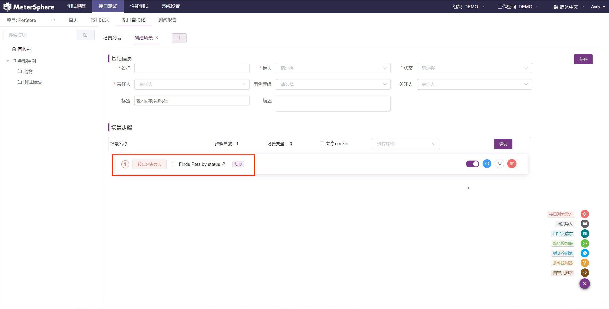
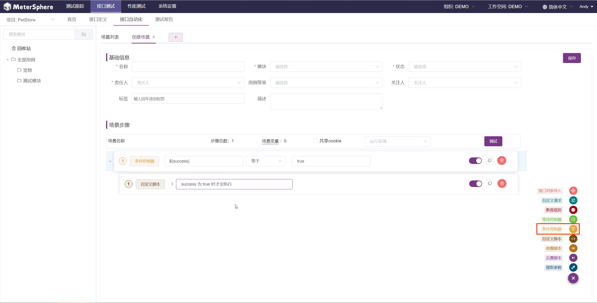
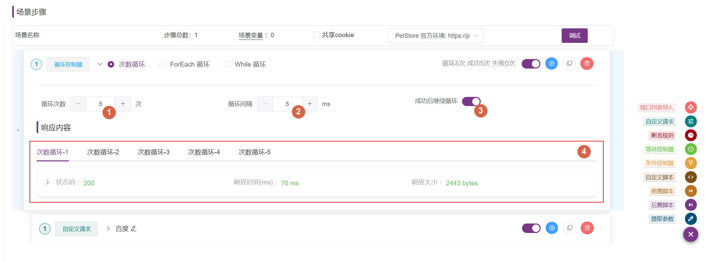
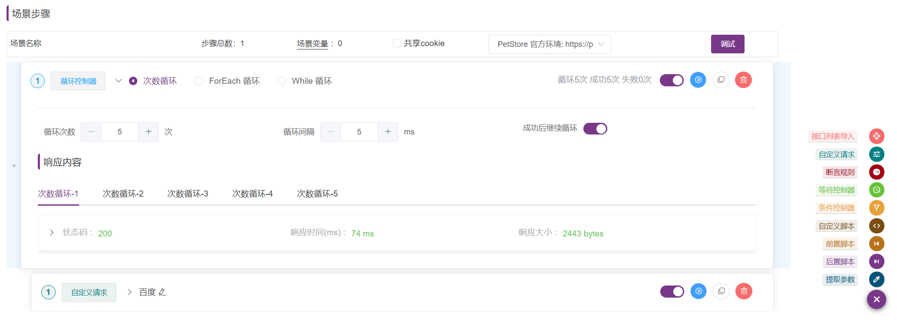
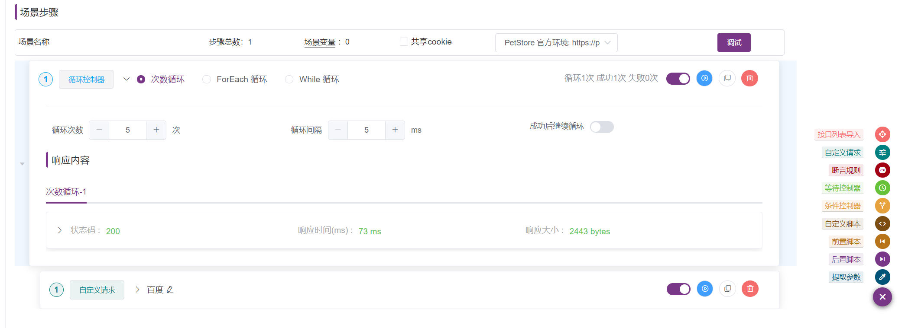
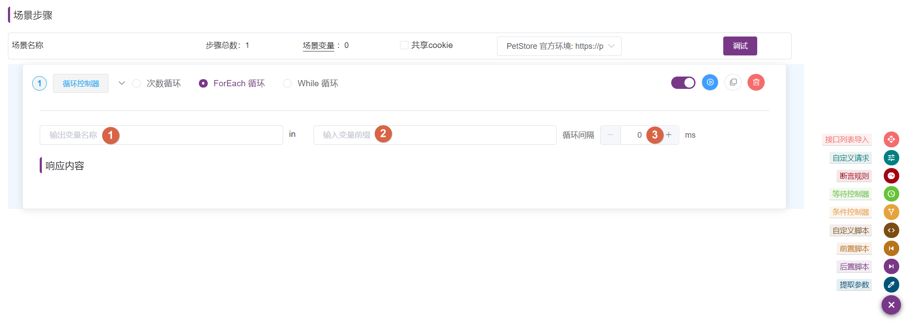
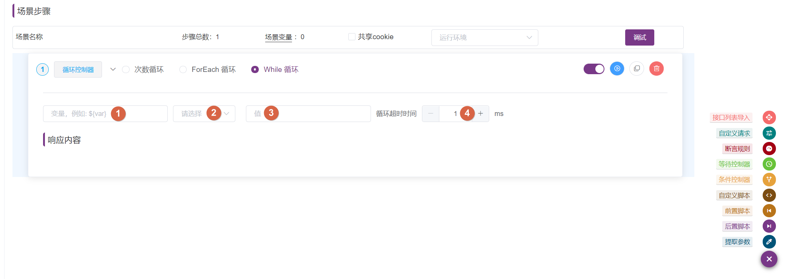
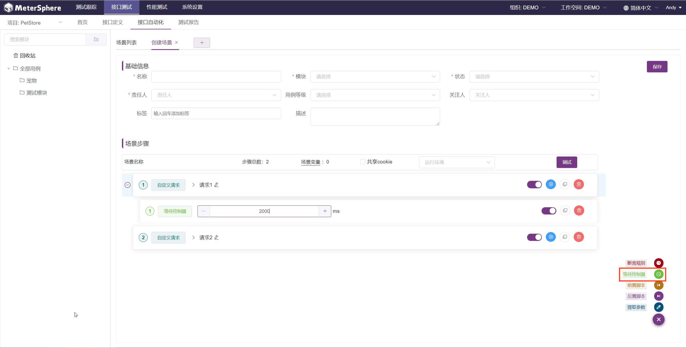

#单接口用例步骤

## 1 前置脚本
!!! ms-abstract "" 
    前置脚本可以添加为请求的子步骤，在请求发送前执行，可以用在修改请求内容、初始化请求需要的参数值等场景。

    目前 MeterSphere 支持以下几种语言的前置脚本：

    - BeanShell
    - Python2
    - Groovy
    - JavaScript 

    与 JMeter 一样，脚本在加载前已经内置了部分变量，在脚本中可以直接使用这些变量。

    - `log` - [Logger]，用于在脚本执行过程中打印日志
    ```
    //打印 `Hello World!` 到 info 日志中
    log.info("Hello World!");
    ```
    - `Label` - 前置脚本所属请求的请求名称
    - `SampleResult` - 当前请求请求结果 [SamplerResult]() 的指针
    ```
    //设置请求结果成功或失败
    SampleResult.setSuccessful(true/false);
    //设置请求返回码
    SampleResult.setResponseCode("code");
    //设置请求返回消息
    SampleResult.setResponseMessage("message");
    ```
    - `sampler` - 当前请求 [sampler]() 的指针
    ```
    //获取当前请求名称
    sampler.getName();
    ```
    - `vars` - [JMeterVariables]()，用于操作变量
    ```
    //获取变量 VAR1 的值
    vars.get("VAR1");
    //设置变量 VAR2 的值为 value
    vars.put("VAR2","value");
    //移除变量 VAR3
    vars.remove("VAR3");
    ```

    **【注意】** 不同脚本语言语法不同，以上示例仅针对 BeanShell 或 Groovy。

    在接口 CASE 编辑页面，操作 Tab 页前置操作菜单：提供了多种不同类型和范围的标准代码模板，同时还支持用户自定义代码模板。代码模版分为：① API测试、② 自定义变量、③ 项目环境、④ 自定义代码片段、⑤ 异常处理。
{ width="900px" }

### 1.1 API测试 
!!! ms-abstract "" 
    【从Api定义导入】：API定义导入可以直接导入 API 或 CASE 自动生成脚本。点击【API定义导入】按钮，从接口列表 ①  API/ ② CASE 选择 ③ 目标数据点击 ④ 【确定】会在前置脚本中默认生成 beanshell 脚本。脚本语言可切换，默认支持 beanshell 、python2 、groovy 、javascript 语法。
{ width="900px" }

{ width="900px" }

!!! ms-abstract "" 
    点击【新API测试[json]】可以自动生成 json 请求方式的 API 请求模板。
{ width="900px" }

### 1.2 自定义变量 
!!! ms-abstract "" 
    在【自定义变量】方法列表，① 选择需要的自定义变量方法可 ② 自动生成获取变量的脚本。包括获取响应头、获取响应码、获取响应等脚本，以获取接口调试结果中的响应头、响应码、响应结果等信息。
{ width="900px" }

### 1.3 项目环境 
!!! ms-abstract "" 
    选择【项目环境】，① 设置环境参数，② 自动生成设置环境变量方法填写对应方法键值对即可试用。
    * vars.put(${__metersphere_env_id}+"key","value"); // 将值存储为环境变量，可在【环境-通用设置】处看到值。当前环境下的所有接口使用。<br>
    * vars.put("key","value")。 // 将值存储为场景变量 <br>
    * 存为环境变量的值，在当前请求引用不到，需要结合存为变量的代码才可以当前请求以及之后请求都可引用到。
{ width="900px" }

### 1.4 自定义代码片段 
!!! ms-abstract "" 
    选择【自定义代码】，① 插入代码片段，② 选择系统定义好的自定义代码片段可直接 ③ 复用项目管理中维护的自定义代码片段。
{ width="900px" }
{ width="900px" }

### 1.5 异常处理
!!! ms-abstract ""  
    选择【异常处理】，① 终止测试，可自动生成 ② 终止测试线程的脚本。设置终止测试异常条件，接口或场景执行过程中匹配到终止条件则终止该进程。
{ width="900px" }

## 2 后置脚本
!!! ms-abstract ""  
    后置脚本与前置脚本类似，可以添加为请求的子步骤，在请求发送后执行，可以用于处理响应结果，从中提取变量等场景。
{ width="900px" }

## 3 前置 SQL
!!! ms-abstract ""  
    在请求发送之前执行 SQL 脚本。前置操作下拉选择 ① 前置SQL，配置 ② 运行环境及 ③ 目标数据源，可直接在 ④ SQL脚本中编写 SQL 语句，返回的接口支持存储结果、按列存储，支持在 SQL脚本中设置变量传参。
    * 存储结果：返回结果的所有字段存储到一个变量中。可配合脚本处理获返回结果中的某一部分值。
    * 按列存储：直接指定取出返回结果字段的值，列名要和SQL语句中查询返回结果列名对应。⑤ 可以用逗号作为占位符代替列名，只写出要提取的列名即可。 如图所示查询,用户 user 通过`${user_n}`进行引用，n为行数，`${user_1}` 为 user 列的第一行值。
{ width="900px" }
{ width="900px" }

## 4 后置SQL
!!! ms-abstract ""  
    后置SQL与前置SQL类似，在请求执行完成后的SQL处理。

## 5 断言规则
!!! ms-abstract ""  
    断言的主要功能是通过验证响应报文是否满足需求规约来验证接口运行是否正确。添加断言按钮，接口 ①【断言规则】菜单下可以添加断言。在同一个断言步骤内可以选择断言方式添加多条断言，断言编辑完成后需要点击 ② 【添加】按钮进行添加。<br />  断言方式：支持 文本、正则、JSONPath、XPath、响应时间、脚本、文档结构校验。
{ width="900px" }
{ width="900px" }

### 5.1 文本断言
!!! ms-abstract ""  
    断言方式选择：① 文本断言。支持选择 ② 断言对象 ③ 条件选择文本内容进行判断即可。④ 支持忽略结果状态选项。例如希望进行返回码为 401 的断言时，需要勾选该选项，否则请求仍会被视为失败状态。
    * 支持选择对象 `Response Code`，`Response Headers`，`Response Data` 。
    * 条件支持选择`包含`，`不包含`，`等于`，`以...开始`，`以...结束` 
    * 断言对象需要匹配的值，匹配成功则断言成功，否则断言失败。
{ width="900px" }


### 5.2 正则断言
!!! ms-abstract "" 
    正则断言较为灵活，适用于请求的响应内容不是 JSON、XML、HTML 等这样的标准且常见的结构化文本时。<br />
    断言方式选择：① 正则断言。支持选择 ② 断言对象并设置 ③ Perl型正则表达式保存。
    * 支持选择对象`Response Code`，`Response Headers`，`Response Data`。
    * Perl型正则表达式：断言对象需要匹配的正则表达式，匹配成功则断言成功，否则断言失败。
{ width="900px" }

!!! ms-abstract 示例
    请求的响应体：
    ```
    id="ddc86657-d402-4c10-b458-2ba2e4604cef"&name="myorg"&description="test org"
    ```
    断言需求：判断响应体中包含 `name="任意文本"`。

    断言配置：
    
    - 对象：`Response Data`
    - Perl型正则表达式：`name=".*?"`

### 5.3 JSONPath 断言 
!!! ms-abstract "" 
    JSONPath 断言适用于请求的响应内容是 JSON 格式时，可以方便的通过 JSONPath 表达式定位到特定字段，设定其期望值。<br />
    断言方式选择：① JSONPath 断言。填写 ② JSONPath 表达式并设置 ③ 期望值即可完成。MeterSphere 在此处提供了快捷操作，点击 ④【推荐JSONPath断言】弹出页点击文本标签即可快速生成一份断言 JSONPath 表达式。
    * JSONPath表达式：JSONPath 表达式，通过该表达式定位到特定字段。
    * 期望值：通过 JSONPath 表达式定位的字段的期望值，支持正则表达式。
{ width="900px" }
{ width="900px" }


### 5.4 XPath 断言 
!!! ms-abstract "" 
    XPath 断言适用于请求的响应内容是 XML、HTML 等格式时，可以方便的通过 XPath 表达式定位到特定字段，设定其期望值。<br />
    断言方式选择：① XPath 断言。填写 ② XPath 表达式即可。
    * XPath表达式：需要进行匹配的 XPath 表达式。
{ width="900px" }

!!! ms-abstract "示例" 
    **请求的响应体**：
    ```xml
    <root xmlns:foo="http://www.foo.org/" xmlns:bar="http://www.bar.org">
        <employees>
            <employee id="1">Johnny Dapp</employee>
            <employee id="2">Al Pacino</employee>
            <employee id="3">Robert De Niro</employee>
            <employee id="4">Kevin Spacey</employee>
            <employee id="5">Denzel Washington</employee>
        </employees>
        <foo:companies>
            <foo:company id="6">Tata Consultancy Services</foo:company>
            <foo:company id="7">Wipro</foo:company>
            <foo:company id="8">Infosys</foo:company>
            <foo:company id="9">Microsoft</foo:company>
            <foo:company id="10">IBM</foo:company>
            <foo:company id="11">Apple</foo:company>
            <foo:company id="12">Oracle</foo:company>
        </foo:companies>
    </root>
    ```
    **断言需求**：判断响应体中的 id 为 10 的公司名称为 `IBM`

    **断言配置**：
    
        - XPath 表达式：//foo:company[@id=10]='IBM'

### 5.5 响应时间断言 
!!! ms-abstract "" 
    响应时间断言适用于对请求的响应时间有特定要求时。<br />
    断言方式选择：① 响应时间。填写 ② 需要指定时间（毫秒）即可。
    * 响应时间在...毫秒以内：以毫秒为单位的响应时间期望，当实际响应时间小于等于该值时断言成功。
{ width="900px" }
    
### 5.6 脚本断言 
!!! ms-abstract "" 
    脚本断言提供了更加强大、灵活的处理能力，通过可以根据自身需求选择合适的语言编写脚本来设定断言结果，适用于常规断言无法满足需求时使用。。<br />
    断言方式选择：① 脚本。点击 ②【编辑】按钮，可以直接 ③ 编写断言脚本，支持直接使用接口步骤设置好的变量及 AssertionResult 变量。
      * 与前后置脚本一样，脚本在加载前已经内置了部分变量，目前支持 `BeanShell`、`Groovy`、`Python` 、`NashornScript`及`RhinoScript` 脚本语言。除了在之前已经介绍过的变量外，脚本断言中的脚本还额外提供了以下变量。  
    - `AssertionResult` - 断言结果对象，可以通过 `AssertionResult.setFailure(true)` 方法设置断言是否成功，通过 `AssertionResult.setFailureMessage("message")` 方法设置断言失败提示信息。
{ width="900px" }
{ width="900px" }

### 5.7 文档结构校验 
!!! ms-abstract "" 
    文档结构校验断言支持从响应体信息中选择需要断言信息。<br />
     断言方式选择：① 文档结构校验，可选择 ② 校验格式JSON/XML，点击 ③ 【添加】按钮即可设置需要校验的格式，支持导入自定义 JSON 串校验格式及跟随API 定义。
{ width="900px" }

!!! ms-abstract "" 
    导入文档校验： ① 点击【导入】可导入需断言 ② Json/xml 数据，自动生成文档结构校验元素表格。可以自定义设置 ③ 校验规则。<br />
    跟随 API 定义：是 API 响应体设置返回值一致，勾选【跟随API定义】可以自动生成内容校验。
 { width="900px" }

{ width="900px" }

## 6 提取参数
!!! ms-abstract "" 
    参数提取功能主要用于从请求响应中提取特定返回值并存储到变量中，便于在后续的步骤中引用该返回值。<br />
     ① 后置操作可以选择【提取参数】点击添加，② 提取参数区域可选择的提取方式不同，展示不同的配置内容。 提取数据的方式支持正则、JSONPath、XPath。
    
{ width="900px" }


### 6.1 正则提取 
!!! ms-abstract "" 
    正则提取较为灵活，适用于请求的响应内容不是 JSON、XML、HTML 等这样的标准且常见的结构化文本时。<br />
    正则提取：① 选择提取对象，设置 ② 变量名 ③ 正则表达式，添加即可。
    * 对象：希望进行提取的对象，支持选择 `Body`，`Request Headers`，`Response Headers`，`URL`，`Response Code`，`Response Message` 
    * 变量名：保存提取值的变量名，后续可以通过 `${varName}` 形式引用到，如果选择了 【匹配多个】可以通过 `${varName_matchNr}` 获取到匹配的总个数，通过 `${varName_n}` 依次获取到每个匹配值。
    * Perl型正则表达式：提取特定值使用的正则表达式，将提取正则表达式中的第一个组。
{ width="900px" }

!!! ms-abstract "示例"
    请求的响应体：
    ```
    id="ddc86657-d402-4c10-b458-2ba2e4604cef"&name="myorg"&description="test org"
    ```
    提取需求1：响应体中 `name` 字段的值。

    提取配置：
    
    - 对象：`Body`
    - 变量名：`name`
    - Perl型正则表达式：`name="(.*?)"`

### 6.2 JSONPath 提取 
!!! ms-abstract "" 
    JSONPath 提取适用于请求的响应内容是 JSON 格式时，可以方便的通过 JSONPath 表达式定位到特定字段进行提取。<br />
    JSPONPath 提取：设置 ① 变量名 ② JSONPath 表达式，点击【添加】按钮即可。MeterSphere 提供了 ③ 【推荐JSONPath 提取】的快捷提取方式，可以通过提示的标签快速生成表达式。
    * 变量名：保存提取值的变量名，后续可以通过 `${varName}` 形式引用到，如果选择了【匹配多个】，可以通过 `${varName_matchNr}` 获取到匹配的总个数，通过 `${varName_n}` 依次获取到每个匹配值。
    * JSONPath表达式：JSONPath 表达式，通过该表达式定位到要提取的字段。
{ width="900px" }
{ width="900px" }

!!! ms-abstract "示例"
    请求的响应体：
    ```json
    {
        "success": true,
        "message": null,
        "data": {
            "id": "ddc86657-d402-4c10-b458-2ba2e4604cef",
            "name": "myorg",
            "description": "form api",
            "createTime": 1611154807818,
            "updateTime": 1611154807818
        }
    }
    ```
    提取需求：提取响应体 `data` 中的 `name` 字段并存储在 `name` 变量中。<br />
    提取配置：
    * 变量名：name
    * JSONPath 表达式：$.data.name

### 6.3 XPath 提取 
!!! ms-abstract "" 
    XPath 提取适用于请求的响应内容是 XML、HTML 等格式时，可以方便的通过 XPath 表达式定位到特定字段进行提取。<br />
    XPath 提取：设置 ① 变量名 ② XPath 表达式，点击【添加】按钮即可。根据请求响应内容格式支持 html、xml 格式。
    * 变量名：保存提取值的变量名，后续可以通过 `${varName}` 形式引用到，如果选择了【匹配多个】，可以通过 `${varName_matchNr}` 获取到匹配的总个数，通过 `${varName_n}` 依次获取到每个匹配值。
    * XPath表达式：需要进行匹配的 XPath 表达式。
{ width="900px" }

!!!  ms-abstract "示例"
    请求的响应体：
    ```xml
    <root xmlns:foo="http://www.foo.org/" xmlns:bar="http://www.bar.org">
        <employees>
            <employee id="1">Johnny Dapp</employee>
            <employee id="2">Al Pacino</employee>
            <employee id="3">Robert De Niro</employee>
            <employee id="4">Kevin Spacey</employee>
            <employee id="5">Denzel Washington</employee>
        </employees>
        <foo:companies>
            <foo:company id="6">Tata Consultancy Services</foo:company>
            <foo:company id="7">Wipro</foo:company>
            <foo:company id="8">Infosys</foo:company>
            <foo:company id="9">Microsoft</foo:company>
            <foo:company id="10">IBM</foo:company>
            <foo:company id="11">Apple</foo:company>
            <foo:company id="12">Oracle</foo:company>
        </foo:companies>
    </root>
    ```
    提取需求：提取响应体中的 `id` 为 3 的员工的姓名，即上述响应中的 `Robert De Niro`，并存储在 `employeeName` 变量中。

    提取配置：
    - 变量名：employeeName
    - XPath 表达式：string(//employee[@id='3'])

#  场景用例步骤

## 1 接口列表导入
!!! ms-abstract "" 
    通过接口列表导入功能，可以直接添加接口定义功能中已维护好的接口或接口下的用例，减少重复填写接口请求参数的情况。

### 1.1 导入接口






### 1.2 导入用例 


!!! info "说明"
    导入用例时提供【复制】和【引用】两种方式。通过【复制】方式导入的用例，当原用例发生变化时，场景中导入的用例不会改变；通过【引用】方式导入的用例，当原用例发生变化时，场景中导入的用例也会随之改变。

## 2 自定义请求
通过添加自定义请求，用户可以自由编辑该请求的详细信息，该请求不需要事先存在于接口定义中。目前支持 HTTP、TCP、DUBBO、SQL 等不同类型的请求。


## 3 自定义脚本
自定义脚本与前后置脚本使用方式类似，但是可以独立添加，不需要依赖于某个已有请求作为其子步骤。目前支持的脚本语言及内置变量请参考 [前置脚本](#_2)。


## 4 场景导入
用户可以维护一些基础、通用场景，通过场景导入功能，可以直接将已有的场景添加到当前场景中，减少重复工作，提高场景的复用性。


!!! info "说明"
    导入场景时提供【复制】和【引用】两种方式。通过【复制】方式导入的场景，当原场景发生变化时，场景中导入的场景不会改变；通过【引用】方式导入的场景，当原场景发生变化时，场景中导入的场景也会随之改变。

## 5 条件控制器
当条件控制器中配置的条件满足时，条件控制器下的子步骤才会执行，否则子步骤会被跳过。


## 6 循环控制器
通过使用循环控制器，可以重复执行循环控制器下的子步骤，目前 MeterSphere 提供了【次数循环】、【ForEach 循环】和【While 循环】三种循环方式。


### 6.1 次数循环 
次数循环支持自定义设置循环次数、循环间隔等。


!!! info "参数说明"
    1. **循环次数**：该循环控制器下的子步骤总共执行的次数。
    2. **循环间隔**：每次执行间的时间间隔，以毫秒为单位。
    3. **成功后是否继续循环**：仅循环控制器下存在一个请求时可以关闭。当关闭时，若循环控制器下的请求是成功状态，则立即终止循环，无论有没有达到循环次数。可以用在异步请求后轮询查询执行结果的场景，当查询结果符合预期时终止循环，避免多余的查询操作。

!!! info "示例"
    开启【成功后继续循环】，循环总共执行了 5 次。
    
    
    关闭【成功后继续循环】，由于循环下的请求第一次便执行成功，循环仅执行了 1 次。
    

### 6.2 ForEach 循环 
ForEach 循环一般配合列表变量使用，例如存在 `ID_1`，`ID_2`，`ID_3` 形式的一组变量时，可以通过 ForEach 循环使用其中每个 ID 发送特定请求。


!!! info "参数说明"
    1. **输出变量名称**：在循环中可以通过该变量引用到列表变量中当前迭代的变量值。
    2. **输入变量前缀**：列表变量的变量前缀。
    3. **循环间隔**：每次执行间的时间间隔，以毫秒为单位。

!!! info "示例"
    在场景变量中设置列表变量 ID，列表值为`ID_1`，`ID_2`，`ID_3`。
    
    
    遍历场景变量中的列表变量，在【前置脚本】中打印列表变量中的每个值。
    
    
    循环次数与列表长度相同，且输出列表变量中的每个值。
    
    
### 6.3 While 循环 
While 循环更为灵活，当配置的条件满足时循环会一直进行。


!!! info "参数说明"
    1. **变量**：要进行判断的变量。
    2. **判断条件**：变量与期望值的比较方式。
    3. **值**：要对变量进行判断的值。
    4. **循环超时时间**：由于 while 循环的特殊性，当条件满足时将会一直循环，为了避免死循环的情况出现，用户可以配置循环超时时间，到超过该时间后，不管循环条件是否满足，循环都将被终止。

!!! info "示例"
      在场景变量中设置常量变量 NUM，值为5。
     
     
     设置 While循环的条件，在前置脚本获取变量值并更改变量值
     
     
     每次循环修改的值在控制台进行打印
     

## 7 等待控制器
当某个步骤执行后需要等待一段时间时使用。当作为步骤添加时，与之同级的所有步骤均会等待若干时间；作为某个步骤的子步骤添加时，该步骤将等待若干时间后再执行。


## 8 事务控制器
来源于JMeter，不影响请求，在JMeter中主要是为了事务划分，把事务控制器下的所有请求当成一个事务。在做性能测试的时候比较有意义，比如用户一个动作包含很多个请求，这部分请求就都放在一个事务控制器下，当成一个事务。


## 9 前置脚本
与单接口用例步骤中的前置脚本类似，请参考 [前置脚本](#1)。

## 10 后置脚本
与单接口用例步骤中的后置脚本类似，请参考 [后置脚本](#12)。

## 11 前置SQL
与单接口用例步骤中的前置SQL类似，请参考 [前置SQL](#13-sql)。

## 12 后置SQL
与单接口用例步骤中的后置SQL类似，请参考 [后置SQL](#14-sql)。

## 13 断言规则
与单接口用例步骤中的断言规则类似，请参考 [断言规则](#15)。

## 14 提取参数
与单接口用例步骤中的提取参数类似，请参考 [提取参数](#16)。

