## 1 新建请求
!!! ms-abstract "" 
    点击【新建】或者【＋】新建接口请求。
{ width="900px" }

!!! ms-abstract "" 
    按下图序号顺序，依次选择接口协议、接口方法，输入请求 URL 、请求参数、认证信息等，点击执行调试成功后保存或直接保存。
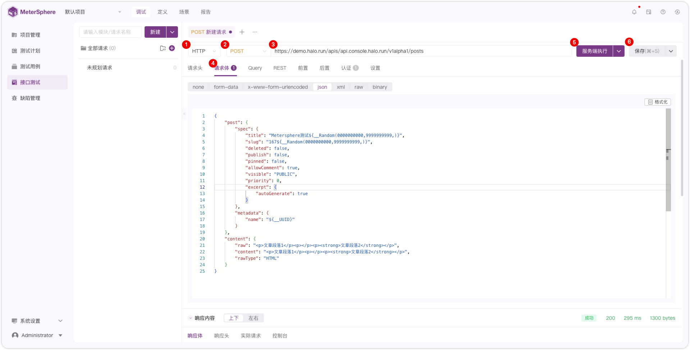{ width="900px" }

!!! ms-abstract "" 
    - 序号1：接口协议类型，默认 http 协议。（接口协议插件拓展后支持多选，接口插件可以参考 [插件列表](../../plugin.md)）。
    - 序号2：接口方法类型（支持 GET、POST、PUT、DELETE、PATCH、OPTIONS、HEAD、CONNECT）。
    - 序号3：输入包含 http 或 https 的完整 URL。如：`https://demo.halo.run/apis/api.console.halo.run/v1alpha1/posts` 。
    - 序号4：输入请求头、请求体、前后置操作、认证方式等。
    - 序号5：选择服务端执行或者本地执行。（本地执行需在【个人信息-本地执行】页面配置本地 `task_runner` 地址。详情参考 [本地执行](../personal_center/information.md#4-本地执行)）。
    - 序号6：保存。

!!! ms-abstract "说明" 
    - 参数介绍：包含请求头、请求体、Query、REST；详情请参考 [参数介绍](../api_test/request_params.md)。
    - 内置函数：请求体参数可选择 **内置函数** [内置函数](../api_test/functions.md)。

!!! ms-abstract "" 
    点击保存后输入请求名称、模块信息，点击【确定】。
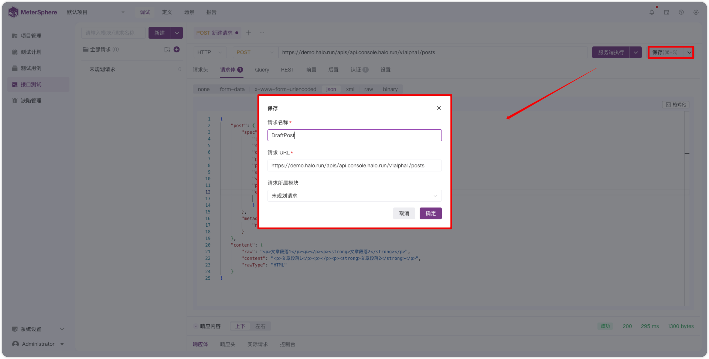{ width="900px" }   

## 2 导入 cURL 请求
!!! ms-abstract "" 
    点击【新建请求】，下拉点击【导入请求】按钮。
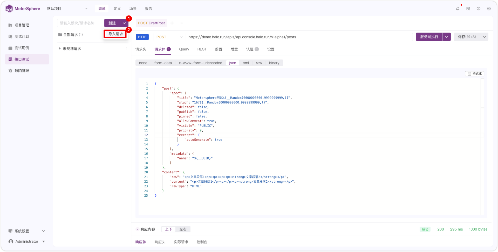{ width="900px" }

!!! ms-abstract "" 
    打开浏览器，按 F12 快捷键打开 NetWork ，根据下图示意复制 cURL 请求。
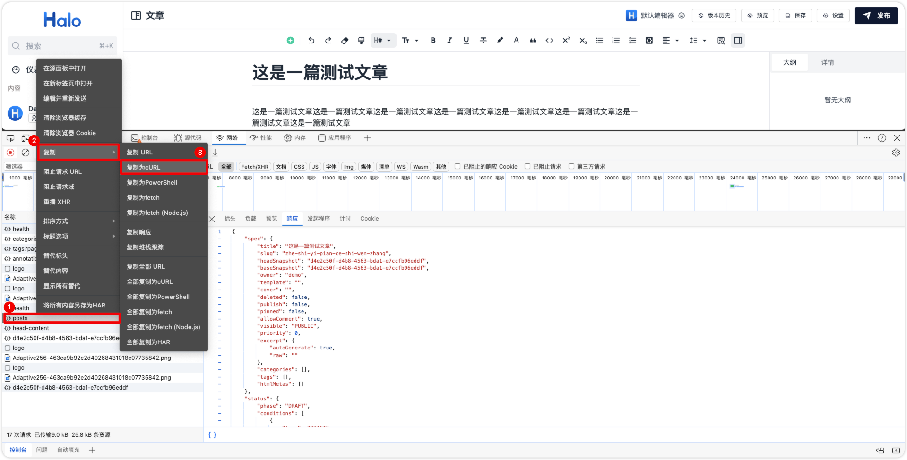{ width="900px" }

!!! ms-abstract "" 
    录入上图复制的 cURL 请求信息，点击确认。
{ width="900px" }    

!!! ms-abstract "说明" 
    导入 cURL 支持快速导入 Chrome、Charles 或 Fiddler 等工具中的抓包数据。

## 3 执行
!!! ms-abstract "" 
    输入接口的认证信息，可根据具体接口的认证类型，通过认证方式、请求头输入 cookie、前置脚本获取 token 等方式进行认证。如下图 Halo 接口采用 Basic Auth 登录认证方式。 
    **选择【服务端执行】或者【本地执行】**
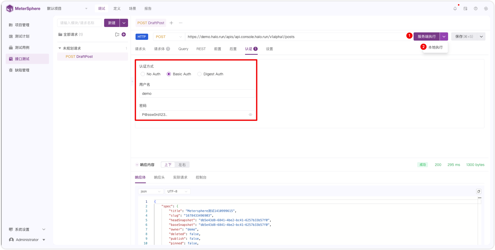{ width="900px" }  

!!! ms-abstract "注意" 
    - 本地执行：进行本地接口调试，调用本地部署的 `task-runner` 执行机。`task-runner` 部署和配置教程请参考：[task_runner 部署配置教程](../api_test/functions.md)。
    - 服务端执行：进行线上接口调试，调用部署在服务器端的 `task-runner`，默认使用【系统初始化资源池】。

## 4 响应内容
!!! ms-abstract "" 
    执行后在页面下方查看响应体、响应头、实际请求和控制台信息。
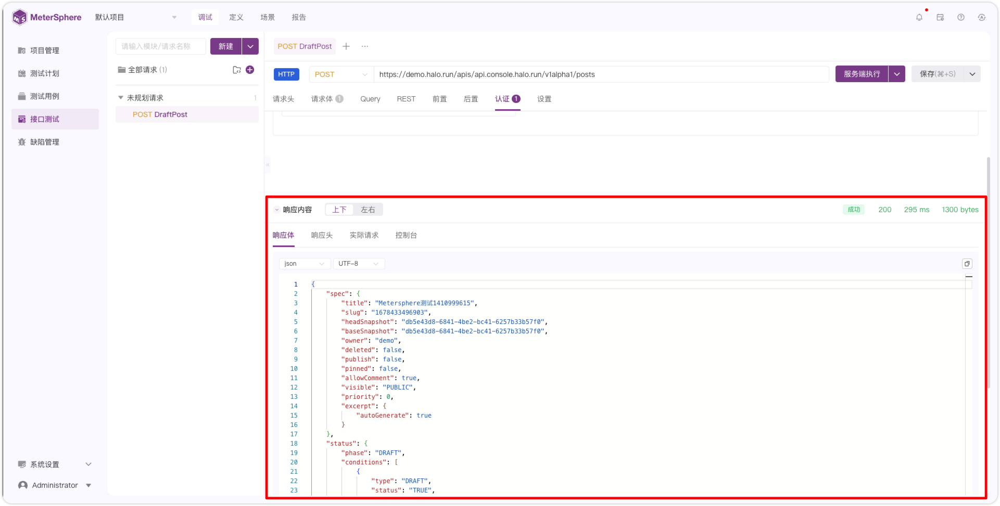{ width="900px" }      

!!! ms-abstract "" 
    点击【上下/左右】切换响应内容布局。
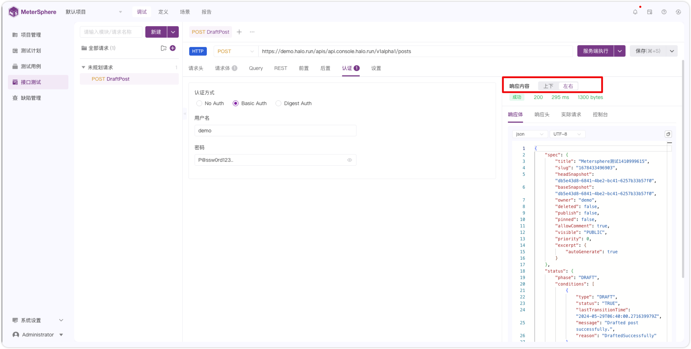{ width="900px" }    

## 5 重命名
!!! ms-abstract "" 
    点击【重命名】修改请求名称。
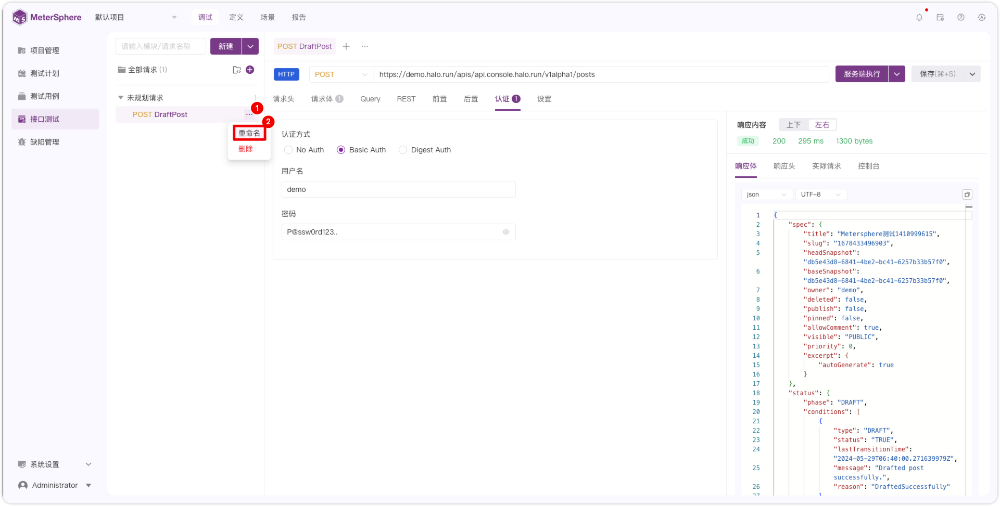{ width="900px" }      

## 6 收起/展开全部请求
!!! ms-abstract "" 
    点击【收起/展开】图标收起/展开全部请求。
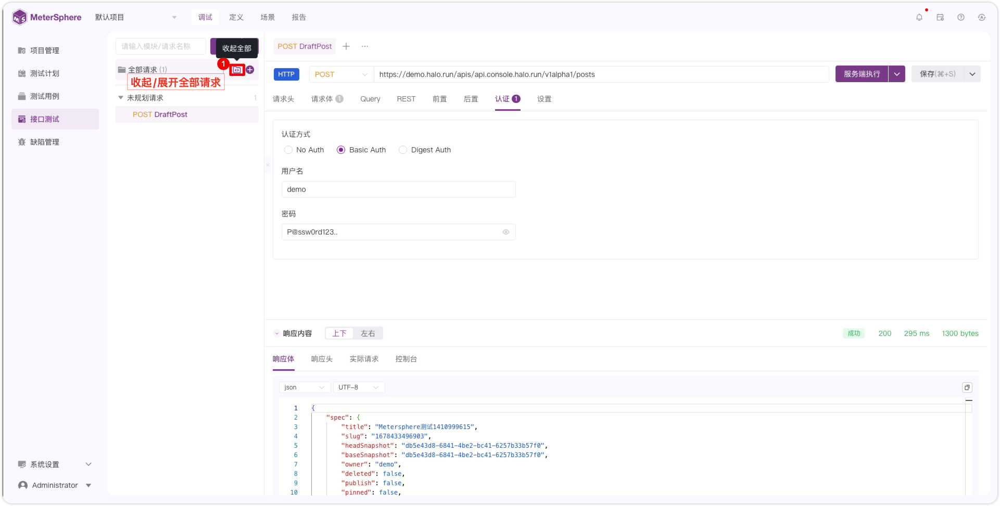{ width="900px" }    

## 7 搜索
!!! ms-abstract "" 
    输入模块名或请求名称快速搜索请求。
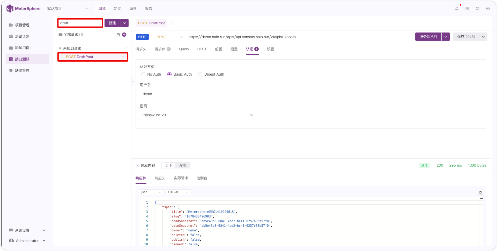{ width="900px" }    

## 8 删除
!!! ms-abstract "" 
    点击【删除】操作删除请求。
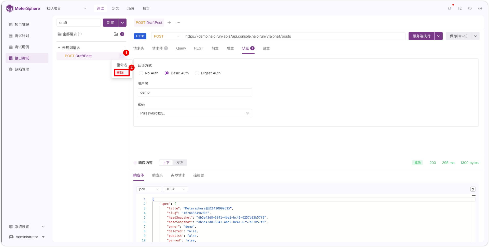{ width="900px" }    

!!! ms-abstract "注意" 
    调试请求删除后无法恢复，请谨慎操作！