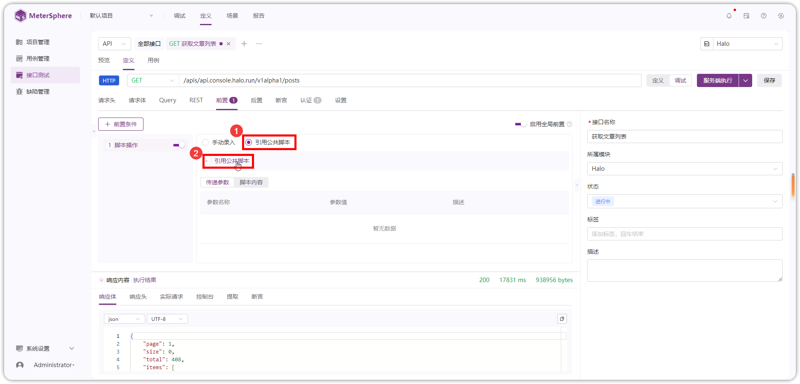
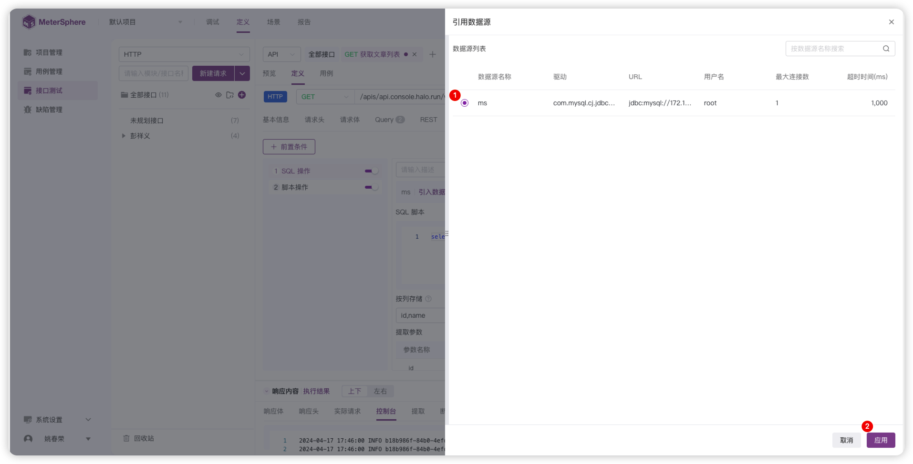

## 1 前置
## 1.1 脚本操作
!!! ms-abstract "" 
    【前置脚本】在请求发送前执行，可以用于生成认证签名或获取 token、修改请求内容、初始化请求需要的参数值等场景。
    **脚本语言支持：**

        BeanShell-JSR223（默认，相比 BeanShell 执行速度更快，多在性能测试场景下使用）
        BeanShell
        Python3
        Groovy
        JavaScript

!!! ms-abstract "示例1" 
    **执行过程中在控制台打印日志。**

        //打印 `Hello World!` 到控制台的日志中
        log.info("Hello World!");

!!! ms-abstract "示例2" 
    **在前置脚本中获取请求参数。**

        import org.apache.jmeter.config.Arguments;
    
        //获取请求的body参数
        Arguments args = sampler.getArguments();
        
        //将获取到的参数转换成字符串格式
        String json = args.getArgument(0).getValue();
        //注意：getArgument(0)中的0，一般获取到的请求参数中只有第0个数据。
        //在获取返回值时，才会有多个数据列
        
        log.info("{}", json);
        //输出值为：{"userId":"123456","userType":"123","type":"1"}

!!! ms-abstract "示例3" 
    **操作变量。**

        //获取变量 VAR1 的值
        vars.get("VAR1");
        //设置变量 VAR2 的值为 value
        vars.put("VAR2","value");
        //移除变量 VAR3
        vars.remove("VAR3");

!!! ms-abstract "手动录入" 
    如下图，按照【序号1-6】完成【手动录入】脚本并调试。
{ width="900px" }   

!!! ms-abstract "引用公共脚本" 
    如下图，选择【引用公共脚本】，点击【引用公共脚本】，在弹出的公共脚本列表页面中选择项目管理中的公共脚本。

    **注意：**

        引入的公共脚本仅参数值可修改。
        通过引入公共脚本方式添加的为引用关系，会跟随原始脚本的变化，当原始脚本更新时，有高亮 new 图标显示。

{ width="900px" }   

{ width="900px" }   

!!! ms-abstract "说明" 
    【公共脚本】相关配置请参考： [公共脚本](../project_management/public_script.md)。

## 1.2 SQL 操作
!!! ms-abstract "" 
    【前置 SQL】在请求发送前执行，可用于接口请求前的数据准备工作。
!!! ms-abstract "" 
    如下图，按照【序号】顺序，添加【SQL 操作】并【引入数据源】。    
{ width="900px" }  

{ width="900px" }  

!!! ms-abstract "说明" 
    【数据源】相关配置请参考： [数据源](../project_management/environment.md#1-环境)。

## 1.2 等待时间

## 2 后置
### 2.1 脚本操作
### 2.2 SQL 操作
### 2.3 提起参数

## 3 断言
### 3.1 状态码
### 3.2 响应头
### 3.3 响应体
### 3.4 响应时间
### 3.5 变量
### 3.6 脚本名称

## 4 认证

## 5 设置

