## 1 前置
### 1.1 脚本操作
!!! ms-abstract "" 
    【前置脚本】在请求发送前执行，用于生成认证签名或获取 token、修改请求内容、初始化请求需要的参数值等场景。 
    **脚本语言支持：**

        BeanShell-JSR223（默认，相比 BeanShell 执行速度更快，多在性能测试场景下使用）
        BeanShell
        Python3
        Groovy
        JavaScript

!!! ms-abstract "示例" 
    - **执行过程中在控制台打印日志。**

            //打印 `Hello World!` 到控制台的日志中
            log.info("Hello World!");

    - **在前置脚本中获取请求参数。**

            import org.apache.jmeter.config.Arguments;
        
            //获取请求的body参数
            Arguments args = sampler.getArguments();
            
            //将获取到的参数转换成字符串格式
            String json = args.getArgument(0).getValue();
            //注意：getArgument(0)中的0，一般获取到的请求参数中只有第0个数据。
            //在获取返回值时，才会有多个数据列
            
            log.info("{}", json);
            //输出值为：{"userId":"123456","userType":"123","type":"1"}

    - **操作变量。**

            //获取变量 VAR1 的值
            vars.get("VAR1");
            //设置变量 VAR2 的值为 value
            vars.put("VAR2","value");
            //移除变量 VAR3
            vars.remove("VAR3");

!!! ms-abstract "" 
    - **手动录入**  
    按照【序号1-6】完成【手动录入】脚本并调试。
{ width="900px" }   

!!! ms-abstract "" 
     - **引用公共脚本**  
    选择【引用公共脚本】，点击【引用公共脚本】，在弹出的公共脚本列表页面中选择项目管理中的公共脚本。
!!! ms-abstract "注意" 
    引入的公共脚本仅参数值可修改。
    通过引入公共脚本方式添加的为引用关系，会跟随原始脚本的变化，当原始脚本更新时，有高亮 new 图标显示。

{ width="900px" }   

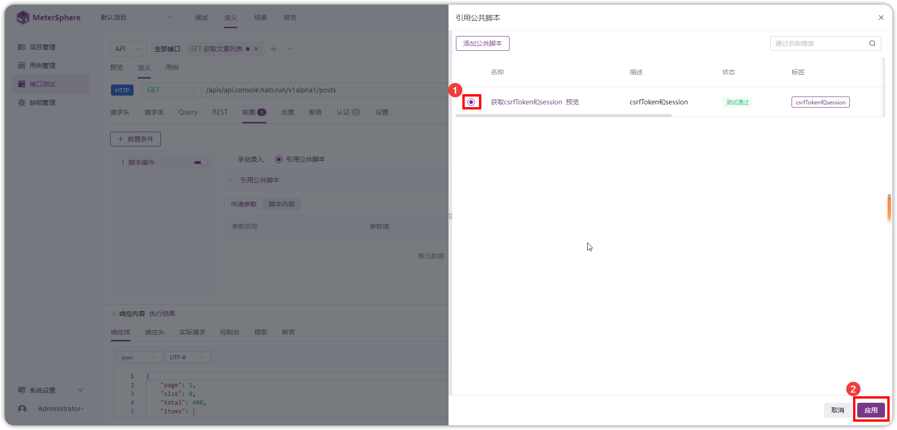{ width="900px" }   

!!! ms-abstract "说明" 
    【公共脚本】相关配置请参考： [公共脚本](../project_management/public_script.md)。

### 1.2 SQL 操作
!!! ms-abstract "" 
    【前置 SQL】在请求发送前执行，用于接口请求前的数据准备工作。
!!! ms-abstract "" 
    按照【序号】顺序，添加【SQL 操作】并【引入数据源】。    
{ width="900px" }  

{ width="900px" }  

!!! ms-abstract "说明" 
    【数据源】相关配置请参考： [添加数据源](../project_management/environment.md#1)。

### 1.3 等待时间
!!! ms-abstract "" 
    按照【序号】顺序，添加【等待时间】并修改等待时间。  
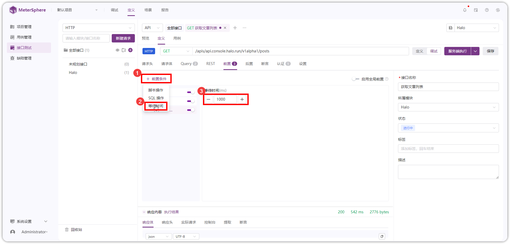{ width="900px" }  

### 1.4 启用全局前置
!!! ms-abstract "" 
    点击 启用或关闭【全局前置】。 
    默认开启，关闭则运行该接口时不执行全局前置。
{ width="900px" }  

!!! ms-abstract "说明" 
    【全局前置】相关配置请参考： [全局前置](../project_management/environment.md#12)。

### 1.5 代码片段快捷功能
!!! ms-abstract "" 
    在代码片段右侧可使用快捷操作生成代码片段。
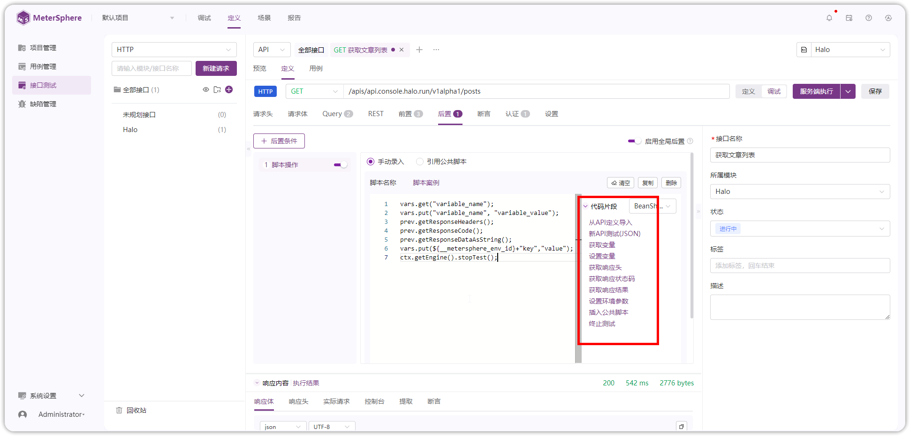{ width="900px" }  

!!! ms-abstract "说明"
    - 从 API 定义导入： 可根据接口定义自动生成该接口请求的代码片段。
    - 新 API 测试（JSON）： 自动生成 Httpclient 请求接口的代码片段。
    - 获取变量：获取变量，如：`vars.get("variable_name")`。
    - 设置变量：设置变量，如：`vars.put("variable_name", "variable_value")`。
    - 获取响应头：获取当前请求的响应头，如：`prev.getResponseHeaders()`。   
    - 获取响应状态码：获取当前请求的获取响应状态码，如：`prev.getResponseCode()`。   
    - 获取响应结果：获取当前请求的响应结果，如：`prev.getResponseDataAsString()`。  
    - 设置环境参数：设置当前执行环境的环境参数，如：`vars.put(${__metersphere_env_id}+"key","value")`。   
    - 插入公共脚本：插入项目管理中的公共脚本。
    - 终止测试：停止当前测试执行，如：`ctx.getEngine().stopTest()`。

## 2 后置
### 2.1 脚本操作
!!! ms-abstract "" 
    【后置脚本】在请求发送后执行，用于处理响应数据并进行数据转换、验证等操作。 
    **脚本语言支持：**

        BeanShell-JSR223（默认，相比 BeanShell 执行速度更快，多在性能测试场景下使用）
        BeanShell
        Python3
        Groovy
        JavaScript

!!! ms-abstract "示例" 
    - **特殊字符转义。**
 
            String rel = "\u7533\u51ef\u6ce2";
            try {
                String a = URLDecoder.decode(rel,"utf-8");
            } catch (UnsupportedEncodingException e) {
                // TODO Auto-generated catch block
                e.printStackTrace();
            }

    - **将文件响应内容存储到服务器。**

            import java.io.*;
  
            byte[] result = prev.getResponseData();
            String file_name = "/opt/metersphere/data/xxxx.xxx";
            File file = new File(file_name);
            FileOutputStream out = new FileOutputStream(file);
            out.write(result);
            out.close();

    - **操作变量。**

            //获取变量 VAR1 的值
            vars.get("VAR1");
            //设置变量 VAR2 的值为 value
            vars.put("VAR2","value");
            //移除变量 VAR3
            vars.remove("VAR3");

!!! ms-abstract "" 
    - **手动录入**  
    按照【序号1-6】完成【手动录入】脚本并调试。
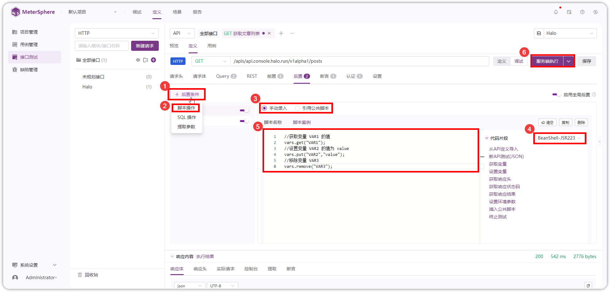{ width="900px" }   

!!! ms-abstract "" 
     - **引用公共脚本**  
    选择【引用公共脚本】，点击【引用公共脚本】，在弹出的公共脚本列表页面中选择项目管理中的公共脚本。
!!! ms-abstract "注意" 
    引入的公共脚本仅参数值可修改。
    通过引入公共脚本方式添加的为引用关系，会跟随原始脚本的变化，当原始脚本更新时，有高亮 new 图标显示。

{ width="900px" }   

{ width="900px" }   

!!! ms-abstract "说明" 
    【公共脚本】相关配置请参考： [公共脚本](../project_management/public_script.md)。

### 2.2 SQL 操作
!!! ms-abstract "" 
    【后置 SQL】在请求发送后执行，用于接口请求后的数据验证工作。
!!! ms-abstract "" 
    如下图，按照【序号】顺序，添加【SQL 操作】并【引入数据源】。    
{ width="900px" }  

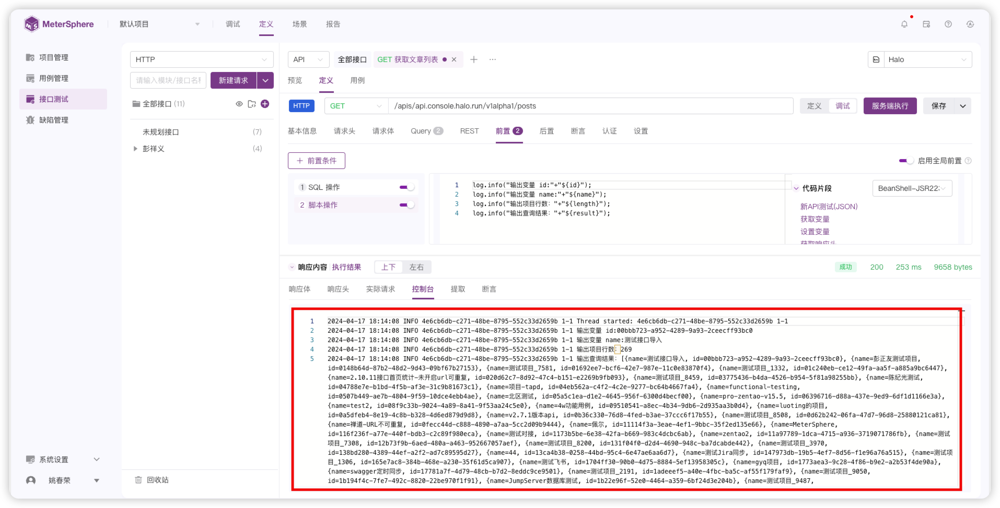{ width="900px" }  

!!! ms-abstract "说明" 
    【数据源】相关配置请参考： [添加数据源](../project_management/environment.md#1)。

### 2.3 提取参数
!!! ms-abstract "" 
    - 正则提取。 
    输入【参数名称】，选择【参数类型】，选择【正则】提取方式，选择提取对象的【范围】。
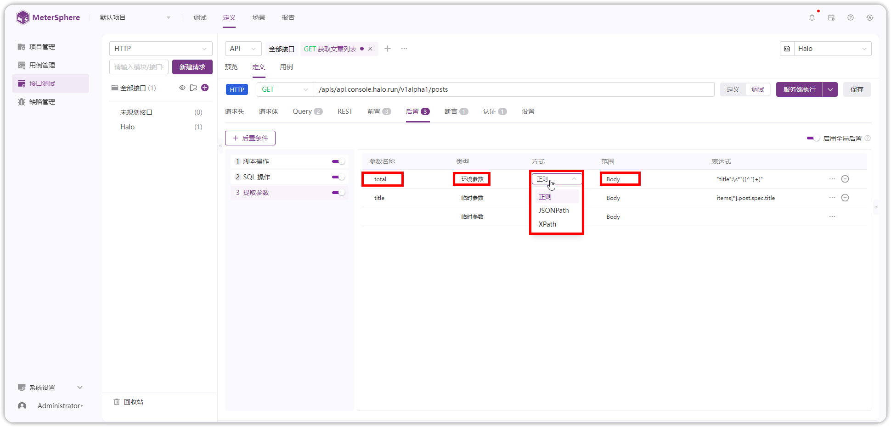{ width="900px" }      

!!! ms-abstract "" 
    在表达式处输入正则表达式或者点击【快捷提取】图标打开表达式【测试】页面。
{ width="900px" }         

!!! ms-abstract "" 
    在【快捷提取】页面，输入正则表达式，选择【匹配表达式/匹配组】点击【测试】，测试通过后设置【结果匹配规则】后点击【确认】。
{ width="900px" }  

!!! ms-abstract "" 
    在提取参数列表处，点击【...】可快捷设置【匹配规则】。
{ width="900px" }      

!!! ms-abstract "" 
    - JSONPath 提取。 
    输入【参数名称】，选择【参数类型】，选择【JSONPath】提取方式，选择提取对象的【范围】。
{ width="900px" }      

!!! ms-abstract "" 
    在表达式处输入 JSONPath 提取表达式或者点击【快捷提取】图标打开快捷提取页面。
{ width="900px" }         

!!! ms-abstract "" 
    在【快捷提取】页面，点击预期提取的字段快速生成 JSONPath 表达式，测试通过后设置【结果匹配规则】后点击【确认】。
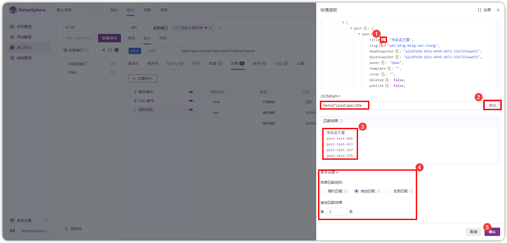{ width="900px" }  

!!! ms-abstract "" 
    在提取参数列表处，点击【...】可快捷设置【匹配结果规则】。
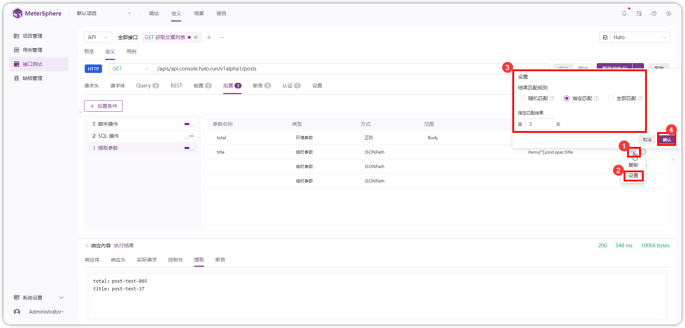{ width="900px" }     

!!! ms-abstract "" 
    - XPath 提取。
    输入【参数名称】，选择【参数类型】，选择【XPath】提取方式，选择提取对象的【范围】。
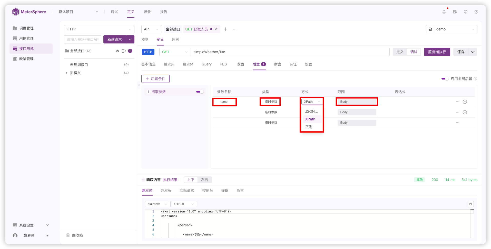{ width="900px" }      

!!! ms-abstract "" 
    在表达式处输入 XPath 提取表达式或者点击【快捷提取】图标打开快捷提取页面。
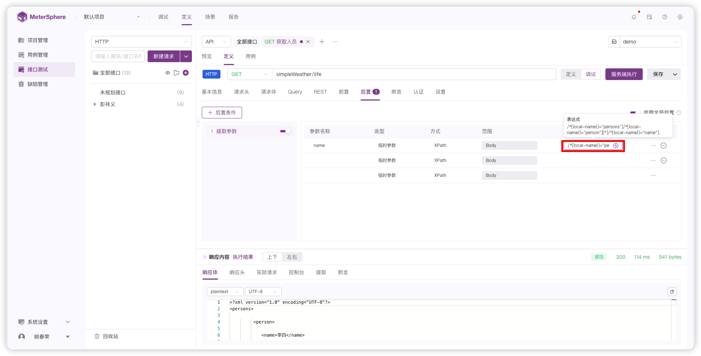{ width="900px" }         

!!! ms-abstract "" 
    在【快捷提取】页面，输入 XPath 表达式，测试通过后设置【结果匹配规则】和【响应内容格式】，然后点击【确认】。
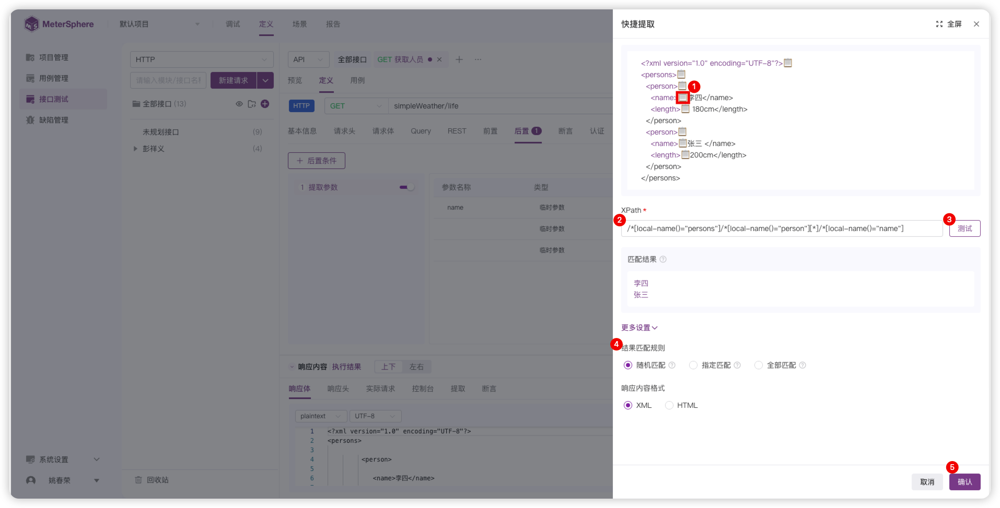{ width="900px" }  

!!! ms-abstract "" 
    在提取参数列表处，点击【...】可快捷设置【匹配结果规则】和【响应内容格式】。
{ width="900px" }     

!!! ms-abstract "参数类型" 
    - 环境参数：提取的参数会同步设置到当前执行环境的环境参数里。
    - 临时参数：提取的参数仅当前测试步骤或者场景可用。   

### 2.4 启用全局后置
!!! ms-abstract "" 
    点击 启用或关闭【全局后置】。 
    默认开启，关闭则运行该接口时不执行全局后置。
{ width="900px" }  

!!! ms-abstract "说明" 
    【全局后置】相关配置请参考： [全局后置](../project_management/environment.md#12)。

### 2.5 代码片段快捷功能
!!! ms-abstract "说明"
    - 同上 [代码片段快捷功能](#15)。

## 3 断言
### 3.1 状态码
!!! ms-abstract ""
    设置要断言的状态码及其匹配条件。
{ width="900px" }      

### 3.2 响应头
!!! ms-abstract ""
    下拉选择响应头的参数名称、匹配条件和匹配值。
{ width="900px" }    

### 3.3 响应体
!!! ms-abstract ""
    选择表达式类型，输入表达式和匹配值，选择匹配条件；具体不同表达式的生成方式同上 [提取参数](#23)。
{ width="900px" }    

### 3.4 响应时间
!!! ms-abstract ""
    输入要断言的响应时间（单位 ms ）。
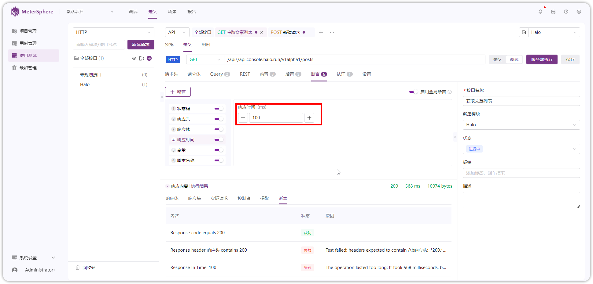{ width="900px" }    

### 3.5 变量
!!! ms-abstract ""
    输入要断言的变量名、匹配条件和匹配值。
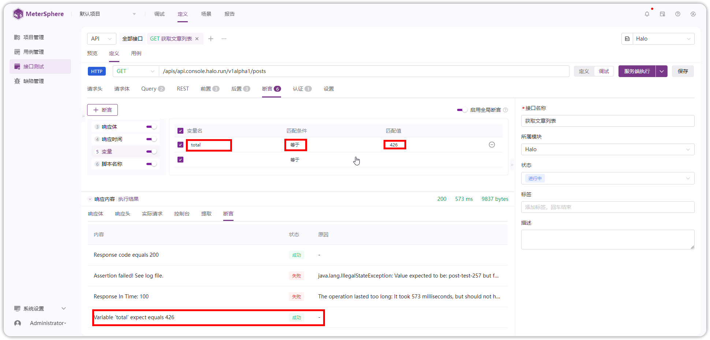{ width="900px" }    

### 3.6 脚本名称
!!! ms-abstract ""
    选择【手动录入/引用公共脚本】，输入断言脚本。
{ width="900px" }  

## 4 认证
!!! ms-abstract ""
    选择接口 Auth 认证方式，并输入用户名、密码。
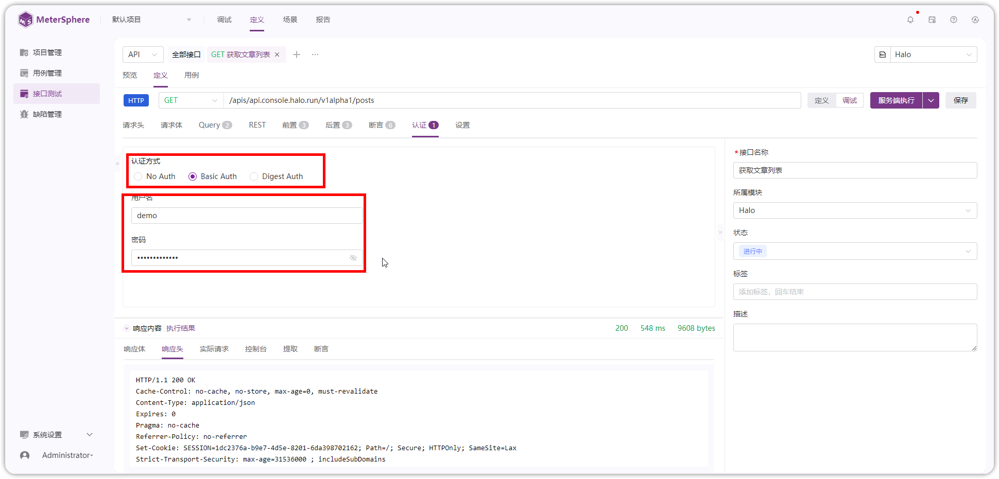{ width="900px" } 

!!! ms-abstract "说明"
    - No Auth：非 Auth 认证方式。
    - Basic Auth：一种简单的用户名+密码的认证方式，多以明文发送。
    - Digest Auth：对 Basic Auth 的一种增强，会将用户名和密码加密后发送。

## 5 设置
!!! ms-abstract ""
    设置接口的 【连接超时】、【响应超时】时间，设置【重定向】方式。
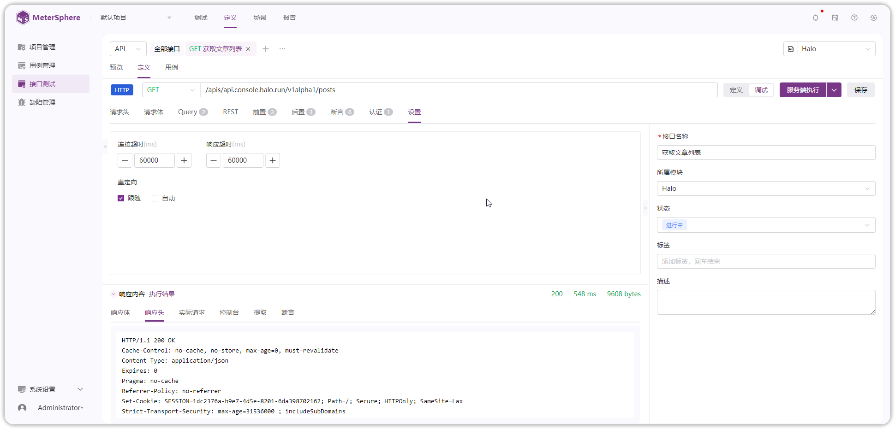{ width="900px" } 

!!! ms-abstract "说明"
    - 连接超时时间：接口请求和客户端建立连接的超时时间，默认 60s。
    - 响应超时时间：接口请求接收客户端响应的超时时间，默认 60s。
    - 跟随重定向：当响应码是3XX时（如301或302，代表页面发生了重定向），会自动跳转到目标地址，并记录重定向过程中的所有请求的响应结果；系统默认设置为【跟随重定向】。
    - 自动重定向：当响应码是3XX时（如301或302，代表页面发生了重定向），会自动跳转到目标地址，不会记录重定向的过程内容，只返回最终的响应结果，没有中间步骤的记录。