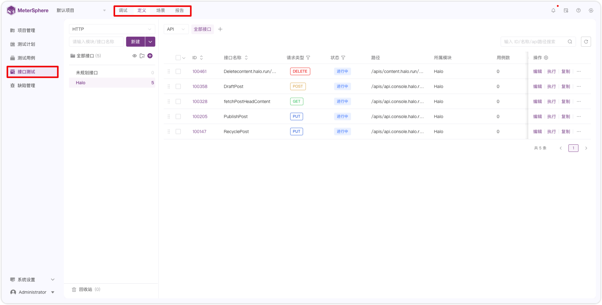

!!! ms-abstract "" 
     接口测试模块主要包含接口调试、接口定义管理、接口用例管理、接口场景管理及接口测试报告管理等功能。
     
!!! ms-abstract "" 
     - **调试**：在开发进行本地接口调试以及前后端联调中应用，支持【服务端执行】和【本地执行】两种模式。
     - **定义**：进行接口设计、接口用例管理和 Mock 服务管理等。 
     - **场景**：进行场景级自动化测试工作，能够编排组合多个接口和测试组件实现复杂场景的测试。 
     - **报告**：在线生成接口测试报告，支持报告分享和导出。
{ width="900px" }