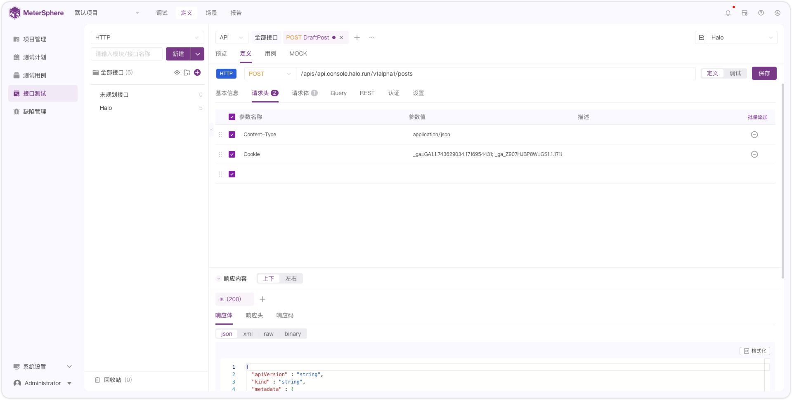
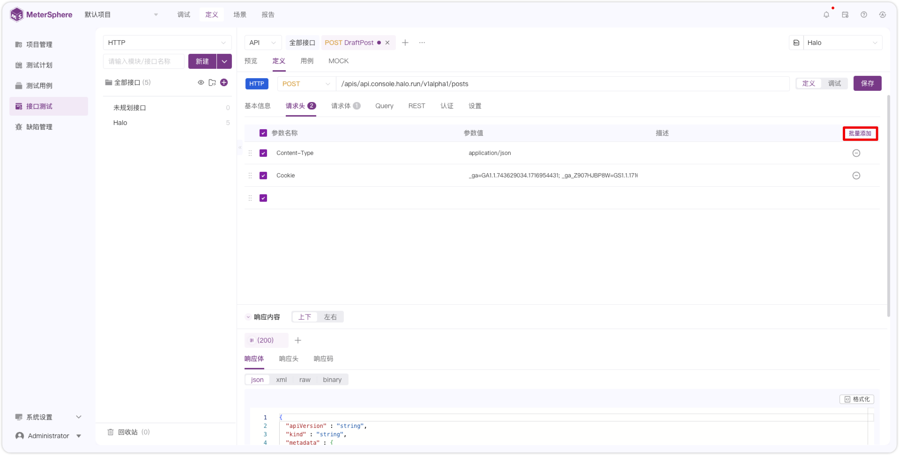
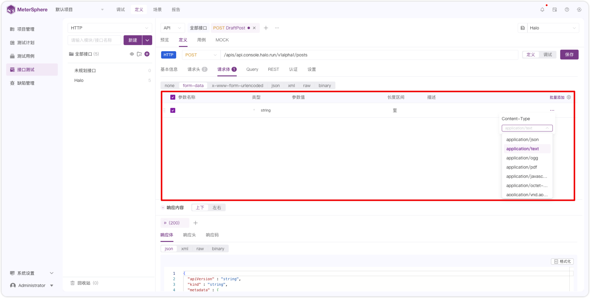
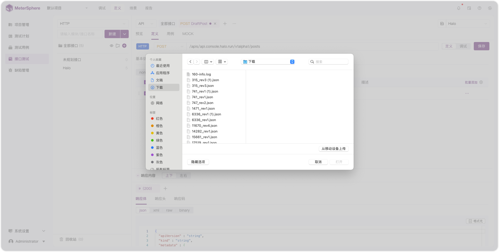

---
description: MeterSphere 一站式开源持续测试平台官方文档。MeterSphere 涵盖测试管理、接口测试、UI 测试和性能测试等功能，全面兼容 JMeter、Selenium 等主流开源标准，有效助力开发和测试团队充分利用云弹性进行高度可 扩展的自动化测试，加速高质量的软件交付。
---     
## 1 概述
!!! ms-abstract "" 
    请求体参数规则在【接口调试】、【接口定义】、【接口用例】以及【场景步骤】中均适用。

## 2 请求头
!!! ms-abstract "" 
    在【参数名称】处输入或者下拉选择请求头参数，在参数值处输入参数值或 [内置函数](../api_test/request_params.md)。
{ width="900px" }

!!! ms-abstract "批量添加" 
    点击【批量添加】，按如下格式要求输入批量导入文本，点击【应用】完成批量导入。 
    **书写格式**： 

        参数名:参数值，如 name:natural，多条记录以换行分隔。
        批量添加里的参数名重复，默认以最后一条数据为最新数据。
{ width="900px" }    

## 3 请求体
### 3.1 none 
!!! ms-abstract "" 
    请求没有 Body，不用做填写。
{ width="900px" }

### 3.2 form-data
!!! ms-abstract "" 
    输入参数名称、类型、参数值、描述、更多（Content-Type）等信息。
{ width="900px" }    

!!! ms-abstract "说明" 
    - 参数名：参数名。
    - 类型：默认 string，可选 integer、number、array、json、file。
    - 参数值：参数值或者 [内置函数](../api_test/request_params.md#2)。
    - 长度区间：字符串长度限制，接口定义处使用，这里无需填写。
    - 描述：描述信息。
    - 更多（Content-Type）：手动输入或者选择以下 Content-Type 类型。
        - application/json 
        - application/text   
        - application/ogg 
        - application/pdf
        - application/javascript
        - application/octet-stream
        - application/vnd.api+json
        - application/atom+xml
        - application/ecmascript 

!!! ms-abstract "" 
    【批量添加】操作同上 [请求头-批量添加](#2)。

!!! ms-abstract "" 
    参数类型为 file 时，如下图选择【本地上传】或者【关联文件】。
{ width="900px" }       

!!! ms-abstract "" 
    选择本地上传。
{ width="900px" }       

!!! ms-abstract "" 
    选择关联文件。关联文件即关联【项目管理-文件管理】中的文件。详情参考：[文件管理](../project_management/file_management.md)。
{ width="900px" }     

### 3.3 x-www-form-urlencoded
!!! ms-abstract "" 
    输入参数名称、类型、参数值、描述、编码、描述等信息。
{ width="900px" }  

!!! ms-abstract "说明" 
    - 参数名：参数名。
    - 类型：默认 string，可选 integer、number、array。
    - 参数值：参数值或者 [内置函数](../api_test/request_params.md#2)。
    - 长度区间：字符串长度限制，接口定义处使用，这里无需填写。
    - 编码：用于是否将表单数据转换为 URL 可传输的格式。**注意：关闭编码只对 GET 请求生效，POST 默认强制开启编码。**

        例如，有以下表单数据：

            name : Kaibo Shen
            age : 18

            开启编码后，发送到服务器的数据形式如下：name=Kaibo+Shen&age=30。
    - 描述：描述信息。

!!! ms-abstract "" 
    【批量添加】操作同上 [请求头-批量添加](#2)。

### 3.4 json
!!! ms-abstract "" 
    在【序号1】处输入 json 文本信息，在【序号2】处格式化 json 文本，在【序号3】处展开 json 子节点。
{ width="900px" }  

### 3.5 xml
!!! ms-abstract "" 
    在【序号1】处输入 xml 文本信息，在【序号2】处格式化 xml 文本。
{ width="900px" }  

### 3.6 raw
!!! ms-abstract "" 
    在文本框中输入 raw 格式参数信息。
{ width="900px" }  

### 3.7 binary
!!! ms-abstract "" 
    请求体为 binary ，如下图选择【本地上传】或者【关联文件】，具体操作同上 [上传文件](#32-form-data)。
{ width="900px" }  

!!! ms-abstract "注意" 
    binary 只能上传或关联一个文件。

## 4 Query
!!! ms-abstract "说明" 
    地址栏中跟在 `?` 后面的参数，如 `updateapi?id=112`。
    编码【开启/关闭】规则同上 [编码](#33-x-www-form-urlencoded)。
{ width="900px" }     

## 5 REST
!!! ms-abstract "说明" 
    地址栏中被斜杠 `/` 分隔的参数，如 `updateapi/{id}`。
    编码【开启/关闭】规则同上 [编码](#33-x-www-form-urlencoded)。
{ width="900px" }     