---
description: MeterSphere 一站式开源持续测试平台官方文档。MeterSphere 涵盖测试管理、接口测试、UI 测试和性能测试等功能，全面兼容 JMeter、Selenium 等主流开源标准，有效助力开发和测试团队充分利用云弹性进行高度可 扩展的自动化测试，加速高质量的软件交付。
---     
## 1 概述
!!! ms-abstract "" 
    请求体参数规则在【接口调试】、【接口定义】、【接口用例】以及【场景步骤】中均适用。

## 2 请求头
!!! ms-abstract "" 
    在【参数名称】处输入或者下拉选择请求头参数，在参数值处输入参数值或 [内置函数](../api_test/request_params.md)。
{ width="900px" }

!!! ms-abstract "批量添加" 
    点击【批量添加】，按如下格式要求输入批量导入文本，点击【应用】完成批量导入。 
    **书写格式**： 

        参数名:参数值，如 name:natural，多条记录以换行分隔。
        批量添加里的参数名重复，默认以最后一条数据为最新数据。
{ width="900px" }    

## 3 请求体
### 3.1 none 
!!! ms-abstract "" 
    请求没有 Body，不用做填写。
{ width="900px" }

### 3.2 form-data
!!! ms-abstract "" 
    输入参数名称、类型、参数值、描述、更多（Content-Type）等信息。
{ width="900px" }    

!!! ms-abstract "说明" 
    - 参数名：参数名。
    - 类型：默认 string，可选 integer、number、array、json、file。
    - 参数值：参数值或者 [内置函数](../api_test/request_params.md#2)。
    - 长度区间：字符串长度限制，接口定义处使用，这里无需填写。
    - 描述：描述信息。
    - 更多（Content-Type）：手动输入或者选择以下 Content-Type 类型。
        - application/json 
        - application/text   
        - application/ogg 
        - application/pdf
        - application/javascript
        - application/octet-stream
        - application/vnd.api+json
        - application/atom+xml
        - application/ecmascript 

!!! ms-abstract "" 
    【批量添加】操作同上 [请求头-批量添加](#2)。

!!! ms-abstract "" 
    参数类型为 file 时，如下图选择【本地上传】或者【关联文件】。
{ width="900px" }       

!!! ms-abstract "" 
    选择本地上传。
{ width="900px" }       

!!! ms-abstract "" 
    选择关联文件。关联文件即关联【项目管理-文件管理】中的文件。详情参考：[文件管理](../project_management/file_management.md)。
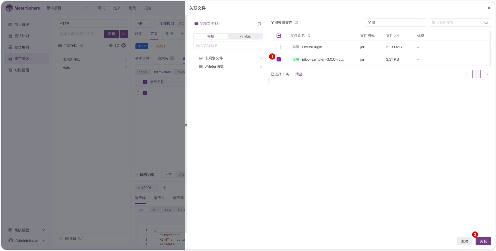{ width="900px" }     

### 3.3 x-www-form-urlencoded
!!! ms-abstract "" 
    输入参数名称、类型、参数值、描述、编码、描述等信息。
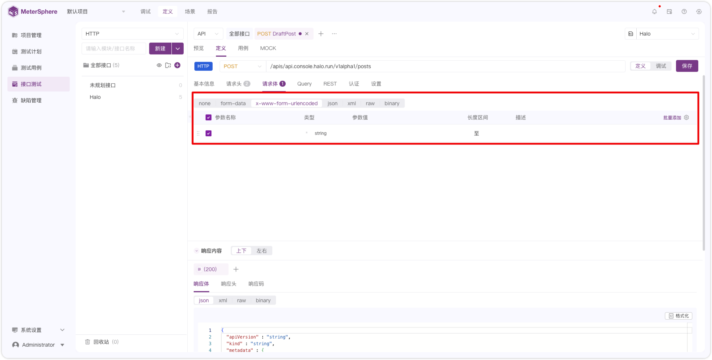{ width="900px" }  

!!! ms-abstract "说明" 
    - 参数名：参数名。
    - 类型：默认 string，可选 integer、number、array。
    - 参数值：参数值或者 [内置函数](../api_test/request_params.md#2)。
    - 长度区间：字符串长度限制，接口定义处使用，这里无需填写。
    - 编码：用于是否将表单数据转换为 URL 可传输的格式。**注意：关闭编码只对 GET 请求生效，POST 默认强制开启编码。**

        例如，有以下表单数据：

            name : Kaibo Shen
            age : 18

            开启编码后，发送到服务器的数据形式如下：name=Kaibo+Shen&age=30。
    - 描述：描述信息。

!!! ms-abstract "" 
    【批量添加】操作同上 [请求头-批量添加](#2)。

### 3.4 json
!!! ms-abstract "" 
    在【序号1】处输入 json 文本信息，在【序号2】处格式化 json 文本，在【序号3】处展开 json 子节点。
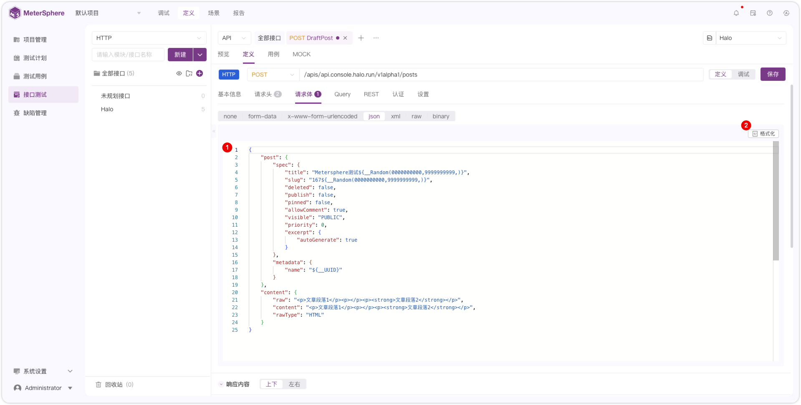{ width="900px" }  

### 3.5 xml
!!! ms-abstract "" 
    在【序号1】处输入 xml 文本信息，在【序号2】处格式化 xml 文本。
{ width="900px" }  

### 3.6 raw
!!! ms-abstract "" 
    在文本框中输入 raw 格式参数信息。
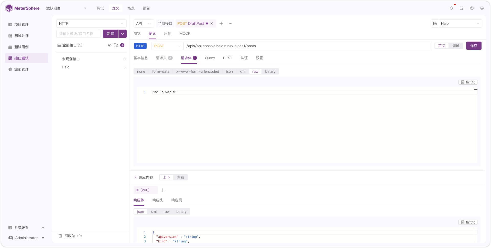{ width="900px" }  

### 3.7 binary
!!! ms-abstract "" 
    请求体为 binary ，如下图选择【本地上传】或者【关联文件】，具体操作同上 [上传文件](#32-form-data)。
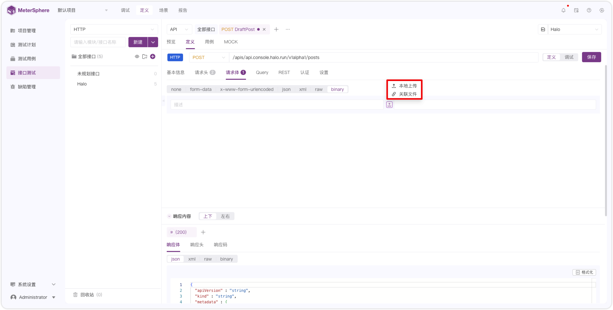{ width="900px" }  

!!! ms-abstract "注意" 
    binary 只能上传或关联一个文件。

## 4 Query
!!! ms-abstract "说明" 
    地址栏中跟在 `?` 后面的参数，如 `updateapi?id=112`。
    编码【开启/关闭】规则同上 [编码](#33-x-www-form-urlencoded)。
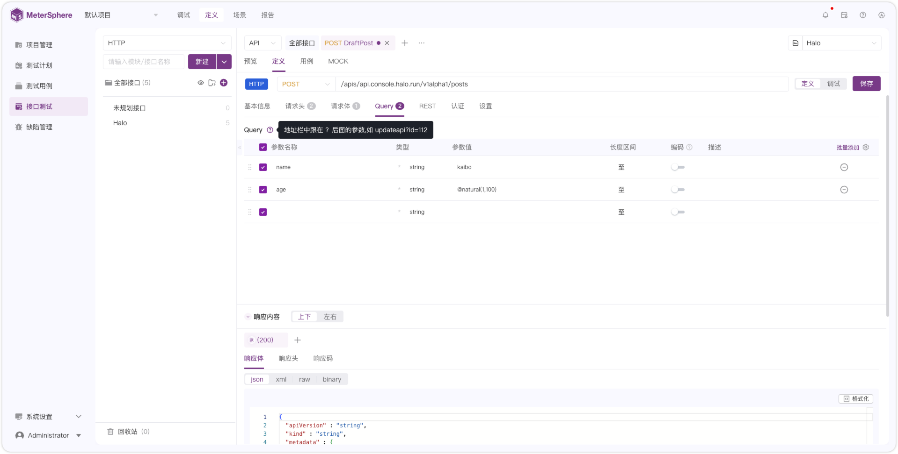{ width="900px" }     

## 5 REST
!!! ms-abstract "说明" 
    地址栏中被斜杠 `/` 分隔的参数，如 `updateapi/{id}`。
    编码【开启/关闭】规则同上 [编码](#33-x-www-form-urlencoded)。
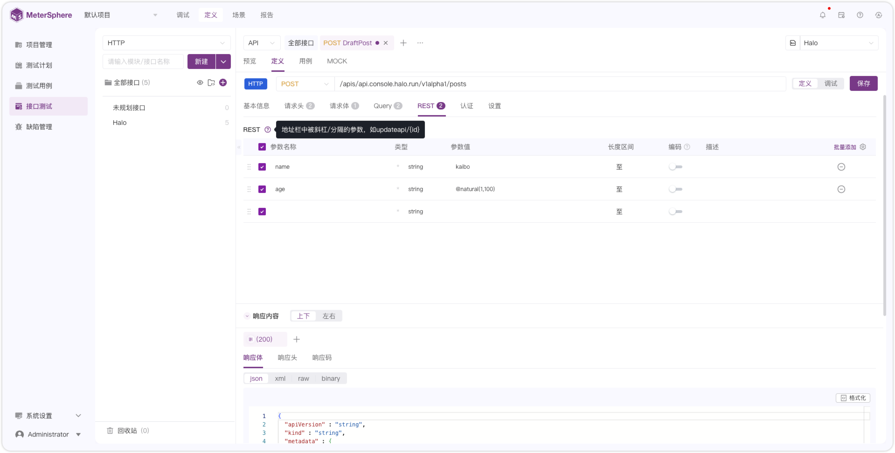{ width="900px" }

## 6 前置
### 6.1 脚本操作
!!! ms-abstract ""
【前置脚本】在请求发送前执行，用于生成认证签名或获取 token、修改请求内容、初始化请求需要的参数值等场景。 
**脚本语言支持：**

BeanShell-JSR223（默认，相比 BeanShell 执行速度更快，多在性能测试场景下使用）
BeanShell
Python3
Groovy
JavaScript

!!! ms-abstract "示例"
- **执行过程中在控制台打印日志。**

//打印 `Hello World!` 到控制台的日志中
log.info("Hello World!");

- **在前置脚本中获取请求参数。**

import org.apache.jmeter.config.Arguments;

//获取请求的body参数
Arguments args = sampler.getArguments();

//将获取到的参数转换成字符串格式
String json = args.getArgument(0).getValue();
//注意：getArgument(0)中的0，一般获取到的请求参数中只有第0个数据。
//在获取返回值时，才会有多个数据列

log.info("{}", json);
//输出值为：{"userId":"123456","userType":"123","type":"1"}

- **操作变量。**

//获取变量 VAR1 的值
vars.get("VAR1");
//设置变量 VAR2 的值为 value
vars.put("VAR2","value");
//移除变量 VAR3
vars.remove("VAR3");

!!! ms-abstract ""
- **手动录入**  
按照【序号1-6】完成【手动录入】脚本并调试。
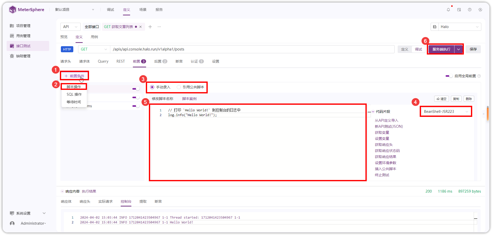{ width="900px" }

!!! ms-abstract ""
- **引用公共脚本**  
选择【引用公共脚本】，点击【引用公共脚本】，在弹出的公共脚本列表页面中选择项目管理中的公共脚本。
!!! ms-abstract "注意"
引入的公共脚本仅参数值可修改。
通过引入公共脚本方式添加的为引用关系，会跟随原始脚本的变化，当原始脚本更新时，有高亮 new 图标显示。

{ width="900px" }

{ width="900px" }

!!! ms-abstract "说明"
【公共脚本】相关配置请参考： [公共脚本](../project_management/public_script.md)。

### 6.2 SQL 操作
!!! ms-abstract ""
【前置 SQL】在请求发送前执行，用于接口请求前的数据准备工作。
!!! ms-abstract ""
按照【序号】顺序，添加【SQL 操作】并【引入数据源】。
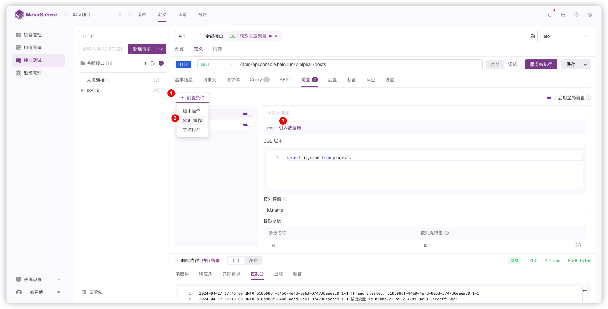{ width="900px" }

{ width="900px" }

!!! ms-abstract "说明"
【数据源】相关配置请参考： [添加数据源](../project_management/environment.md#1)。

### 6.3 等待时间
!!! ms-abstract ""
按照【序号】顺序，添加【等待时间】并修改等待时间。
{ width="900px" }

### 6.4 启用全局前置
!!! ms-abstract ""
点击 启用或关闭【全局前置】。 
默认开启，关闭则运行该接口时不执行全局前置。
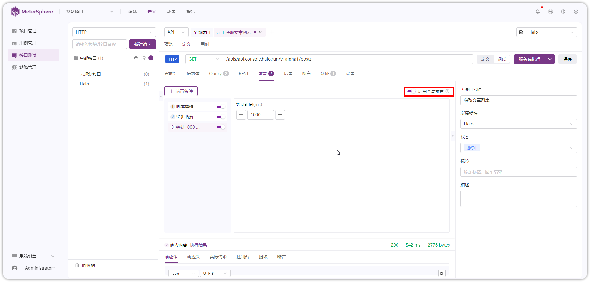{ width="900px" }

!!! ms-abstract "说明"
【全局前置】相关配置请参考： [全局前置](../project_management/environment.md#12)。

### 6.5 代码片段快捷功能
!!! ms-abstract ""
在代码片段右侧可使用快捷操作生成代码片段。
{ width="900px" }

!!! ms-abstract "说明"
- 从 API 定义导入： 可根据接口定义自动生成该接口请求的代码片段。
- 新 API 测试（JSON）： 自动生成 Httpclient 请求接口的代码片段。
- 获取变量：获取变量，如：`vars.get("variable_name")`。
- 设置变量：设置变量，如：`vars.put("variable_name", "variable_value")`。
- 获取响应头：获取当前请求的响应头，如：`prev.getResponseHeaders()`。
- 获取响应状态码：获取当前请求的获取响应状态码，如：`prev.getResponseCode()`。
- 获取响应结果：获取当前请求的响应结果，如：`prev.getResponseDataAsString()`。
- 设置环境参数：设置当前执行环境的环境参数，如：`vars.put(${__metersphere_env_id}+"key","value")`。
- 插入公共脚本：插入项目管理中的公共脚本。
- 终止测试：停止当前测试执行，如：`ctx.getEngine().stopTest()`。

## 7 后置
### 7.1 脚本操作
!!! ms-abstract ""
【后置脚本】在请求发送后执行，用于处理响应数据并进行数据转换、验证等操作。 
**脚本语言支持：**

BeanShell-JSR223（默认，相比 BeanShell 执行速度更快，多在性能测试场景下使用）
BeanShell
Python3
Groovy
JavaScript

!!! ms-abstract "示例"
- **特殊字符转义。**

String rel = "\u7533\u51ef\u6ce2";
try {
String a = URLDecoder.decode(rel,"utf-8");
} catch (UnsupportedEncodingException e) {
// TODO Auto-generated catch block
e.printStackTrace();
}

- **将文件响应内容存储到服务器。**

import java.io.*;

byte[] result = prev.getResponseData();
String file_name = "/opt/metersphere/data/xxxx.xxx";
File file = new File(file_name);
FileOutputStream out = new FileOutputStream(file);
out.write(result);
out.close();

- **操作变量。**

//获取变量 VAR1 的值
vars.get("VAR1");
//设置变量 VAR2 的值为 value
vars.put("VAR2","value");
//移除变量 VAR3
vars.remove("VAR3");

!!! ms-abstract ""
- **手动录入**  
按照【序号1-6】完成【手动录入】脚本并调试。
{ width="900px" }

!!! ms-abstract ""
- **引用公共脚本**  
选择【引用公共脚本】，点击【引用公共脚本】，在弹出的公共脚本列表页面中选择项目管理中的公共脚本。
!!! ms-abstract "注意"
引入的公共脚本仅参数值可修改。
通过引入公共脚本方式添加的为引用关系，会跟随原始脚本的变化，当原始脚本更新时，有高亮 new 图标显示。

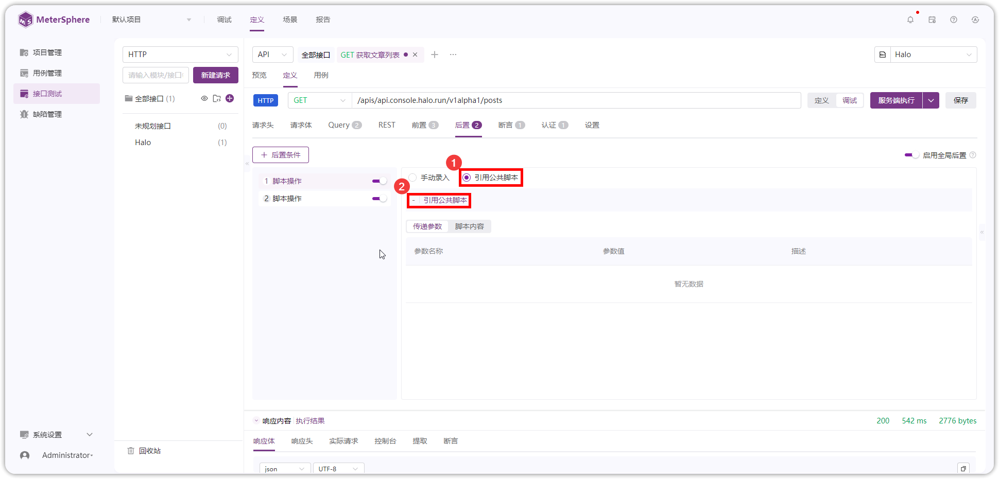{ width="900px" }

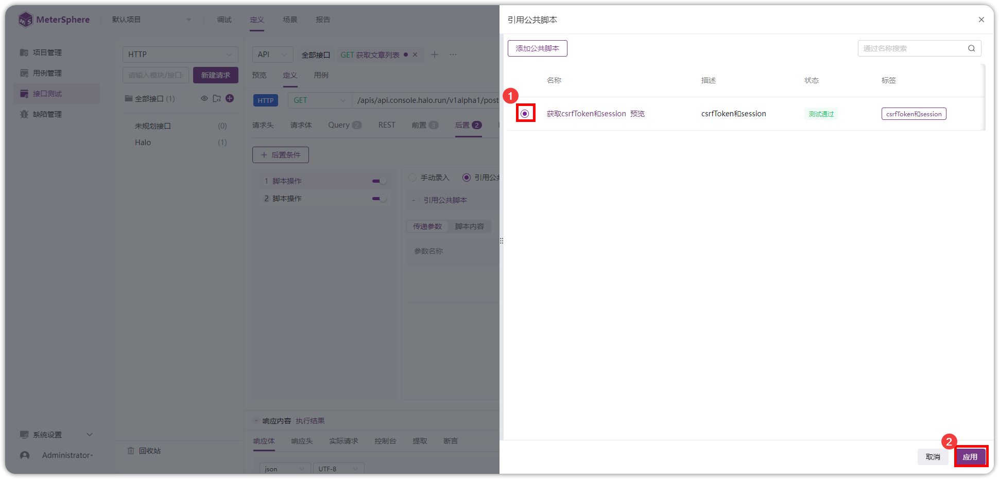{ width="900px" }

!!! ms-abstract "说明"
【公共脚本】相关配置请参考： [公共脚本](../project_management/public_script.md)。

### 7.2 SQL 操作
!!! ms-abstract ""
【后置 SQL】在请求发送后执行，用于接口请求后的数据验证工作。
!!! ms-abstract ""
如下图，按照【序号】顺序，添加【SQL 操作】并【引入数据源】。
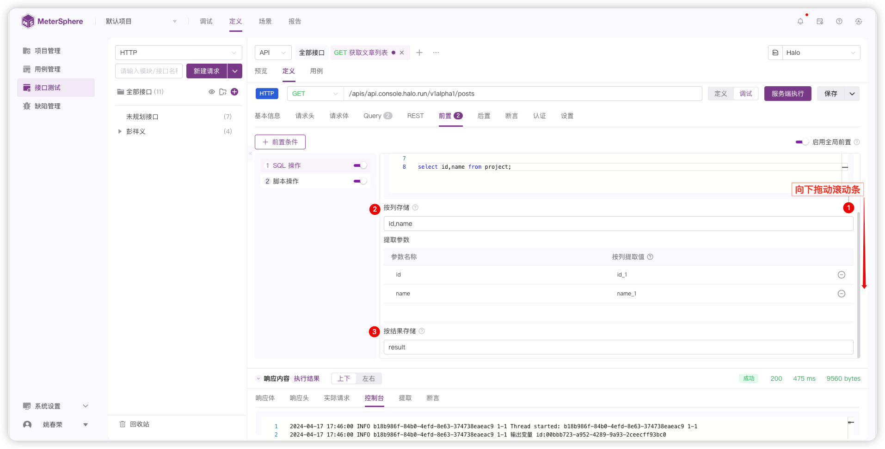{ width="900px" }

{ width="900px" }

!!! ms-abstract "说明"
【数据源】相关配置请参考： [添加数据源](../project_management/environment.md#12-环境配置)。

### 7.3 提取参数
!!! ms-abstract ""
- 正则提取。 
输入【参数名称】，选择【参数类型】，选择【正则】提取方式，选择提取对象的【范围】。
{ width="900px" }

!!! ms-abstract ""
在表达式处输入正则表达式或者点击【快捷提取】图标打开表达式【测试】页面。
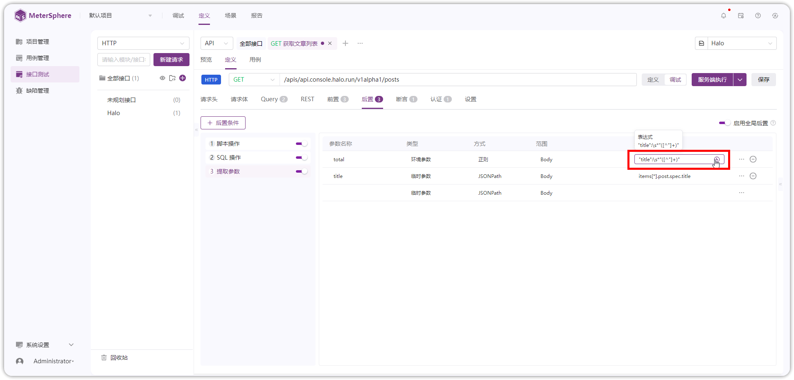{ width="900px" }

!!! ms-abstract ""
在【快捷提取】页面，输入正则表达式，选择【匹配表达式/匹配组】点击【测试】，测试通过后设置【结果匹配规则】后点击【确认】。
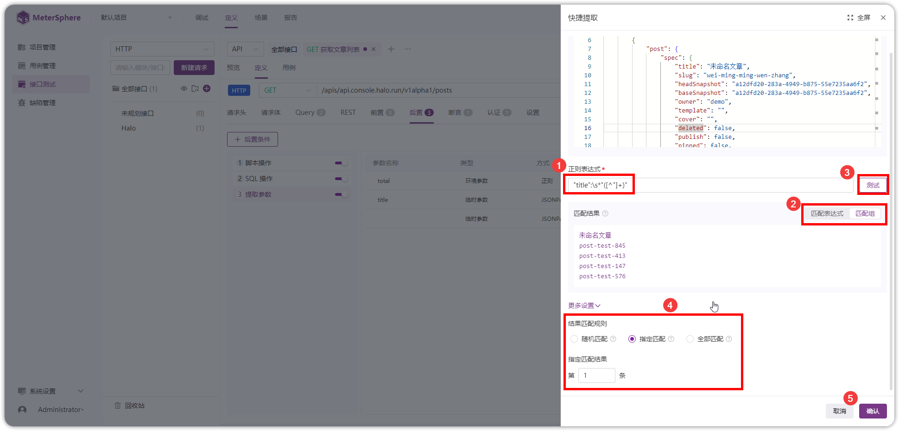{ width="900px" }

!!! ms-abstract ""
在提取参数列表处，点击【...】可快捷设置【匹配规则】。
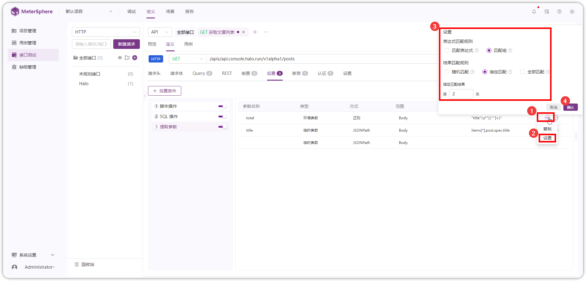{ width="900px" }

!!! ms-abstract ""
- JSONPath 提取。 
输入【参数名称】，选择【参数类型】，选择【JSONPath】提取方式，选择提取对象的【范围】。
{ width="900px" }

!!! ms-abstract ""
在表达式处输入 JSONPath 提取表达式或者点击【快捷提取】图标打开快捷提取页面。
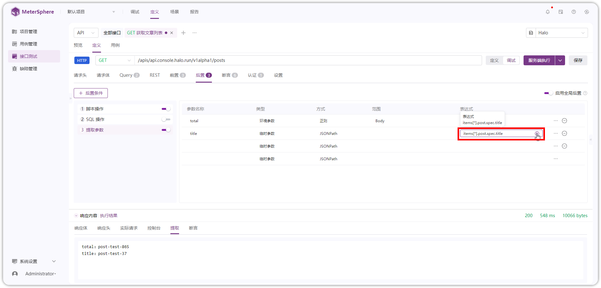{ width="900px" }

!!! ms-abstract ""
在【快捷提取】页面，点击预期提取的字段快速生成 JSONPath 表达式，测试通过后设置【结果匹配规则】后点击【确认】。
{ width="900px" }

!!! ms-abstract ""
在提取参数列表处，点击【...】可快捷设置【匹配结果规则】。
{ width="900px" }

!!! ms-abstract ""
- XPath 提取。
输入【参数名称】，选择【参数类型】，选择【XPath】提取方式，选择提取对象的【范围】。
{ width="900px" }

!!! ms-abstract ""
在表达式处输入 XPath 提取表达式或者点击【快捷提取】图标打开快捷提取页面。
{ width="900px" }

!!! ms-abstract ""
在【快捷提取】页面，输入 XPath 表达式，测试通过后设置【结果匹配规则】和【响应内容格式】，然后点击【确认】。
{ width="900px" }

!!! ms-abstract ""
在提取参数列表处，点击【...】可快捷设置【匹配结果规则】和【响应内容格式】。
{ width="900px" }

!!! ms-abstract ""
**参数类型**：
- 环境参数：提取的参数会同步设置到当前执行环境的环境参数里。
- 临时参数：提取的参数仅当前测试步骤或者场景可用。
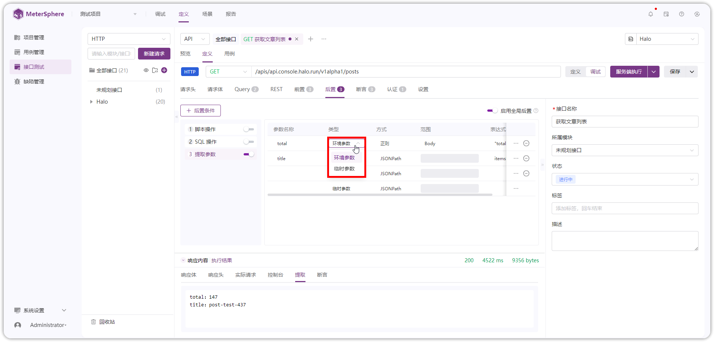{ width="900px" }

### 7.4 启用全局后置
!!! ms-abstract ""
点击 启用或关闭【全局后置】。 
默认开启，关闭则运行该接口时不执行全局后置。
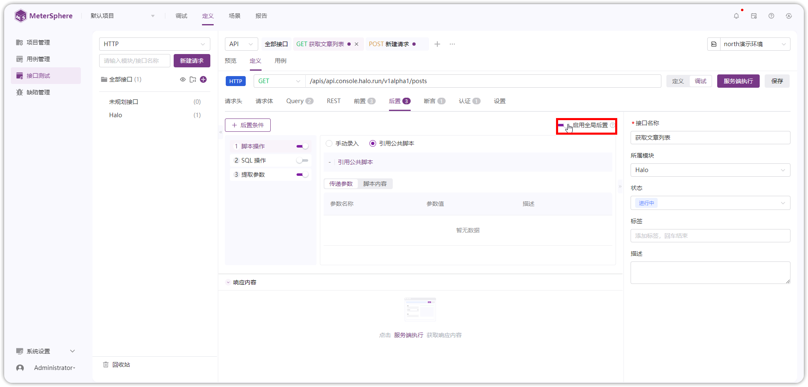{ width="900px" }

!!! ms-abstract "说明"
【全局后置】相关配置请参考： [全局后置](../project_management/environment.md#12)。

### 7.5 代码片段快捷功能
!!! ms-abstract "说明"
- 同上 [代码片段快捷功能](#15)。

## 8 断言
### 8.1 状态码
!!! ms-abstract ""
设置要断言的状态码及其匹配条件。
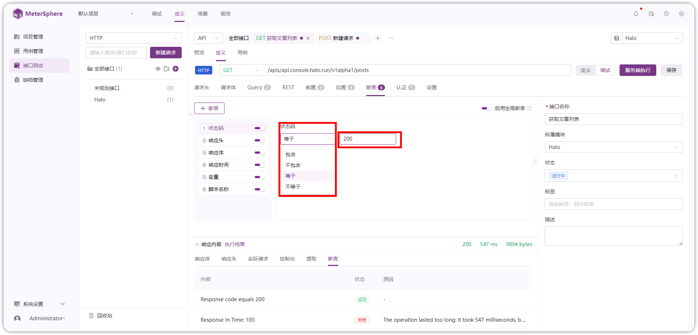{ width="900px" }

### 8.2 响应头
!!! ms-abstract ""
下拉选择响应头的参数名称、匹配条件和匹配值。
{ width="900px" }

### 8.3 响应体
!!! ms-abstract ""
选择表达式类型，输入表达式和匹配值，选择匹配条件；具体不同表达式的生成方式同上 [提取参数](#23)。
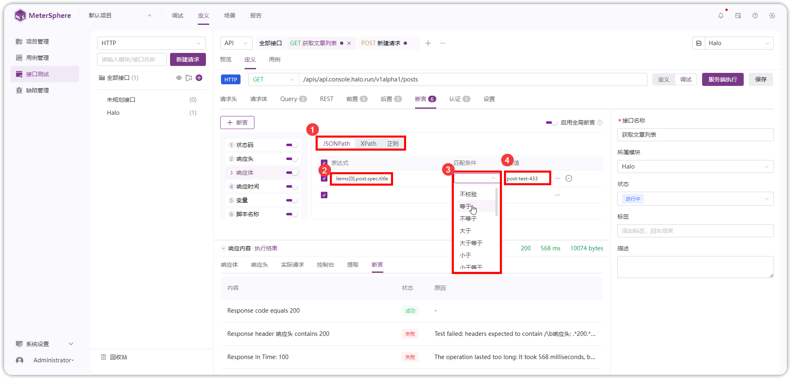{ width="900px" }

### 8.4 响应时间
!!! ms-abstract ""
输入要断言的响应时间（单位 ms ）。
{ width="900px" }

### 8.5 变量
!!! ms-abstract ""
输入要断言的变量名、匹配条件和匹配值。
{ width="900px" }

### 8.6 脚本
!!! ms-abstract ""
选择【手动录入/引用公共脚本】，输入断言脚本。
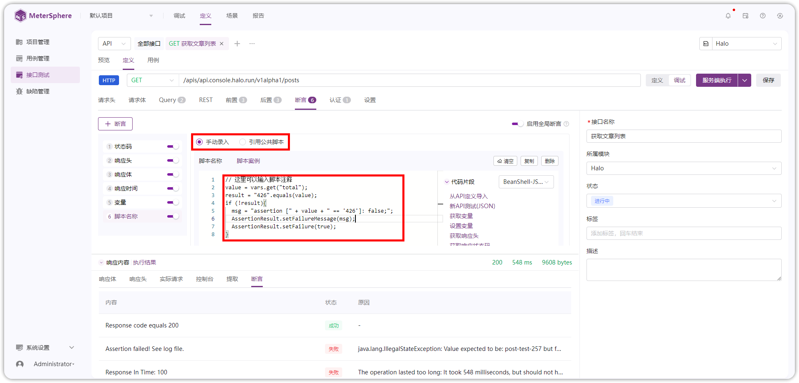{ width="900px" }

## 9 认证
!!! ms-abstract ""
选择接口 Auth 认证方式，并输入用户名、密码。
{ width="900px" }

!!! ms-abstract "说明"
- No Auth：非 Auth 认证方式。
- Basic Auth：一种简单的用户名+密码的认证方式，多以明文发送。
- Digest Auth：对 Basic Auth 的一种增强，会将用户名和密码加密后发送。

## 10 设置
!!! ms-abstract ""
设置接口的 【连接超时】、【响应超时】时间，设置【重定向】方式。
{ width="900px" }

!!! ms-abstract "说明"
- 连接超时时间：接口请求和客户端建立连接的超时时间，默认 60s。
- 响应超时时间：接口请求接收客户端响应的超时时间，默认 60s。
- 跟随重定向：当响应码是3XX时（如301或302，代表页面发生了重定向），会自动跳转到目标地址，并记录重定向过程中的所有请求的响应结果；系统默认设置为【跟随重定向】。
- 自动重定向：当响应码是3XX时（如301或302，代表页面发生了重定向），会自动跳转到目标地址，不会记录重定向的过程内容，只返回最终的响应结果，没有中间步骤的记录。

