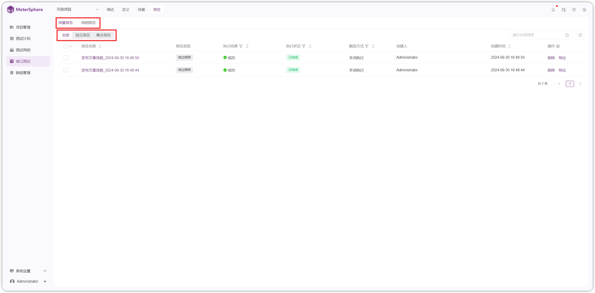
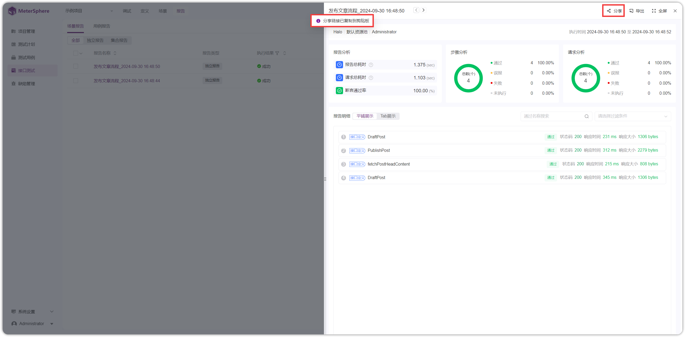
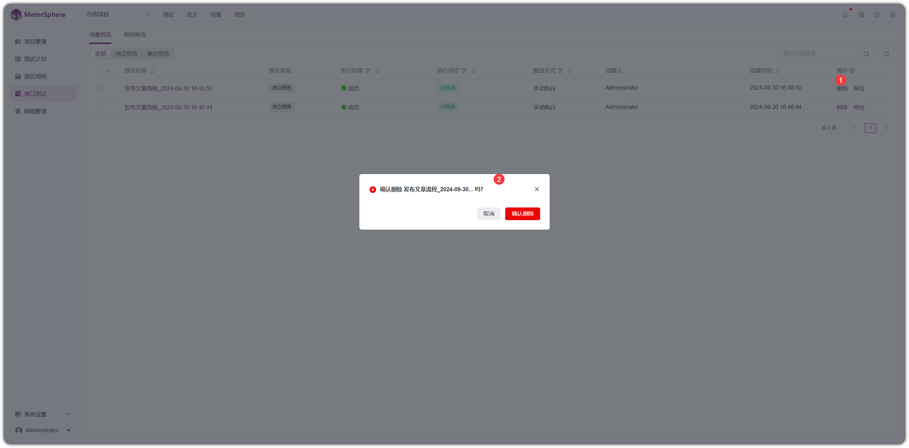
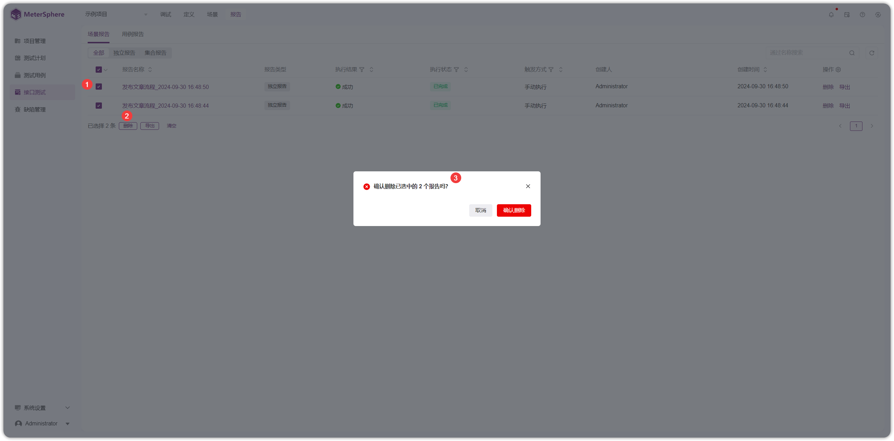

## 1 查看报告
!!! ms-abstract "" 
    在【报告】页面查看【场景报告】和【用例报告】。
{ width="900px" }

!!! ms-abstract "" 
    点击【报告名称】预览报告详情。
{ width="900px" }

!!! ms-abstract "" 
    点击【步骤名称】查看步骤实际请求的响应内容。
{ width="900px" }

## 2 分享报告
!!! ms-abstract ""
    在报告详情页面，点击【分享】按钮获取分享链接。报告链接有效期可在 [项目管理-应用设置](../project_management/project_permissions.md#23-接口测试) 处配置。

{ width="900px" }

## 3 删除报告
!!! ms-abstract "" 
    点击【删除】按钮删除报告。
{ width="900px" }

!!! ms-abstract "" 
    勾选复选框，点击【删除】批量删除报告。
{ width="900px" }

!!! ms-abstract "注意" 
    删除报告后无法恢复，请谨慎使用该功能！