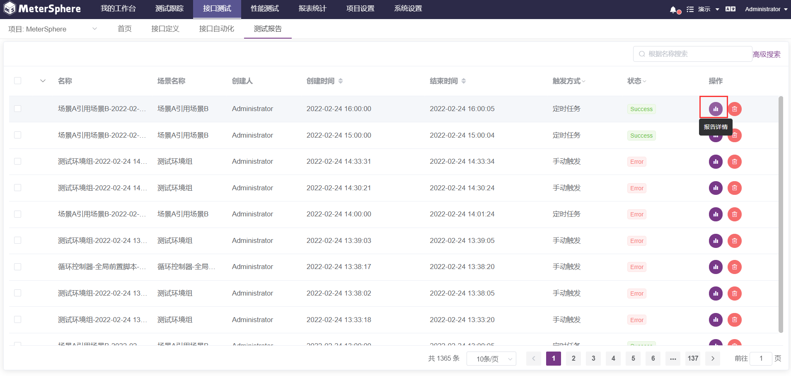
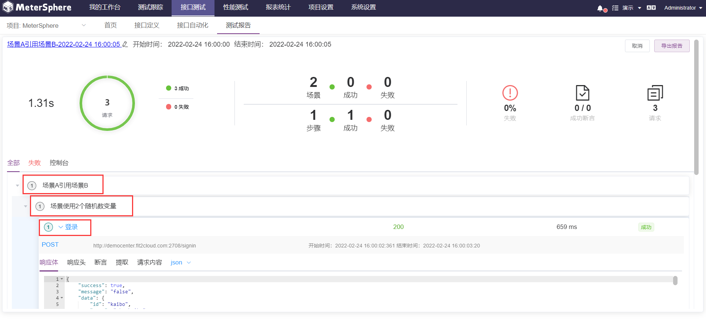
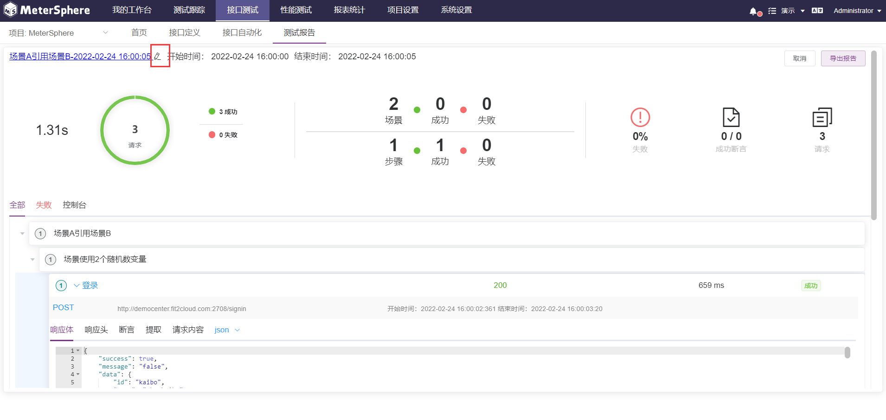
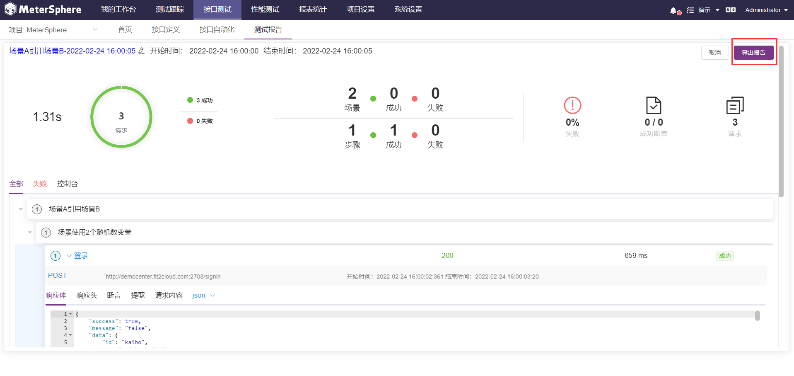
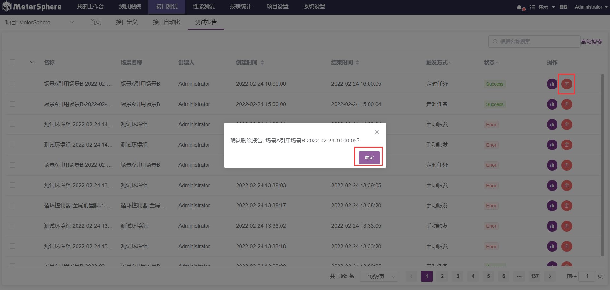

测试报告是对场景用例执行结果的持久化。在测试报告中可以查看场景用例中每个请求的请求详情及响应详情，同时提供了控制台日志、断言结果、变量提取结果等信息的展示。

## 1 查看测试报告
在测试报告列表中点击指定测试报告操作列中的 `报告详情` 按钮，进入报告详情页面。在该页面中可以查看该报告的详细内容，并支持重命名、导出等操作。

## 2 重命名测试报告
在查看测试报告详情页面，点击左上角的铅笔图标按钮并修改后，点击任意空白区域即对报告进行重命名。

## 3 导出和分享测试报告
在查看测试报告详情页面，点击右上角 `导出报告` 按钮将报告导出为 PDF 格式，点击`分享报告` 生成一个有实效的报告分享链接。

## 4 删除测试报告
在测试报告列表中点击指定测试报告操作列中的 `删除` 按钮删除该报告。

!!! error "注意"
    删除某个测试报告时，该测试报告将从数据库中删除且无法恢复，请谨慎使用该功能。
