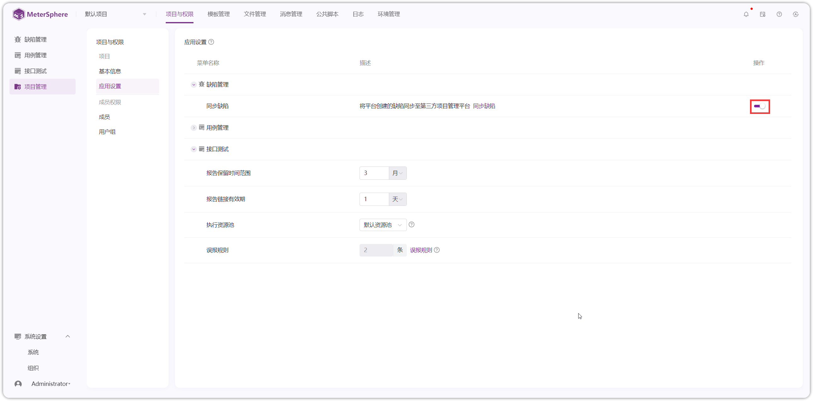
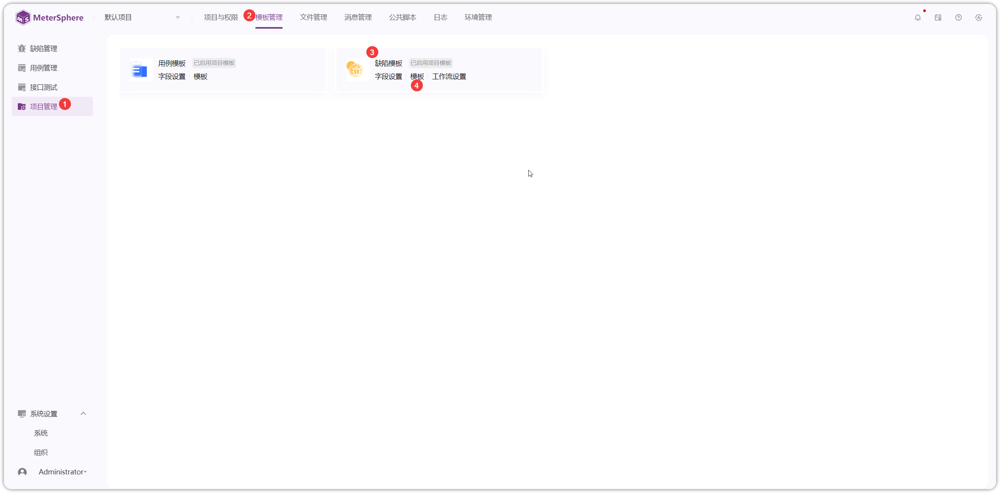
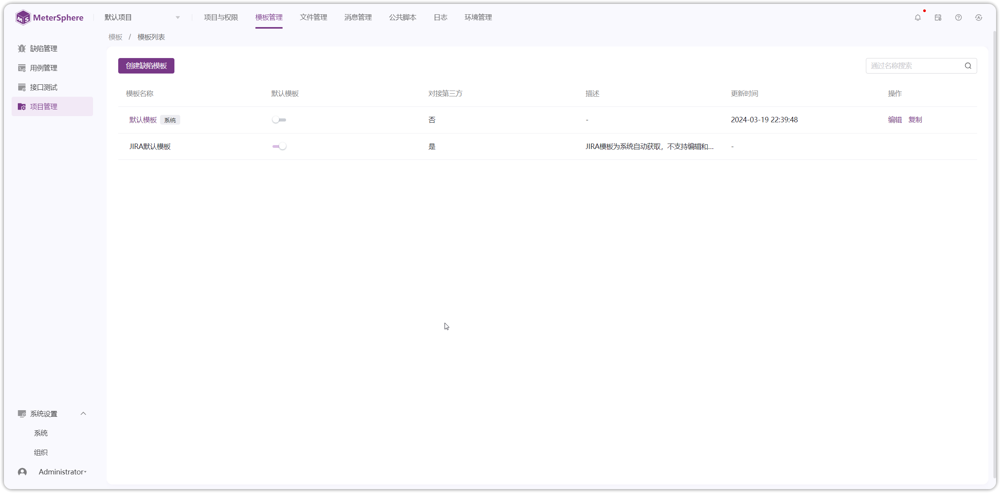
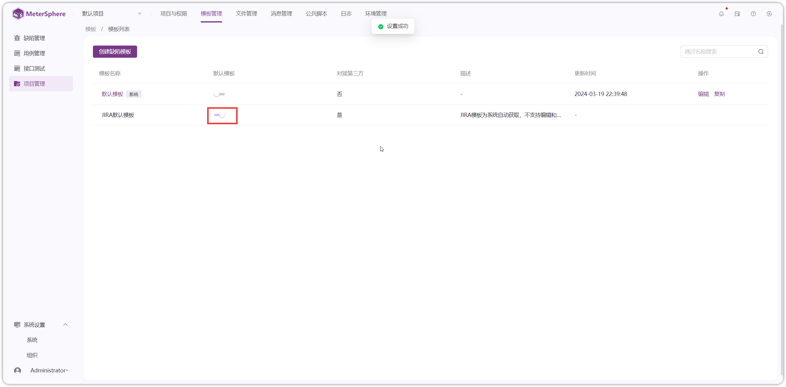

## 1 缺陷
### 1.1 缺陷模板
!!! ms-abstract ""
    缺陷模板设置： 

    - **非第三方平台模板**：进入【系统设置】-【模板管理】-【缺陷模板】-【模板】进入模板页面，开启要使用的模板
    - **第三方平台模板**：先在【系统设置】-【组织】-【服务集成】处配置第三方平台（如 JIRA、禅道、TAPD 等），然后在【模板】处开启项目模板。此操作不可逆，请谨慎操作！！！ 

!!! ms-abstract ""
    在【项目管理】-【项目权限】-【应用设置】-【缺陷管理】处配置【同步缺陷】的项目平台、项目 Key、缺陷类型、同步机制、同步频率等内容。以 JIRA 平台为例。
{ width="900px" }

{ width="900px" }

!!! ms-abstract ""
    点击【系统设置】-【模板管理】-【缺陷模板】-【模板】进入模板页面
{ width="900px" }

!!! ms-abstract ""
    在模板管理页面，存在系统【默认模板】和【JIRA 默认模板】，系统【默认模板】可以进行自定义，【JIRA 默认模板】自动生成，不可更改。
{ width="900px" }

!!! ms-abstract ""
    开启【JIRA 默认模板】为项目默认模板，在【缺陷管理】创建页面，默认展示【JIRA 默认模板】内容
{ width="900px" }

### 1.2 缺陷管理
!!! ms-abstract ""
    点击【缺陷管理】-【缺陷】进入缺陷页面，点击【创建缺陷】进行缺陷创建
{ width="900px" }

!!! ms-abstract ""
    进入缺陷页面，默认展示【JIRA 默认模板】内容，填写相应内容进行创建。也可以切换到系统【默认模板】内容，填写相应内容进行创建
{ width="900px" }

{ width="900px" }

!!! ms-abstract ""
    缺陷列表页面，缺陷的所属平台为 JIRA 
{ width="900px" }

!!! ms-abstract ""
    JIRA【自动同步】根据在【项目管理】-【项目权限】-【应用设置】-【缺陷管理】-【同步缺陷】处配置的内容生效
{ width="900px" }

!!! ms-abstract "操作说明"
    - 【同步缺陷】缺陷手动同步到第三方平台。
    - 【复制】复制缺陷
    - 【编辑】编辑缺陷名称、缺陷内容
    - 【删除】删除缺陷，MeterSphere 创建的缺陷进入回收站，第三方平台同步的缺陷将不做回收
    - 【导出】勾选导出的字段进行导出
    - 【清空】清空勾选的复选框

{ width="900px" }

!!! ms-abstract ""
    点击缺陷【ID】进入缺陷详情页面
{ width="900px" }

!!! ms-abstract "说明"
    - 【分享】在浏览器上打开分享链接，跳转到该缺陷的详情页面
    - 【关注】点击关注后，在"我的关注"页面集中管理
    - 【详情】显示缺陷内容详细信息
    - 【用例】缺陷关联用例
    - 【评论】发布缺陷评论，可对评论进行编辑、回复和删除等操作
    - 【变更历史】显示该缺陷的变更情况

## 2 回收站
!!! ms-abstract ""
    缺陷进行单个或批量【恢复】和【彻底删除】操作
{ width="900px" }