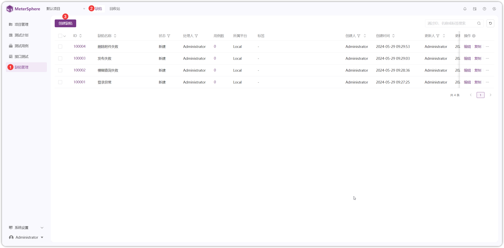
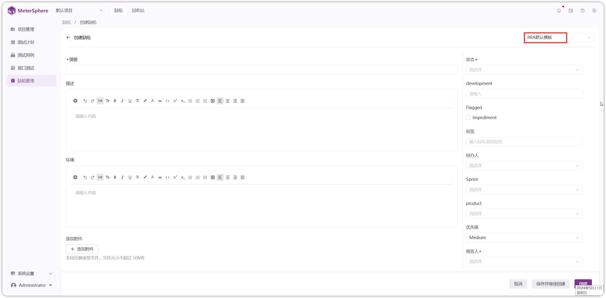
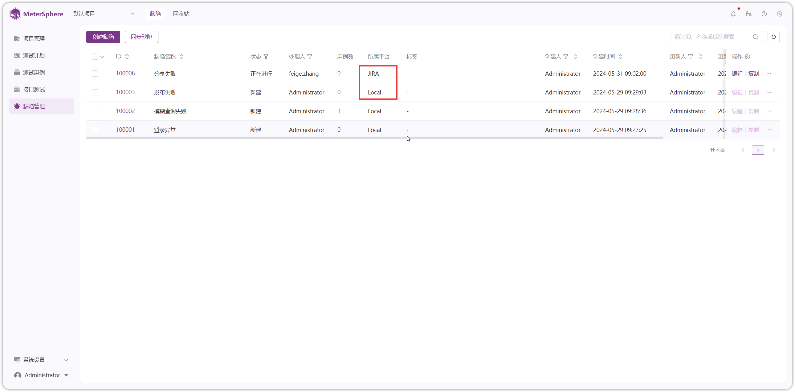
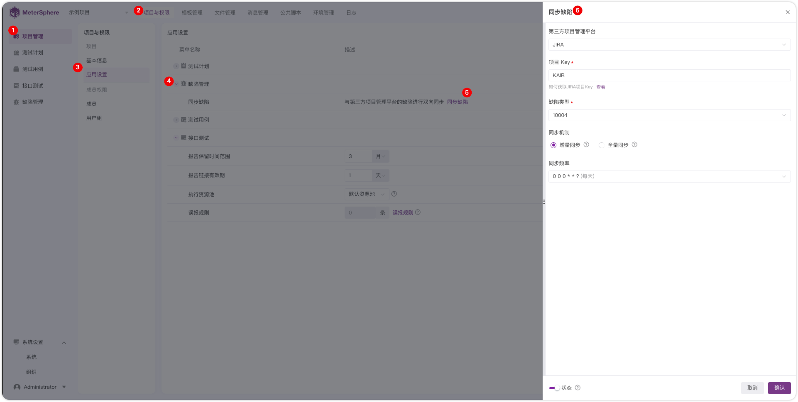
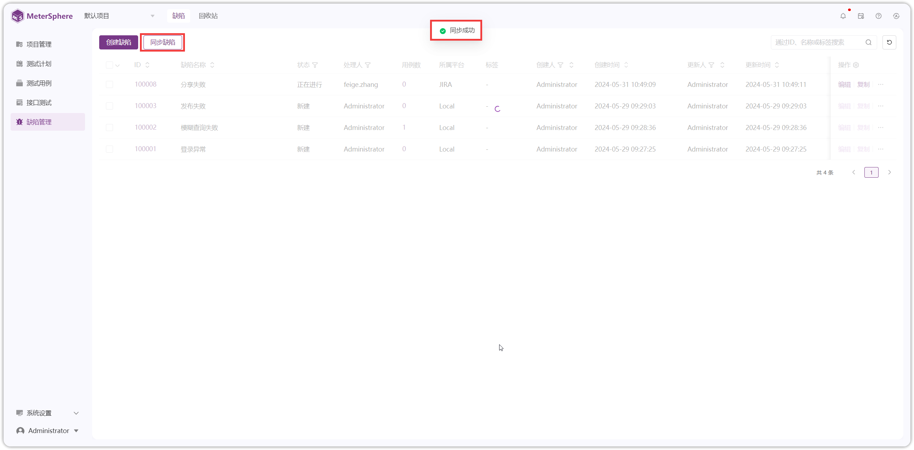
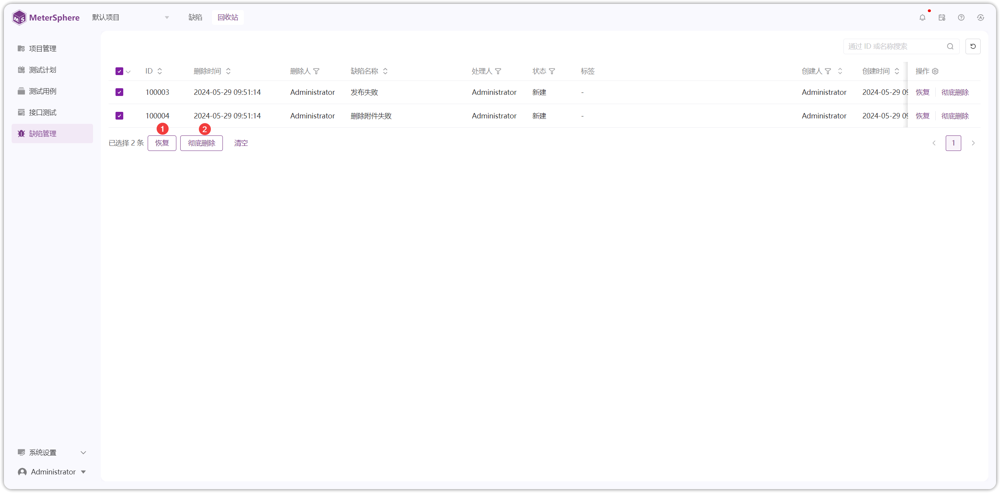

## 1 缺陷
### 1.1 缺陷管理
!!! ms-abstract ""
    点击【缺陷管理-缺陷】进入缺陷页面，点击【创建缺陷】进行缺陷创建
{ width="900px" }

!!! ms-abstract ""
    进入缺陷页面，默认展示【JIRA 默认模板】内容，填写相应内容进行创建。也可以切换到【默认模板】，填写相应内容进行创建
{ width="900px" }

{ width="900px" }

!!! ms-abstract "字段说明"
    - 【缺陷名称】自定义缺陷名称
    - 【缺陷模板】可选择本地平台模板或第三方平台模板，配置缺陷模板步骤，详情参考：[模板设置](../project_management/template_management.md#22)
    - 【描述】缺陷的详细步骤进行描述
    - 【附件】上传或关联任意类型文件，限制文件大小为 50 MB

!!! ms-abstract ""
    缺陷创建完成后，在缺陷列表页面，可看到缺陷所属平台是 JIRA 或 Local
{ width="900px" }

### 1.2 同步缺陷
!!! ms-abstract ""
    【自动同步】根据在【项目管理-项目权限-应用设置-缺陷管理】处配置的内容生效，详情参考：[自动同步配置](../project_management/project_permissions.md#21)
{ width="900px" }

!!! ms-abstract ""
    【手动同步】需要点击缺陷管理页面【同步缺陷】按钮即可进行缺陷同步
{ width="900px" }

{ width="900px" }

!!! ms-abstract "操作说明"
    - 【同步缺陷】手动同步缺陷到第三方平台
    - 【复制】复制缺陷
    - 【编辑】编辑缺陷名称、缺陷内容
    - 【删除】删除缺陷时，仅对 MeterSphere 平台管理创建的缺陷有效，并进入回收站，对已同步到第三方平台的缺陷没有影响
    - 【导出】勾选缺陷进行导出
    - 【清空】清空勾选的复选框

!!! ms-abstract ""
    点击缺陷【ID】进入缺陷详情页面
{ width="900px" }

!!! ms-abstract "说明"
    - 【分享】在浏览器上打开分享链接，跳转到该缺陷的详情页面
    - 【关注】点击关注后，在"我的关注"页面集中管理
    - 【详情】显示缺陷内容详细信息
    - 【用例】缺陷关联用例
    - 【评论】发布缺陷评论，可对评论进行编辑、回复和删除等操作
    - 【变更历史】显示该缺陷的变更情况

## 2 回收站
!!! ms-abstract ""
    在回收站中可对已删除的缺陷执行【恢复】和【彻底删除】操作
{ width="900px" }