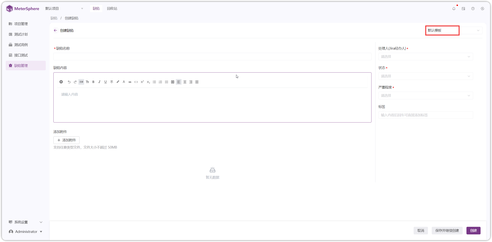
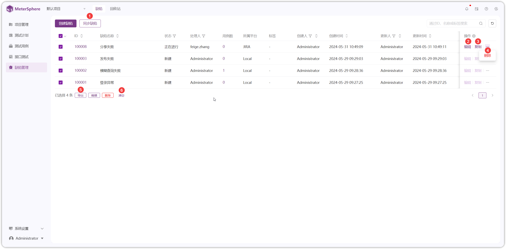

## 1 缺陷
### 1.1 缺陷模板
!!! ms-abstract ""
    缺陷模板设置： 

    - **非第三方平台模板**：进入【系统设置】-【模板管理】-【缺陷模板】-【模板】进入模板页面，开启要使用的模板
    - **使用第三方平台模板**：先在【系统设置】-【组织】-【服务集成】处配置第三方平台（如 JIRA、禅道、TAPD 等），然后在【模板】处开启项目模板。此操作不可逆，请谨慎操作！！！ 

!!! ms-abstract ""
    在【项目管理】-【项目权限】-【应用设置】-【缺陷管理】处配置【同步缺陷】的项目平台、项目 Key、缺陷类型、同步机制、同步频率等内容。以 JIRA 平台为例。
{ width="900px" }
{ width="900px" }

!!! ms-abstract ""
    点击【系统设置】-【模板管理】-【缺陷模板】-【模板】进入模板页面
{ width="900px" }

!!! ms-abstract ""
    在模板管理页面，存在系统【默认模板】和【JIRA 默认模板】，系统【默认模板】可以进行自定义，【JIRA 默认模板】自动生成，不可更改。
{ width="900px" }

!!! ms-abstract ""
    开启【JIRA 默认模板】为项目默认模板，在【缺陷管理】创建页面，默认展示【JIRA 默认模板】内容
{ width="900px" }

### 1.2 缺陷管理
!!! ms-abstract ""
    点击【缺陷管理】-【缺陷】进入缺陷页面，点击【创建缺陷】进行缺陷创建
{ width="900px" }

!!! ms-abstract ""
    进入缺陷页面，默认展示【JIRA 默认模板】内容，填写相应内容进行创建。也可以切换到系统【默认模板】内容，填写相应内容进行创建即可
{ width="900px" }
{ width="900px" }

!!! ms-abstract ""
    缺陷列表页面，可看到缺陷的所属平台为 JIRA 
{ width="900px" }

!!! ms-abstract ""
    JIRA【自动同步】根据在【项目管理】-【项目权限】-【应用设置】-【缺陷管理】-【同步缺陷】处配置的内容生效。
{ width="900px" }

!!! ms-abstract ""
    支持手动【同步缺陷】【复制】【编辑】【删除】【导出】缺陷操作和【清空】多选框等操作
{ width="900px" }

## 2 回收站
