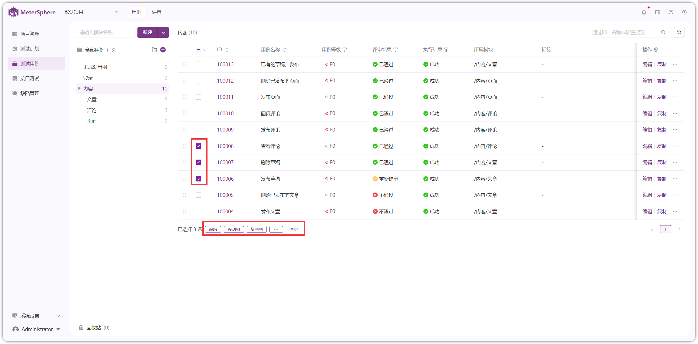
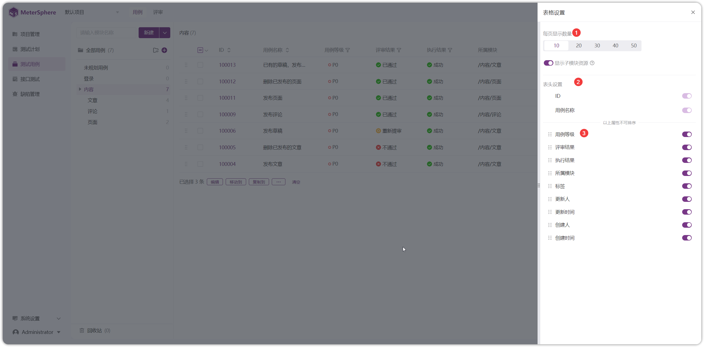
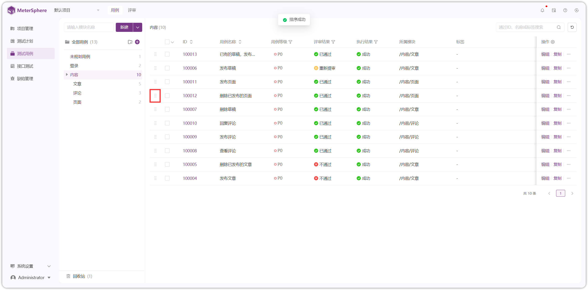
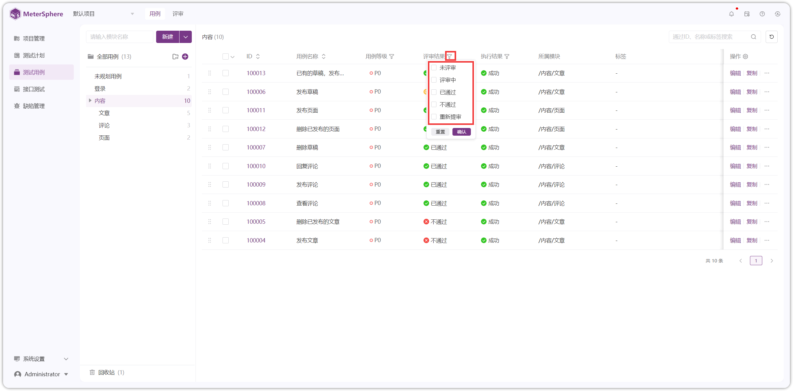
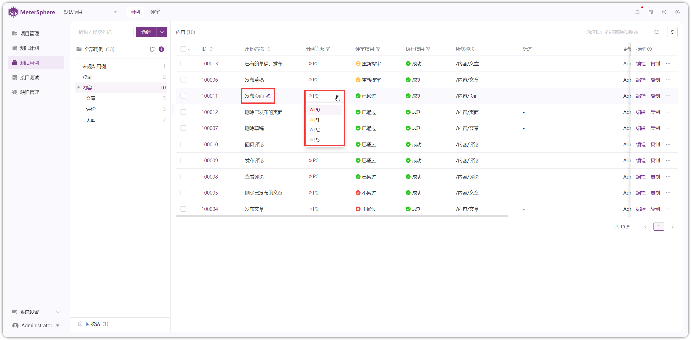
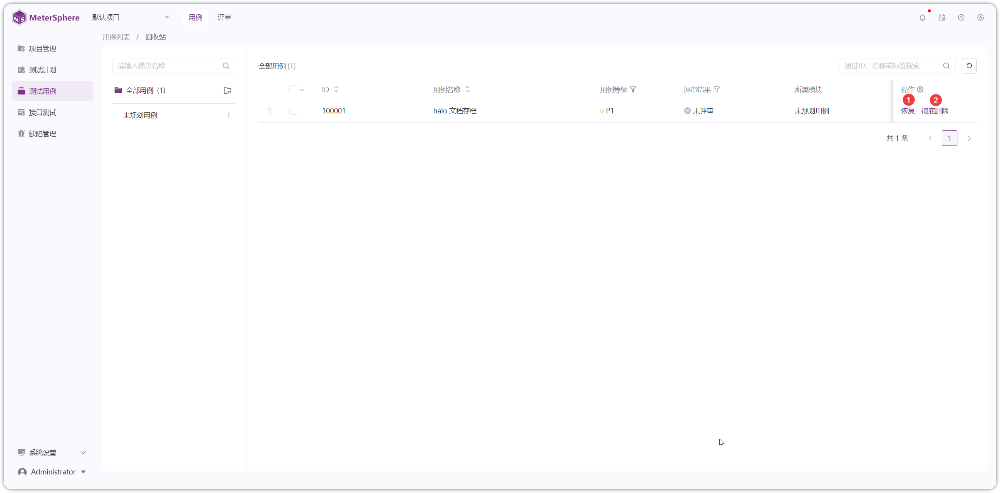
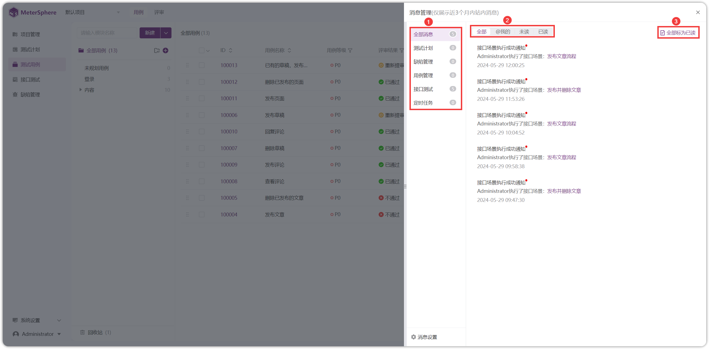
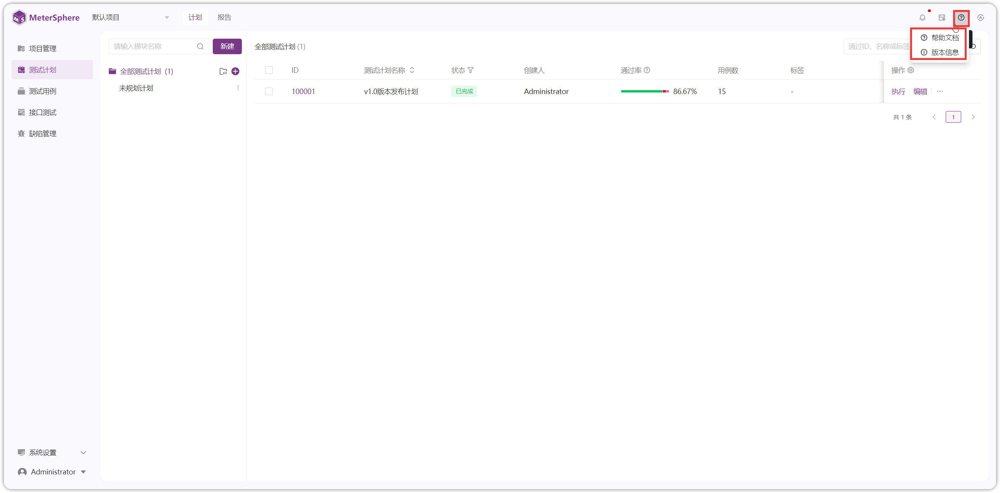

## 1 切换项目
!!! ms-abstract ""
    MeterSphere 中的缺陷管理、用例管理、接口测试、UI测试、性能测试等资源均使用项目进行隔离，用户需要操作另一个项目中的资源时需要先进行项目切换。 
    点击左上方的项目下拉菜单，菜单中列出了当前登录用户已被授权的项目列表，点击某个项目进行切换。
{ width="900px" }

## 2 模块树管理
!!! ms-abstract ""
    系统提供模块树管理，可根据不用功能创建不同的模块，并可根据各功能依赖关系设置子模块。该部分以【用例管理】下模块树相关操作举例。

!!! ms-abstract "注意"
    系统默认模块【未规划用例】不允许创建子模块。

### 2.1 添加子模块
!!! ms-abstract ""
    选中模块树列表【全部用例】，点击【+】号按钮在模块总目录下创建子模块。选中任意上级模块即可在该模块下创建子模块，模块树最多支持 8 层的树状结构。
{ width="900px" }

### 2.2 模块操作

{ width="900px" }
    
!!! ms-abstract "操作说明"
    - 【重命名】点击模块名称右侧【...】按钮，下拉可选择重命名模块名称。
    - 【删除】点击模块名称右侧【...】按钮，可删除该模块和其所有子模块。删除后，此节点下的所有资源都会被删除。
    - 【收起/展开】操作，当模块下存在子模块时出现，可点击【收起/展开】该模块下的所有子模块。
    - 【添加子模块】鼠标悬停在要操作的模块时出现，点击可以在该模块下添加子模块。
    - 【模块搜索】在【全部用例】下方搜索框中输入模块名称可以按模块搜索。

!!! ms-abstract ""
    模块树还支持鼠标拖拽操作，用户可以根据需求调整模块顺序及其层级关系。

{ width="900px" }

## 3 列表页操作

### 3.1 批量操作
!!! ms-abstract ""
    勾选复选框，在列表也下方选择【编辑】、【移动】、【复制】、【添加需求】、【关联需求】、【删除】等批量操作。
{ width="900px" }

### 3.2 全选操作
!!! ms-abstract ""
    点击列表表头行复选框右侧【V】下拉可选【全选当前页】和【全选所有页】两个全选操作。
{ width="900px" }

### 3.3 查询操作
!!! ms-abstract ""
    列表页右上方可按照【ID】、【名称】、【标签】快速搜索。
{ width="900px" }

### 3.4 表格设置
!!! ms-abstract ""
    点击列表页表头行最后一列【设置】按钮，可自定义进行【模式设置】、【每页显示数量】、【显示子目录】、【表头设置】等设置。
{ width="900px" }

### 3.5 表头快捷排序
!!! ms-abstract ""
    点击表头某字段上下排序按钮，可实现【增序】、【降序】、【默认】三种快捷排序功能。
{ width="900px" }

### 3.6 列表排序
!!! ms-abstract ""
    鼠标按住列表行左侧【∷】图标，可在列表行上下拖动实现自定义排序功能。
{ width="900px" }

### 3.7 表头快捷筛选
!!! ms-abstract ""
    点击列表某表头字段右侧【V】下拉实现表头快捷筛选。
{ width="900px" }

### 3.8 列表内快捷修改
!!! ms-abstract ""
    鼠标在列表字段悬停可以显示【✎】按钮或者【下拉选项】，可实现列表内快捷修改。
{ width="900px" }

### 3.9 调整列表宽度
!!! ms-abstract ""
    鼠标悬停在表头字段左侧空白处，出现【┤├】按钮，左右拖动可以调整列表宽度。
{ width="900px" }

## 4 回收站
!!! ms-abstract ""
    列表页删除用例后，用例将放入回收站，点击模块下方【回收站】按钮，可在回收站内进行数据恢复。
{ width="900px" }

{ width="900px" }

## 5 个人信息
!!! ms-abstract ""
    点击系统左下角【用户】选项，继续点击【个人信息】弹出【个人中心】页面进行个人信息的更新。
{ width="900px" }

### 5.1 基本信息
!!! ms-abstract ""
    点击【基本信息】Tab，点击【更换头像】可以修改头像信息，点击【更新】可以修改【用户名称】、【邮箱】、【手机号码】信息。

!!! ms-abstract "注意"
    修改邮箱后，需要使用新的邮箱登录系统。    
{ width="900px" }

### 5.2 密码设置
!!! ms-abstract ""
    点击【密码设置】Tab，可修改当前登录用户密码。

!!! ms-abstract "注意"
    修改密码后，需要使用新的密码登录系统。    
{ width="900px" }

### 5.3 APIKEY 管理
!!! ms-abstract ""
    点击【APIKEY】Tab，点击【新增】自动创建【APIKEY】，可以【查看】、【复制】APIKEY。

{ width="900px" }

!!! ms-abstract ""
    点击【设置】可删除和设置 APIKEY 有效期，点击【开关】按钮可【开启/关闭】APIKEY。    
{ width="900px" }

{ width="900px" }

### 5.4 本地执行
!!! ms-abstract ""
    点击【本地执行】Tab，输入本地接口执行程序URL，回车检测，可配置是否【优先本地执行】。

!!! ms-abstract "说明"
    本地调试机制是专为开发调试而设计的，只需要本地计算机上启动（Local Task-Runnner）【添加本地部署task_runner和配置代理的跳转链接】并将请求导向本地代理，而不是传输到后端服务器。这一机制解决了本地网络与部署服务器网络之间的互通问题。

    同时开发使用 MeterSphere 进行接口调试可以方便接口从设计之初就在平台上沉淀和管理，也能形成接口设计到接口测试的流程闭环，管理者可以在平台上追溯接口的整个生命周期。
{ width="900px" }

### 5.5 三方平台账号
!!! ms-abstract ""
    在个人信息处可以绑定第三方平台的个人账号，可以以【个人】创建和修改缺陷信息。
{ width="900px" }

!!! ms-abstract "注意"
    - 禅道账号：禅道账号具有 API 相应的权限，请按照参考页面勾选上对应权限 `参考页面: 组织-权限-分组-权限维护-API开发}` ；还需开启超级 Model 配置项，禅道配置文件中 `$config->features-apiGetModel = true ` 配置文件参考路径：`/opt/zbox/app/zentao/config/my.php`。
    - Jira 认证方式：私有化部署选择 Basic Auth 填写账号密码, 选择 Bearer Token 填写 Token；SaaS 版本只能选择 Basic Auth，填写【账号+令牌】【账户设置-安全-创建 API 令牌】。

## 6 消息通知
!!! ms-abstract ""
    点击右上角【消息通知】图标，可以查看近 3 个月内站内消息。
{ width="900px" }

## 7 任务中心（有bug待细化）

### 7.1 实时任务
!!! ms-abstract ""
    点击右上角【消息通知】图标，可以查看近 3 个月内站内消息。
{ width="900px" }

### 7.2 实时任务
!!! ms-abstract ""
    点击右上角【消息通知】图标，可以查看近 3 个月内站内消息。
{ width="900px" }

## 8 帮助中心
!!! ms-abstract ""
    点击右上角【帮助中心】图标，可以查看【帮助文档】、【版本信息】。
{ width="900px" }

## 9 切换语言
!!! ms-abstract "" 
    点击页面右上方的语言下拉菜单，进行指定语言的切换。
{ width="900px" }

## 10 退出系统
!!! ms-abstract "" 
    点击系统左下角【用户】选项，继续点击【个人信息】弹出【个人中心】页面进行个人信息的更新。
{ width="900px" }